 
# Azure Pipelines with Microsoft Teams

[!INCLUDE [version-team-services](../includes/version-team-services.md)]


If [Microsoft Teams](https://products.office.com/microsoft-teams/group-chat-software) is your choice for collaboration, you can use the [Azure Pipelines app built for Microsoft Teams](https://appsource.microsoft.com/product/office/WA200000055?src=wnblogmar2018)
 to easily monitor the events for your pipelines. Set up and manage subscriptions for builds, releases, YAML pipelines, pending approvals and more from the app and get notifications for these events in your Teams channels.

> [!div class="mx-imgBorder"]
> 

[!INCLUDE [temp](../../includes/feature-support-cloud-only.md)] 

## Add Azure Pipelines app to your team

Visit the App store in Microsoft Teams and search for the Azure Pipelines app. Upon installing, a welcome message from the app displays as shown in the following example. Use the `@azure pipelines` handle to start interacting with the app.

> [!div class="mx-imgBorder"]
> 

## Connect the Azure Pipelines app to your pipelines

Once the app is installed in your team, you can connect the app to the pipelines you want to monitor. The app asks you to sign in & authenticate to Azure Pipelines before running any commands. Use **Sign in with different email** if your Microsoft Teams and Azure Boards are in different tenants. 

> [!div class="mx-imgBorder"]
> 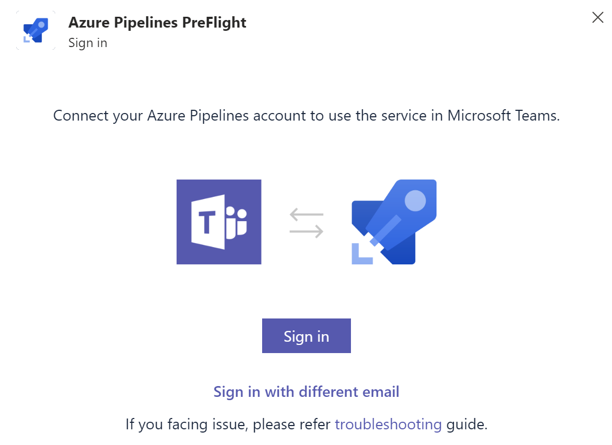

> [!div class="mx-imgBorder"]
> 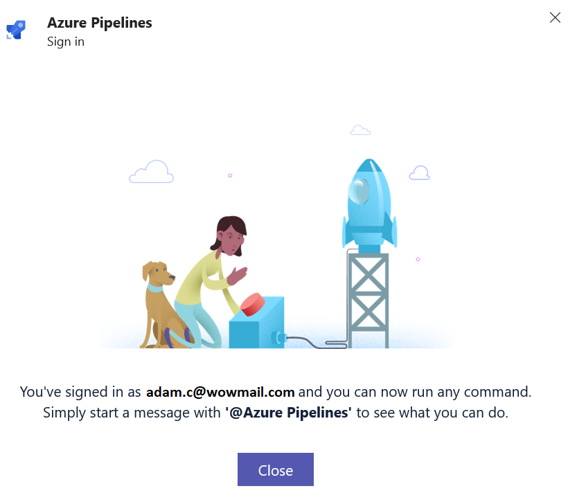


To start monitoring all pipelines in a project, use the following command inside a channel:

```
@azure pipelines subscribe [project url]
```
The project URL can be to any page within your project (except URLs to pipelines).

For example:

```
@azure pipelines subscribe https://dev.azure.com/myorg/myproject/
```

You can also monitor a specific pipeline using the following command:

```
@azure pipelines subscribe [pipeline url]
```

The pipeline URL can be to any page within your pipeline that has a `definitionId` or `buildId/releaseId` present in the URL. 

For example:

```
@azure pipelines subscribe https://dev.azure.com/myorg/myproject/_build?definitionId=123
```

or:

```
@azure pipelines subscribe https://dev.azure.com/myorg/myproject/_release?definitionId=123&view=mine&_a=releases
```

For Build pipelines, the channel is subscribed to the *Build completed* notification. For Release pipelines, the channel is subscribed to the *Release deployment started*, *Release deployment completed*, and *Release deployment approval pending* notifications. For YAML pipelines, subscriptions are created for the *Run stage state changed* and *Run stage waiting for approval* notifications.

> [!div class="mx-imgBorder"]
> 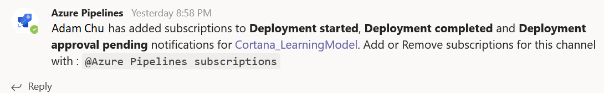

## Add or remove subscriptions

To manage the subscriptions for a channel, use the following command:

`@azure pipelines subscriptions`

This command lists all of the current subscriptions for the channel and allows you to add/remove subscriptions.

[!NOTE]
Team administrators aren't able to remove or modify subscriptions created by Project administrators.

> [!div class="mx-imgBorder"]
> 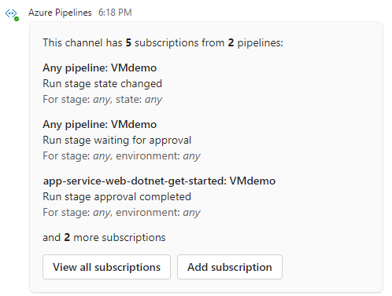


## Using filters effectively to customize subscriptions

When a user subscribes to any pipeline, a few subscriptions are created by default without any filters being applied. Often, users have the need to customize these subscriptions. 
For example, users may want to get notified only when builds fail or when deployments are pushed to a production environment. The Azure Pipelines app supports filters to customize what you see in your channel.

1. Run the `@Azure Pipelines subscriptions` command
2. Select **View all subscriptions**. In the list of subscriptions, if there is a subscription that is unwanted or should be modified (Example: creating noise in the channel), select **Remove**
3. Scroll down and select the **Add subscription** button
4. Select the required pipeline and the event
5. Select the appropriate filters and save 

### Example: Get notifications only for failed builds

> [!div class="mx-imgBorder"]
> 

### Example: Get notifications only if the deployments are pushed to prod environment

> [!div class="mx-imgBorder"]
> 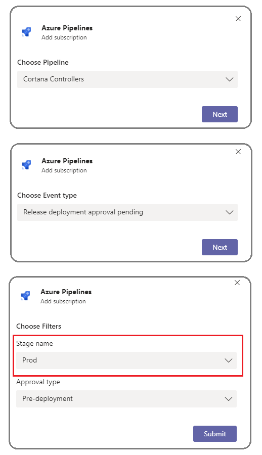

## Approve deployments from your channel

You can approve deployments from within your channel without navigating to the Azure Pipelines portal by subscribing to the *Release deployment approval pending* notification for classic Releases or the *Run stage waiting for approval* notification for YAML pipelines. Both of these subscriptions are created by default when you subscribe to the pipeline.

> [!div class="mx-imgBorder"]
> 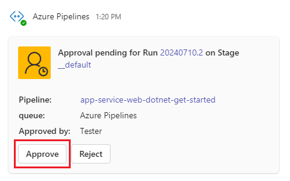

Whenever the running of a stage is pending for approval, a notification card with options to approve or reject the request is posted in the channel. Approvers can review the details of
 the request in the notification and take appropriate action. In the following example, the deployment was approved and the approval status is displayed on the card.

> [!div class="mx-imgBorder"]
> 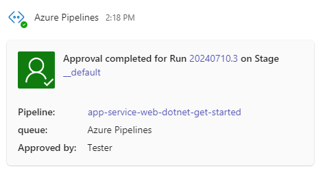

The app supports all of the checks and approval scenarios present in the Azure Pipelines portal, like single approver, multiple approvers (any one user, any order, in sequence), and teams as approvers. You can approve requests as an individual or on behalf of a team.

## Search and share pipeline information using compose extension

To help users search and share information about pipelines, Azure Pipelines app for Microsoft Teams supports compose extension. You can now search for pipelines by pipeline ID or by pipeline name. For compose extension to work, users will have to sign into Azure Pipelines project that they are interested in either by running `@azure pipelines signin` command or by signing into the compose extension directly.

> [!div class="mx-imgBorder"]
> 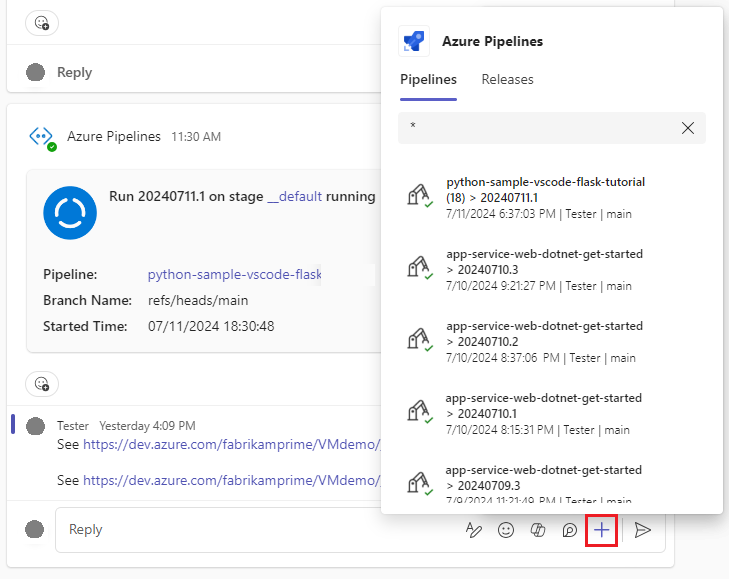


## Previews of pipeline URLs

When a user pastes a pipeline URL, a preview is shown similar to that in the following image. This helps to keep pipeline related conversations relevant and accurate. Users can choose between compact and expanded cards.

> [!div class="mx-imgBorder"]
> 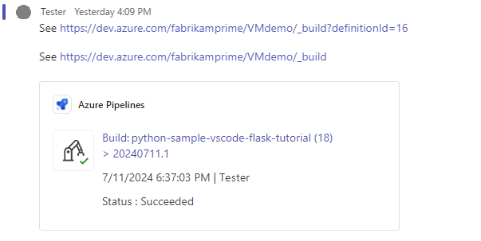

> [!div class="mx-imgBorder"]
> 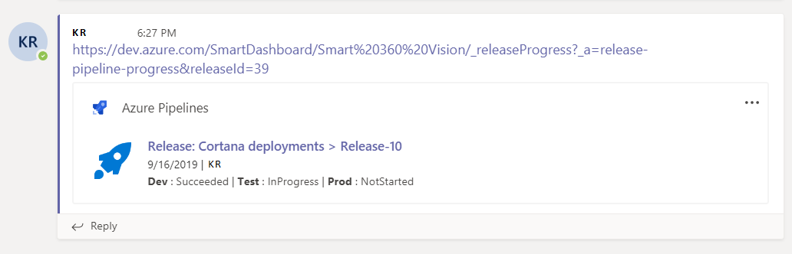

For this feature to work, users have to be signed-in. Once they are signed in, this feature will work for all channels in a team in Microsoft Teams.


## Remove subscriptions and pipelines from a channel

If you want to clean up your channel, use the following commands to unsubscribe from all pipelines within a project.  
```
@azure pipelines unsubscribe all [project url]
```

For example:  
```
@azure pipelines unsubscribe all https://dev.azure.com/myorg/myproject
```

This command deletes all the subscriptions related to any pipeline in the project and removes the pipelines from the channel. 

> [!IMPORTANT] 
> Only project administrators can run this command.

## Threaded notifications

To logically link a set of related notifications and also to reduce the space occupied by notifications in a channel, notifications are threaded. All notifications linked to a particular run of a pipeline will be linked together.

The following example shows the compact view of linked notifications. 

> [!div class="mx-imgBorder"]
> 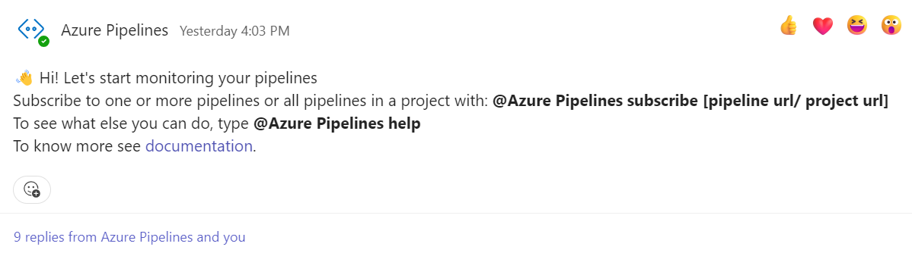

When expanded, you can see all the of the linked notifications, as shown in the following example.

> [!div class="mx-imgBorder"]
> 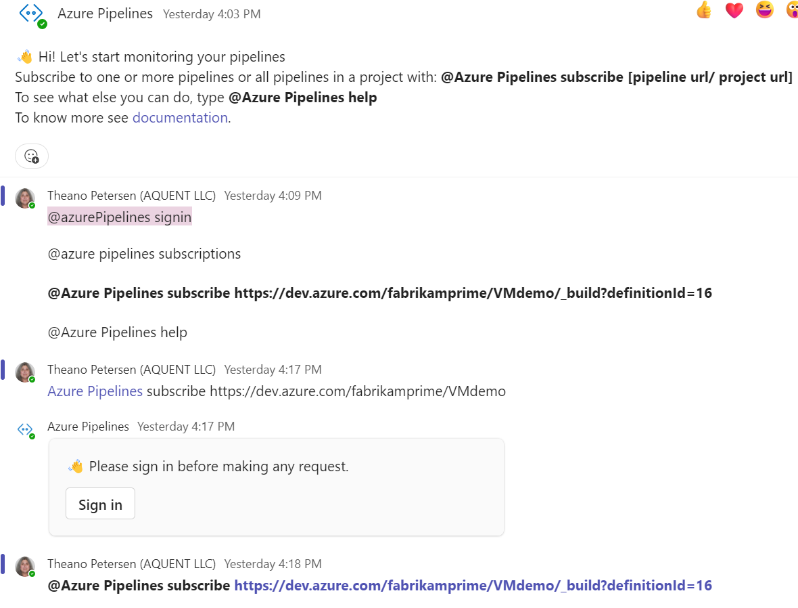

## Commands reference

Here are all the commands supported by the Azure Pipelines app:

| Slash command        | Functionality  |
| -------------------- |----------------|
| @azure pipelines subscribe [pipeline url/ project url]      | Subscribe to a pipeline or all pipelines in a project to receive notifications| 
| @azure pipelines subscriptions      | Add or remove subscriptions for this channel | 
| @azure pipelines feedback | Report a problem or suggest a feature |
| @azure pipelines help     | Get help on the slash commands |
| @azure pipelines signin  | Sign in to your Azure Pipelines account |
| @azure pipelines signout  | Sign out from your Azure Pipelines account |
| @azure pipelines unsubscribe all [project url] | Remove all pipelines (belonging to a project) and their associated subscriptions from a channel |


>[!NOTE]
> * You can use the Azure Pipelines app for Microsoft Teams only with a project hosted on Azure DevOps Services at this time.  
> * The user must be an admin of the project containing the pipeline to set up the subscriptions
> * Notifications are currently not supported inside chat/direct messages
> * Deployment approvals which have applied the **Revalidate identity of approver before completing the approval** policy are not supported
> * 'Third party application access via OAuth' must be enabled to receive notifications for the organization in Azure DevOps (Organization Settings -> Security -> Policies)

 ## Multi-tenant support

In your organization if you are using a different email or tenant for Microsoft Teams and Azure DevOps, perform the following steps to sign in and connect based on your use case. 
 
 <table>
  <tr>
   <td>
       <strong>Case</strong>
   </td>
   <td>
        <strong>Email ID and tenant in Microsoft Teams</strong>
   </td>
   <td>
        <strong>Email ID and tenant in Azure DevOps</strong>
   </td>
   <td>
        <strong>Steps to take </strong>
   </td>
  </tr>
  <tr>
   <td>
        1
   </td>
   <td>
        <u>email1@abc.com</u> (tenant 1)
   </td>
   <td>
        <u>email1@abc.com</u> (tenant 1)
   </td>
   <td>
        Sign in using <strong>Sign in</strong> button.
   </td>
  </tr>
  <tr>
   <td>
        2
   </td>
   <td>
        <u>email1@abc.com</u> (tenant 1)
   </td>
   <td>
        <u>email1@abc.com</u> (tenant 2)
   </td>
   <td>
    <ul>
	<li>Sign in the Azure DevOps account</li> 
	<li>In the same browser, start a new tab, navigate to https://teams.microsoft.com/</li> 
	<li>Run the <code>signin</code> command and choose the <strong>Sign in</strong> button. </li>
    </ul>
   </td>
  </tr>
  <tr>
   <td>
        3
   </td>
   <td>
        <u>email1@abc.com</u> (tenant 1) 
   </td>
   <td>
        <u>email2@pqr.com</u> (tenant 2) 
   </td>
   <td>
        Sign in using <strong>Sign in with different email address</strong>, in the email id picker use the email2 to sign in to Azure DevOps.
   </td>
  </tr>
  <tr>
   <td>
        4
   </td>
   <td>
        <u>email1@abc.com</u> (tenant 1) 
   </td>
   <td>
	   <u>email2@pqr.com</u> (non default tenant 3) 
   </td>
   <td>
    This scenario is not supported today
   </td>
  </tr>
</table>

## Troubleshooting

If you are experiencing the following errors when using the
[Azure Pipelines app for Microsoft Teams](https://appsource.microsoft.com/product/office/WA200000055?src=wnblogmar2018), follow the procedures in this section. 

[!INCLUDE [troubleshooting](includes/troubleshoot-authentication.md)]

In the **same browser**, start a new tab and sign in to `https://teams.microsoft.com/`. Run the `@Azure Pipelines signout` command and then run the `@Azure Pipelines signin` command in the channel where the Azure Pipelines app for Microsoft Teams is installed.

Select the `Sign in` button and you'll be redirected to a consent page like the one in the following example. Ensure that the directory shown beside the email is same as what was chosen in the previous step. Accept and complete the sign-in process.

> [!div class="mx-imgBorder"]
> 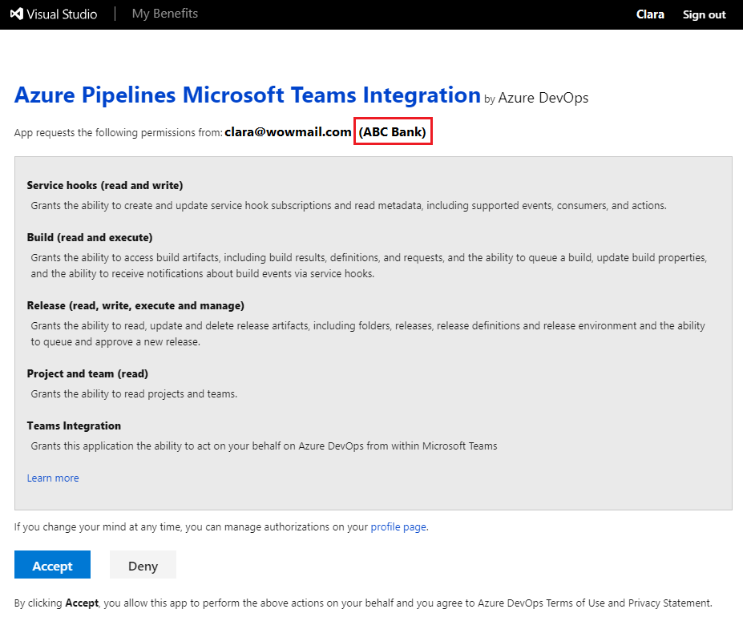

If these steps don't resolve your authentication issue, reach out to us at [Developer Community](https://developercommunity.visualstudio.com/spaces/21/index.html).

## Related articles
- [Azure Boards with Microsoft Teams](../../boards/integrations/boards-teams.md)
- [Azure Repos with Microsoft Teams](../../repos/integrations/repos-teams.md)