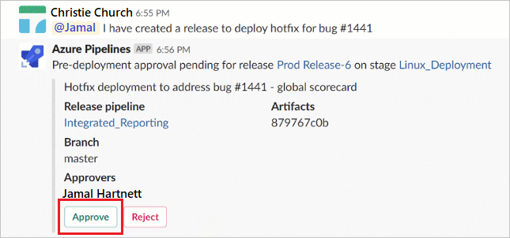
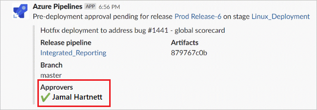

 
# Azure Pipelines with Slack

If you use [Slack](https://slack.com), you can use the Azure Pipelines app for Slack to easily monitor the events for your pipelines. Set up and manage subscriptions for completed builds, releases, 
pending approvals and more from the app and get notifications for these events in your Slack channels.


## Add the Azure Pipelines app to your Slack workspace

Navigate to [Azure Pipelines Slack app](https://azchatopprodcus1.azchatops.visualstudio.com/_slack/installslackapp) to install the Azure Pipelines app to your Slack workspace. Once added, 
you will see a welcome message from the app as below. Use the `/azpipelines` handle to start interacting with the app.


## Connect the Azure Pipelines app to your pipelines

Once the app has been installed in your Slack workspace, you can connect the app to the pipelines you want to monitor. The app will ask you to authenticate to Azure Pipelines before running any commands. 


To start monitoring a pipeline, use the following slash command inside a channel:

```
/azpipelines subscribe [pipeline url]
```

The pipeline URL can be to any page within your pipeline that has the `definitionId` or `buildId/releaseId`.  

For example, for Build pipelines, use:

```
/azpipelines subscribe https://dev.azure.com/myorg/myproject/_build?definitionId=123
```

For Release pipelines, use:

```
/azpipelines subscribe https://dev.azure.com/myorg/myproject/_release?definitionId=123&view=mine&_a=releases
```

The subscribe command gets you started with a few subscriptions by default. For Build pipelines, the channel is subscribed to *Build completed* notification, and for Release pipelines, 
the channel will start receiving *Release deployment started*, *Release deployment completed* and *Release deployment approval pending* notifications.


## Manage subscriptions

To manage the subscriptions for a channel, use the following command:

`/azpipelines subscribe`

This command will list all the current subscriptions for the channel and allow you to add new subscriptions.


## Approve release deployments from your channel
You can approve release deployments from within Slack without navigating to the Azure Pipelines portal. Subscribe to the *Release deployment approval pending* notification in Slack (which happens by default upon subscribing to any release pipeline).



Whenever a deployment is pending for approval, a notification card with options to approve or reject the deployment is posted in the channel. Users can then look at the details of the deployment in the notification and take action. In the following example, the deployment was approved and the approval status is displayed on the card.



The app supports all the approval scenarios present in Azure Pipelines portal, like single approver, multiple approvers (any one user, any order, in sequence) and teams as approvers. You can approve deployments as an individual or on behalf of a team.

## Commands reference

Here are all the commands supported by the Azure Pipelines app:

| Slash command        | Functionality  |
| -------------------- |----------------|
| /azpipelines subscribe [pipeline url]      | Subscribe to notifications for a pipeline you want to monitor | 
| /azpipelines subscribe      | Manage/add subscriptions for a channel      | 
| /azpipelines feedback | Report problems or suggest features for the app      |
| /azpipelines help     | Get help on the slash commands |
| /azpipelines signin  | Connect your Azure Pipelines account to the app |
| /azpipelines signout  | Disconnect your Azure Pipelines account from the app |

### Notifications in Private channels

The Azure Pipelines app can help you monitor the pipelines activity in your private channels as well. You will need to invite the bot to your private channel by using `/invite @azpipelines`. 
Post that, you can set up and manage your notifications the same way as you would for a public channel.

>[!NOTE]
> * The user has to be an admin of the project containing the pipeline to set up the subscriptions
> * Notifications are currently not supported inside direct messages
> * Deployment approvals which have 'Revalidate identity of approver before completing the approval' policy applied, are not supported.
