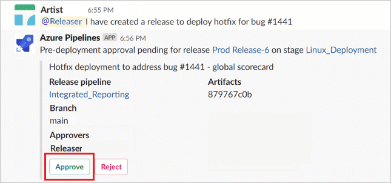
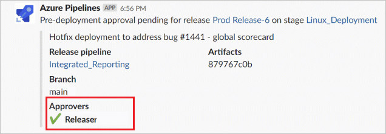
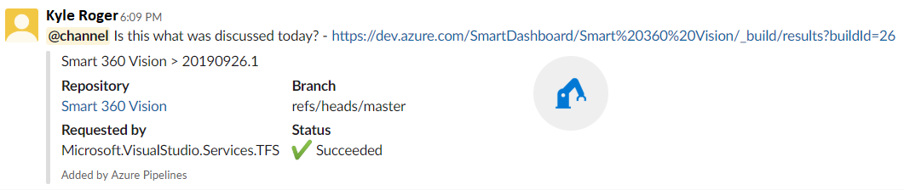

 
# Use Azure Pipelines with Slack

[!INCLUDE [version-eq-azure-devops](../../includes/version-eq-azure-devops.md)]

With [Azure Pipelines app for Slack](https://slack.com/apps/AFH4Y66N9-azure-pipelines), Slack users can easily track the events occurring within their pipelines. The app allows users to establish and oversee subscriptions for various pipeline events, such as builds, releases, pending approvals, and more. Notifications for these events are then delivered directly to users' Slack channels

[!INCLUDE [temp](../../includes/feature-support-cloud-only.md)] 

## Install Azure Pipelines app

Navigate to [Azure Pipelines Slack app](https://azchatopprodcus1.azchatops.visualstudio.com/_slack/installslackapp) to install the Azure Pipelines app to your Slack workspace. Once added, 
you will see a welcome message from the app as below. Use the `/azpipelines` handle to start interacting with the app.

    :::image type="content" source="media/integrations-slack/welcome-message.png" alt-text="A screenshot showing the Azure Pipelines app welcome message.":::

## Connect to your pipeline

Once the app has been installed in your Slack workspace, you can connect the app to any pipeline you want to monitor. You will be asked to authenticate to Azure Pipelines before running any commands. 

    :::image type="content" source="media/integrations-slack/sign-in.png" alt-text="A screenshot showing the sign-in prompt message.":::

To start monitoring all pipelines in a project, use the following slash command inside a channel:

    ```
    /azpipelines subscribe [project url]
    ```

The project URL can link to any page within your project (except URLs to pipelines). For example: */azpipelines subscribe https://dev.azure.com/myorg/myproject/*


You can also monitor a specific pipeline using the following command:

    ```
    /azpipelines subscribe [pipeline url]
    ```

The pipeline URL can link to any page within your pipeline that has a `definitionId` or a `buildId/releaseId` in the URL. For example: */azpipelines subscribe https://dev.azure.com/myorg/myproject/_build?definitionId=123*, or: */azpipelines subscribe https://dev.azure.com/myorg/myproject/_release?definitionId=123&view=mine&_a=releases*

The subscribe command gets you started with a few subscriptions by default. Here are the default notifications enabled for the following pipeline type:

| Build pipelines | Release pipelines | YAML pipelines |
| -------- | -------- | -------- |
| *Build completed* notification | *Release deployment started*, *Release deployment completed* and *Release deployment approval pending* notifications | *Run stage state changed* and *Run stage waiting for approval* notifications |

:::image type="content" source="media/integrations-slack/events-subscription.png" alt-text="A screenshot showing notification example.":::

## Manage subscriptions

To manage the subscriptions for a channel, use the following command: `/azpipelines subscriptions`

This command will list all the current subscriptions for the channel and allow you to add or remove subscriptions.

> [!NOTE]
> Team administrators are not able to remove or modify subscriptions created by Project administrators.

:::image type="content" source="media/integrations-slack/subscriptions-list.png" alt-text="A screenshot showing a list of subscriptions.":::

## Customize subscriptions

By default, when subscribing to a pipeline, several subscriptions are generated that do not have any filters applied. However, it is common for users to want to personalize these subscriptions according to their preferences. For instance, users may wish to receive notifications only for failed builds or when deployments are made to production. The Azure Pipelines app offers the option to apply filters, enabling users to customize the messages they receive in their channel. To customize a subscription:

1. Run the `/azpipelines subscriptions` command to list all your subscriptions.

1. Select **Add subscription**.

1. Select the event you want to subscribe to, and then select your desired configuration.

1. Select **Save** when you're done.

#### Example: Get notifications only for failed builds

:::image type="content" source="media/integrations-slack/custom-build-completed.png" alt-text="A screenshot showing a list how to add a custom new subscription.":::

## Approve deployments from your channel

You can approve deployments from within your channel without navigating to the Azure Pipelines portal by subscribing to the *Release deployment approval pending* notification for classic Releases or the *Run stage waiting for approval* notification for YAML pipelines. Both of these subscriptions are created by default when you subscribe to the pipeline.



Whenever the running of a stage is pending for approval, a notification card with options to approve or reject the request is posted in the channel. Approvers can review the details of the request in the notification and take appropriate action. In the following example, the deployment was approved and the approval status is displayed on the card.



The app supports all the checks and approval scenarios present in Azure Pipelines portal, like single approver, multiple approvers (any one user, any order, in sequence) and teams as approvers. You can approve requests as an individual or on behalf of a team.

## Previews of pipeline URLs

When a user pastes a pipeline URL, a preview is shown similar to that in the following image. This helps to keep pipeline related conversations relevant and accurate.




For this feature to work, users have to be signed-in. Once they are signed in, this feature will work for all channels in a workspace.


## Remove subscriptions and pipelines from a channel

If you want to clean up your channel, use the following commands to unsubscribe from all pipelines within a project.

```
/azpipelines unsubscribe all [project url]
```

For example:

```
/azpipelines unsubscribe all https://dev.azure.com/myorg/myproject
```

This command deletes all the subscriptions related to any pipeline in the project and removes the pipelines from the channel. 

> [!IMPORTANT] 
> Only project administrators can run this command.


## Commands reference

Here are all the commands supported by the Azure Pipelines app:

| Slash command        | Functionality  |
| -------------------- |----------------|
| /azpipelines subscribe [pipeline url/ project url]      | Subscribe to a pipeline or all pipelines in a project to receive notifications | 
| /azpipelines subscriptions      | Add or Remove subscriptions for this channel      | 
| /azpipelines feedback | Report a problem or suggest a feature      |
| /azpipelines help     | Get help on the slash commands |
| /azpipelines signin  | Sign in to your Azure Pipelines account |
| /azpipelines signout  | Sign out from your Azure Pipelines account |
| /azpipelines unsubscribe all [project url] | Remove all pipelines (belonging to a project) and their associated subscriptions from a channel |

### Notifications in Private channels

The Azure Pipelines app can help you monitor the pipelines activity in your private channels as well. You will need to invite the bot to your private channel by using `/invite @azpipelines`. 
Post that, you can set up and manage your notifications the same way as you would for a public channel.

>[!NOTE]
> * You can use the Azure Pipelines app for Slack only with a project hosted on Azure DevOps Services at this time.
> * The user has to be an admin of the project containing the pipeline to set up the subscriptions
> * Notifications are currently not supported inside direct messages
> * Deployment approvals which have 'Revalidate identity of approver before completing the approval' policy applied, are not supported
> * 'Third party application access via OAuth' must be enabled to receive notifications for the organization in Azure DevOps (Organization Settings -> Security -> Policies)

## Troubleshooting

If you are experiencing the following errors when using the [Azure Pipelines App for Slack](https://slack.com/apps/AFH4Y66N9-azure-pipelines), follow the procedures in this section. 

[!INCLUDE [troubleshooting](includes/troubleshoot-authentication.md)]

In the **same browser**, start a new tab, navigate to `https://slack.com`, and sign in to your work space (**use web client**). Run the `/azpipelines signout` command followed by the `/azpipelines signin` command. 

Select the `Sign in` button and you'll be redirected to a consent page like the one in the following example. Ensure that the directory shown beside the email is same as what was chosen in the previous step. Accept and complete the sign-in process.

> [!div class="mx-imgBorder"]
> 

If these steps don't resolve your authentication issue, reach out to us at [Developer Community](https://developercommunity.visualstudio.com/spaces/21/index.html).

## Related articles
- [Azure Boards with Slack](../../boards/integrations/boards-slack.md)
- [Azure Repos with Slack](../../repos/integrations/repos-slack.md)
- [Create a service hook for Azure DevOps with Slack](../../service-hooks/services/slack.md)