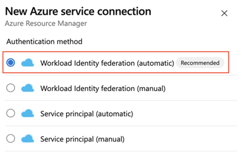
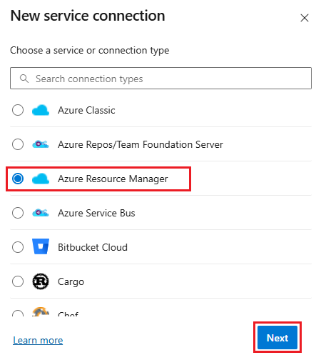
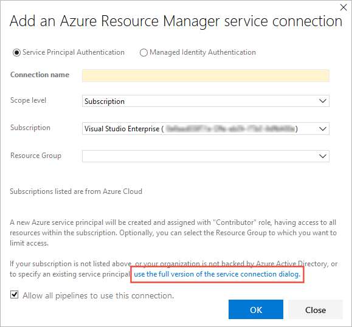
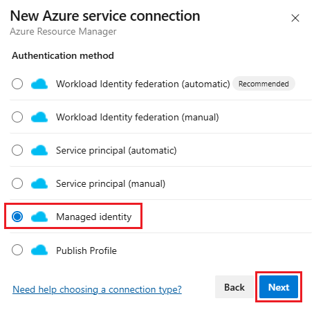

# Connect to Azure by using an Azure Resource Manager service connection

[!INCLUDE [version-lt-eq-azure-devops](../../includes/version-lt-eq-azure-devops.md)]

[!INCLUDE [temp](../includes/concept-rename-note.md)]

You can use an Azure Resource Manager service connection to connect to Azure resources through service principal authentication or through an Azure managed service identity. If you use a Resource Manager service connection, you can use a pipeline to deploy to an Azure resource like an Azure App Service app without authenticating each time.

You have multiple options for connecting to Azure by using Azure Resource Manager service connections:

::: moniker range="azure-devops"
* Service principal or managed identity with workload identity federation
::: moniker-end
* Service principal with secret
* Agent-assigned managed identity

> To learn about other types of connections and for general information about creating and using connections, see [Service connections for builds and releases](service-endpoints.md).

::: moniker range="azure-devops"

## Create an Azure Resource Manager service connection that uses workload identity federation

[Workload identity federation](/azure/active-directory/workload-identities/workload-identity-federation) uses OpenID Connect to authenticate with Microsoft Entra protected resources without needing to manage secrets.

We recommend that you use this approach if all the following items are true for your scenario:

* You have the Owner role for your Azure subscription.
* You're not connecting to [Azure Stack](#connect-stack) or to an [Azure Government Cloud](#connect-govt).
* You're not connecting from Azure DevOps Server 2019 or earlier versions of Azure Visual Studio Team Foundation Server.
* Any Marketplace extensions tasks that you use are updated to support workload identity federation.

### Create a new workload identity federation service connection

1. In the Azure DevOps project, go to **Project settings** > **Service connections** [project settings page](../../project/navigation/go-to-service-page.md#open-project-settings).

1. Select **New service connection**, and then select **Azure Resource Manager**.

   

1. Select **Workload identity federation (automatic)**.

   

1. Specify the following parameters:

   | Parameter | Description |
   | --------- | ----------- |
   | Subscription | Select an existing Azure subscription. If no Azure subscriptions or instances appear, see [Troubleshoot Azure Resource Manager service connections](../release/azure-rm-endpoint.md). |
   | Resource Group | Leave empty to allow users to access all resources that are defined within the subscription. To restrict user access to resources, enter a resource group name. Users can then access only the resources that are defined for that resource group. |
   | Service connection name | Required. The name that you use to refer to this service connection in task properties. Not the name of your Azure subscription. |

1. After the new service connection is created, copy the connection name and paste it into your code as the value for `azureSubscription`.

1. To deploy to a specific Azure resource, the task needs more data about that resource. Go to the resource in the Azure portal, and then copy the data into your code. For example, to deploy a web app, copy the name of the Azure App Service app and paste it into your code as the value for `WebAppName`.

### Convert an existing Azure Resource Manager service connection to use workload identity federation

You can quickly convert an existing Azure Resource Manager service connection to use workload identity federation for authentication instead of a service principal. You can use the service connection conversion tool in Azure DevOps if your service connection meets these requirements:

* Azure DevOps originally created the service connection. If you manually create your service connection, you can't convert the service connection by using the service connection conversion tool because Azure DevOps doesn't have permissions to modify its own credentials.
* Only one project uses the service connection. You can't convert [cross-project service connections](service-endpoints.md#project-permissions---cross-project-sharing-of-service-connections).

1. In the Azure DevOps project, go to **Project settings** > **Service connections**.

   For more information, see [Open project settings](../../project/navigation/go-to-service-page.md#open-project-settings).

1. Select the service connection that you want to convert to use workload identity.

1. Select **Convert**.

    :::image type="content" source="media/federated-convert-credential.png" alt-text="Screenshot that shows selecting convert for federated credentials.":::

1. Select **Convert** again to confirm that you want to create a new service connection.

   The conversion might take a few minutes. If you want to revert the connection, you must revert it within seven days.

### Revert an existing Azure Resource Manager Service connection to use a service principal secret

You can revert a converted automatic service connection with its secret for seven days. After seven days, manually create a new secret.

If you manually create and convert your service connection, you can't revert the service connection by using the service connection conversion tool because Azure DevOps doesn't have permissions to modify its own credentials.

To revert a service connection:

1. In the Azure DevOps project, go to **Pipelines** > **Service connections**.

1. Select an existing service connection to revert.

1. Select **Revert conversion to the original scheme**.

    :::image type="content" source="media/federated-revert-credential.png" alt-text="Screenshot that shows selecting revert for a federated credential.":::

1. Select **Revert** again to confirm your choice.

::: moniker-end

::: moniker range=">=azure-devops-2020"

## Create an Azure Resource Manager service connection that uses a service principal secret

We recommend that you use this approach if all the following items are true for your scenario:

* You're signed in as the owner of the Azure Pipelines organization and the Azure subscription.
* You don't need to further limit permissions for Azure resources that users access through the service connection.
* You're not connecting to [Azure Stack](#connect-stack) or to an [Azure Government Cloud](#connect-govt).
* You're not connecting from Azure DevOps Server 2019 or earlier versions of Team Foundation Server.

1. In the Azure DevOps project, go to **Project settings** > **Service connections**.

   In Team Foundation Server, select the **Settings** icon in the top menu bar to go to the **Services** page.

   For more information, see [Open project settings](../../project/navigation/go-to-service-page.md#open-project-settings).

1. Select **New service connection**, and then select **Azure Resource Manager**.

   

1. Enter or select the following parameters:

   | Parameter | Description |
   | --------- | ----------- |
   | **Connection Name** | Required. The name that you use to refer to this service connection in task properties. Not the name of your Azure subscription. |
   | **Scope level** | Select **Subscription** or **Management Group**. [Management groups](/azure/azure-resource-manager/management-groups-overview) are containers that help you manage access, policy, and compliance across multiple subscriptions. |
   | **Subscription** | If you select **Subscription** for the scope, select an existing Azure subscription. If no Azure subscriptions or instances appear, see [Troubleshoot Azure Resource Manager service connections](../release/azure-rm-endpoint.md). |
   | **Management Group** | If you select **Management Group** for the scope, select an existing Azure management group. For more information, see [Create management groups](/azure/azure-resource-manager/management-groups-create). |
   | **Resource Group** | Leave empty to allow users to access all resources that are defined within the subscription. To restrict user access to resources, enter a resource group name. Users can then access only the resources that are defined for that resource group. |

1. After the new service connection is created:

   * If you use the classic editor, select the connection name you assigned in the **Azure subscription** setting of your pipeline.
   * If you use a YAML file, copy the connection name into your code as the value for `azureSubscription`.

1. To deploy to a specific Azure resource, add more information about the resource to the task:

   * If you use the classic editor, select data to add to the task. For example, select the App Service name.
   * If you use a YAML file, go to the resource in the Azure portal. Copy the data that you need and paste into your task code. For example, to deploy a web app, copy the name of the App Service app and paste it as the value for `WebAppName` in the task YAML.

> [!NOTE]
>
> When you follow this approach, Azure DevOps *connects with Microsoft Entra ID and creates an app registration with a secret that's valid for three months*. When the service connection is about to expire, Microsoft Entra ID displays this prompt: **A certificate or secret is expiring soon. Create a new one**. In this scenario, you must refresh the service connection.
>
> To refresh a service connection, in the Azure DevOps portal, edit the connection and select **Verify**. After you save the edit, the service connection is valid for another three months.
>
> We recommend that you use workload identity federation instead of creating a secret. If you use workload identity federation, you don't need to rotate secrets, and app registration is constrained to its intended purpose. To start using workload identity federation, go to the service connection details page and select **Convert**. This converts the service connection to use workload identity federation instead of a secret. For more information, see [Convert an existing Resource Manager service connection to use workload identity federation](#convert-an-existing-arm-service-connection-to-use-workload-identity-federation).
>

For more information, see [Troubleshoot Azure Resource Manager service connection](../release/azure-rm-endpoint.md).

If you have problems using this approach (such as no subscriptions shown in the dropdown list) or if you want to further limit users' permissions, you can instead use a [service principal](#use-spn) or a [virtual machine with a managed service identity](#use-msi).  

::: moniker-end

## Create an Azure Resource Manager service connection that uses an existing service principal

1. If you want to use a predefined set of access permissions and you don't already have a service principal defined for this purpose, follow one of these tutorials to create a new service principal:

   * [Use the portal to create a Microsoft Entra application and a service principal that can access resources](/azure/azure-resource-manager/resource-group-create-service-principal-portal)
   * [Use Azure PowerShell to create an Azure service principal that has a certificate](/azure/active-directory/develop/howto-create-service-principal-portal#option-1-upload-a-certificate)

1. In the Azure DevOps project, go to **Project settings** > **Service connections**.

   In Team Foundation Server, select the **Settings** icon in the top menu bar to go to the **Services** page.

   For more information, see [Open project settings](../../project/navigation/go-to-service-page.md#open-project-settings).

1. Select **New service connection**, and then select **Azure Resource Manager**.

   

1. Select the **Service Principal (manual)** option, and then enter the service principal details.

   

1. For **Connection name**, enter a display name to use to refer to this service connection.

1. For **Environment**, select the environment name (**Azure Cloud**, **Azure Stack**, or **Azure Government Cloud**).

1. If you *don't* select **Azure Cloud**, enter the environment URL. For Azure Stack, the environment URL is something like `https://management.local.azurestack.external`.

1. For **Scope level**, select the scope for the connection:

   * If you select **Subscription**, select an existing Azure subscription. If no Azure subscriptions or instances appear, see [Troubleshoot Azure Resource Manager service connections](../release/azure-rm-endpoint.md).
   * If you select **Management Group**, select an existing Azure management group. For more information, see [Create management groups](/azure/azure-resource-manager/management-groups-create).

1. In the Azure subscription dialog, enter the following information about your service principal:

   * Subscription ID
   * Subscription name
   * Service principal ID
   * Either the service principal client key or, if you selected **Certificate**, enter the contents of both the certificate and the private key sections of the _*.pem_ file.
   * Tenant ID

   You can get this information by downloading and running an [Azure PowerShell script](https://github.com/Microsoft/vsts-rm-extensions/blob/master/TaskModules/powershell/Azure/SPNCreation.ps1). When you're prompted, enter your subscription name, password, role (optional), and the type of cloud, such as Azure Cloud (the default), Azure Stack, or an Azure Government Cloud.

1. Select **Verify connection** to validate the settings you entered.

1. After the new service connection is created:

   * If you use the service connection in the UI, select the connection name that you assigned in the **Azure subscription** setting of your pipeline.
   * If you use the service connection in a YAML file, copy the connection name and paste it into your code as the value for `azureSubscription`.

1. If necessary, modify the service principal to expose the appropriate permissions.

   For more information about authenticating by using a service principal, see [Use role-based access control to manage access to your Azure subscription resources](/azure/role-based-access-control/role-assignments-portal) or the blog post [Automate an Azure resource group deployment by using a service principal in Visual Studio](https://devblogs.microsoft.com/devops/automating-azure-resource-group-deployment-using-a-service-principal-in-visual-studio-online-buildrelease-management/).

For more information, see [Troubleshoot Azure Resource Manager service connections](../release/azure-rm-endpoint.md).

## Create an Azure Resource Manager service connection to a virtual machine by using a managed service identity

> [!NOTE]
>
> To use a managed service identity to authenticate, you must use a self-hosted agent on an Azure virtual machine (VM).

You can configure Azure VM-based agents to use an [Azure Managed Service Identity](/azure/active-directory/managed-service-identity/overview) in Microsoft Entra ID. In this scenario, you use the system-assigned identity (service principal) to grant the Azure VM-based agents access to any Azure resource that supports Microsoft Entra ID, such as an instance of Azure Key Vault, instead of persisting credentials in Azure DevOps for the connection.

1. In the Azure DevOps project, go to **Project settings** > **Service connections**.

   In Team Foundation Server, select the **Settings** icon in the top menu bar to go to the **Services** page.

   For more information, see [Open project settings](../../project/navigation/go-to-service-page.md#open-project-settings).

1. Select **New service connection**, and then select **Azure Resource Manager**.

   

1. Select the **Managed Identity Authentication** option.

   

1. For **Connection name**,  enter a display name to use when you refer to this service connection.

1. For **Environment**, select the environment name (**Azure Cloud**, **Azure Stack**, or **Azure Government Cloud**).

1. In the connections dialog, enter the following values from your subscription:

   * Subscription ID
   * Subscription name
   * Tenant ID

1. After the new service connection is created:

   * If you use the service connection in the UI, select the connection name that you assigned in the **Azure subscription** setting of your pipeline.
   * If you use the service connection in a YAML file, copy the connection name into your code as the value for `azureSubscription`.

1. Ensure that the VM (agent) has the appropriate permissions.

   For example, if your code needs to call Azure Resource Manager, assign the VM the appropriate role by using role-based access control (RBAC) in Microsoft Entra ID.

   For more information, see [How can I use managed identities for Azure resources?](/azure/active-directory/managed-identities-azure-resources/overview#how-can-i-use-managed-identities-for-azure-resources) and
   [Use role-based access control to manage access to your Azure subscription resources](/azure/role-based-access-control/role-assignments-portal).

For more information, see [Troubleshoot Azure Resource Manager service connections](../release/azure-rm-endpoint.md).

## Connect to an Azure Government Cloud

For information about connecting to an Azure Government Cloud, see [Connecting from Azure Pipelines (Azure Government Cloud)](/azure/azure-government/documentation-government-get-started-connect-with-vsts).

## Connect to Azure Stack

For information about connecting to Azure Stack, see these articles:

* [Connect to Azure Stack](/azure/azure-stack/azure-stack-connect-azure-stack)
* [Connect Azure Stack to Azure by using VPN](/azure/azure-stack/azure-stack-connect-vpn)
* [Connect Azure Stack to Azure by using ExpressRoute](/azure/azure-stack/azure-stack-connect-expressroute)

[!INCLUDE [rm-help-support-shared](../includes/rm-help-support-shared.md)]
