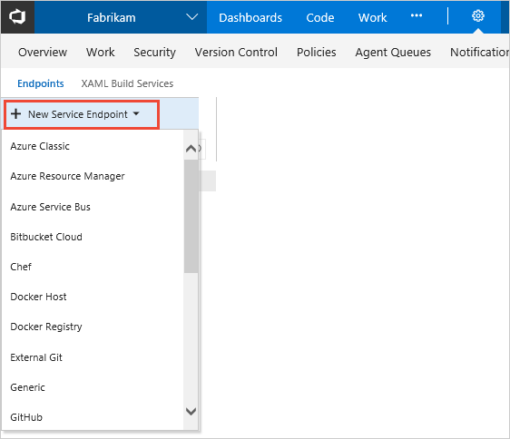
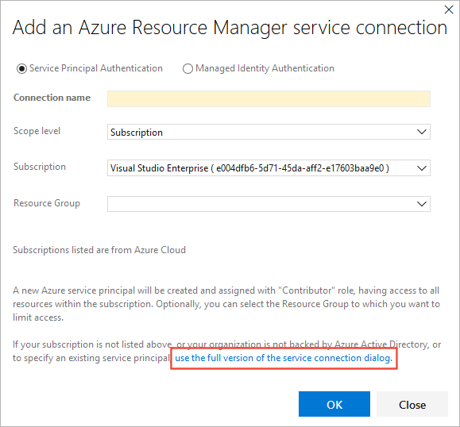
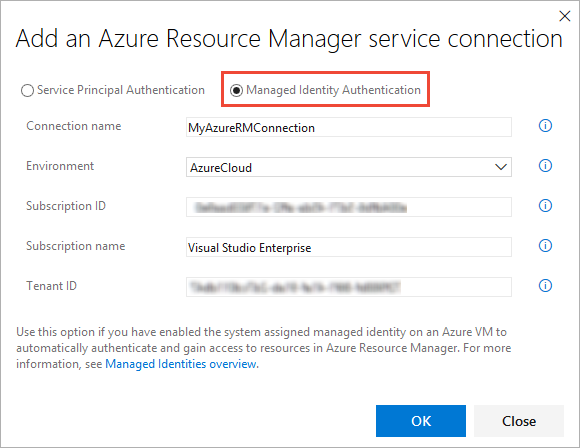

# Connect to Microsoft Azure

[!INCLUDE [version-tfs-2017-rtm](../_shared/version-tfs-2017-rtm.md)]

[!INCLUDE [temp](../_shared/concept-rename-note.md)]

To deploy your app to an Azure resource (to an app service or to a virtual machine), you need an Azure Resource Manager service connection. 

> For other types of connection, and general information about creating and using connections, see [Service connections for builds and releases](service-endpoints.md).

::: moniker range="azure-devops"

## Create an Azure Resource Manager service connection using automated security

We recommend this simple approach if:

* You're signed in as the owner of the Azure Pipelines organization and the Azure subscription.
* You don't need to further limit the permissions for Azure resources accessed through the service connection.
* You're not connecting to [Azure Stack](#connect-stack) or an [Azure Government Cloud](#connect-govt).
* You're not connecting from Azure DevOps Server 2019 or earlier versions of TFS

1. In Azure DevOps, open the **Service connections** page from the [project settings page](../../project/navigation/go-to-service-page.md#open-project-settings).
   In TFS, open the **Services** page from the "settings" icon in the top menu bar.

1. Choose **+ New service connection** and select **Azure Resource Manager**.

   

1. Specify the following parameters.

   | Parameter | Description |
   | --------- | ----------- |
   | Connection Name | Required. The name you will use to refer to this service connection in task properties. This is not the name of your Azure subscription. |
   | Scope level | Select Subscription or Management Group. [Management groups](/azure/azure-resource-manager/management-groups-overview) are containers that help you manage access, policy, and compliance across multiple subscriptions. |
   | Subscription | If you selected Subscription for the scope, select an existing Azure subscription. If you don't see any Azure subscriptions or instances, see [Troubleshoot Azure Resource Manager service connections](../release/azure-rm-endpoint.md). |
   | Management Group | If you selected Management Group for the scope, select an existing Azure management group. See [Create management groups](/azure/azure-resource-manager/management-groups-create). |
   | Resource Group | Leave empty to allow users to access all resources defined within the subscription, or select a resource group to which you want to restrict users' access (users will be able to access only the resources defined within that group). |

1. After the new service connection is created:

   * If you're using the designer, select the connection name you assigned in the **Azure subscription** setting of your pipeline.
   * If you're using YAML, copy the connection name into your code as the `azureSubscription` value.

1. To deploy to a specific Azure resource, the task will need additional data about that resource.

   * If you're using the designer, select data you need. For example, the App service name.
   * If you're using YAML, then go to the resource in the Azure portal, and then copy the data into your code. For example, to deploy a web app, you would copy the name of the App Service into the `WebAppName` value.

See also: [Troubleshoot Azure Resource Manager service connection](../release/azure-rm-endpoint.md).

If you have problems using this approach (such as no subscriptions being shown in the drop-down list),
or if you want to further limit users' permissions, you can instead use a [service principal](#use-spn)
or a [VM with a managed service identity](#use-msi).  

::: moniker-end

## Create an Azure Resource Manager service connection with an existing service principal

1. If you want to use a pre-defined set of access permissions, and you don't already have a suitable service principal defined, follow one of these tutorials to create a new service principal:

   * [Use the portal to create an Azure Active Directory application and service principal that can access resources](/azure/azure-resource-manager/resource-group-create-service-principal-portal)
   * [How to create and test Azure Service Principal using Azure CLI](https://blogs.msdn.microsoft.com/arsen/2016/05/11/how-to-create-and-test-azure-service-principal-using-azure-cli/)

1. In Azure DevOps, open the **Service connections** page from the [project settings page](../../project/navigation/go-to-service-page.md#open-project-settings).
   In TFS, open the **Services** page from the "settings" icon in the top menu bar.

1. Choose **+ New service connection** and select **Azure Resource Manager**.

   

1. Switch from the simplified version of the dialog to the full version using the link in the dialog.

   

1. Enter a user-friendly **Connection name** to use when referring to this service connection.

1. Select the **Environment** name (such as Azure Cloud, Azure Stack, or an Azure Government Cloud).

1. If you _do not_ select **Azure Cloud**, enter the Environment URL. For Azure Stack, this will be something like `https://management.local.azurestack.external`

1. Select the **Scope level** you require: 
   
   * If you choose **Subscription**, select an existing Azure subscription. If you don't see any Azure subscriptions or instances, see [Troubleshoot Azure Resource Manager service connections](../release/azure-rm-endpoint.md). |
   * If you choose **Management Group**, select an existing Azure management group. See [Create management groups](/azure/azure-resource-manager/management-groups-create). |

1. Enter the information about your service principal into the Azure subscription dialog textboxes:

   * Subscription ID
   * Subscription name
   * Service principal ID
   * Either the service principal client key or, if you have selected **Certificate**, enter the contents of both the certificate and private key sections of the *.pem file.
   * Tenant ID

   You can obtain this information if you don't have it to hand by downloading and running
   [this PowerShell script](https://github.com/Microsoft/vsts-rm-extensions/blob/master/TaskModules/powershell/Azure/SPNCreation.ps1) in an Azure PowerShell window.
   When prompted, enter your subscription name, password, role (optional), and the type of cloud such as Azure Cloud (the default), Azure Stack, or an Azure Government Cloud.

1. Choose **Verify connection** to validate the settings you entered.

1. After the new service connection is created:

   * If you are using it in the UI, select the connection name you assigned in the **Azure subscription** setting of your pipeline.
   * If you are using it in YAML, copy the connection name into your code as the **azureSubscription** value.

1. If required, modify the service principal to expose the appropriate permissions. For more details, see 
   [Use Role-Based Access Control to manage access to your Azure subscription resources](/azure/role-based-access-control/role-assignments-portal).
   [This blog post](http://blogs.msdn.com/b/visualstudioalm/archive/2015/10/04/automating-azure-resource-group-deployment-using-a-service-principal-in-visual-studio-online-build-release-management.aspx)
   also contains more information about using service principal authentication.

See also: [Troubleshoot Azure Resource Manager service connections](../release/azure-rm-endpoint.md).

## Create an Azure Resource Manager service connection to a VM with a managed service identity

You can configure Azure Virtual Machines (VM)-based agents with an
[Azure Managed Service Identity](https://docs.microsoft.com/azure/active-directory/managed-service-identity/overview)
in Azure Active Directory (Azure AD). This lets you use the system assigned identity (Service Principal)
 to grant the Azure VM-based agents access to any Azure resource that supports Azure AD,
such as Key Vault, instead of persisting credentials in Azure DevOps for the connection.

1. In Azure DevOps, open the **Service connections** page from the [project settings page](../../project/navigation/go-to-service-page.md#open-project-settings).
   In TFS, open the **Services** page from the "settings" icon in the top menu bar.

1. Choose **+ New service connection** and select **Azure Resource Manager**.

   

1. Select the **Managed Identity Authentication** option.

   

1. Enter a user-friendly **Connection name** to use when referring to this service connection.

1. Select the **Environment** name (such as Azure Cloud, Azure Stack, or an Azure Government Cloud).

1. Enter the values for your subscription into these fields of the connection dialog:

   * Subscription ID
   * Subscription name
   * Tenant ID

1. After the new service connection is created:

   * If you are using it in the UI, select the connection name you assigned in the **Azure subscription** setting of your pipeline.
   * If you are using it in YAML, copy the connection name into your code as the **azureSubscription** value.

1. Ensure that the VM (agent) has the appropriate permissions.
   For example, if your code needs to call Azure Resource Manager, assign the VM the appropriate role using Role-Based Access Control (RBAC) in Azure AD.
   For more details, see [How can I use managed identities for Azure resources?](https://docs.microsoft.com/azure/active-directory/managed-identities-azure-resources/overview#how-can-i-use-managed-identities-for-azure-resources) and
   [Use Role-Based Access Control to manage access to your Azure subscription resources](/azure/role-based-access-control/role-assignments-portal).

See also: [Troubleshoot Azure Resource Manager service connections](../release/azure-rm-endpoint.md).

## Connect to an Azure Government Cloud

For information about connecting to an Azure Government Cloud, see:

* [Connecting from Azure Pipelines (Azure Government Cloud)](/azure/azure-government/documentation-government-get-started-connect-with-vsts)

## Connect to Azure Stack

For information about connecting to Azure Stack, see:

* [Connect to Azure Stack](/azure/azure-stack/azure-stack-connect-azure-stack)
* [Connect Azure Stack to Azure using VPN](/azure/azure-stack/azure-stack-connect-vpn)
* [Connect Azure Stack to Azure using ExpressRoute](/azure/azure-stack/azure-stack-connect-expressroute)

[!INCLUDE [rm-help-support-shared](../_shared/rm-help-support-shared.md)]
