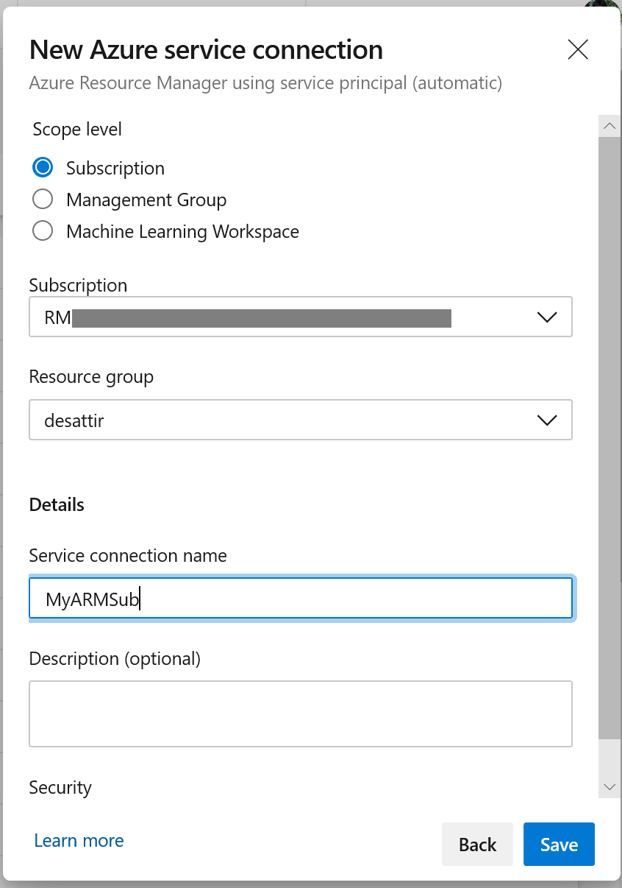
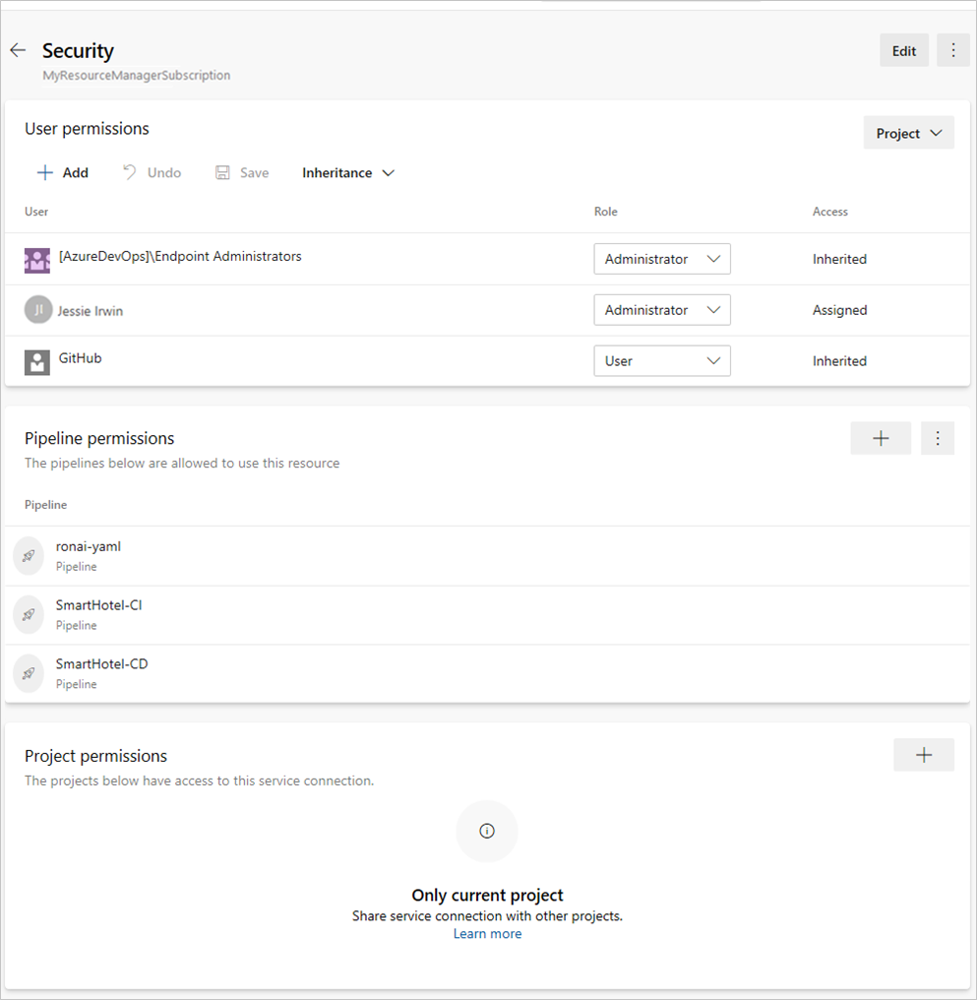

# Service connections

[!INCLUDE [version-tfs-2015-rtm](../includes/version-tfs-2015-rtm.md)]

::: moniker range="<= tfs-2018"

[!INCLUDE [temp](../includes/concept-rename-note.md)]

::: moniker-end

Service connections enable you to connect to external and remote services to execute tasks in a job. For example, you may need to connect to your Microsoft Azure
subscription, to a different build server or file server, to an online continuous
integration environment, or to services you install on remote computers.

It's possible to define service connections in Azure Pipelines that are available for use in all your tasks. For example, you can create a service connection for your Azure subscription
and use this service connection name in an Azure Web Site Deployment task in a release pipeline.

You define and manage service connections from the Admin settings of your project:

* Azure DevOps: `https://dev.azure.com/{organization}/{project}/_settings/adminservices`
* TFS: `https://{tfsserver}/{collection}/{project}/_admin/_services`

<a name="create-new"></a>

## Create a service connection

1. In Azure DevOps, open the **Service connections** page from the [project settings page](../../project/navigation/go-to-service-page.md#open-project-settings).
   In TFS, open the **Services** page from the "settings" icon in the top menu bar.

1. Choose **+ New service connection** and select the type of service connection you need.

1. Fill in the parameters for the service connection. The list of parameters differs for each type of service connection - see the [following list](#ep-types).
   
1. Decide if you want the service connection to be accessible for any pipeline by
   setting the **Allow all pipelines to use this connection** option. This option allows pipelines
   defined in YAML, which are not automatically authorized for service connections,
   to use this service connection. See [Use a service connection](#use-connection).

1. Choose **OK** to create the connection.
For example, this is the default **Azure Resource Manager** connection dialog:

   

   > [!NOTE]
   > The connection dialog may appear different for the different types of service connections, 
   > and have different parameters. See the list of parameters in 
   > [Common service connection types](#common-service-connection-types) for each
   > service connection type.

## Manage a service connection

1. In Azure DevOps, open the **Service connections** page from the [project settings page](../../project/navigation/go-to-service-page.md#open-project-settings).
   Or, in TFS, open the **Services** page from the "settings" icon in the top menu bar.

1. Select the service connection you want to manage.

1. You will land in the **Overview** tab of the service connection where you can see the details of the service connection i.e. type, creator, authentication type (like Token, Username/Password or OAuth etc.).


1. Next to the overview tab, you can see **Usage history** that shows the list of pipelines using the service connection.


1. To update the service connection, click on **Edit** at the top right corner of the page.

1. **Approvals and checks**, **Security** and **Delete** are part of the more options at the top right corner.


<a name="security"></a>

## Secure a service connection

To manage the security for a connection:

1. In Azure DevOps, open the **Service connections** page from the [project settings page](../../project/navigation/go-to-service-page.md#open-project-settings).
   In TFS, open the **Services** page from the "settings" icon in the top menu bar.


1. To manage user permissions at hub level, go to the more options at the top-right corner and choose **Security**.


1. To manage security for a service connection, open the service connection and go to more options at top-right corner and choose **Security**.


Service connection is a critical resource for various workflows in Azure DevOps like Classic Build and Release pipelines, YAML pipelines, KeyVault Variable groups etc. Based on the usage patterns, service connection security is divided into three categories in the service connections new UI.
* User permissions
* Pipeline permissions
* Project permissions

### User permissions
You can control who can create, view, use, and manage the service connection with user permissions. There are four roles to manage each of these actions: Creator, Reader, User, and Administrator. In the service connections tab, you can set the hub level permissions. Hub level permissions are inherited. You can also can override the roles for each service connection in the service connections tab. 

| Role on a service connection | Purpose |
|------------------------------------|---------|
| Creator | Members of this role can create the service connection in the project. Contributors are added as members by default|
| Reader | Members of this role can view the service connection. |
| User | Members of this role can use the service connection when authoring build or release pipelines or authorize yaml pipelines. |
| Administrator | In addition to using the service connection, members of this role can manage membership of all other roles for the service connection in the project. Project administrators are added as members by default |

Previously, two special groups, Endpoint Creators and Endpoint Administrator groups were used to control who can create and manage service connections. Now, as part of service connection new UI, we are moving to pure RBAC model i.e. using roles.
For backward compatibility, in the existing projects, Endpoint Administrators group is added as Administrator role and Endpoint creators group is assigned with creator role which ensures there is no change in the behavior for existing service connections. 

> [!NOTE]
> This change is applicable only in Azure DevOps Services where new UI is available. 
> Azure DevOps Server 2019 and older versions still follow the previous security model.

Along with the new service connections UI, we are introducing **Sharing of service connections across projects**. With this feature, service connections now become an organization level object however scoped to current project by default. In User permissions section, you can see **Project** and **Organization** level permissions. And the functionalities of administrator role is split between the two levels.

#### Project level permissions

The project level permissions are the user permissions with reader, user, creator and administrator roles, as explained above, within the project scope. You have inheritance and you can set the roles at the hub level as well as for each service connection. 

The project-level administrator have limited administrative capabilities as below:
* A project-level administrator can manage other users and roles at project scope.
* A project-level administrator can rename a service connection, update description and enable/disable "Allow pipeline access" flag.
* A project-level administrator can delete a service connection which removes the existence of service connection from the project.


The user that created the service connection is automatically added to the project level Administrator role for that service connection. And users/groups assigned administrator role at hub level are inherited if the inheritance is turned on.

#### Organization level permissions
Organization level permissions are introduced along with cross project sharing feature. Any permissions set at this level are reflected across all the projects where the service connection is shared. 

There is no inheritance for organization level permissions. Today we only have administrator role at organization level.

The organization-level administrator has all the administrative capabilities that include:
* A organization-level administrator can manage organization level users.
* A organization-level administrator can edit all the fields of a service connection.
* A organization-level administrator can share/un-share a service connection with other projects.


The user that created the service connection is automatically added as a organization level Administrator role for that service connection. In all the existing service connections, for backward compatibility, all the connection administrators are made organization-level administrators to ensure there is no change in the behavior.


### Pipeline permissions
Pipeline permissions control which YAML pipelines are authorized to use this service connection. This is interlinked with 'Allow pipeline access' checkbox you find in service connection creation dialogue.

You can either choose to open access for all pipelines to consume this service connection from the more options at top right corner of the **Pipeline permissions** section in security tab of a service connection.

Or you can choose to lock down the service connection and only allow selected YAML pipelines to consume this service connection. If any other YAML pipeline refers to this service connection, an authorization request is raised which has to be approved by the connection administrators.


### Project permissions - Cross project sharing of service connections
Project permissions control which projects can use this service connection. By default, service connections are not shared with any other projects.

* Only the organization-level administrators from **User permissions** can share the service connection with other projects.
* The user who is sharing the service connection with a project should have atleast create service connection permission in the target project.
* The user who shares the service connection with a project becomes the project-level administrator for that service connection  and the project-level inheritance is turned on in the target project.
* The service connection name is appended with the project name and it can be renamed in the target project scope.
* Organization level administrator can un-share a service connection from any shared project.


> [!NOTE]
> Project permissions feature is dependent on the new service connections UI and once we enable this feature, the old service
> connections UI is no longer usable.


<a name="use-connection"></a>

## Use a service connection

After the new service connection is created:

<a id="yaml"></a>

# [YAML](#tab/yaml)

Copy the connection name into your code as the **azureSubscription** (or the equivalent connection name) value.

  

<a id="classic"></a>

# [Classic](#tab/classic)

Select the connection name you assigned in the **Azure subscription** (or the equivalent connection name) setting of your pipeline.

  

---

Next you must authorize the service connection.
To do this, or if you encounter a resource authorization error in your build,
use one of the following techniques:

- If you want to authorize any pipeline to use the service connection,
  go to Azure Pipelines, open the Settings page, select Service connections,
  and enable the setting **Allow all pipelines to use this connection** option for the connection.

- If you want to authorize a service connection for a specific pipeline, open the pipeline
  by selecting **Edit** and queue a build manually. You will see a resource authorization error
  and an "Authorize resources" action on the error. Choose this action to explicitly add the pipeline as an
  authorized user of the service connection.

> You can also create your own [custom service connections](../../extend/develop/service-endpoints.md).

> [!NOTE]
> Service connection cannot be specified by variable

<a name="ep-types"></a>

## Common service connection types

Azure Pipelines and TFS support various service connection types by default, including:

- [Azure Classic](#sep-azure-classic)
- [Azure Repos/Team Foundation Server](#sep-tfsts)
- [Azure Resource Manager](#sep-azure-resource-manager)
- [Azure Service Bus](#sep-servbus)
- [Bitbucket Cloud](#sep-bbucket)
- [Chef](#sep-chef)
- [Docker Host](#sep-dochost)
- [Docker Registry](#sep-docreg)
- [External Git](#sep-extgit)
- [Generic](#sep-generic)
- [GitHub](#sep-github)
- [GitHub Enterprise Server](#sep-githubent)
- [Jenkins](#sep-jenkins)
- [Kubernetes](#sep-kuber)
- [Maven](#sep-maven)
- [npm](#sep-npm)
- [NuGet](#sep-nuget)
- [Python package download](#sep-python-download)
- [Python package upload](#sep-python-upload)
- [Service Fabric](#sep-fabric)
- [SSH](#sep-ssh)
- [Subversion](#sep-subversion)
- [Visual Studio App Center](#sep-vsmobile)

After you enter the parameters when creating a service connection, validate the
connection. The validation link uses a REST call to the external service with
the information you entered, and indicates if the call succeeded.

<h3 id="sep-azure-classic">Azure Classic service connection</h3>

Defines and secures a connection to a Microsoft Azure subscription
using Azure credentials or an Azure management certificate.
[How do I create a new service connection?](#create-new)

| Parameter | Description |
| --------- | ----------- |
| \[authentication type\] | Required. Select **Credentials** or **Certificate based**. |
| Connection Name | Required. The name you will use to refer to this service connection in task properties. This is not the name of your Azure account or subscription. If you are using YAML, use this name as the **azureSubscription** or the equivalent subscription name value in the script. |
| Environment | Required. Select **Azure Cloud**, **Azure Stack**, or one of the pre-defined [Azure Government Clouds](government-cloud.md) where your subscription is defined. |
| Subscription ID | Required. The GUID-like identifier for your Azure subscription (not the subscription name). You can copy this from the Azure portal. |
| Subscription Name | Required. The name of your Microsoft Azure subscription (account). |
| User name | Required for Credentials authentication. User name of a work or school account (for example @fabrikam.com). Microsoft accounts (for example @live or @hotmail) are not supported. |
| Password | Required for Credentials authentication. Password for the user specified above. |
| Management Certificate | Required for Certificate-based authentication. Copy the value of the management certificate key from your [publish settings XML file](https://go.microsoft.com/fwlink/?LinkID=312990) or the Azure portal. |

> If your subscription is defined in an [Azure Government Cloud](government-cloud.md), ensure your application meets the relevant compliance requirements before you configure a service connection.

*****

<h3 id="sep-tfsts">Azure Repos/Team Foundation Server</h3>

Defines and secures a connection to another Azure DevOps organization.


|       Parameter       |                                                                                                                                  Description                                                                                                                                   |
|-----------------------|--------------------------------------------------------------------------------------------------------------------------------------------------------------------------------------------------------------------------------------------------------------------------------|
|   (authentication)    |                                                                                                              Select **Basic** or **Token Based** authentication.                                                                                                               |
|    Connection Name    | Required. The name you will use to refer to this service connection in task properties. This is not the name of your Azure account or subscription. If you are using YAML, use this name as the **azureSubscription** or the equivalent subscription name value in the script. |
|    Connection URL     |                                                                                                           Required. The URL of the TFS or the other Azure DevOps organization.                                                                                                         |
|       User name       |                                                                                                   Required for Basic authentication. The username to connect to the service.                                                                                                   |
|       Password        |                                                                                                  Required for Basic authentication. The password for the specified username.                                                                                                   |
| Personal Access Token |                      Required for Token Based authentication (TFS 2017 and newer and Azure Pipelines only). The token to use to authenticate with the service. [Learn more](../../organizations/accounts/use-personal-access-tokens-to-authenticate.md).                       |

<p />

Use the **Verify connection** link to validate your connection information.

See also [Authenticate access with personal access tokens for Azure DevOps](../../organizations/accounts/use-personal-access-tokens-to-authenticate.md).

*****

<a name="sep-azure-resource-manager-conditions"></a>
<a name="arm-auto-connect"></a>
<a name="arm-manual-connect"></a>
<a name="sep-azure-resource-manager-existingsp"></a>

<h3 id="sep-azure-resource-manager">Azure Resource Manager service connection</h3>

Defines and secures a connection to a Microsoft Azure subscription
using Service Principal Authentication (SPA) or an Azure Managed Service Identity.
The dialog offers two main modes:

* **Automated subscription detection**. In this mode, Azure Pipelines and TFS will attempt to query Azure for all of the subscriptions and instances to which you have access using the credentials you are currently logged on with in Azure Pipelines or TFS (including Microsoft accounts and School or Work accounts).
  If no subscriptions are shown, or subscriptions other than the one you want to use, you must sign out of Azure Pipelines or TFS and sign in again
  using the appropriate account credentials.

* **Manual subscription pipeline**. In this mode, you must specify the service principal you want to use to connect to Azure. The service principal specifies the resources and the access levels that will be available over the connection.
  Use this approach when you need to connect to an Azure account using different credentials from those you are currently logged on with in Azure Pipelines or TFS.
  This is also a useful way to maximize security and limit access.
    Service principals are valid for two years. 

For more information, see [Connect to Microsoft Azure](connect-to-azure.md)

> [!NOTE]
> If you don't see any Azure subscriptions or instances, or you have problems validating the connection, see [Troubleshoot Azure Resource Manager service connections](../release/azure-rm-endpoint.md).

*****

<h3 id="sep-servbus">Azure Service Bus service connection</h3>


Defines and secures a connection to a Microsoft Azure Service Bus queue.


|          Parameter           |                                                                                                                                  Description                                                                                                                                   |
|------------------------------|--------------------------------------------------------------------------------------------------------------------------------------------------------------------------------------------------------------------------------------------------------------------------------|
|       Connection Name        | Required. The name you will use to refer to this service connection in task properties. This is not the name of your Azure account or subscription. If you are using YAML, use this name as the **azureSubscription** or the equivalent subscription name value in the script. |
| Service Bus ConnectionString |                                                                    The URL of your Azure Service Bus instance. [More information](/azure/service-bus-messaging/service-bus-fundamentals-hybrid-solutions).                                                                     |
|    Service Bus Queue Name    |                                                                                                                The name of an existing Azure Service Bus queue.                                                                                                                |

<p />

<!--

*****

<h3 id="sep-servfabric">Azure Service Fabric service connection</h3>

Defines and secures a connection to a Microsoft Azure Service Fabric cluster.

| Parameter | Description |
| --------- | ----------- |
| \[authentication type\] | Required. Select **No authentication**, **Azure Active Directory credentials**, or **Certificate based**. |
| Connection Name | Required. The name you will use to refer to this connection in task properties. This is not the name of your Azure account or subscription. If you are using YAML, use this name as the **azureSubscription** or the equivalent subscription name value in the script. |
| Cluster connection | Required. The client connection of the remote cluster to connect to. Prefix with **tcp://**. |
| Username | Required for Azure Active Directory authentication. The username to use when connecting to the remote cluster. |
| Password | Required for Azure Active Directory authentication. The password for the specified username. |
| Client certificate | Required for certificate based authentication. The Base64-encoded contents of the client certificate. |
| Password | The password for the certificate when using certificate based authentication. |
<p />

You can use the following PowerShell script to obtain a Base64-encoded representation of a certificate:

```powershell
[System.Convert]::ToBase64String([System.IO.File]::ReadAllBytes("path-to-certificate-file\certificate.pfx"))
```

-->

*****

<h3 id="sep-bbucket">Bitbucket Cloud service connection</h3>

Defines a connection to Bitbucket Cloud. You can use OAuth with **Grant authorization** or a username and password with **Basic Authentication**. For pipelines to keep working, your repository access must remain active.

### Grand authorization
| Parameter | Description |
| --------- | ----------- |
| OAuth Configuration | Required.  OAuth connection to Bitbucket. |

### Basic authentication

| Parameter | Description |
| --------- | ----------- |
| Connection Name | Required. The name you will use to refer to this service connection in task properties. This is not the name of your Azure account or subscription. If you are using YAML, use this name as the **azureSubscription** or the equivalent subscription name value in the script. |
| User name | Required. The username to connect to the service. |
| Password | Required. The password for the specified username. |

*****

<h3 id="sep-chef">Chef service connection</h3>

Defines and secures a connection to a [Chef](https://docs.chef.io/chef_overview.html) automation server.

| Parameter | Description |
| --------- | ----------- |
| Connection Name | Required. The name you will use to refer to this service connection in task properties. This is not the name of your Azure account or subscription. If you are using YAML, use this name as the **azureSubscription** or the equivalent subscription name value in the script. |
| Server URL | Required. The URL of the Chef automation server. |
| Node Name (Username) | Required. The name of the node to connect to. Typically this is your username. |
| Client Key | Required. The key specified in the Chef .pem file. |

*****

<h3 id="sep-dochost">Docker Host service connection</h3>

Defines and secures a connection to a Docker host.

| Parameter | Description |
| --------- | ----------- |
| Connection Name | Required. The name you will use to refer to this service connection in task properties. This is not the name of your Azure account or subscription. If you are using YAML, use this name as the **azureSubscription** or the equivalent subscription name value in the script. |
| Server URL | Required. The URL of the Docker host. |
| CA Certificate | Required. A trusted certificate authority certificate to use to authenticate with the host. |
| Certificate | Required. A client certificate to use to authenticate with the host. |
| Key | Required. The key specified in the Docker key.pem file. |

Ensure you protect your connection to the Docker host. [Learn more](https://docs.docker.com/engine/security/https/).

*****

<h3 id="sep-docreg">Docker Registry service connection</h3>

Defines a connection to a container registry.

**Azure Container Registry**

| Parameter | Description |
| --------- | ----------- |
| Connection Name | Required. The name you will use to refer to this service connection in task inputs. |
| Azure subscription | Required. The Azure subscription containing the container registry to be used for service connection creation. |
| Azure Container Registry | Required. The Azure Container Registry to be used for creation of service connection. |

**Docker Hub or Others**

| Parameter | Description |
| --------- | ----------- |
| Connection Name | Required. The name you will use to refer to this service connection in task inputs. |
| Docker Registry | Required. The URL of the Docker registry. |
| Docker ID | Required. The identifier of the Docker account user. |
| Password | Required. The password for the account user identified above. (Docker Hub requires a PAT instead of a password.) |
| Email | Optional. An email address to receive notifications. |

*****

<h3 id="sep-extgit">External Git service connection</h3>

Defines and secures a connection to a Git repository server.
There is a specific service connection for [GitHub](#sep-github)
and [GitHub Enterprise Server](#sep-githubent) connections.

| Parameter | Description |
| --------- | ----------- |
| Connection Name | Required. The name you will use to refer to this service connection in task properties. This is not the name of your Azure account or subscription. If you are using YAML, use this name as the **azureSubscription** or the equivalent subscription name value in the script. |
| Server URL | Required. The URL of the Git repository server. |
| User name | Required. The username to connect to the Git repository server. |
| Password/Token Key | Required. The password or access token for the specified username. |

Also see [Artifact sources](../release/artifacts.md#sources).

*****

<h3 id="sep-generic">Generic service connection</h3>

Defines and secures a connection to any other type of service or application.

| Parameter | Description |
| --------- | ----------- |
| Connection Name | Required. The name you will use to refer to this service connection in task properties. This is not the name of your Azure account or subscription. If you are using YAML, use this name as the **azureSubscription** or the equivalent subscription name value in the script. |
| Server URL | Required. The URL of the service. |
| User name | Optional. The username to connect to the service. |
| Password/Token Key | Optional. The password or access token for the specified username. |

*****

<h3 id="sep-github">GitHub service connection</h3>

Defines a connection to a GitHub repository.
Note that there is a specific service connection for [External Git servers](#sep-extgit)
and [GitHub Enterprise Server](#sep-githubent) connections.


|      Parameter       |                                                                                                                                  Description                                                                                                                                   |
|----------------------|--------------------------------------------------------------------------------------------------------------------------------------------------------------------------------------------------------------------------------------------------------------------------------|
| Choose authorization |                                                                                            Required. Either **Grant authorization** or **Personal access token**. See notes below.                                                                                             |
|        Token         |                                                                                                       Required for Personal access token authorization. See notes below.                                                                                                       |
|   Connection Name    | Required. The name you will use to refer to this service connection in task properties. This is not the name of your Azure account or subscription. If you are using YAML, use this name as the **azureSubscription** or the equivalent subscription name value in the script. |

<p />

> [!NOTE]
> If you select **Grant authorization** for the **Choose authorization** option,
the dialog shows an **Authorize** button that opens the GitHub login page.
If you select **Personal access token** you must obtain a suitable token
and paste it into the **Token** textbox. The dialog shows the recommended scopes
for the token: **repo, user, admin:repo_hook**. See
[this page](https://help.github.com/articles/creating-an-access-token-for-command-line-use/)
on GitHub for information about obtaining an access token. Then register your
GitHub account in your profile:

* Open your profile from your organization name at the right of the Azure Pipelines page heading.
* At the top of the left column, under **DETAILS**, choose **Security**.
* In the **Security** tab, in the right column, choose **Personal access tokens**.
* Choose the **Add** link and enter the information required to create the token.

Also see [Artifact sources](../release/artifacts.md#tfvcsource).

*****

<h3 id="sep-githubent">GitHub Enterprise Server service connection</h3>

Defines a connection to a GitHub repository.
Note that there is a specific service connection for [External Git servers](#sep-extgit)
and [standard GitHub service connections](#sep-github).


|                 Parameter                  |                                                                                                                                  Description                                                                                                                                   |
|--------------------------------------------|--------------------------------------------------------------------------------------------------------------------------------------------------------------------------------------------------------------------------------------------------------------------------------|
|            Choose authorization            |                                                                                     Required. Either **Personal access token**, **Username and Password**, or **OAuth2**. See notes below.                                                                                     |
|              Connection Name               | Required. The name you will use to refer to this service connection in task properties. This is not the name of your Azure account or subscription. If you are using YAML, use this name as the **azureSubscription** or the equivalent subscription name value in the script. |
|                 Server URL                 |                                                                                                                       Required. The URL of the service.                                                                                                                        |
|     Accept untrusted SSL certificates      |                                         Set this option to allow clients to accept a self-signed certificate instead of installing the certificate in the TFS service role or the computers hosting the [agent](../agents/agents.md).                                          |
|                   Token                    |                                                                                                       Required for Personal access token authorization. See notes below.                                                                                                       |
|                 User name                  |                                                                                           Required for Username and Password authentication. The username to connect to the service.                                                                                           |
|                  Password                  |                                                                                          Required for Username and Password authentication. The password for the specified username.                                                                                           |
|            OAuth configuration             |                                                                                             Required for OAuth2 authorization. The OAuth configuration specified in your account.                                                                                              |
| GitHub Enterprise Server configuration URL |                                                                                                                  The URL is fetched from OAuth configuration.                                                                                                                  |

<p />

> [!NOTE]
> If you select **Personal access token** you must obtain a suitable token
and paste it into the **Token** textbox. The dialog shows the recommended scopes
for the token: **repo, user, admin:repo_hook**. See
[this page](https://help.github.com/articles/creating-an-access-token-for-command-line-use/)
on GitHub for information about obtaining an access token. Then register your
GitHub account in your profile:

* Open your profile from your account name at the right of the Azure Pipelines page heading.
* At the top of the left column, under **DETAILS**, choose **Security**.
* In the **Security** tab, in the right column, choose **Personal access tokens**.
* Choose the **Add** link and enter the information required to create the token.

*****

<h3 id="sep-jenkins">Jenkins service connection</h3>

Defines a connection to the Jenkins service.


|             Parameter             |                                                                                                                                  Description                                                                                                                                   |
|-----------------------------------|--------------------------------------------------------------------------------------------------------------------------------------------------------------------------------------------------------------------------------------------------------------------------------|
|          Connection Name          | Required. The name you will use to refer to this service connection in task properties. This is not the name of your Azure account or subscription. If you are using YAML, use this name as the **azureSubscription** or the equivalent subscription name value in the script. |
|            Server URL             |                                                                                                                       Required. The URL of the service.                                                                                                                        |
| Accept untrusted SSL certificates |                                         Set this option to allow clients to accept a self-signed certificate instead of installing the certificate in the TFS service role or the computers hosting the [agent](../agents/agents.md).                                          |
|             User name             |                                                                                                               Required. The username to connect to the service.                                                                                                                |
|             Password              |                                                                                                               Required. The password for the specified username.                                                                                                               |

<p />

Also see [Azure Pipelines Integration with Jenkins](https://devblogs.microsoft.com/devops/vsts-visual-studio-team-services-integration-with-jenkins/) 
and [Artifact sources](../release/artifacts.md#jenkinssource).

*****

<h3 id="sep-kuber">Kubernetes service connection</h3>

Defines a connection to a Kubernetes cluster.

**Azure subscription option**

| Parameter | Description |
| --------- | ----------- |
| Connection Name | Required. The name you will use to refer to this service connection in task inputs. |
| Azure subscription | Required. The Azure subscription containing the cluster to be used for service connection creation.  |
| Cluster | Name of the Azure Kubernetes Service cluster. |
| Namespace | Namespace within the cluster. |

For an RBAC enabled cluster, a ServiceAccount is created in the chosen namespace along with RoleBinding object so that the created ServiceAccount is able to perform actions only on the chosen namespace.

For an RBAC disabled cluster, a ServiceAccount is created in the chosen namespace. But the created ServiceAccount has cluster-wide privileges (across namespaces).

> [!NOTE]
> This option lists all the subscriptions the service connection creator has access to *across different Azure tenants*. If you are unable to see subscriptions from other Azure tenants, please check your AAD permissions in those tenants.

**Service account option**

| Parameter | Description |
| --------- | ----------- |
| Connection Name | Required. The name you will use to refer to this service connection in task inputs. |
| Server URL | Required. Cluster's API server URL.  |
| Secret | Secret associated with the service account to be used for deployment |

The following command can be used to fetch Server URL - 

```
kubectl config view --minify -o 'jsonpath={.clusters[0].cluster.server}'
```
For fetching Secret object required to connect and authenticate with the cluster, the following sequence of commands needs to be run -

```
kubectl get serviceAccounts <service-account-name> -n <namespace> -o 'jsonpath={.secrets[*].name}'
```   

The above command fetches the name of the secret associated with a ServiceAccount. The output of the above command is to be substituted in the following command for fetching Secret object - 

```
kubectl get secret <service-account-secret-name> -n <namespace> -o json
```

Copy and paste the Secret object fetched in YAML form into the Secret text-field.

> [!NOTE]
> When using the service account option, [ensure that a RoleBinding exists](https://kubernetes.io/docs/reference/access-authn-authz/rbac/#kubectl-create-rolebinding), which grants permissions in the `edit` `ClusterRole` to the desired service account. This is needed so that the service account can be used by Azure Pipelines for creating objects in the chosen namespace.

**Kubeconfig option**

| Parameter | Description |
| --------- | ----------- |
| Connection Name | Required. The name you will use to refer to this service connection in task inputs. |
| Kubeconfig | Required. Contents of the kubeconfig file  |
| Context | Context within the kubeconfig file that is to be used for identifying the cluster |

*****

<h3 id="sep-maven">Maven service connection</h3>

Defines and secures a connection to a Maven repository.

|       Parameter       |                                                                                                                                  Description                                                                                                                                   |
|-----------------------|--------------------------------------------------------------------------------------------------------------------------------------------------------------------------------------------------------------------------------------------------------------------------------|
|    Connection Name    | Required. The name you will use to refer to this service connection in task properties. This is not the name of your Azure account or subscription. If you are using YAML, use this name as the **azureSubscription** or the equivalent subscription name value in the script. |
|     Registry URL      |                                                                                                                      Required. The URL of the Maven repository.                                                                                                                      |
|     Registry ID       |                                                                                           Required. This is the ID of the server that matches the id element of the repository/mirror that Maven tries to connect to.                                                           |
|       Username        |                                                                                          Required when connection type is **Username and Password**. The username for authentication.                                                                                          |
|       Password        |                                                                                           Required when connection type is **Username and Password**. The password for the username.                                                                                           |
| Personal Access Token |                                  Required when connection type is **Authentication Token**. The token to use to authenticate with the service. [Learn more](../../organizations/accounts/use-personal-access-tokens-to-authenticate.md).                                   |

<p />

*****

<h3 id="sep-npm">npm service connection</h3>

Defines and secures a connection to an npm server.


|       Parameter       |                                                                                                                                  Description                                                                                                                                   |
|-----------------------|--------------------------------------------------------------------------------------------------------------------------------------------------------------------------------------------------------------------------------------------------------------------------------|
|    Connection Name    | Required. The name you will use to refer to this service connection in task properties. This is not the name of your Azure account or subscription. If you are using YAML, use this name as the **azureSubscription** or the equivalent subscription name value in the script. |
|     Registry URL      |                                                                                                                      Required. The URL of the npm server.                                                                                                                      |
|       Username        |                                                                                          Required when connection type is **Username and Password**. The username for authentication.                                                                                          |
|       Password        |                                                                                           Required when connection type is **Username and Password**. The password for the username.                                                                                           |
| Personal Access Token |                                  Required when connection type is **External Azure Pipelines**. The token to use to authenticate with the service. [Learn more](../../organizations/accounts/use-personal-access-tokens-to-authenticate.md).                                   |

<p />

*****

<h3 id="sep-nuget">NuGet service connection</h3>

Defines and secures a connection to a NuGet server. 


|       Parameter       |                                                                                                                                  Description                                                                                                                                   |
|-----------------------|--------------------------------------------------------------------------------------------------------------------------------------------------------------------------------------------------------------------------------------------------------------------------------|
|    Connection Name    | Required. The name you will use to refer to this service connection in task properties. This is not the name of your Azure account or subscription. If you are using YAML, use this name as the **azureSubscription** or the equivalent subscription name value in the script. |
|       Feed URL        |                                                                                                                     Required. The URL of the NuGet server.                                                                                                                     |
|        ApiKey         |                                                                                                      Required when connection type is **ApiKey**. The authentication key.                                                                                                      |
| Personal Access Token |                                  Required when connection type is **External Azure Pipelines**. The token to use to authenticate with the service. [Learn more](../../organizations/accounts/use-personal-access-tokens-to-authenticate.md).                                   |
|       Username        |                                                                                          Required when connection type is **Basic authentication**. The username for authentication.                                                                                           |
|       Password        |                                                                                           Required when connection type is **Basic authentication**. The password for the username.                                                                                            |

<p />

To configure NuGet to authenticate with Azure Artifacts and other NuGet repositories, See [NuGet Authenticate](../tasks/package/nuget-authenticate.md). 

---

<h3 id="sep-python-download">Python package download service connection</h3>

Defines and secures a connection to a Python repository for downloading Python packages.


|             Parameter              |                                                                                                                                  Description                                                                                                                                   |
|------------------------------------|--------------------------------------------------------------------------------------------------------------------------------------------------------------------------------------------------------------------------------------------------------------------------------|
|          Connection Name           | Required. The name you will use to refer to this service connection in task properties. This is not the name of your Azure account or subscription. If you are using YAML, use this name as the **azureSubscription** or the equivalent subscription name value in the script. |
| Python repository url for download |                                                                                                                  Required. The URL of the Python repository.                                                                                                                   |
|       Personal Access Token        |                                    Required when connection type is **Authentication Token**. The token to use to authenticate with the service. [Learn more](../../organizations/accounts/use-personal-access-tokens-to-authenticate.md).                                     |
|              Username              |                                                                                          Required when connection type is **Username and Password**. The username for authentication.                                                                                          |
|              Password              |                                                                                           Required when connection type is **Username and Password**. The password for the username.                                                                                           |

<p />

*****

<h3 id="sep-python-upload">Python package upload service connection</h3>

Defines and secures a connection to a Python repository for uploading Python packages.


|            Parameter             |                                                                                                                                  Description                                                                                                                                   |
|----------------------------------|--------------------------------------------------------------------------------------------------------------------------------------------------------------------------------------------------------------------------------------------------------------------------------|
|         Connection Name          | Required. The name you will use to refer to this service connection in task properties. This is not the name of your Azure account or subscription. If you are using YAML, use this name as the **azureSubscription** or the equivalent subscription name value in the script. |
| Python repository url for upload |                                                                                                                  Required. The URL of the Python repository.                                                                                                                   |
|           EndpointName           |                                                                                     Required. Unique repository name used for twine upload. Spaces and special characters are not allowed.                                                                                     |
|      Personal Access Token       |                                    Required when connection type is **Authentication Token**. The token to use to authenticate with the service. [Learn more](../../organizations/accounts/use-personal-access-tokens-to-authenticate.md).                                     |
|             Username             |                                                                                          Required when connection type is **Username and Password**. The username for authentication.                                                                                          |
|             Password             |                                                                                           Required when connection type is **Username and Password**. The password for the username.                                                                                           |

<p />

*****

<h3 id="sep-fabric">Service Fabric service connection</h3>

Defines and secures a connection to a Service Fabric cluster.


|           Parameter           |                                                                                                                                  Description                                                                                                                                   |
|-------------------------------|--------------------------------------------------------------------------------------------------------------------------------------------------------------------------------------------------------------------------------------------------------------------------------|
|        Connection Name        | Required. The name you will use to refer to this service connection in task properties. This is not the name of your Azure account or subscription. If you are using YAML, use this name as the **azureSubscription** or the equivalent subscription name value in the script. |
|       Cluster Endpoint        |                                                                                                                   Required. The TCP endpoint of the cluster.                                                                                                                   |
| Server Certificate Thumbprint |                                                                                             Required when connection type is **Certificate based** or **Azure Active Directory**.                                                                                              |
|      Client Certificate       |                                                                                                            Required when connection type is **Certificate based**.                                                                                                             |
|           Password            |                                                                                               Required when connection type is **Certificate based**. The certificate password.                                                                                                |
|           Username            |                                                                                         Required when connection type is **Azure Active Directory**. The username for authentication.                                                                                          |
|           Password            |                                                                                          Required when connection type is **Azure Active Directory**. The password for the username.                                                                                           |
|     Use Windows security      |                                                                                                                  Required when connection type is **Others**.                                                                                                                  |
|          Cluster SPN          |                                                                                                    Required when connection type is **Others** and using Windows security.                                                                                                     |

<p />

*****

<h3 id="sep-ssh">SSH service connection</h3>

Defines and secures a connection to a remote host using Secure Shell (SSH).


|       Parameter        |                                                                                                                                  Description                                                                                                                                   |
|------------------------|--------------------------------------------------------------------------------------------------------------------------------------------------------------------------------------------------------------------------------------------------------------------------------|
|    Connection Name     | Required. The name you will use to refer to this service connection in task properties. This is not the name of your Azure account or subscription. If you are using YAML, use this name as the **azureSubscription** or the equivalent subscription name value in the script. |
|       Host name        |                                                                                                        Required. The name of the remote host machine or the IP address.                                                                                                        |
|      Port number       |                                                                                   Required. The port number of the remote host machine to which you want to connect. The default is port 22.                                                                                   |
|       User name        |                                                                                                   Required. The username to use when connecting to the remote host machine.                                                                                                    |
| Password or passphrase |                                                                                            The password or passphrase for the specified username if using a keypair as credentials.                                                                                            |
|      Private key       |                                                                                               The entire contents of the private key file if using this type of authentication.                                                                                                |

<p />

Also see [SSH task](../tasks/deploy/ssh.md)
and [Copy Files Over SSH](../tasks/deploy/copy-files-over-ssh.md).

*****

<h3 id="sep-subversion">Subversion service connection</h3>

Defines and secures a connection to the Subversion repository.


|             Parameter             |                                                                                                                                  Description                                                                                                                                   |
|-----------------------------------|--------------------------------------------------------------------------------------------------------------------------------------------------------------------------------------------------------------------------------------------------------------------------------|
|          Connection Name          | Required. The name you will use to refer to this service connection in task properties. This is not the name of your Azure account or subscription. If you are using YAML, use this name as the **azureSubscription** or the equivalent subscription name value in the script. |
|       Server repository URL       |                                                                                                                      Required. The URL of the repository.                                                                                                                      |
| Accept untrusted SSL certificates |                                                                                   Set this option to allow the client to accept self-signed certificates installed on the agent computer(s).                                                                                   |
|            Realm name             |                                              Optional. If you use multiple credentials in a build or release pipeline, use this parameter to specify the realm containing the credentials specified for this service connection.                                               |
|             User name             |                                                                                                               Required. The username to connect to the service.                                                                                                                |
|             Password              |                                                                                                               Required. The password for the specified username.                                                                                                               |

<p />

*****


<h3 id="sep-vsmobile">Visual Studio App Center service connection</h3>

Defines and secures a connection to Visual Studio App Center.


|    Parameter    |                                                                                                                                  Description                                                                                                                                   |
|-----------------|--------------------------------------------------------------------------------------------------------------------------------------------------------------------------------------------------------------------------------------------------------------------------------|
| Connection Name | Required. The name you will use to refer to this service connection in task properties. This is not the name of your Azure account or subscription. If you are using YAML, use this name as the **azureSubscription** or the equivalent subscription name value in the script. |
|    API Token    |                                                                                        Required. The token to use to authenticate with the service. [Learn more](/appcenter/api-docs/).                                                                                        |

<p />

*****

## Extensions for other service connections

Other service connection types and tasks can be installed in Azure Pipelines
and Team Foundation Server as extensions. Some examples of service connections currently
available through extensions are:

* [TFS artifacts for Azure Pipelines](https://marketplace.visualstudio.com/items?itemName=ms-vscs-rm.vss-services-externaltfs).
  Deploy on-premises TFS builds with Azure Pipelines
  through a TFS service connection and the **Team Build (external)** artifact,
  even when the TFS machine is not reachable directly
  from Azure Pipelines. For more information, see
  [External TFS](../release/artifacts.md#onpremtfssource) and
  [this blog post](https://devblogs.microsoft.com/devops/deploy-artifacts-from-onprem-tfs-server-with-release-management-service/).

* [TeamCity artifacts for Azure Pipelines](https://marketplace.visualstudio.com/items?itemName=ms-devlabs.vss-services-teamcity).
  This extension provides integration with TeamCity through a TeamCity service connection,
  enabling artifacts produced in TeamCity to be deployed
  by using Azure Pipelines. See
  [TeamCity](../release/artifacts.md#teamcitysource)
  for more details.

* [SCVMM Integration](https://marketplace.visualstudio.com/items?itemname=ms-vscs-rm.scvmmapp).
  Connect to a System Center Virtual Machine Manager (SCVMM) server to easily
  provision virtual machines and perform actions on
  them such as managing checkpoints, starting and
  stopping VMs, and running PowerShell scripts.

* [VMware Resource Deployment](https://marketplace.visualstudio.com/items?itemname=ms-vscs-rm.vmwareapp).
  Connect to a VMware vCenter Server from Visual Studio Team
  Services or Team Foundation Server to provision,
  start, stop, or snapshot VMware virtual machines.

> You can also create your own [custom service connections](../../extend/develop/service-endpoints.md).

## FAQs and Troubleshoot service connections

### Q: 
**A:** 


[!INCLUDE [rm-help-support-shared](../includes/rm-help-support-shared.md)]
