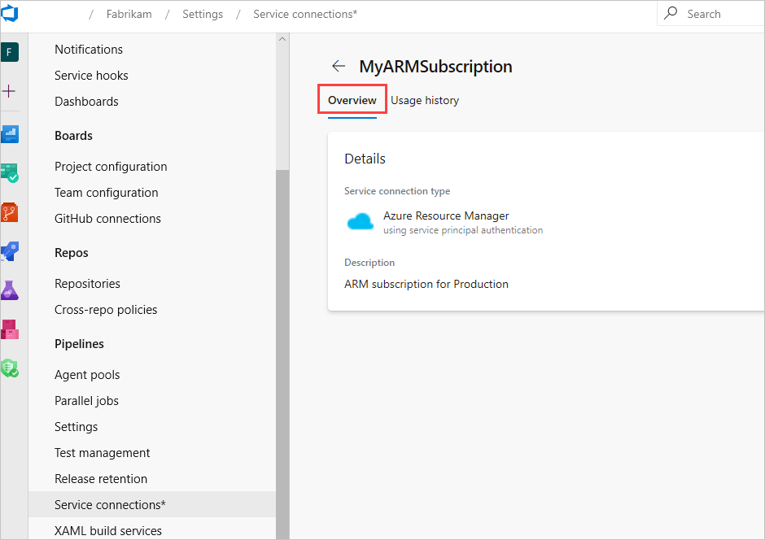
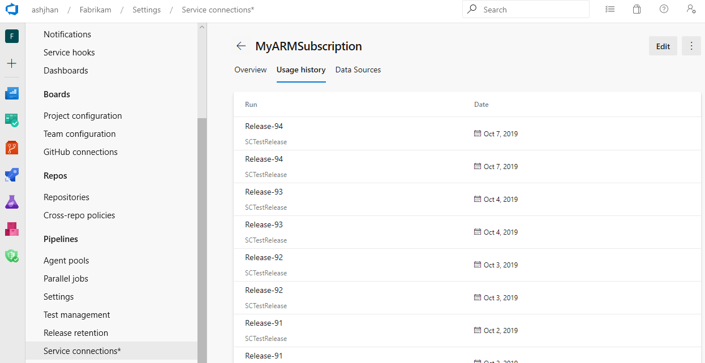
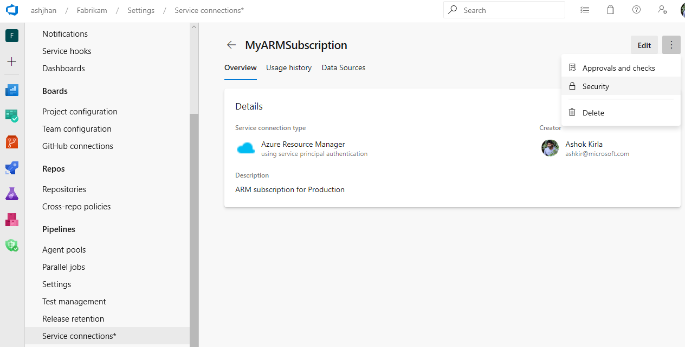
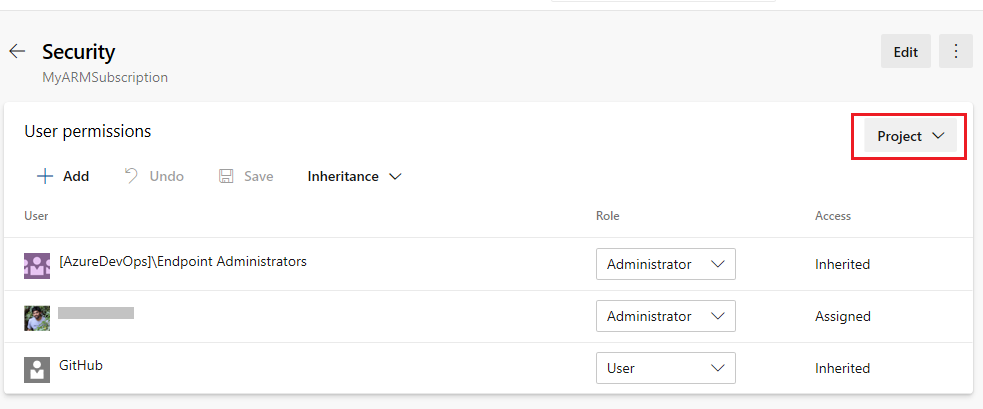
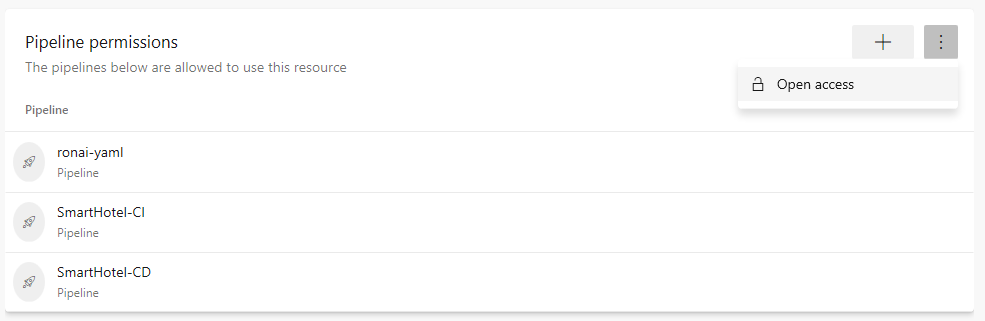
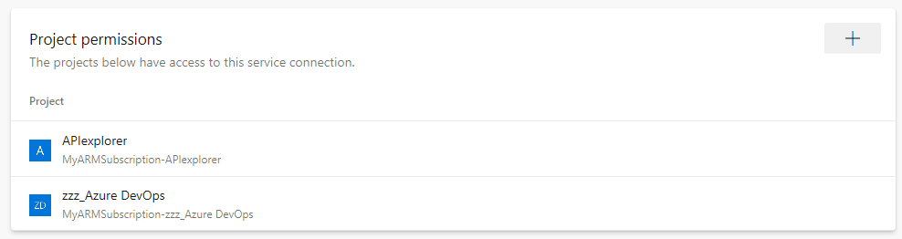
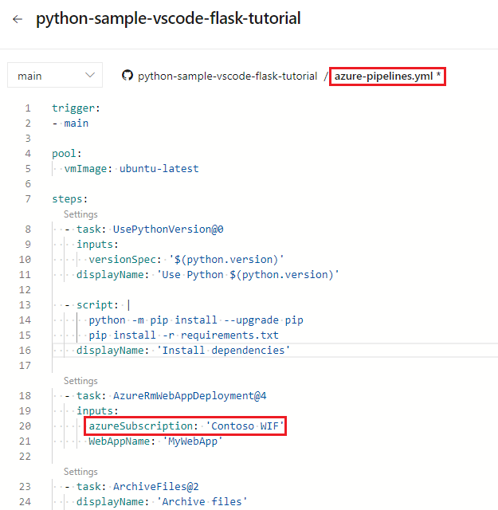
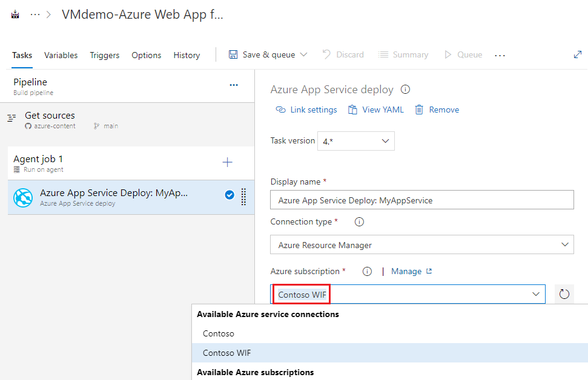

# Manage service connections

[!INCLUDE [version-tfs-2015-rtm](../includes/version-tfs-2015-rtm.md)]

::: moniker range="<= tfs-2018"

[!INCLUDE [temp](../includes/concept-rename-note.md)]

::: moniker-end

You can create a connection from Azure Pipelines to external and remote services for executing tasks in a job. Once you establish a connection, you can view, edit, and add security to the service connection.

For example, you might want to connect to one of the following categories and their services.

* Your Microsoft Azure subscription: Create a service connection with your Microsoft Azure subscription and use the name of the service connection in an Azure Web Site Deployment task in a release pipeline.
* A different build server or file server: Create a standard GitHub Enterprise Server service connection to a GitHub repository.
* An online continuous integration environment: Create a Jenkins service connection for continuous integration of Git repositories.
* Services installed on remote computers: Create an Azure Resource Manager service connection to a VM with a managed service identity.
  
> [!TIP]
> The Azure Resource Manager service connection is a single example of a service connection. For more information, see [Common service connection types](#common-service-connection-types).

## Prerequisites

You can create, view, use, and manage a service connection based on your assigned user roles. For more information, see [User permissions](#user-permissions).

## Create a service connection

Complete the following steps to create a service connection for Azure Pipelines.

::: moniker range="azure-devops"

1. Sign in to your organization (```https://dev.azure.com/{yourorganization}```) and select your project.
1. Select **Project settings** > **Service connections**.
1. Select **+ New service connection**, select the type of service connection that you need, and then select **Next**.
1. Choose an authentication method, and then select **Next**.
1. Enter the parameters for the service connection. The list of parameters differs for each type of service connection. For more information, see the [list of service connection types and associated parameters](#common-service-connection-types).
1. Select **Save** to create the connection.

   

1. Validate the connection, once it's created and parameters are entered. The validation link uses a REST call to the external service with the information that you entered, and indicates whether the call succeeded.

::: moniker-end

::: moniker range="<= tfs-2018"

1. In Team Foundation Server (TFS), open the **Services** page from the "settings" icon in the top menu bar.
1. Select **+ New service connection** and select the type of service connection you need.
1. Enter the parameters for the service connection. The list of parameters differs for each type of service connection. For more information, see the [list of service connection types](#common-service-connection-types).
1. Select **OK** to create the connection.

   

1. Validate the connection, once it's created and parameters are entered. The validation link uses a REST call to the external service with the information that you entered, and indicates whether the call succeeded.

::: moniker-end

> [!NOTE]
> The new service connection window may appear different for the various types of service connections and have different parameters. See the list of parameters in [Common service connection types](#common-service-connection-types) for each service connection type.

## Edit service connection

Complete the following steps to edit a service connection.

::: moniker range="azure-devops"

1. Sign in to your organization (```https://dev.azure.com/{yourorganization}```) and select your project.
1. Select **Project settings** > **Service connections**.
1. Select the service connection that you want to edit.
1. See the **Overview** tab of the service connection where you can see the details of the service connection. For example, you can see details like type, creator, and authentication type. For instance, token, username/password, or OAuth, and so on.

   

1. Next to the overview tab, you can see **Usage history**, which shows the list of pipelines that are using the service connection.

   

1. To update the service connection, select **Edit**.
   **Approvals and checks**, **Security**, and **Delete** are part of the more options at the top-right corner.

   

::: moniker-end

::: moniker range="<= tfs-2018"

1. In TFS, open the **Services** page from the "settings" icon in the top menu bar.
1. Select **Project settings** > **Service connections**.
1. Select the service connection that you want to edit.
1. See the **Overview** tab of the service connection where you can see the details of the service connection. For example, you can see details like type, creator, and authentication type. For instance, token, username/password, or OAuth, and so on.

   

1. Next to the overview tab, you can see **Usage history**, which shows the list of pipelines that are using the service connection.

   

1. To update the service connection, select **Edit**.
   **Approvals and checks**, **Security**, and **Delete** are part of the more options at the top-right corner.

   

::: moniker-end

## Secure a service connection

Complete the following steps to manage security for a service connection.

::: moniker range="azure-devops"

1. Sign in to your organization (```https://dev.azure.com/{yourorganization}```) and select your project.
1. Select **Project settings** > **Service connections**.
1. Highlight the service connection that you want to edit.
1. Go to the more options at the top-right corner and choose **Security**.

   

::: moniker-end

::: moniker range="<= tfs-2018"

1. In TFS, open the **Services** page from the "settings" icon in the top menu bar.

1. To manage user permissions at hub level, go to the more options at the top-right corner and choose **Security**.

   

1. To manage security for a service connection, open the service connection and go to more options at top-right corner and choose **Security**.

::: moniker-end

Based on usage patterns, service connection security is divided into the following categories. Edit permissions as desired.

* [User permissions](#user-permissions)
* [Pipeline permissions](#pipeline-permissions)
* [Project permissions](#project-permissions---cross-project-sharing-of-service-connections)

   :::image type="content" source="../release/_img/azure-rm-endpoint/azure-rm-security.png" alt-text="Screenshot of Azure Resource Manager security.":::

### User permissions

Control who can create, view, use, and manage a service connection with user roles. In **Project settings** > **Service connections**, you can set the hub-level permissions, which are inherited. You can also override the roles for each service connection.

| Role on a service connection | Purpose |
|------------------------------------|---------|
| Creator | Members of this role can create the service connection in the project. Contributors are added as members by default|
| Reader | Members of this role can view the service connection. |
| User | Members of this role can use the service connection when authoring build or release pipelines or authorize yaml pipelines. |
| Administrator | Members of this role can use the service connection and manage membership of all other roles for the project's service connection. Project Administrators are added as members by default. |

::: moniker range="azure-devops"

> [!NOTE]
> Previously, Endpoint Creator and Endpoint Administrator groups were used to control who could create and manage service connections. We've moved to the pure RBAC model, which uses roles.
For backward compatibility in existing projects, the Endpoint Administrator group is now the Administrator role and the Endpoint Creator group is the Creator role, which ensures there's no change in the behavior for existing service connections.
>
>We've also introduced **Sharing of service connections across projects**. With this feature, service connections now become an organization-level object, however scoped to your current project by default. In **User permissions**, you can see **Project**- and **Organization**- level permissions. The functionality of the Administrator role is split between the two permission levels.

::: moniker-end

#### Project-level permissions

The project-level permissions are the user permissions with reader, user, creator and administrator roles, as explained above, within the project scope. You have inheritance and you can set the roles at the hub level and for each service connection.

The project-level Administrator can do the following tasks:

* Manage other users and roles at the project-level
* Rename a service connection and update the description
* Delete a service connection, which removes it from the project



The user who created the service connection is automatically added to the project-level Administrator role for that service connection. Users and groups assigned the Administrator role at the hub-level are inherited if the inheritance is turned on.

#### Organization-level permissions

Any permissions set at the organization-level reflect across all the projects where the service connection is shared. There's no inheritance for organization-level permissions.

The organization-level Administrator can do the following administrative tasks:

* Manage organization-level users
* Edit all the fields of a service connection
* Share and unshare a service connection with other projects


The user who created the service connection is automatically added as an organization-level Administrator role for that service connection. In all existing service connections, the connection Administrators are made organization-level Administrators.

### Pipeline permissions

Pipeline permissions control which YAML pipelines are authorized to use the service connection.

You can choose from the following options:

* Open access for all pipelines to consume the service connection from the more options at top-right corner of the **Pipeline permissions** section in security tab of a service connection.

* Lock down the service connection and only allow selected YAML pipelines to consume the service connection. If any other YAML pipeline refers to the service connection, an authorization request gets raised, which must be approved by a connection Administrator.



### Project permissions - Cross project sharing of service connections

Project permissions control which projects can use the service connection. By default, service connections aren't shared with any other projects.

* Only the organization-level administrators from **User permissions** can share the service connection with other projects.
* The user who's sharing the service connection with a project should have at least Create service connection permission in the target project.
* The user who shares the service connection with a project becomes the project-level Administrator for that service connection. The project-level inheritance is set to *on* in the target project.
* The service connection name is appended with the project name and it can be renamed in the target project scope.
* Organization-level administrator can unshare a service connection from any shared project.



> [!NOTE]
> The project permissions feature is dependent on the new service connections UI. When we enable this feature, the old service
> connections UI will no longer be usable.

## Use a service connection

Once you've [created your service connection](#create-a-service-connection), complete the following steps to use it.

# [YAML](#tab/yaml)

1. Copy the connection name into your code as the **azureSubscription** (or the equivalent connection name) value.

  

<a id="classic"></a>

# [Classic](#tab/classic)

1. Select the connection name you assigned in the **Azure subscription** (or the equivalent connection name) setting of your pipeline.

  

---

1. Authorize the service connection using one of the following techniques:

* To authorize any pipeline to use the service connection, go to Azure Pipelines, open the Settings page, select Service connections, and enable the setting **Allow all pipelines to use this connection** option for the connection.

* To authorize a service connection for a specific pipeline, open the pipeline
  by selecting **Edit** and queue a build manually. You see a resource authorization error
  and an "Authorize resources" action on the error. Choose this action to explicitly add the pipeline as an
  authorized user of the service connection.

You can also create your own [custom service connections](../../extend/develop/service-endpoints.md).

> [!NOTE]
> Service connections can't be specified by variables.

## Common service connection types

Azure Pipelines supports the following service connection types by default:

[Azure Classic](#azure-classic-service-connection) | [Azure Repos/TFS](#azure-repos) | [Azure Resource Manager](#azure-resource-manager-service-connection) | [Azure Service Bus](#azure-service-bus-service-connection) | [BitBucket](#bitbucket-cloud-service-connection) | [Chef](#chef-service-connection) | [Docker hub or others](#docker-hub-or-others) | [External Git](#external-git-service-connection) | [Generic](#generic-service-connection) | [GitHub](#github-service-connection) | [GitHub Enterprise Server](#github-enterprise-server-service-connection) | [Jenkins](#jenkins-service-connection) | [Kubernetes](#kubernetes-service-connection) | [Maven](#maven-service-connection) | [npm](#npm-service-connection) | [NuGet](#nuget-service-connection) | [Python package download](#python-package-download-service-connection) | [Python package upload](#python-package-upload-service-connection) | [Service Fabric](#service-fabric-service-connection) | [SSH](#ssh-service-connection) | [Subversion](#subversion-service-connection) | [Visual Studio App Center](#visual-studio-app-center-service-connection) |

### Azure Classic service connection

Use the following parameters to define and secure a connection to a Microsoft Azure subscription, using Azure credentials or an Azure management certificate.

[How do I create a new service connection?](#create-a-service-connection)

| Parameter | Description |
| --------- | ----------- |
| \[authentication type\] | Required. Select **Credentials** or **Certificate based**. |
| Connection name | Required. The name you use to refer to the service connection in task properties. It's not the name of your Azure account or subscription. If you're using YAML, use the name as the **azureSubscription** or the equivalent subscription name value in the script. |
| Environment | Required. Select **Azure Cloud**, **Azure Stack**, or one of the pre-defined [Azure Government Clouds](government-cloud.md) where your subscription is defined. |
| Subscription ID | Required. The GUID-like identifier for your Azure subscription (not the subscription name). You can copy the subscription ID from the Azure portal. |
| Subscription name | Required. The name of your Microsoft Azure subscription. |
| User name | Required for Credentials authentication. User name of a work or school account (for example @fabrikam.com). Microsoft accounts (for example @live or @hotmail) are't supported. |
| Password | Required for Credentials authentication. Password for the user specified above. |
| Management certificate | Required for Certificate-based authentication. Copy the value of the management certificate key from your [publish settings XML file](https://go.microsoft.com/fwlink/?LinkID=312990) or the Azure portal. |

If your subscription is defined in an [Azure Government Cloud](government-cloud.md), ensure your application meets the relevant compliance requirements before you configure a service connection.

### Azure Repos

Use the following parameters to define and secure a connection to another Azure DevOps organization.

|       Parameter       |                                                                                                                                  Description                                                                                                                                   |
|-----------------------|--------------------------------------------------------------------------------------------------------------------------------------------------------------------------------------------------------------------------------------------------------------------------------|
|   (authentication)    |                                                                                                              Select **Basic** or **Token Based** authentication.                                                                                                               |
|    Connection name    | Required. The name you use to refer to the service connection in task properties. This isn't the name of your Azure account or subscription. If you're using YAML, use the name as the **azureSubscription** or the equivalent subscription name value in the script. |
|    Connection URL     |                                                                                                           Required. The URL of the TFS or the other Azure DevOps organization.                                                                                                         |
|       User name       |                                                                                                   Required for Basic authentication. The username to connect to the service.                                                                                                   |
|       Password        |                                                                                                  Required for Basic authentication. The password for the specified username.                                                                                                   |
| Personal Access Token |                      Required for Token Based authentication (TFS 2017 and newer and Azure Pipelines only). The token to use to authenticate with the service. [Learn more](../../organizations/accounts/use-personal-access-tokens-to-authenticate.md).                       |

Use the **Verify connection** link to validate your connection information.

For more information, see [Authenticate access with personal access tokens for Azure DevOps](../../organizations/accounts/use-personal-access-tokens-to-authenticate.md).

### Azure Resource Manager service connection

Use the following parameters to define and secure a connection to a Microsoft Azure subscription
using Service Principal Authentication (SPA) or an Azure-Managed Service Identity.
The dialog offers two main modes:

* **Automated subscription detection**. In this mode, Azure Pipelines queries Azure for all of the subscriptions and instances to which you have access. They use the credentials you're currently signed in with in Azure Pipelines (including Microsoft accounts and School or Work accounts).
  
If you don't see the subscription you want to use, sign out of Azure Pipelines and sign in again using the appropriate account credentials.

* **Manual subscription pipeline**. In this mode, you must specify the service principal you want to use to connect to Azure. The service principal specifies the resources and the access levels that are available over the connection.

Use this approach when you need to connect to an Azure account using different credentials from the credentials you're currently signed in with in Azure Pipelines. It's useful way to maximize security and limit access. Service principals are valid for two years.

For more information, see [Connect to Microsoft Azure](connect-to-azure.md)

> [!NOTE]
> If you don't see any Azure subscriptions or instances, or you have problems validating the connection, see [Troubleshoot Azure Resource Manager service connections](../release/azure-rm-endpoint.md).

### Azure Service Bus service connection

Use the following parameters to define and secure a connection to a Microsoft Azure Service Bus queue.

|          Parameter           |                                                                                                                                  Description                                                                                                                                   |
|------------------------------|--------------------------------------------------------------------------------------------------------------------------------------------------------------------------------------------------------------------------------------------------------------------------------|
|       Connection name        | Required. The name you use to refer to the service connection in task properties. This name isn't the name of your Azure account or subscription. If you're using YAML, use the name as the **azureSubscription** or the equivalent subscription name value in the script. |
| Service Bus ConnectionString |                                                                    The URL of your Azure Service Bus instance. [More information](/azure/service-bus-messaging/service-bus-fundamentals-hybrid-solutions).                                                                     |
|    Service Bus Queue Name    |                                                                                                                The name of an existing Azure Service Bus queue.                                                                                                                |

<!--

*****

<h3 id="sep-servfabric">Azure Service Fabric service connection</h3>

Defines and secures a connection to a Microsoft Azure Service Fabric cluster.

| Parameter | Description |
| --------- | ----------- |
| \[authentication type\] | Required. Select **No authentication**, **Azure Active Directory credentials**, or **Certificate based**. |
| Connection name | Required. The name you will use to refer to this connection in task properties. This is not the name of your Azure account or subscription. If you are using YAML, use the name as the **azureSubscription** or the equivalent subscription name value in the script. |
| Cluster connection | Required. The client connection of the remote cluster to connect to. Prefix with **tcp://**. |
| Username | Required for Azure Active Directory authentication. The username to use when connecting to the remote cluster. |
| Password | Required for Azure Active Directory authentication. The password for the specified username. |
| Client certificate | Required for certificate based authentication. The Base64-encoded contents of the client certificate. |
| Password | The password for the certificate when using certificate based authentication. |
<p />

You can use the following PowerShell script to obtain a Base64-encoded representation of a certificate:

```powershell
[System.Convert]::ToBase64String([System.IO.File]::ReadAllBytes("path-to-certificate-file\certificate.pfx"))
```

-->

### Bitbucket Cloud service connection

Use OAuth with **Grant authorization** or a username and password with **Basic Authentication** to define a connection to Bitbucket Cloud. For pipelines to keep working, your repository access must remain active.

### Grand authorization

| Parameter | Description |
| --------- | ----------- |
| OAuth configuration | Required.  OAuth connection to Bitbucket. |

### Basic authentication

| Parameter | Description |
| --------- | ----------- |
| Connection name | Required. The name you use to refer to the service connection in task properties. It's not the name of your Azure account or subscription. If you're using YAML, use the name as the **azureSubscription** or the equivalent subscription name value in the script. |
| User name | Required. The username to connect to the service. |
| Password | Required. The password for the specified username. |

### Chef service connection

Use the following parameters to define and secure a connection to a [Chef](https://docs.chef.io/chef_overview.html) automation server.

| Parameter | Description |
| --------- | ----------- |
| Connection name | Required. The name you use to refer to the service connection in task properties. It's not the name of your Azure account or subscription. If you're using YAML, use the name as the **azureSubscription** or the equivalent subscription name value in the script. |
| Server URL | Required. The URL of the Chef automation server. |
| Node Name (Username) | Required. The name of the node to connect to. Typically this is your username. |
| Client Key | Required. The key specified in the Chef .pem file. |

### Docker Host service connection

Use the following parameters to define and secure a connection to a Docker host.

| Parameter | Description |
| --------- | ----------- |
| Connection name | Required. The name you use to refer to the service connection in task properties. It's not the name of your Azure account or subscription. If you're using YAML, use the name as the **azureSubscription** or the equivalent subscription name value in the script. |
| Server URL | Required. The URL of the Docker host. |
| CA certificate | Required. A trusted certificate authority certificate to use to authenticate with the host. |
| Certificate | Required. A client certificate to use to authenticate with the host. |
| Key | Required. The key specified in the Docker key.pem file. |

For more information about protecting your connection to the Docker host, see [Protect the Docker daemon socket](https://docs.docker.com/engine/security/https/).

### Docker Registry service connection

Use the following parameters to define a connection to a container registry for either [Azure Container Registry](#azure-container-registry) or [Docker Hub or others](#docker-hub-or-others).

#### Azure Container Registry

| Parameter | Description |
| --------- | ----------- |
| Connection name | Required. The name you use to refer to the service connection in task inputs. |
| Azure subscription | Required. The Azure subscription containing the container registry to be used for service connection creation. |
| Azure Container Registry | Required. The Azure Container Registry to be used for creation of service connection. |

#### Docker Hub or others

| Parameter | Description |
| --------- | ----------- |
| Connection name | Required. The name you use to refer to the service connection in task inputs. |
| Docker Registry | Required. The URL of the Docker registry. |
| Docker ID | Required. The identifier of the Docker account user. |
| Password | Required. The password for the account user identified above. (Docker Hub requires a PAT instead of a password.) |
| Email | Optional. An email address to receive notifications. |

### External Git service connection

Use the following parameters to define and secure a connection to a Git repository server.
There's a specific service connection for [GitHub](#github-service-connection) and [GitHub Enterprise Server](#github-enterprise-server-service-connection).

| Parameter | Description |
| --------- | ----------- |
| Connection name | Required. The name you use to refer to the service connection in task properties. It's not the name of your Azure account or subscription. If you're using YAML, use the name as the **azureSubscription** or the equivalent subscription name value in the script. |
| Server URL | Required. The URL of the Git repository server. |
| User name | Required. The username to connect to the Git repository server. |
| Password/Token key | Required. The password or access token for the specified username. |

For more information, see [Artifact sources](../release/artifacts.md#sources).

### Generic service connection

Use the following parameters to define and secure a connection to any generic type of service or application.

| Parameter | Description |
| --------- | ----------- |
| Connection name | Required. The name you use to refer to the service connection in task properties. It's not the name of your Azure account or subscription. If you're using YAML, use the name as the **azureSubscription** or the equivalent subscription name value in the script. |
| Server URL | Required. The URL of the service. |
| User name | Optional. The username to connect to the service. |
| Password/Token key | Optional. The password or access token for the specified username. |

### GitHub service connection

Use the following parameters to define a connection to a GitHub repository.

> [!TIP]
> There's a specific service connection for [External Git servers](#external-git-service-connection) and [GitHub Enterprise Server connections](#github-enterprise-server-service-connection).

|      Parameter       |                                                                                                                                  Description                                                                                                                                   |
|----------------------|--------------------------------------------------------------------------------------------------------------------------------------------------------------------------------------------------------------------------------------------------------------------------------|
| Choose authorization |                                                                                            Required. Either **Grant authorization** or **Personal access token**. See notes below.                                                                                             |
|        Token         |                                                                                                       Required for Personal access token authorization. See notes below.                                                                                                       |
|   Connection name    | Required. The name you use to refer to the service connection in task properties. It's not the name of your Azure account or subscription. If you're using YAML, use the name as the **azureSubscription** or the equivalent subscription name value in the script. |

> [!NOTE]
> If you select **Grant authorization** for the **Choose authorization** option, the dialog shows an **Authorize** button that opens the GitHub signin page. If you select **Personal access token**, paste it into the **Token** textbox. The dialog shows the recommended scopes for the token: **repo, user, admin:repo_hook**. For more information, see
[Create an access token for command line use](https://help.github.com/articles/creating-an-access-token-for-command-line-use/)
Then, complete the following steps to register your GitHub account in your profile.

1. Open your profile from your account name at the right of the Azure Pipelines page heading.
2. At the top of the left column, under **DETAILS**, choose **Security**.
3. Select **Personal access tokens**.
4. Select **Add** and enter the information required to create the token.

For more information, see [Artifact sources](../release/artifacts.md#tfvcsource).

### GitHub Enterprise Server service connection

Use the following parameters to define a connection to a GitHub repository.

> [!TIP]
> There's a specific service connection for [External Git servers](#external-git-service-connection) and [standard GitHub service connections](#github-service-connection).

|                 Parameter                  |                                                                                                                                  Description                                                                                                                                   |
|--------------------------------------------|--------------------------------------------------------------------------------------------------------------------------------------------------------------------------------------------------------------------------------------------------------------------------------|
|            Choose authorization            |                                                                                     Required. Either **Personal access token**, **Username and Password**, or **OAuth2**. See notes below.                                                                                     |
|              Connection name               | Required. The name you use to refer to the service connection in task properties. This isn't the name of your Azure account or subscription. If you're using YAML, use the name as the **azureSubscription** or the equivalent subscription name value in the script. |
|                 Server URL                 |                                                                                                                       Required. The URL of the service.                                                                                                                        |
|     Accept untrusted TLS/SSL certificates      |                                         Set this option to allow clients to accept a self-signed certificate instead of installing the certificate in the TFS service role or the computers hosting the [agent](../agents/agents.md).                                          |
|                   Token                    |                                                                                                       Required for Personal access token authorization. See notes below.                                                                                                       |
|                 User name                  |                                                                                           Required for Username and Password authentication. The username to connect to the service.                                                                                           |
|                  Password                  |                                                                                          Required for Username and Password authentication. The password for the specified username.                                                                                           |
|            OAuth configuration             |                                                                                             Required for OAuth2 authorization. The OAuth configuration specified in your account.                                                                                              |
| GitHub Enterprise Server configuration URL |                                                                                                                  The URL is fetched from OAuth configuration.                                                                                                                  |

> [!NOTE]
> If you select **Personal access token** (PAT) you must paste the PAT into the **Token** textbox. The dialog shows the recommended scopes for the token: **repo, user, admin:repo_hook**. For more information, see
[Create an access token for command line use](https://help.github.com/articles/creating-an-access-token-for-command-line-use/)
Then, complete the following steps to register your GitHub account in your profile.

1. Open your profile from your account name at the right of the Azure Pipelines page heading.
2. At the top of the left column, under **DETAILS**, choose **Security**.
3. Select **Personal access tokens**.
4. Select **Add** and enter the information required to create the token.

### Jenkins service connection

Use the following parameters to define a connection to the Jenkins service.

|             Parameter             |                                                                                                                                  Description                                                                                                                                   |
|-----------------------------------|--------------------------------------------------------------------------------------------------------------------------------------------------------------------------------------------------------------------------------------------------------------------------------|
|          Connection name          | Required. The name you use to refer to the service connection in task properties. It's not the name of your Azure account or subscription. If you're using YAML, use the name as the **azureSubscription** or the equivalent subscription name value in the script. |
|            Server URL             |                                                                                                                       Required. The URL of the service.                                                                                                                        |
| Accept untrusted TLS/SSL certificates |                                         Set this option to allow clients to accept a self-signed certificate instead of installing the certificate in the TFS service role or the computers hosting the [agent](../agents/agents.md).                                          |
|             User name             |                                                                                                               Required. The username to connect to the service.                                                                                                                |
|             Password              |                                                                                                               Required. The password for the specified username.                                                                                                               |

For more information, see [Azure Pipelines Integration with Jenkins](https://devblogs.microsoft.com/devops/vsts-visual-studio-team-services-integration-with-jenkins/) and [Artifact sources](../release/artifacts.md#jenkinssource).

### Kubernetes service connection

Use the following parameters when you define a connection to a Kubernetes cluster. Choose from the following service connection options:

* Azure subscription
* Service account
* Kubeconfig

#### Azure subscription option

| Parameter | Description |
| --------- | ----------- |
| Connection name | Required. The name you use to refer to the service connection in task inputs. |
| Azure subscription | Required. The Azure subscription containing the cluster to be used for service connection creation.  |
| Cluster | Name of the Azure Kubernetes Service cluster. |
| Namespace | Namespace within the cluster. |

For an Azure RBAC enabled cluster, a ServiceAccount gets created in the chosen namespace along with RoleBinding object, so that the created ServiceAccount can do actions only on the chosen namespace.

For an Azure RBAC disabled cluster, a ServiceAccount gets created in the chosen namespace, but, the created ServiceAccount has cluster-wide privileges (across namespaces).

> [!NOTE]
> This option lists all the subscriptions the service connection creator has access to *across different Azure tenants*. If you can't see subscriptions from other Azure tenants, check your Azure AD permissions in those tenants.

#### Service account option

| Parameter | Description |
| --------- | ----------- |
| Connection name | Required. The name you use to refer to the service connection in task inputs. |
| Server URL | Required. Cluster's API server URL.  |
| Secret | Secret associated with the service account to be used for deployment |

Use the following command to fetch the Server URL.

```
kubectl config view --minify -o 'jsonpath={.clusters[0].cluster.server}'
```

Use the following sequence of commands to fetch the Secret object that's required to connect and authenticate with the cluster.

```
kubectl get serviceAccounts <service-account-name> -n <namespace> -o 'jsonpath={.secrets[*].name}'
```

In the following command, replace the `service-account-secret-name` with the output of the previous command.

```
kubectl get secret <service-account-secret-name> -n <namespace> -o json
```

Copy and paste the Secret object fetched in YAML form into the Secret text-field.

> [!NOTE]
> When using the service account option, [ensure that a RoleBinding exists](https://kubernetes.io/docs/reference/access-authn-authz/rbac/#kubectl-create-rolebinding), which grants permissions in the `edit` `ClusterRole` to the desired service account. This is needed so that the service account can be used by Azure Pipelines for creating objects in the chosen namespace.

#### Kubeconfig option

| Parameter | Description |
| --------- | ----------- |
| Connection name | Required. The name you use to refer to the service connection in task inputs. |
| Kubeconfig | Required. Contents of the kubeconfig file.  |
| Context | Context within the kubeconfig file that is to be used for identifying the cluster. |

### Maven service connection

Use the following parameters when you define and secure a connection to a Maven repository.

|       Parameter       |                                                                                                                                  Description                                                                                                                                   |
|-----------------------|--------------------------------------------------------------------------------------------------------------------------------------------------------------------------------------------------------------------------------------------------------------------------------|
|    Connection name    | Required. The name you use to refer to the service connection in task properties. It's not the name of your Azure account or subscription. If you're using YAML, use the name as the **azureSubscription** or the equivalent subscription name value in the script. |
|     Registry URL      |                                                                                                                      Required. The URL of the Maven repository.                                                                                                                      |
|     Registry ID       |                                                                                           Required. This is the ID of the server that matches the ID element of the repository/mirror that Maven tries to connect to.                                                           |
|       Username        |                                                                                          Required when connection type is **Username and Password**. The username for authentication.                                                                                          |
|       Password        |                                                                                           Required when connection type is **Username and Password**. The password for the username.                                                                                           |
| Personal Access Token |                                  Required when connection type is **Authentication Token**. The token to use to authenticate with the service. [Learn more](../../organizations/accounts/use-personal-access-tokens-to-authenticate.md).                                   |

### Npm service connection

Use the following parameters when you define and secure a connection to an npm server.

|       Parameter       |                                                                                                                                  Description                                                                                                                                   |
|-----------------------|--------------------------------------------------------------------------------------------------------------------------------------------------------------------------------------------------------------------------------------------------------------------------------|
|    Connection name    | Required. The name used to refer to the service connection in task properties. It's not the name of your Azure account or subscription. If you're using YAML, use the name as the **azureSubscription** or the equivalent subscription name value in the script. |
|     Registry URL      |                                                                                                                      Required. The URL of the npm server.                                                                                                                      |
|       Username        |                                                                                          Required when connection type is **Username and Password**. The username for authentication.                                                                                          |
|       Password        |                                                                                           Required when connection type is **Username and Password**. The password for the username.                                                                                           |
| Personal Access Token |                                  Required when connection type is **External Azure Pipelines**. The token to use to authenticate with the service. [Learn more](../../organizations/accounts/use-personal-access-tokens-to-authenticate.md).                                   |

### NuGet service connection

Use the following parameters when you define and secure a connection to a NuGet server.

|       Parameter       |                                                                                                                                  Description                                                                                                                                   |
|-----------------------|--------------------------------------------------------------------------------------------------------------------------------------------------------------------------------------------------------------------------------------------------------------------------------|
|    Connection name    | Required. The name used to refer to the service connection in task properties. It's not the name of your Azure account or subscription. If you're using YAML, use the name as the **azureSubscription** or the equivalent subscription name value in the script. |
|       Feed URL        |                                                                                                                     Required. The URL of the NuGet server.                                                                                                                     |
|        ApiKey         |                                                                                                      Required when connection type is **ApiKey**. The authentication key.                                                                                                      |
| Personal Access Token |                                  Required when connection type is **External Azure Pipelines**. The token to use to authenticate with the service. [Learn more](../../organizations/accounts/use-personal-access-tokens-to-authenticate.md).                                   |
|       Username        |                                                                                          Required when connection type is **Basic authentication**. The username for authentication.                                                                                           |
|       Password        |                                                                                           Required when connection type is **Basic authentication**. The password for the username.                                                                                            |

To configure NuGet to authenticate with Azure Artifacts and other NuGet repositories, see [NuGet Authenticate](../tasks/package/nuget-authenticate.md).

### Python package download service connection

Use the following parameters when you define and secure a connection to a Python repository for downloading Python packages.

|             Parameter              |                                                                                                                                  Description                                                                                                                                   |
|------------------------------------|--------------------------------------------------------------------------------------------------------------------------------------------------------------------------------------------------------------------------------------------------------------------------------|
|          Connection name           | Required. The name used to refer to the service connection in task properties. It's not the name of your Azure account or subscription. If you're using YAML, use the name as the **azureSubscription** or the equivalent subscription name value in the script. |
| Python repository url for download |                                                                                                                  Required. The URL of the Python repository.                                                                                                                   |
|       Personal Access Token        |                                    Required when connection type is **Authentication Token**. The token to use to authenticate with the service. [Learn more](../../organizations/accounts/use-personal-access-tokens-to-authenticate.md).                                     |
|              Username              |                                                                                          Required when connection type is **Username and Password**. The username for authentication.                                                                                          |
|              Password              |                                                                                           Required when connection type is **Username and Password**. The password for the username.                                                                                           |

### Python package upload service connection

Use the following parameters when you define and secure a connection to a Python repository for uploading Python packages.

|            Parameter             |                                                                                                                                  Description                                                                                                                                   |
|----------------------------------|--------------------------------------------------------------------------------------------------------------------------------------------------------------------------------------------------------------------------------------------------------------------------------|
|         Connection name          | Required. The name used to refer to the service connection in task properties. It's not the name of your Azure account or subscription. If you're using YAML, use the name as the **azureSubscription** or the equivalent subscription name value in the script. |
| Python repository url for upload |                                                                                                                  Required. The URL of the Python repository.                                                                                                                   |
|           EndpointName           |                                                                                     Required. Unique repository name used for twine upload. Spaces and special characters aren't allowed.                                                                                     |
|      Personal Access Token       |                                    Required when connection type is **Authentication Token**. The token to use to authenticate with the service. [Learn more](../../organizations/accounts/use-personal-access-tokens-to-authenticate.md).                                     |
|             Username             |                                                                                          Required when connection type is **Username and Password**. The username for authentication.                                                                                          |
|             Password             |                                                                                           Required when connection type is **Username and Password**. The password for the username.                                                                                           |

### Service Fabric service connection

Use the following parameters when you define and secure a connection to a Service Fabric cluster.

|           Parameter           |                                                                                                                                  Description                                                                                                                                   |
|-------------------------------|--------------------------------------------------------------------------------------------------------------------------------------------------------------------------------------------------------------------------------------------------------------------------------|
|        Connection name        | Required. The name used to refer to the service connection in task properties. It's not the name of your Azure account or subscription. If you're using YAML, use the name as the **azureSubscription** or the equivalent subscription name value in the script. |
|       Cluster Endpoint        |                                                                                                                   Required. The TCP endpoint of the cluster.                                                                                                                   |
| Server Certificate Thumbprint |                                                                                             Required when connection type is **Certificate based** or **Azure Active Directory**.                                                                                              |
|      Client Certificate       |                                                                                                            Required when connection type is **Certificate based**.                                                                                                             |
|           Password            |                                                                                               Required when connection type is **Certificate based**. The certificate password.                                                                                                |
|           Username            |                                                                                         Required when connection type is **Azure Active Directory**. The username for authentication.                                                                                          |
|           Password            |                                                                                          Required when connection type is **Azure Active Directory**. The password for the username.                                                                                           |
|     Use Windows security      |                                                                                                                  Required when connection type is **Others**.                                                                                                                  |
|          Cluster SPN          |                                                                                                    Required when connection type is **Others** and using Windows security.                                                                                                     |

### SSH service connection

Use the following parameters when you define and secure a connection to a remote host using Secure Shell (SSH).

|       Parameter        |                                                                                                                                  Description                                                                                                                                   |
|------------------------|--------------------------------------------------------------------------------------------------------------------------------------------------------------------------------------------------------------------------------------------------------------------------------|
|    Connection name     | Required. The name used to refer to the service connection in task properties. It's not the name of your Azure account or subscription. If you're using YAML, use the name as the **azureSubscription** or the equivalent subscription name value in the script. |
|       Host name        |                                                                                                        Required. The name of the remote host machine or the IP address.                                                                                                        |
|      Port number       |                                                                                   Required. The port number of the remote host machine to which you want to connect. The default is port 22.                                                                                   |
|       User name        |                                                                                                   Required. The username to use when connecting to the remote host machine.                                                                                                    |
| Password or passphrase |                                                                                            The password or passphrase for the specified username if using a keypair as credentials.                                                                                            |
|      Private key       |                                                                                               The entire contents of the private key file if using this type of authentication.                                                                                                |

For more information, see [SSH task](../tasks/deploy/ssh.md) and [Copy files over SSH](../tasks/deploy/copy-files-over-ssh.md).

### Subversion service connection

Use the following parameters when you define and secure a connection to the Subversion repository.

|             Parameter             |                                                                                                                                  Description                                                                                                                                   |
|-----------------------------------|--------------------------------------------------------------------------------------------------------------------------------------------------------------------------------------------------------------------------------------------------------------------------------|
|          Connection name          | Required. The name used to refer to the service connection in task properties. It's not the name of your Azure account or subscription. If you're using YAML, use the name as the **azureSubscription** or the equivalent subscription name value in the script. |
|       Server repository URL       |                                                                                                                      Required. The URL of the repository.                                                                                                                      |
| Accept untrusted TLS/SSL certificates |                                                                                   Set this option to allow the client to accept self-signed certificates installed on the agent computer(s).                                                                                   |
|            Realm name             |                                              Optional. If you use multiple credentials in a build or release pipeline, use this parameter to specify the realm containing the credentials specified for the service connection.                                               |
|             User name             |                                                                                                               Required. The username to connect to the service.                                                                                                                |
|             Password              |                                                                                                               Required. The password for the specified username.                                                                                                               |

### Visual Studio App Center service connection

Use the following parameters when you define and secure a connection to Visual Studio App Center.

|    Parameter    |                                                                                                                                  Description                                                                                                                                   |
|-----------------|--------------------------------------------------------------------------------------------------------------------------------------------------------------------------------------------------------------------------------------------------------------------------------|
| Connection name | Required. The name used to refer to the service connection in task properties. It's not the name of your Azure account or subscription. If you're using YAML, use the name as the **azureSubscription** or the equivalent subscription name value in the script. |
|    API token    |                                                                                        Required. The token to use to authenticate with the service. For more information, see the [API docs](/appcenter/api-docs/).                                                                                        |

## Extensions for other service connections

Other service connection types and tasks can be installed as extensions. See the following examples of service connections available through extensions:

* [TFS artifacts for Azure Pipelines](https://marketplace.visualstudio.com/items?itemName=ms-vscs-rm.vss-services-externaltfs).
  Deploy on-premises TFS builds with Azure Pipelines through a TFS service connection and the **Team Build (external)** artifact, even when the TFS machine isn't reachable directly from Azure Pipelines. For more information, see [External TFS](../release/artifacts.md#onpremtfssource) and [this blog post](https://devblogs.microsoft.com/devops/deploy-artifacts-from-onprem-tfs-server-with-release-management-service/).

* [TeamCity artifacts for Azure Pipelines](https://marketplace.visualstudio.com/items?itemName=ms-devlabs.vss-services-teamcity).
  This extension provides integration with TeamCity through a TeamCity service connection, enabling artifacts produced in TeamCity to be deployed by using Azure Pipelines. For more information, see [TeamCity](../release/artifacts.md#teamcitysource).

* [System Center Virtual Machine Manager (SCVMM) Integration](https://marketplace.visualstudio.com/items?itemname=ms-vscs-rm.scvmmapp).
  Connect to an SCVMM server to provision virtual machines and do actions on them such as managing checkpoints, starting and stopping virtual machines (VMs), and running PowerShell scripts.

* [VMware Resource Deployment](https://marketplace.visualstudio.com/items?itemname=ms-vscs-rm.vmwareapp).
  Connect to a VMware vCenter Server from Visual Studio Team Services or TFS to provision. Start, stop, or snapshot VMware virtual machines.

* [Microsoft Power Platform Build Tools for Azure DevOps](/power-platform/alm/devops-build-tools). Use Microsoft Power Platform Build Tools to automate common build and deployment tasks related to apps built on Microsoft Power Platform. After installing the extension, the **Power Platform** service connection type has the following properties.

    |    Parameter                       | Description  |
    |------------------------------------|--------------|
    |    Connection Name                 | Required. The name you will use to refer to this service connection in task properties. |
    |    Server URL                      | Required. The URL of the Power Platform instance. Example: `https://contoso.crm4.dynamics.com` |
    |    Tenant ID                       | Required. Tenant ID (also called directory ID in Azure portal) to authenticate to. Refer to [https://aka.ms/buildtools-spn](https://aka.ms/buildtools-spn) for a script that shows Tenant ID and configures Application ID and associated Client Secret. The application user must also be [created in CDS](/powerapps/developer/common-data-service/use-single-tenant-server-server-authentication#application-user-creation) |
    |    Application ID                  | Required. Azure Application ID to authenticate with. |
    |    Client secret of Application ID | Required. Client secret of the Service Principal associated to above Application ID used to prove identity. |

---


You can also create your own [custom service connections](../../extend/develop/service-endpoints.md).

<!--  ## FAQs and Troubleshoot service connections -->

<!-- ### Q: -->
<!-- **A:**  -->

[!INCLUDE [rm-help-support-shared](../includes/rm-help-support-shared.md)]
