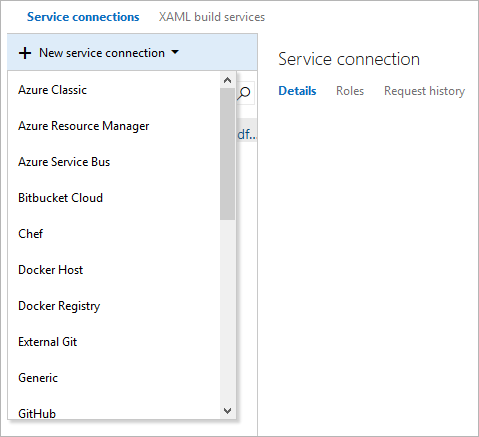

# Service endpoints for builds and releases

**VSTS | TFS 2018 | TFS 2017 | TFS 2015**

You will typically need to connect to external and remote services to execute tasks
for a build or deployment. For example, you may need to connect to your Microsoft Azure
subscription, to a different build server or file server, to an online continuous
integration environment, or to services you install on remote computers.

You can define endpoints in Visual Studio Team Services (VSTS) or Team Foundation Server (TFS) that are available for use in all
your tasks. For example, you can create an endpoint for your Azure subscription
and use this endpoint name in an Azure Web Site Deployment task in a release definition.

You define and manage service endpoints from the Admin settings of your project.
* VSTS: `https://{account}.visualstudio.com/{teamproject}/_admin/_services`
* TFS: `https://{tfsserver}/{collection}/{teamproject}/_admin/_services`

Service endpoints are created at project scope. An endpoint created in one project is not visible in another project.

<a name="create-new"></a>

## Create and use a service endpoint

1. Open the **Services** page from the "settings" icon in the top menu bar.

   

1. Choose **+ New Service Endpoint** and select the type of endpoint you need. 

   

1. Fill in the parameters for the endpoint. The list of parameters differs for each  type of service endpoint - see the [following list](#ep-types).
   For example, this is the default **Azure Resource Manager** connection dialog:

   

1. After the new service endpoint is created:

   * If you are using it in the UI, select the connection name you assigned in the **Azure subscription** (or the equivalent connection name) setting of your pipeline.

   

   * If you are using it in YAML, copy the connection name into your code as the **azureSubscription** (or the equivalent connection name) value.

   

<a name="ep-types"></a>

## Common endpoint types

VSTS and TFS support a variety of endpoint types by default. Some of these are described below:

* [Azure Classic service endpoint](#sep-azure-classic)
* [Azure Resource Manager service endpoint](#sep-azure-rm)
* [Azure Service Bus service endpoint](#sep-servbus)
* [Bitbucket Cloud service endpoint](#sep-bbucket)
* [Chef service endpoint](#sep-chef)
* [Docker Host service endpoint](#sep-dochost)
* [Docker Registry service endpoint](#sep-docreg)
* [External Git service endpoint](#sep-extgit)
* [Generic service endpoint](#sep-generic)
* [GitHub service endpoint](#sep-github)
* [GitHub Enterprise service endpoint](#sep-githubent)
* [Jenkins service endpoint](#sep-jenkins)
* [Kubernetes service endpoint](#sep-kuber)
* [npm service endpoint](#sep-npm)
* [NuGet service endpoint](#sep-nuget)
* [Service Fabric service endpoint](#sep-fabric)
* [SSH service endpoint](#sep-ssh)
* [Subversion service endpoint](#sep-subversion)
* [Team Foundation Server / VSTS service endpoint](#sep-tfsts)
* [Visual Studio App Center service endpoint](#sep-vsmobile)

After you enter the parameters when creating a service endpoint, validate the
connection. The validation link uses a REST call to the external service with
the information you entered, and indicates if the call succeeded.

<h3 id="sep-azure-classic">Azure Classic service endpoint</h3>

Defines and secures a connection to a Microsoft Azure subscription
using Azure credentials or an Azure management certificate.
[How do I create a new service endpoint?](#create-new)

| Parameter | Description |
| --------- | ----------- |
| \[authentication type\] | Required. Select **Credentials** or **Certificate based**. |
| Connection Name | Required. The name you will use to refer to this endpoint in task properties. This is not the name of your Azure account or subscription. If you are using YAML, use this name as the **azureSubscription** or the equivalent subscription name value in the script. |
| Environment | Required. Select **Azure Cloud**, **Azure Stack**, or one of the pre-defined [Azure Government Clouds](government-cloud.md) where your subscription is defined. |
| Subscription ID | Required. The GUID-like identifier for your Azure subscription (not the subscription name). You can copy this from the Azure portal. |
| Subscription Name | Required. The name of your Microsoft Azure subscription (account). |
| User name | Required for Credentials authentication. User name of a work or school account (for example @fabrikam.com). Microsoft accounts (for example @live or @hotmail) are not supported. |
| Password | Required for Credentials authentication. Password for the user specified above. |
| Management Certificate | Required for Certificate based authentication. Copy the value of the management certificate key from your [publish settings XML file](https://go.microsoft.com/fwlink/?LinkID=312990) or the Azure portal. |

> If your subscription is defined in an [Azure Government Cloud](government-cloud.md), ensure your application meets the relevant compliance requirements before you configure a service endpoint.

*****

<a name="sep-azure-rm-conditions"></a>
<a name="arm-auto-connect"></a>
<a name="arm-manual-connect"></a>
<a name="sep-azure-rm-existingsp"></a>

<h3 id="sep-azure-rm">Azure Resource Manager service endpoint</h3>

Defines and secures a connection to a Microsoft Azure subscription
using Service Principal Authentication (SPA). The dialog offers two modes:

* **Automated subscription detection**. In this mode, VSTS and TFS will attempt to query Azure for all of the subscriptions and instances to which you have access using the credentials you are currently logged on with in VSTS or TFS (including Microsoft accounts and School or Work accounts). 
  If no subscriptions are shown, or subscriptions other than the one you want to use, you must sign out of VSTS or TFS and sign in again
  using the appropriate account credentials.

* **Manual subscription definition**. In this mode, you must specify the service principal you want to use to connect to Azure. The service principal specifies the resources and the access levels that will be available over the connection.
  Use this approach when you need to connect to an Azure account using different credentials from those you are currently logged on with in VSTS or TFS.
  This is also a useful way to maximize security and limit access.

For more information, see [Create an Azure service endpoint](connect-to-azure.md)

**NOTE**: If you don't see any Azure subscriptions or instances, or you have problems validating the connection, see [Troubleshoot Azure Resource Manager service endpoints](../release/azure-rm-endpoint.md).

*****

<h3 id="sep-servbus">Azure Service Bus service endpoint</h3>

Defines and secures a connection to a Microsoft Azure Service Bus queue.

| Parameter | Description |
| --------- | ----------- |
| Connection Name | Required. The name you will use to refer to this endpoint in task properties. This is not the name of your Azure account or subscription. If you are using YAML, use this name as the **azureSubscription** or the equivalent subscription name value in the script. |
| Service Bus ConnectionString | The URL of your Azure Service Bus instance. [More information](https://docs.microsoft.com/en-us/azure/service-bus-messaging/service-bus-fundamentals-hybrid-solutions). |
| Service Bus Queue Name | The name of an existing Azure Service Bus queue. |
<p />

[How do I create a new service endpoint?](#create-new)

<!--

*****

<h3 id="sep-servfabric">Azure Service Fabric service endpoint</h3>

Defines and secures a connection to a Microsoft Azure Service Fabric cluster.

| Parameter | Description |
| --------- | ----------- |
| \[authentication type\] | Required. Select **No authentication**, **Azure Active Directory credentials**, or **Certificate based**. |
| Connection Name | Required. The name you will use to refer to this endpoint in task properties. This is not the name of your Azure account or subscription. If you are using YAML, use this name as the **azureSubscription** or the equivalent subscription name value in the script. |
| Cluster endpoint | Required. The client endpoint of the remote cluster to connect to. Prefix with **tcp://**. |
| Username | Required for Azure Active Directory authentication. The username to use when connecting to the remote cluster. |
| Password | Required for Azure Active Directory authentication. The password for the specified username. |
| Client certificate | Required for certificate based authentication. The Base64-encoded contents of the client certificate. |
| Password | The password for the certificate when using certificate based authentication. |
<p />

[How do I create a new service endpoint?](#create-new)

You can use the following PowerShell script to obtain a Base64-encoded representation of a certificate:

```powershell
[System.Convert]::ToBase64String([System.IO.File]::ReadAllBytes("path-to-certificate-file\certificate.pfx"))
```

-->

*****

<h3 id="sep-bbucket">Bitbucket service endpoint</h3>

Defines a connection to a Bitbucket server.

| Parameter | Description |
| --------- | ----------- |
| Connection Name | Required. The name you will use to refer to this endpoint in task properties. This is not the name of your Azure account or subscription. If you are using YAML, use this name as the **azureSubscription** or the equivalent subscription name value in the script. |
| User name | Required. The username to connect to the service. |
| Password | Required. The password for the specified username. |

[How do I create a new service endpoint?](#create-new)

*****

<h3 id="sep-chef">Chef service endpoint</h3>

Defines and secures a connection to a [Chef](https://docs.chef.io/chef_overview.html) automation server.

| Parameter | Description |
| --------- | ----------- |
| Connection Name | Required. The name you will use to refer to this endpoint in task properties. This is not the name of your Azure account or subscription. If you are using YAML, use this name as the **azureSubscription** or the equivalent subscription name value in the script. |
| Server URL | Required. The URL of the Chef automation server. |
| Node Name (Username) | Required. The name of the node to connect to. Typically this is your username. |
| Client Key | Required. The key specified in the Chef .pem file. |

[How do I create a new service endpoint?](#create-new)

*****

<h3 id="sep-dochost">Docker Host service endpoint</h3>

Defines and secures a connection to a Docker host.

| Parameter | Description |
| --------- | ----------- |
| Connection Name | Required. The name you will use to refer to this endpoint in task properties. This is not the name of your Azure account or subscription. If you are using YAML, use this name as the **azureSubscription** or the equivalent subscription name value in the script. |
| Server URL | Required. The URL of the Docker host. |
| CA Certificate | Required. A trusted certificate authority certificate to use to authenticate with the host. |
| Certificate | Required. A client certificate to use to authenticate with the host. |
| Key | Required. The key specified in the Docker key.pem file. |

Ensure you protect your connection to the Docker host. [Learn more](https://docs.docker.com/engine/security/https/).

[How do I create a new service endpoint?](#create-new)
 
*****

<h3 id="sep-docreg">Docker Registry service endpoint</h3>

Defines and secures a connection to a Docker registry.

| Parameter | Description |
| --------- | ----------- |
| Connection Name | Required. The name you will use to refer to this endpoint in task properties. This is not the name of your Azure account or subscription. If you are using YAML, use this name as the **azureSubscription** or the equivalent subscription name value in the script. |
| Docker Registry | Required. The URL of the Docker registry. A default value is provided. |
| Docker ID | Required. The identifier of the Docker account user. |
| Password | Required. The password for the account user identified above. |
| Email | Optional. An email address to receive notifications. |

[How do I create a new service endpoint?](#create-new)

*****

<h3 id="sep-extgit">External Git service endpoint</h3>

Defines and secures a connection to a Git repository server.
Note that there is a specific endpoints for [GitHub](#sep-github)
and [GitHub Enterprise](#sep-githubent) connections.

| Parameter | Description |
| --------- | ----------- |
| Connection Name | Required. The name you will use to refer to this endpoint in task properties. This is not the name of your Azure account or subscription. If you are using YAML, use this name as the **azureSubscription** or the equivalent subscription name value in the script. |
| Server URL | Required. The URL of the Git repository server. |
| User name | Required. The username to connect to the Git repository server. |
| Password/Token Key | Required. The password or access token for the specified username. |

Also see [Artifact sources](../release/artifacts.md#sources).

[How do I create a new service endpoint?](#create-new)

*****

<h3 id="sep-generic">Generic service endpoint</h3>

Defines and secures a connection to any other type of service or application.

| Parameter | Description |
| --------- | ----------- |
| Connection Name | Required. The name you will use to refer to this endpoint in task properties. This is not the name of your Azure account or subscription. If you are using YAML, use this name as the **azureSubscription** or the equivalent subscription name value in the script. |
| Server URL | Required. The URL of the service. |
| User name | Required. The username to connect to the service. |
| Password/Token Key | Required. The password or access token for the specified username. |

[How do I create a new service endpoint?](#create-new)

*****

<h3 id="sep-github">GitHub service endpoint</h3>

Defines a connection to a GitHub repository.
Note that there is a specific endpoint for [External Git servers](#sep-extgit)
and [GitHub Enterprise](#sep-githubent) connections.

| Parameter | Description |
| --------- | ----------- |
| Choose authorization | Required. Either **Grant authorization** or **Personal access token**. See notes below. |
| Token | Required for Personal access token authorization. See notes below. |
| Connection Name | Required. The name you will use to refer to this endpoint in task properties. This is not the name of your Azure account or subscription. If you are using YAML, use this name as the **azureSubscription** or the equivalent subscription name value in the script. |
<p />

[How do I create a new service endpoint?](#create-new)

> [!NOTE]
> If you select **Grant authorization** for the **Choose authorization** option,
the dialog shows an **Authorize** button that opens the GitHub login page.
If you select **Personal access token** you must obtain a suitable token
and paste it into the **Token** textbox. The dialog shows the recommended scopes
for the token: **repo, user, admin:repo_hook**. See
[this page](https://help.github.com/articles/creating-an-access-token-for-command-line-use/)
on GitHub for information about obtaining an access token. Then register your
GitHub account in your profile:

* Open your profile from your account name at the right of the VSTS page heading.
* At the top of the left column, under **DETAILS**, choose **Security**.
* In the **Security** tab, in the right column, choose **Personal access tokens**.
* Choose the **Add** link and enter the information required to create the token.

Also see [Artifact sources](../release/artifacts.md#tfvcsource).

*****

<h3 id="sep-githubent">GitHub Enterprise service endpoint</h3>

Defines a connection to a GitHub repository.
Note that there is a specific endpoint for [External Git servers](#sep-extgit)
and [standard GitHub endpoints](#sep-github).

| Parameter | Description |
| --------- | ----------- |
| Choose authorization | Required. Either **Personal access token** or **Username and Password**. See notes below. |
| Connection Name | Required. The name you will use to refer to this endpoint in task properties. This is not the name of your Azure account or subscription. If you are using YAML, use this name as the **azureSubscription** or the equivalent subscription name value in the script. |
| Server URL | Required. The URL of the service. |
| Accept untrusted SSL certificates | Set this option to allow clients to accept a self-signed certificate instead of installing the certificate in the TFS service role or the computers hosting the [agent](../agents/agents.md). |
| Token | Required for Personal access token authorization. See notes below. |
| User name | Required for Username and Password authentication. The username to connect to the service. |
| Password | Required for Username and Password authentication. The password for the specified username. |
<p />

[How do I create a new service endpoint?](#create-new)

> [!NOTE]
> If you select **Personal access token** you must obtain a suitable token
and paste it into the **Token** textbox. The dialog shows the recommended scopes
for the token: **repo, user, admin:repo_hook**. See
[this page](https://help.github.com/articles/creating-an-access-token-for-command-line-use/)
on GitHub for information about obtaining an access token. Then register your
GitHub account in your profile:

* Open your profile from your account name at the right of the VSTS page heading.
* At the top of the left column, under **DETAILS**, choose **Security**.
* In the **Security** tab, in the right column, choose **Personal access tokens**.
* Choose the **Add** link and enter the information required to create the token.

*****

<h3 id="sep-jenkins">Jenkins service endpoint</h3>

Defines a connection to the Jenkins service.

| Parameter | Description |
| --------- | ----------- |
| Connection Name | Required. The name you will use to refer to this endpoint in task properties. This is not the name of your Azure account or subscription. If you are using YAML, use this name as the **azureSubscription** or the equivalent subscription name value in the script. |
| Server URL | Required. The URL of the service. |
| Accept untrusted SSL certificates | Set this option to allow clients to accept a self-signed certificate instead of installing the certificate in the TFS service role or the computers hosting the [agent](../agents/agents.md). |
| User name | Required. The username to connect to the service. |
| Password | Required. The password for the specified username. |
<p />

[How do I create a new service endpoint?](#create-new)

Also see [VSTS Integration with Jenkins](https://blogs.msdn.microsoft.com/visualstudioalm/2017/04/25/vsts-visual-studio-team-services-integration-with-jenkins/) 
and [Artifact sources](../release/artifacts.md#jenkinssource).

*****

<h3 id="sep-kuber">Kubernetes service endpoint</h3>

Defines and secures a connection to a [Kubernetes](https://kubernetes.io/docs/home/) automation account.

| Parameter | Description |
| --------- | ----------- |
| Connection Name | Required. The name you will use to refer to this endpoint in task properties. This is not the name of your Azure account or subscription. If you are using YAML, use this name as the **azureSubscription** or the equivalent subscription name value in the script. |
| Server URL | Required. The URL of the Kubernetes automation service. |
| Kubeconfig | The contents of the kubectl configuration file. |
<p />

[How do I create a new service endpoint?](#create-new)

*****

<h3 id="sep-npm">npm service endpoint</h3>

Defines and secures a connection to an npm server.

| Parameter | Description |
| --------- | ----------- |
| Connection Name | Required. The name you will use to refer to this endpoint in task properties. This is not the name of your Azure account or subscription. If you are using YAML, use this name as the **azureSubscription** or the equivalent subscription name value in the script. |
| Registry URL | Required. The URL of the npm server. |
| Username | Required when connection type is **Basic authentication**. The username for authentication. |
| Password | Required when connection type is **Basic authentication**. The password for the username. |
| Personal Access Token | Required when connection type is **External VSTS**. The token to use to authenticate with the service. [Learn more](../../organizations/accounts/use-personal-access-tokens-to-authenticate.md). |
<p />

[How do I create a new service endpoint?](#create-new)

*****

<h3 id="sep-nuget">NuGet service endpoint</h3>

Defines and secures a connection to a NuGet server.

| Parameter | Description |
| --------- | ----------- |
| Connection Name | Required. The name you will use to refer to this endpoint in task properties. This is not the name of your Azure account or subscription. If you are using YAML, use this name as the **azureSubscription** or the equivalent subscription name value in the script. |
| Feed URL | Required. The URL of the NuGet server. |
| ApiKey | Required when connection type is **ApiKey**. The authentication key. |
| Personal Access Token | Required when connection type is **External VSTS**. The token to use to authenticate with the service. [Learn more](../../organizations/accounts/use-personal-access-tokens-to-authenticate.md). |
| Username | Required when connection type is **Basic authentication**. The username for authentication. |
| Password | Required when connection type is **Basic authentication**. The password for the username. |
<p />

[How do I create a new service endpoint?](#create-new)

*****

<h3 id="sep-fabric">Service Fabric service endpoint</h3>

Defines and secures a connection to a Service Fabric cluster.

| Parameter | Description |
| --------- | ----------- |
| Connection Name | Required. The name you will use to refer to this endpoint in task properties. This is not the name of your Azure account or subscription. If you are using YAML, use this name as the **azureSubscription** or the equivalent subscription name value in the script. |
| Cluster Endpoint  | Required. The TCP endpoint of the cluster. |
| Server Certificate Thumbprint | Required when connection type is **Certificate based** or **Azure Active Directory**. |
| Client Certificate | Required when connection type is **Certificate based**. |
| Password | Required when connection type is **Certificate based**. The certificate password. |
| Username | Required when connection type is **Azure Active Directory**. The username for authentication. |
| Password | Required when connection type is **Azure Active Directory**. The password for the username. |
| Use Windows security | Required when connection type is **Others**. |
| Cluster SPN | Required when connection type is **Others** and usiong Windows security. |
<p />

[How do I create a new service endpoint?](#create-new)

*****

<h3 id="sep-ssh">SSH service endpoint</h3>

Defines and secures a connection to a remote host using Secure Shell (SSH).

| Parameter | Description |
| --------- | ----------- |
| Connection Name | Required. The name you will use to refer to this endpoint in task properties. This is not the name of your Azure account or subscription. If you are using YAML, use this name as the **azureSubscription** or the equivalent subscription name value in the script. |
| Host name | Required. The name of the remote host machine or the IP address. |
| Port number | Required. The port number of the remote host machine to which you want to connect. The default is port 22. |
| User name | Required. The username to use when connecting to the remote host machine. |
| Password or passphrase | The password or passphrase for the specified username if using a keypair as credentials. |
| Private key | The entire contents of the private key file if using this type of authentication. |
<p />

[How do I create a new service endpoint?](#create-new)

Also see [SSH task](../tasks/deploy/ssh.md)
and [Copy Files Over SSH](../tasks/deploy/copy-files-over-ssh.md).

*****

<h3 id="sep-subversion">Subversion service endpoint</h3>

Defines and secures a connection to the Subversion repository.

| Parameter | Description |
| --------- | ----------- |
| Connection Name | Required. The name you will use to refer to this endpoint in task properties. This is not the name of your Azure account or subscription. If you are using YAML, use this name as the **azureSubscription** or the equivalent subscription name value in the script. |
| Server repository URL | Required. The URL of the repository. |
| Accept untrusted SSL certificates | Set this option to allow the client to accept self-signed certificates installed on the agent computer(s). |
| Realm name | Optional. If you use multiple credentials in a build or release definition, use this parameter to specify the realm containing the credentials specified for this endpoint. |
| User name | Required. The username to connect to the service. |
| Password | Required. The password for the specified username. |
<p />

[How do I create a new service endpoint?](#create-new)

*****

<h3 id="sep-tfsts">Team Foundation Server / VSTS service endpoint</h3>

Defines and secures a connection to another TFS or VSTS account.

| Parameter | Description |
| --------- | ----------- |
| (authentication) | Select **Basic** or **Token Based** authentication. |
| Connection Name | Required. The name you will use to refer to this endpoint in task properties. This is not the name of your Azure account or subscription. If you are using YAML, use this name as the **azureSubscription** or the equivalent subscription name value in the script. |
| Connection URL | Required. The URL of the TFS or VSTS instance. |
| User name | Required for Basic authentication. The username to connect to the service. |
| Password | Required for Basic authentication. The password for the specified username. |
| Personal Access Token | Required for Token Based authentication (TFS 2017 and newer and VSTS only). The token to use to authenticate with the service. [Learn more](../../organizations/accounts/use-personal-access-tokens-to-authenticate.md). |
<p />

[How do I create a new service endpoint?](#create-new)

Use the **Verify connection** link to validate your connection information.

See also [Authenticate access with personal access tokens for VSTS and TFS](../../organizations/accounts/use-personal-access-tokens-to-authenticate.md).

*****

<h3 id="sep-vsmobile">Visual Studio App Center service endpoint</h3>

Defines and secures a connection to Visual Studio App Center.

| Parameter | Description |
| --------- | ----------- |
| Connection Name | Required. The name you will use to refer to this endpoint in task properties. This is not the name of your Azure account or subscription. If you are using YAML, use this name as the **azureSubscription** or the equivalent subscription name value in the script. |
| API Token | Required. The token to use to authenticate with the service. [Learn more](https://docs.microsoft.com/en-us/appcenter/api-docs/). |
<p />

[How do I create a new service endpoint?](#create-new)

## Extensions for other endpoints

Other service endpoint types and tasks can be installed in VSTS
and Team Foundation Server as extensions. Some examples of service endpoints currently
available through extensions are:

* [TFS artifacts for Release Management](https://marketplace.visualstudio.com/items?itemName=ms-vscs-rm.vss-services-externaltfs).
  Deploy on-premises TFS builds with VSTS
  Release Management through a TFS service endpoint
  connection and the **Team Build (external)** artifact,
  even when the TFS machine is not reachable directly
  from VSTS. For more information, see
  [External TFS](../release/artifacts.md#onpremtfssource) and
  [this blog post](https://blogs.msdn.microsoft.com/visualstudioalm/2016/04/05/deploy-artifacts-from-onprem-tfs-server-with-release-management-service/).

* [TeamCity artifacts for Release Management](https://marketplace.visualstudio.com/items?itemName=ms-devlabs.vss-services-teamcity).
  This extension provides integration with TeamCity through a TeamCity service endpoint,
  enabling artifacts produced in TeamCity to be deployed
  by using Release Management. See
  [TeamCity](../release/artifacts.md#teamcitysource)
  for more details.

* [SCVMM Integration](https://marketplace.visualstudio.com/items?itemname=ms-vscs-rm.scvmmapp).
  Connect to a System Center Virtual Machine Manager (SCVMM) server to easily
  provision virtual machines and perform actions on
  them such as managing checkpoints, starting and
  stopping VMs, and running PowerShell scripts.

* [VMware Resource Deployment](https://marketplace.visualstudio.com/items?itemname=ms-vscs-rm.vmwareapp).
  Connect to a VMware vCenter Server from Visual Studio Team
  Services or Team Foundation Server to provision,
  start, stop, or snapshot VMware virtual machines.

For information about creating your own custom extensions, see
[Overview of extensions for VSTS](../../integrate/index.md).

<h2 id="security">Endpoint security</h2>

You can control who can define new service endpoints in a library, and who can use an existing service endpoint. **Roles** are defined for  service endpoints, and **membership** in these roles governs the operations you can perform on those endpoints.

| Role on a library service endpoint | Purpose |
|------------------------------------|---------|
| User | Members of this role can use the endpoint when authoring build or release definitions. |
| Administrator | In addition to using the endpoint, members of this role can manage membership of all other roles for the service endpoint. The user that created the service endpoint is automatically added to the Administrator role for that service endpoint.

Two special groups called **Endpoint administrators** and **Endpoint creators** are added to every project. 
Members of the Endpoint administrators group can manage all endpoints. By default, project administrators are added as members of this group. This group is also added as an administrator to every endpoint created.
Members of the Endpoint creators group can create new endpoints. By default, project contributors are added as members of this group. 


[!INCLUDE [rm-help-support-shared](../_shared/rm-help-support-shared.md)]
