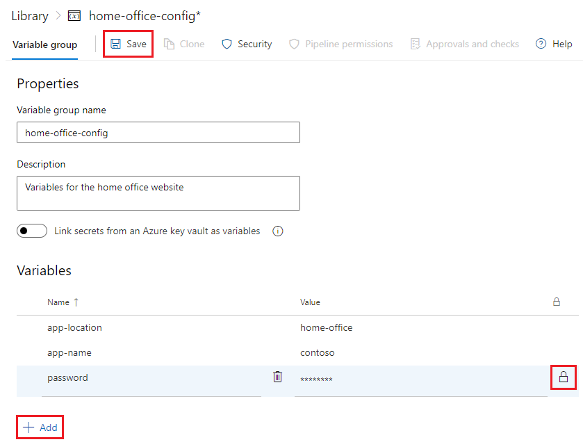
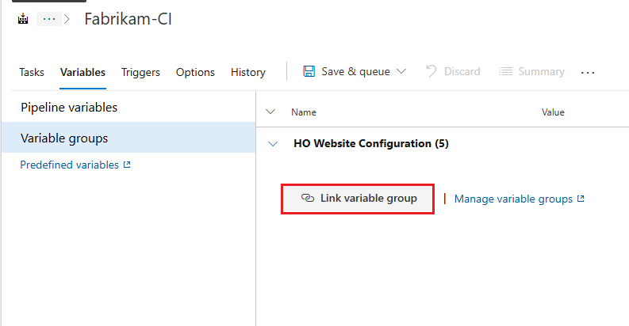
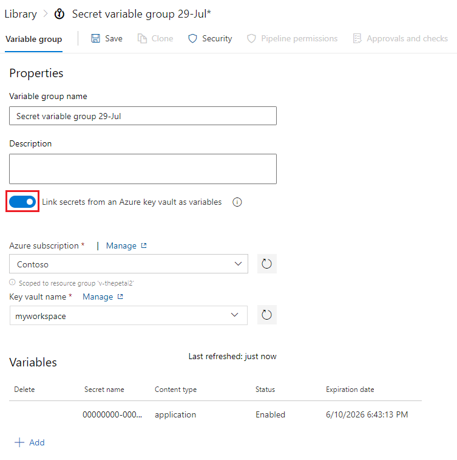

# Add & use variable groups

Use a variable group to store values that you want to control and make available across
multiple pipelines. You can also use variable groups to store secrets and other values
that might need to be [passed into a YAML pipeline](variable-groups.md?tabs=yaml&view=azure-devops&preserve-view=true#use-a-variable-group). Variable groups are defined and managed in the **Library** page under **Pipelines**.

Variables groups are a [protected resource](../security/resources.md). You can add [approvals and checks](../process/approvals.md) to them and set pipeline permissions.

[!INCLUDE [temp](../includes/concept-rename-note.md)]

::: moniker range="< tfs-2018"
> [!NOTE]
> Variable groups can be used in a build pipeline only Azure DevOps and TFS 2018.
::: moniker-end

## Create a variable group

#### [YAML](#tab/yaml/)

You can't create variable groups in YAML, but they can be used as described in [Use a variable group](#use-a-variable-group).

#### [Classic](#tab/classic/)

1. Open the **Library** tab to see a list of existing variable groups for your project.
Choose **+ Variable group**.

1. Enter a name and description for the group.

1. Decide if you want the variable group to be accessible for any pipeline
   by setting the **Allow access to all pipelines** option. This option allows
   pipelines defined in YAML to use this variable group. Pipelines defined in YAML aren't automatically authorized for variable groups. For more information, see [Use a variable group](variable-groups.md?tabs=yaml&view=azure-devops&preserve-view=true#use-a-variable-group).

1. To link secrets from an Azure key vault as variables, see [Link secrets from an Azure key vault](variable-groups.md#link-secrets-from-an-azure-key-vault). This step is optional.

1. Enter the name and value for each [variable](../release/variables.md#custom-variables) that you want to include in the group, choosing **+ Add** for each one. If you want to encrypt and securely store the value, choose the "lock" icon at the end of the row.

1. When you're finished adding variables, choose **Save**.

    

Variable groups follow the [library security model](index.md#library-security).

#### [Azure DevOps CLI](#tab/azure-devops-cli)

::: moniker range="> azure-devops-2019"

Using the Azure DevOps CLI, you can create and update variable groups for the pipeline runs in your project. You can also [manage the variable groups](#manage-a-variable-group) and [manage the individual variables within a variable group](#manage-variables-in-a-variable-group).

### Prerequisites

- You must have installed the Azure DevOps CLI extension as described in [Get started with Azure DevOps CLI](../../cli/index.md).
- Sign into Azure DevOps using `az login`.
- For the examples in this article, set the default organization using `az devops configure --defaults organization=YourOrganizationURL`.

[Create a variable group](#create-variable-group) | [Update a variable group](#update-variable-group) 

<a id="create-variable-group" />  

### Create a variable group 

You can create a variable group with the [az pipelines variable-group create](/cli/azure/pipelines/variable-group#ext-azure-devops-az-pipelines-variable-group-create) command. To get started, see [Get started with Azure DevOps CLI](../../cli/index.md).

```azurecli
az pipelines variable-group create --name
                                   --variables
                                   [--authorize {false, true}]
                                   [--description]
                                   [--org]
                                   [--project]
```

#### Parameters

- **name**: Required. Name of the variable group.
- **variables**: Required. Variables in format `key=value` space-separated pairs. Secret variables should be managed using [az pipelines variable-group variable](#manage-variables-in-a-variable-group) commands.
- **authorize**: Optional. Specify whether the variable group should be accessible by all pipelines. Accepted values are *false* and *true*.
- **description**: Optional. Description of the variable group.
- **org**: Azure DevOps organization URL. You can configure the default organization using `az devops configure -d organization=ORG_URL`. Required if not configured as default or picked up using `git config`. Example: `--org https://dev.azure.com/MyOrganizationName/`.
- **project**: Name or ID of the project. You can configure the default project using `az devops configure -d project=NAME_OR_ID`. Required if not configured as default or picked up using `git config`.

#### Example

The following command creates a variable group named **new-app-variables**. It includes the variables **app-location=Head_Office** and **app-name=Fabrikam** and returns the result in YAML format.

```azurecli
az pipelines variable-group create --name new-app-variables --variables app-location=Head_Office app-name=Fabrikam --output yaml

authorized: false
description: null
id: 5
name: new-app-variables
providerData: null
type: Vsts
variables:
  app-location:
    isSecret: null
    value: Head_Office
  app-name:
    isSecret: null
    value: Fabrikam
```

<a id="update-variable-group" />  

### Update a variable group

You can update a variable group with the [az pipelines variable-group update](/cli/azure/pipelines/variable-group#ext-azure-devops-az-pipelines-variable-group-update) command. To get started, see [Get started with Azure DevOps CLI](../../cli/index.md).

```azurecli
az pipelines variable-group update --group-id
                                   [--authorize {false, true}]
                                   [--description]
                                   [--name]
                                   [--org]
                                   [--project]
```

#### Parameters

- **group-id**: Required. ID of the variable group. To find the variable group ID, see [List variable groups](#list-variable-group).
- **authorize**: Required unless **description** or **name** is specified. Indicates whether the variable group should be accessible by all pipelines. Accepted values are *false* and *true*.
- **description**: Required unless **authorize** or **name** is specified. Use to change the description of the variable group.
- **name**: Required unless **authorize** or **description** is specified. Use to change the name of the variable group.
- **org**: Azure DevOps organization URL. You can configure the default organization using `az devops configure -d organization=ORG_URL`. Required if not configured as default or picked up using `git config`. Example: `--org https://dev.azure.com/MyOrganizationName/`.
- **project**: Name or ID of the project. You can configure the default project using `az devops configure -d project=NAME_OR_ID`. Required if not configured as default or picked up using `git config`.

#### Example

The following command updates the variable group with the ID **4**. The **description** and **name** are changed and the results are shown in table format.

```azurecli
az pipelines variable-group update --group-id 4 --name MyNewAppVariables --description "Variables for my new app" --output table

ID    Name               Type    Description               Is Authorized    Number of Variables
----  -----------------  ------  ------------------------  ---------------  ---------------------
4     MyNewAppVariables  Vsts    Variables for my new app  False            2
```

::: moniker-end

[!INCLUDE [temp](../../includes/note-cli-not-supported.md)]

* * *

## Use a variable group

#### [YAML](#tab/yaml/)
::: moniker range="> tfs-2018"

To use a variable from a variable group, you need to add a reference to the group in your YAML file:

```yaml
variables:
- group: my-variable-group
```

Then, variables from the variable group can be used in your YAML file.

If you use both variables and variable groups, use the `name`/`value` syntax for the individual (non-grouped) variables:

```yaml
variables:
- group: my-variable-group
- name: my-bare-variable
  value: 'value of my-bare-variable'
```

To reference a variable group, use macro syntax or a runtime expression. In the following example, the group `my-variable-group` has a variable named `myhello`.

```yaml
variables:
- group: my-variable-group
- name: my-passed-variable
  value: $[variables.myhello] # uses runtime expression

steps:
- script: echo $(myhello) # uses macro syntax
- script: echo $(my-passed-variable) 
```

You can reference multiple variable groups in the same pipeline. If multiple variable groups include the same variable, the variable group included last in your YAML file sets the variable's value.

```yaml
variables:
- group: my-first-variable-group
- group: my-second-variable-group
```

You can also reference a variable group in a template. In the template `variables.yml`, the group `my-variable-group` is referenced. The variable group includes a variable named `myhello`.

```yaml
# variables.yml
variables:
- group: my-variable-group
```

In this pipeline, the variable `$(myhello)` from the variable group `my-variable-group` is included and `variables.yml` is referenced.

```yaml
# azure-pipeline.yml
stages:
- stage: MyStage
  variables:
  - template: variables.yml
  jobs:
  - job: Test
    steps:
    - script: echo $(myhello)
```

### Authorize

To work with variable groups, you must authorize the group. If you only name the variable group in YAML, then anyone who can push code to your repository could extract the contents of secrets in the variable group.
To authorize the group, use one of the following techniques:

- To authorize any pipeline to use the variable group, which may be a good option if you don't have any secrets in the group, go to Azure Pipelines. Select **Library** > **Variable groups**, and then select the variable group in question and enable the setting **Allow access to all pipelines**.

- To authorize a variable group for a specific pipeline, open the pipeline by selecting **Edit** and queue a build manually. You see a resource authorization error and an "Authorize resources" action on the error. Choose this action to explicitly add the pipeline as an authorized user of the variable group.

> [!Note]
> If you add a variable group to a pipeline and don't get a resource authorization error in your build when you expected one, turn off the **Allow access to all pipelines** setting.

::: moniker-end

::: moniker range="<= tfs-2018"

YAML builds aren't available on TFS.

::: moniker-end

#### [Classic](#tab/classic/)

To use a variable group, open your pipeline. Select **Variables** > **Variable groups**, and then choose **Link variable group**.
In a build pipeline, you see a list of available groups. In a release pipeline, for example, you
also see a drop-down list of stages in the pipeline. Link the variable group to one or more of these stages in the pipeline.



- **build pipeline**: The variable group gets linked to the pipeline. All the variables in the group are available for use within this pipeline.
- **release pipeline**: Link a variable group to the pipeline itself, or to a specific stage of the release pipeline.
  - If you link to a release pipeline, all the variables in the group are available for use in the pipeline, in all stages.
  - If you link to one or more stages in a release pipeline, the variables from the variable group get scoped to these stages and aren't accessible in the other stages of the same release.

> [!NOTE]
> Linking a variable group to a specific stage is available only on Azure Pipelines and on TFS 2018 Update 2 and later.

#### [Azure DevOps CLI](#tab/azure-devops-cli)

::: moniker range=">=azure-devops-2020"

There's no [**az pipelines**](/cli/azure/pipelines) command that applies to using a variable group.

::: moniker-end

[!INCLUDE [temp](../../includes/note-cli-not-supported.md)]

* * *

Access the variable values in a linked variable group the same way as [variables you define within the pipeline itself](../process/variables.md).
For example, to access the value of a variable named **customer** in a variable group linked to the pipeline,
use `$(customer)` in a task parameter or a script. But, you can't access secret variables (encrypted variables and key vault variables) directly in scripts - instead, they must be passed as arguments to a task. For more information, see [secrets](../process/variables.md#secret-variables)

Any changes made centrally to a variable group, such as the value or addition of new variables, are automatically available to all the definitions or stages to which the variable group gets linked.

::: moniker range=">=azure-devops-2020"

## Manage a variable group

Using the Azure DevOps CLI, you can list the variable groups for the pipeline runs in your project and show details for each one. You can also delete variable groups if you no longer need them.

[List variable groups](#list-variable-group) | [Show details for a variable group](#show-variable-group) | [Delete a variable group](#delete-variable-group)

<a id="list-variable-group" />  

### List variable groups

List the variable groups in your project with the [az pipelines variable-group list](/cli/azure/pipelines/variable-group#ext-azure-devops-az-pipelines-variable-group-list) command. To get started, see [Get started with Azure DevOps CLI](../../cli/index.md).

```azurecli
az pipelines variable-group list [--action {manage, none, use}]
                                 [--continuation-token]
                                 [--group-name]
                                 [--org]
                                 [--project]
                                 [--query-order {Asc, Desc}]
                                 [--top]
```

#### Optional parameters

- **action**: Specifies the action that can be performed on the variable groups. Accepted values are *manage*, *none*, and *use*.
- **continuation-token**: Lists the variable groups after a continuation token is provided.
- **group-name**: Name of the variable group. Wildcards are accepted, such as `new-var*`.
- **org**: Azure DevOps organization URL. Configure the default organization using `az devops configure -d organization=ORG_URL`. Required if not configured as default or picked up using `git config`. Example: `--org https://dev.azure.com/MyOrganizationName/`.
- **project**: Name or ID of the project. Configure the default project using `az devops configure -d project=NAME_OR_ID`. Required if not configured as default or picked up using `git config`.
- **query-order**: Lists the results in either ascending or descending (the default) order. Accepted values are *Asc* and *Desc*.
- **top**: Number of variable groups to list.

#### Example

The following command lists the top three variable groups in ascending order and returns the results in table format.

```azurecli
az pipelines variable-group list --top 3 --query-order Asc --output table

ID    Name               Type    Number of Variables
----  -----------------  ------  ---------------------
1     myvariables        Vsts    2
2     newvariables       Vsts    4
3     new-app-variables  Vsts    3
```

<a id="show-variable-group" />  

### Show details for a variable group

Display the details of a variable group in your project with the [az pipelines variable-group show](/cli/azure/pipelines/variable-group#ext-azure-devops-az-pipelines-variable-group-show) command. To get started, see [Get started with Azure DevOps CLI](../../cli/index.md).

```azurecli
az pipelines variable-group show --group-id
                                 [--org]
                                 [--project]
```

#### Parameters

- **group-id**: Required. ID of the variable group. To find the variable group ID, see [List variable groups](#list-variable-group).
- **org**: Azure DevOps organization URL. Configure the default organization using `az devops configure -d organization=ORG_URL`. Required if not configured as default or picked up using `git config`. Example: `--org https://dev.azure.com/MyOrganizationName/`.
- **project**: Name or ID of the project. Configure the default project using `az devops configure -d project=NAME_OR_ID`. Required if not configured as default or picked up using `git config`.

#### Example

The following command shows details for the variable group with the ID **4** and returns the results in YAML format.

```azurecli
az pipelines variable-group show --group-id 4 --output yaml

authorized: false
description: Variables for my new app
id: 4
name: MyNewAppVariables
providerData: null
type: Vsts
variables:
  app-location:
    isSecret: null
    value: Head_Office
  app-name:
    isSecret: null
    value: Fabrikam
```

<a id="delete-variable-group" />  

### Delete a variable group

Delete a variable group in your project with the [az pipelines variable-group delete](/cli/azure/pipelines/variable-group#ext-azure-devops-az-pipelines-variable-group-delete) command. To get started, see [Get started with Azure DevOps CLI](../../cli/index.md).

```azurecli
az pipelines variable-group delete --group-id
                                   [--org]
                                   [--project]
                                   [--yes]
```

#### Parameters

- **group-id**: Required. ID of the variable group. To find the variable group ID, see [List variable groups](#list-variable-group).
- **org**: Azure DevOps organization URL. Configure the default organization using `az devops configure -d organization=ORG_URL`. Required if not configured as default or picked up using `git config`. Example: `--org https://dev.azure.com/MyOrganizationName/`.
- **project**: Name or ID of the project. Configure the default project using `az devops configure -d project=NAME_OR_ID`. Required if not configured as default or picked up using `git config`.
- **yes**: Optional. Doesn't prompt for confirmation.

#### Example

The following command deletes the variable group with the ID **1** and doesn't prompt for confirmation.

```azurecli
az pipelines variable-group delete --group-id 1 --yes

Deleted variable group successfully.
```

## Manage variables in a variable group

Using the Azure DevOps CLI, you can add and delete variables from a variable group in a pipeline run. You can also list the variables in the variable group and make updates to them as needed.

[Add variables to a variable group](#add-variables-group) | [List variables in a variable group](#list-variables-group) | [Update variables in a variable group](#update-variables-group) | [Delete variables from a variable group](#delete-variables-group)

<a id="add-variables-group" />  

### Add variables to a variable group

Add a variable to a variable group with the [az pipelines variable-group variable create](/cli/azure/pipelines/variable-group/variable#ext-azure-devops-az-pipelines-variable-group-variable-create) command. To get started, see [Get started with Azure DevOps CLI](../../cli/index.md).

```azurecli
az pipelines variable-group variable create --group-id
                                            --name
                                            [--org]
                                            [--project]
                                            [--secret {false, true}]
                                            [--value]
```

#### Parameters

- **group-id**: Required. ID of the variable group. To find the variable group ID, see [List variable groups](#list-variable-group).
- **name**: Required. Name of the variable you're adding.
- **org**: Azure DevOps organization URL. Configure the default organization using `az devops configure -d organization=ORG_URL`. Required if not configured as default or picked up using `git config`. Example: `--org https://dev.azure.com/MyOrganizationName/`.
- **project**: Name or ID of the project. Configure the default project using `az devops configure -d project=NAME_OR_ID`. Required if not configured as default or picked up using `git config`.
- **secret**: Optional. Indicates whether the variable's value is a secret. Accepted values are *false* and *true*.
- **value**: Required for non-secret variable. Value of the variable. For secret variables, if **value** parameter isn't provided, it's picked from environment variable prefixed with `AZURE_DEVOPS_EXT_PIPELINE_VAR_` or user is prompted to enter it via standard input. For example, a variable named **MySecret** can be input using the environment variable `AZURE_DEVOPS_EXT_PIPELINE_VAR_MySecret`.

#### Example

The following command creates a variable in the variable group with ID of **4**. The new variable is named **requires-login** and has a value of **True**, and the result is shown in table format.

```azurecli
az pipelines variable-group variable create --group-id 4 --name requires-login --value True --output table

Name            Is Secret    Value
--------------  -----------  -------
requires-login  False        True
```

<a id="list-variables-group" />  

### List variables in a variable group

You can list the variables in a variable group with the [az pipelines variable-group variable list](/cli/azure/pipelines/variable-group/variable#ext-azure-devops-az-pipelines-variable-group-variable-list) command. To get started, see [Get started with Azure DevOps CLI](../../cli/index.md).

```azurecli
az pipelines variable-group variable list --group-id
                                          [--org]
                                          [--project]
```

#### Parameters

- **group-id**: Required. ID of the variable group. To find the variable group ID, see [List variable groups](#list-variable-group).
- **org**: Azure DevOps organization URL. You can configure the default organization using `az devops configure -d organization=ORG_URL`. Required if not configured as default or picked up using `git config`. Example: `--org https://dev.azure.com/MyOrganizationName/`.
- **project**: Name or ID of the project. You can configure the default project using `az devops configure -d project=NAME_OR_ID`. Required if not configured as default or picked up using `git config`.

#### Example

The following command lists all of the variables in the variable group with ID of **4** and shows the result in table format.

```azurecli
az pipelines variable-group variable list --group-id 4 --output table

Name            Is Secret    Value
--------------  -----------  -----------
app-location    False        Head_Office
app-name        False        Fabrikam
requires-login  False        True
```

<a id="update-variables-group" />  

### Update variables in a variable group

Update a variable in a variable group with the [az pipelines variable-group variable update](/cli/azure/pipelines/variable-group/variable#ext-azure-devops-az-pipelines-variable-group-variable-update) command. To get started, see [Get started with Azure DevOps CLI](../../cli/index.md).

```azurecli
az pipelines variable-group variable update --group-id
                                            --name
                                            [--new-name]
                                            [--org]
                                            [--project]
                                            [--prompt-value {false, true}]
                                            [--secret {false, true}]
                                            [--value]
```

#### Parameters

- **group-id**: Required. ID of the variable group. To find the variable group ID, see [List variable groups](#list-variable-group).
- **name**: Required. Name of the variable you're adding.
- **new-name**: Optional. Specify to change the name of the variable.
- **org**: Azure DevOps organization URL. Configure the default organization using `az devops configure -d organization=ORG_URL`. Required if not configured as default or picked up using `git config`. Example: `--org https://dev.azure.com/MyOrganizationName/`.
- **project**: Name or ID of the project. Configure the default project using `az devops configure -d project=NAME_OR_ID`. Required if not configured as default or picked up using `git config`.
- **prompt-value**: Set to **true** to update the value of a secret variable using environment variable or prompt via standard input. Accepted values are *false* and *true*.
- **secret**: Optional. Indicates whether the variable's value is kept secret. Accepted values are *false* and *true*.
- **value**: Updates the value of the variable. For secret variables, use the **prompt-value** parameter to be prompted to enter it via standard input. For non-interactive consoles, it can be picked from environment variable prefixed with `AZURE_DEVOPS_EXT_PIPELINE_VAR_`. For example, a variable named **MySecret** can be input using the environment variable `AZURE_DEVOPS_EXT_PIPELINE_VAR_MySecret`.

#### Example

The following command updates the **requires-login** variable with the new value **False** in the variable group with ID of **4**. It specifies that the variable is a **secret** and shows the result in YAML format. Notice that the output shows the value as **null** instead of **False** since it's a secret hidden value.

```azurecli
az pipelines variable-group variable update --group-id 4 --name requires-login --value False --secret true --output yaml

requires-login:
  isSecret: true
  value: null
```

<a id="delete-variables-group" />  

### Delete variables from a variable group

Delete a variable from a variable group with the [az pipelines variable-group variable delete](/cli/azure/pipelines/variable-group/variable#ext-azure-devops-az-pipelines-variable-group-variable-delete) command. To get started, see [Get started with Azure DevOps CLI](../../cli/index.md).

```azurecli
az pipelines variable-group variable delete --group-id
                                            --name
                                            [--org]
                                            [--project]
                                            [--yes]
```

#### Parameters

- **group-id**: Required. ID of the variable group. To find the variable group ID, see [List variable groups](#list-variable-group).
- **name**: Required. Name of the variable you're deleting.
- **org**: Azure DevOps organization URL. Configure the default organization using `az devops configure -d organization=ORG_URL`. Required if not configured as default or picked up using `git config`. Example: `--org https://dev.azure.com/MyOrganizationName/`.
- **project**: Name or ID of the project. Configure the default project using `az devops configure -d project=NAME_OR_ID`. Required if not configured as default or picked up using `git config`.
- **yes**: Optional. Doesn't prompt for confirmation.

#### Example

The following command deletes the **requires-login** variable from the variable group with ID of **4** and prompts for confirmation.

```azurecli
az pipelines variable-group variable delete --group-id 4 --name requires-login

Are you sure you want to delete this variable? (y/n): y
Deleted variable 'requires-login' successfully.
```

::: moniker-end

## Link secrets from an Azure key vault

Link an existing Azure key vault to a variable group and map selective vault secrets to the variable group.

1. In the **Variable groups** page, enable **Link secrets from an Azure key vault as variables**.
   You'll need an existing key vault containing your secrets. Create a key vault using the [Azure portal](https://portal.azure.com).

   

1. Specify your Azure subscription end point and the name of the vault containing your secrets.

   Ensure the Azure service connection has at least **Get** and **List** management permissions on the vault for secrets.
   Enable Azure Pipelines to set these permissions by choosing **Authorize** next to the vault name.
   Or, set the permissions manually in the [Azure portal](https://portal.azure.com):

   1. Open **Settings** for the vault, and then choose **Access policies** > **Add new**.
   1. Select **Select principal** and then choose the service principal for your client account.
   1. Select **Secret permissions** and ensure that **Get** and **List** have check marks.
   1. Select **OK** to save the changes.

1. On the **Variable groups** page, select **+ Add** to select specific secrets from your vault for mapping to this variable group.

### Secret management

- Only the secret *names* get mapped to the variable group, not the secret values. The latest secret value, fetched from the vault, is used in the pipeline run that's linked to the variable group.

- Any change made to *existing* secrets in the key vault is automatically available to all the pipelines the variable group's used in.

- When new secrets get added to or deleted from the vault, the associated variable groups aren't automatically updated. The secrets included in the variable group must be explicitly updated so the pipelines that are using the variable group get executed correctly.

- Azure Key Vault supports storing and managing cryptographic keys and secrets in Azure.
  Currently, Azure Pipelines variable group integration supports mapping only secrets from the Azure key vault. Cryptographic keys and certificates aren't supported.

## Expansion of variables in a group

#### [YAML](#tab/yaml/)

::: moniker range=">= azure-devops-2019"

When you set a variable in a group and use it in a YAML file, it's equal to other defined variables in the YAML file.
For more information about precedence of variables, see [Variables](../process/variables.md#expansion-of-variables).

::: moniker-end
::: moniker range="< azure-devops-2019"
YAML isn't supported in TFS.
::: moniker-end

#### [Classic](#tab/classic/)

When you set a variable with the same name in multiple scopes, the following precedence is used (highest precedence first).

1. Variable set at queue time
1. Variable set in the pipeline
1. Variable set in the variable group

[!INCLUDE [variable-collision](../includes/variable-collision.md)]

#### [Azure DevOps CLI](#tab/azure-devops-cli)

::: moniker range=">=azure-devops-2020"

There isn't an [**az pipelines**](/cli/azure/pipelines) command that applies to the expansion of variables in a group.

::: moniker-end

[!INCLUDE [temp](../../includes/note-cli-not-supported.md)]

* * *

## Related articles

- [Use Azure Key Vault secrets in Azure Pipelines](../release/azure-key-vault.md)
- [Define variables](../process/variables.md)
- [Use variables in variable groups](../scripts/cli/pipeline-variable-group-secret-nonsecret-variables.md)
