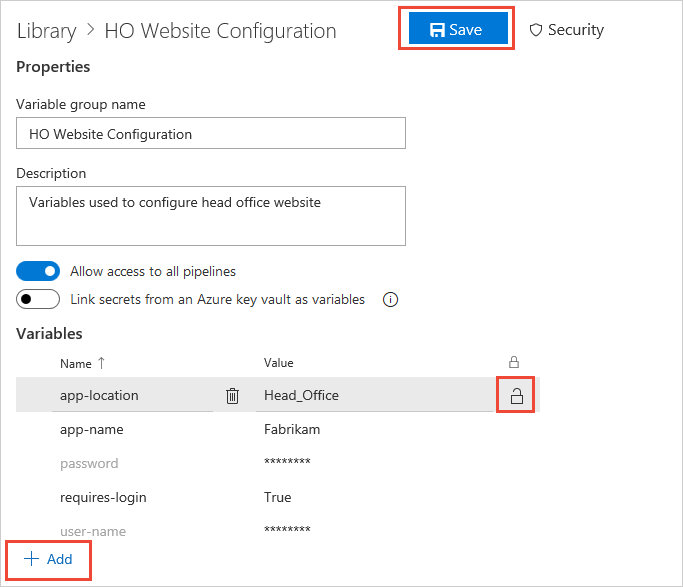
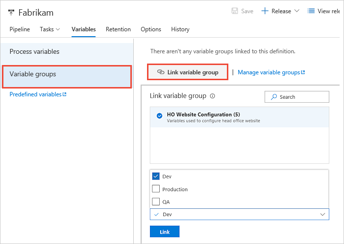
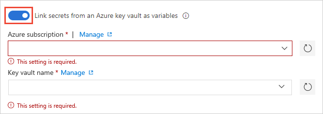

# Variable groups

[!INCLUDE [temp](../_shared/concept-rename-note.md)]

Use a variable group to store values that you want to control and make available across
multiple pipelines. Variable groups are defined and managed in the **Library** tab of the
**Pipelines** hub.

::: moniker range="< tfs-2018"
> [!NOTE]
> Variable groups can be used in a build pipeline in only Azure DevOps and TFS 2018. They cannot be used in a build pipeline in earlier versions of TFS. 
::: moniker-end

## Create a variable group

1. Open the **Library** tab to see a list of existing variable groups for your project.
Choose **+ Variable group**.

1. Enter a name and description for the group.
 
1. Decide if you want the variable group to be accessible for any pipeline
   by setting the **Allow access to all pipelines** option. This option allows
   pipelines defined in YAML, which are not automatically authorized for variable groups,
   to use this variable group. See [Use a variable group](variable-groups.md?tabs=yaml&view=azure-devops#use-a-variable-group)

1. If you want to link secrets from an Azure key vault as variables, see [Link secrets from an Azure key vault](variable-groups.md#link-secrets-from-an-azure-key-vault).

1. Enter the name and value for each [variable](../release/variables.md#custom-variables)
   you want to include in the group, choosing **+ Add** for each one.
   If you want to encrypt and securely store the value, choose the "lock" icon 
   at the end of the row.

1. When you're finished adding variables, choose **Save**.

    

> Variable groups follow the [library security model](index.md#security).

## Use a variable group

# [YAML](#tab/yaml)

::: moniker range="> tfs-2018"

You can add a variable group by referencing it in your YAML file:

```yaml
variables:
- group: my-variable-group
```

If you use both variables and variable groups, you'll have to use `name`/`value` syntax for the individual (non-grouped) variables:

```yaml
variables:
- group: my-variable-group
- name: my-bare-variable
  value: 'value of my-bare-variable'
```

Next you must authorize the variable group (this is a security feature: if you only had to name the variable group in YAML, then anyone who can push code
to your repository could extract the contents of secrets in the variable group).
To do this, or if you encounter a resource authorization error in your build,
use one of the following techniques:

* If you want to authorize any pipeline to use the variable group,
  which may be a suitable option if you do not have any secrets in the group,
  go to Azure Pipelines, open the **Library** page, choose **Variable groups**, select the variable group in question,
  and enable the setting **Allow access to all pipelines**.

* If you want to authorize a variable group for a specific pipeline, open the pipeline
  by selecting **Edit** and queue a build manually. You will see a resource authorization error
  and a "Authorize resources" action on the error. Choose this action to explicitly add the pipeline as an
  authorized user of the variable group.

> [!Note]
> If you added a variable group to a pipeline and did not get a resource authorization error in your build when you expected one, turn off the **Allow access to all pipelines** setting described above.

::: moniker-end

::: moniker range="<= tfs-2018"

YAML builds are not yet available on TFS.

::: moniker-end

# [Designer](#tab/designer)

To use a variable group, open your pipeline, select the **Variables**
tab, select **Variable groups**, and then choose **Link variable group**.
In a build pipeline, you see a list of available groups. In a release pipeline (as shown below), you
also see a drop-down list of stages in the pipeline - you can link the variable group to one or more of these stages.



* In a **build pipeline**, the variable group is linked to the pipeline and all the variables in the group are available for use within this pipeline.
* In a **release pipeline**, you can link a variable group to the pipeline itself, or to a specific stage of the release pipeline.
  - If you link to a release pipeline, all the variables in the group are available for use in the pipeline and in all stages of that pipeline.
  - If you link to one or more stages in a release pipeline, the variables from the variable group are scoped to these stages and are not accessible in the other stages of the same release.

> [!NOTE]
> Linking a variable group to a specific stage is available only on Azure Pipelines and on TFS 2018 Update 2 and later.

---

You access the value of the variables in a linked variable group in exactly
the same way as [variables you define within the pipeline itself](../process/variables.md).
For example, to access the value of a variable named **customer** in a variable group linked to the pipeline,
use `$(customer)` in a task parameter or a script. However, secret variables (encrypted variables and key vault variables) 
cannot be accessed directly in scripts - instead they must be passed as arguments to a task. For more information, see [secrets](../process/variables.md#secret-variables)

Any changes made centrally to a variable group, such as a change in the value of a variable or the addition of new variables,
will automatically be made available to all the definitions or stages to which the variable group is linked.

## Link secrets from an Azure key vault

Link an existing Azure key vault to a variable group and map selective vault secrets to the variable group.

1. In the **Variable groups** page, enable **Link secrets from an Azure key vault as variables**.
   You'll need an existing key vault containing your secrets. You can create a 
   key vault using the [Azure portal](https://portal.azure.com).

   

1. Specify your Azure subscription end point and the name of the vault containing your secrets.

   Ensure the Azure service connection has at least **Get** and **List** management permissions on the vault for secrets.
   You can enable Azure Pipelines to set these permissions by choosing **Authorize** next to the vault name.
   Alternatively, you can set the permissions manually in the [Azure portal](https://portal.azure.com):

   - Open the **Settings** blade for the vault, choose **Access policies**, then **Add new**.
   - In the **Add access policy** blade, choose **Select principal** and select the service principal for your client account.
   - In the **Add access policy** blade, choose **Secret permissions** and ensure that **Get** and **List** are checked (ticked).
   - Choose **OK** to save the changes.<p />

1. In the **Variable groups** page, choose **+ Add** to select specific secrets from your vault that will be mapped to this variable group.

### Secrets management notes

* Only the secret *names* are mapped to the variable group, not the secret values. The latest version of the value of each secret
  is fetched from the vault and used in the pipeline linked to the variable group during the run.

* Any changes made to *existing* secrets in the key vault, such as a change in the value of a secret, will be made available
  automatically to all the pipelines in which the variable group is used.

* When new secrets are added to the vault, or a secret is deleted from the vault, the associated variable groups are not updated
  automatically. The secrets included in the variable group must be explicitly updated in order for the pipelines using the
  variable group to execute correctly.

* Azure Key Vault supports storing and managing cryptographic keys and secrets in Azure.
  Currently, Azure Pipelines variable group integration supports mapping only secrets from the Azure key vault. Cryptographic keys and certificates are not supported.

## Expansion of variables in a group

# [YAML](#tab/yaml)

::: moniker range=">= azure-devops-2019"

When you set a variable in a group and use it in a YAML file, it has the same precedence as any other variable defined within the YAML file. 
For more information about precedence of variables, see the topic on [variables](../process/variables.md#expansion-of-variables).

::: moniker-end
::: moniker range="< azure-devops-2019"
YAML is not supported in TFS.
::: moniker-end

# [Designer](#tab/designer)

When you set a variable with the same name in multiple scopes, the following precedence is used (highest precedence first).

1. Variable set at queue time
1. Variable set in the pipeline
1. Variable set in the variable group

[!INCLUDE [variable-collision](../_shared/variable-collision.md)]

---