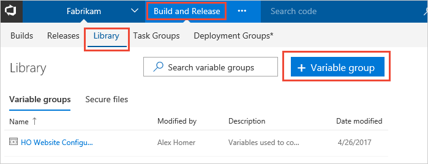

# Variable groups for builds and releases

**VSTS | TFS 2018 | TFS 2017**

Use a variable group to store values that you want to make available across
multiple build and release definitions. Variable groups are defined and managed in the **Library** tab of the
**Build &amp; Release** hub.

## Create a variable group

1. Open the **Library** tab to see a list of existing variable groups for your project.
Choose **+ Variable group**.

    

1. Enter a name and description for the group. Then enter the name and value for each
   [variable](../release/variables.md#custom-variables)
   you want to include in the group, choosing **+ Add** for each one.
   If you want to encrypt and securely store the value, choose the "lock" icon 
   at the end of the row. When you're finished adding variables, choose **Save**.

    

>Variable groups follow the [library security model](index.md#security).

## Link secrets from an Azure key vault as variables

Link an existing Azure key vault to a variable group and map selective vault secrets to the variable group.

1. In the **Variable groups** page, enable **Link secrets from an Azure key vault as variables**.
   You'll need an existing key vault containing your secrets. You can create a 
   key vault using the [Azure portal](https://portal.azure.com).

   

1. Specify your Azure subscription end point and the name of the vault containing your secrets.

   Ensure the Azure endpoint has at least **Get** and **List** management permissions on the vault for secrets.
   You can enable VSTS to set these permissions by choosing **Authorize** next to the vault name.
   Alternatively, you can set the permissions manually in the [Azure portal](https://portal.azure.com):

   - Open the **Settings** blade for the vault, choose **Access policies**, then **Add new**.
   - In the **Add access policy** blade, choose **Select principal** and select the service principal for your client account.
   - In the **Add access policy** blade, choose **Secret permissions** and ensure that **Get** and **List** are checked (ticked).
   - Choose **OK** to save the changes.

1. In the **Variable groups** page, choose **+ Add** to select specific secrets from your vault that will be mapped to this variable group. 

### Secrets management notes

* Only the secret *names* are mapped to the variable group, not the secret values. The latest version of the value of each secret
  is fetched from the vault and used in the definition linked to the variable group during the build or release.

* Any changes made to *existing* secrets in the key vault, such as a change in the value of a secret, will be made available
  automatically to all the definitions in which the variable group is used.

* When *new* secrets are added to the vault, they are **not** made available automatically to all the definitions. 
  New secrets must be explicitly added to the variable group in order to make them available to definitions
  in which the variable group is used.

* Azure Key Vault supports storing and managing cryptographic keys and secrets in Azure.
  Currently, VSTS variable group integration supports mapping only secrets from the Azure key vault.
  Cryptographic keys and certificates are not yet supported

## Use a variable group

To use a variable group, open your build or release definition, select the **Variables**
tab, select **Variable groups**, and then choose **Link variable group**.
In a build definition, you see a list of available groups. In a release definition (as shown below), you
also see a drop-down list of environments in the definition - you can link the variable group to one or more of these environments.

* In a **build definition**, the variable group is linked to the definition and all the variables in the group are available for use within this definition.
* In a **release definition**, you can link a variable group to the definition itself, or to a specific environment of the release definition.
  - If you link to a release definition, all the variables in the group are available for use in the definition and in all environments of that definition.
  - If you link to one or more environments in a release definition, the variables from the variable group are scoped to these environments and are not accessible in the other environments of the same release. 

> [!NOTE]
> Linking a variable group to a specific environment is available only on VSTS and on TFS 2018 Update 2 and later. 

You access the value of the variables in a linked variable group in exactly
the same way as [variables you define within the definition itself](../release/variables.md#custom-variables).
For example, to access the value of a variable named **customer** in a variable group linked to the definition,
use `$(customer)` in a task parameter or a script. However, secret variables (encrypted variables and key vault variables) 
cannot be accessed directly in scripts - instead they must be passed as arguments to a task. 

[!INCLUDE [variable-collision](../_shared/variable-collision.md)]

Any changes made centrally to a variable group, such as a change in the value of a variable or the addition of new variables,
will automatically be made available to all the definitions or environments to which the variable group is linked.

[!INCLUDE [rm-help-support-shared](../_shared/rm-help-support-shared.md)]
