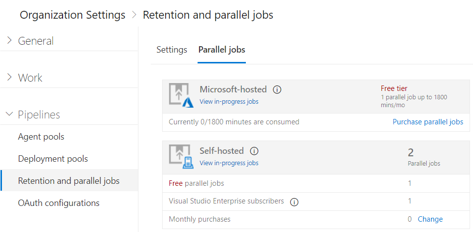

# CI/CD Concurrent Jobs in Team Services

**VSTS | [TFS 2018](concurrent-pipelines-tfs.md) | [TFS 2017](concurrent-pipelines-tfs.md)**

> [!NOTE]
> May 2018: For the past few months we have not enforced throttling of concurrent builds or releases on self-hosted agents because of an issue with our design. As a result, your ability to run multiple builds or releases concurrently on these agents was limited only by the number of agents in your organization.
>
> We've fixed the issue, and beginning in June 2018 we'll resume throttling and you'll be able to run only as many concurrent build or release jobs as explained below.

A CI/CD _concurrent job_ gives you the ability to run a single build job or a single release job at a time in your organization. In VSTS you can run concurrent jobs on Microsoft-hosted infrastructure or on your own (self-hosted) infrastructure.

## Microsoft-hosted CI/CD
_formerly hosted pipelines_

If you want to run builds and releases on machines managed by Microsoft, then you need Microsoft-hosted CI/CD. We provide a **free tier** of service by default in your VSTS organization,
allowing you to run one concurrent job for up to 240 minutes per month. This uses our pool of [Microsoft-hosted agents](../agents/hosted.md) to run your builds and releases. Each build or release job can run for up to 30 minutes. 

When the **free tier** of Microsoft-hosted CI/CD is no longer sufficient, you can pay for CI/CD capacity per concurrent job. Paid Microsoft-hosted CI/CD removes the monthly time limit and also allows you to run a single job for up to 6 hours.

[Buy Microsoft-hosted CI/CD](https://marketplace.visualstudio.com/items?itemName=ms.build-release-hosted-pipelines) 

## Self-hosted CI/CD
_formerly private pipelines_

If you want to run builds and releases on your own machines, then you need _self-hosted CI/CD_. You'll start by deploying our [self-hosted agents](../agents/agents.md) on your machines. 
You can register any number of these self-hosted agents in your VSTS organization for free. We charge based on the number of jobs you want to run at a time, not the number of agents registered.

Your VSTS organization includes one self-hosted concurrent job free to get you started. Additionally, for each active Visual Studio Enterprise subscriber who is a member of your organization you get one additional self-hosted concurrent job. If you need additional capacity, you can buy more. There are no monthly time limits on self-hosted CI/CD.

[Buy self-hosted CI/CD](https://marketplace.visualstudio.com/items?itemName=ms.build-release-private-pipelines)

## How a concurrent job is consumed by a build or release

For example, consider a VSTS organization that has only one Microsoft-hosted concurrent job. This allows users in that organization to collectively run only one build or release job at a time. When additional jobs are triggered, they are queued and will wait for the previous job to complete.

A release consumes a concurrent job only when it is being actively deploying to an environment. While the release is waiting for an approval or a manual intervention, it does not consume a concurrent job.

0. FabrikamFiber CI Build 102 (master branch) is first to be started.
0. Deployment of FabrikamFiber Release 11 is triggered by completion of FabrikamFiber CI Build 102.
0. FabrikamFiber CI Build 101 (feature branch) is triggered. The build can't start yet because Release 11's deployment is active. So the build stays queued.
0. Release 11 waits for approvals. Fabrikam CI Build 101 starts because a release waiting for approvals does not consume a concurrent job.
0. Release 11 is approved. It resumes only after Fabrikam CI Build 101 is completed.

## How a concurrent job is consumed by a phase

A single build or release can comprise of multiple jobs through [phases](../process/phases.md) and [environments](../release/environments.md).

* An agent phase can create multiple jobs through multi-configuration or multi-agent options. Each of these consumes a concurrent job. If there are not enough concurrent jobs, then the jobs are queued up and run one after the other.

* A server phase does not create any jobs, and hence does not consume any concurrent jobs.

* A deployment group phase creates as many jobs as there are machines in the deployment group. Jobs that run on deployment group machines do not consume any concurrent jobs.

## Determine how many concurrent jobs you need

You can begin by seeing if your teams can get by with the free tier of Microsoft-hosted CI/CD and self-hosted CI/CD offered in your VSTS organization. When you've reached the 240 minute limit 
for the free tier of Microsoft-hosted CI/CD, then you can start by buying one concurrent job to remove this monthly time limit before deciding to increase the number of concurrent jobs further.

As the number of queued builds and releases exceeds the number of concurrent jobs you have, your build and release queues will grow longer. When you find the queue delays are too long, 
you can purchase additional concurrent jobs as needed.

### Simple estimate

A simple rule of thumb: Estimate that you'll need one concurrent job for every 4-5 users in your organization.

### Detailed estimate

In the following scenarios you might need multiple concurrent jobs:

* If you have multiple teams, and if each of them require a CI build, then you'll likely need a concurrent job for each team.

* If your CI build trigger applies to multiple branches, then you'll likely need a concurrent job for each branch.

* If you develop multiple applications using one organization or server, then you'll likely need additional concurrent jobs: one to deploy each application at the same time.

* If you run multiple jobs in parallel within each build or release, then you'll need additional concurrent jobs.

## View available concurrent jobs

0. Browse to **Organization settings**, **Build and Release**, **Resource limits**.

 

 URL example: `https://{your_organization}/_admin/_buildQueue?_a=resourceLimits`

0. View the maximum number of concurrent jobs of Microsoft-hosted and self-hosted CI/CD that are available in your organization.

0. Select **Pipelines queue...** to display all the builds and releases that are actively consuming an available concurrent job or that are queued waiting for a concurrent job to be available.

## Sharing of concurrent jobs across projects in a collection

Concurrent jobs are purchased at the organization level, and they are shared by all projects in an organization. We don't yet offer a way to partition or dedicate concurrent job capacity to a specific project or agent pool. For example:

0. You purchase two concurrent jobs in your organization.

0. You queue two builds in the first project, and both the concurrent jobs are consumed.

0. You queue a build in the second project. That build will not start until one of the builds in your first project is completed.

In the future, we plan to support finer control on allocation of concurrent jobs.

## Q&A

### Who can use the Build and Release Management features?

VSTS users with [basic access](https://visualstudio.microsoft.com/products/visual-studio-team-services-feature-matrix-vs) can author as many builds and releases as they want.

To approve releases, basic access is not necessary. Any user with [stakeholder access](../../organizations/security/get-started-stakeholder.md) can approve or reject releases.

### Are there any limits on the number of builds and release pipelines that I can create?

No. You can create hundreds or even thousands of definitions for no charge. You can register any number of self-hosted agents for no charge.

### I use XAML build controllers with my organization. How am I charged for those?

You can register one XAML build controller for each self-hosted concurrent job in your organization. Your organization gets at least one free self-hosted concurrent job, so you can register one 
XAML build controller for no additional charge. For each additional XAML build controller, you'll need an additional self-hosted concurrent job.

### As a Visual Studio Enterprise subscriber, do I get additional concurrent jobs for TFS and VSTS?

Yes. Visual Studio Enterprise subscribers get [one concurrent job in Team Foundation Server 2017 or later](concurrent-pipelines-tfs.md) and one self-hosted concurrent job in each VSTS organization of which they are a member.
