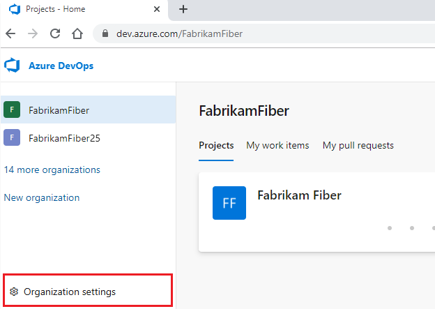
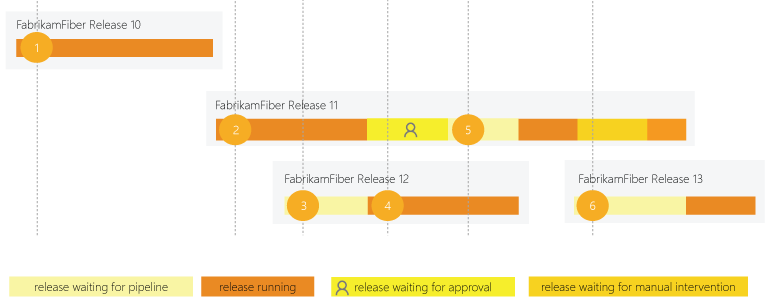
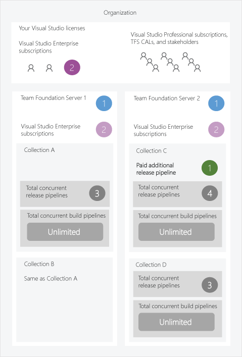
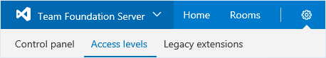
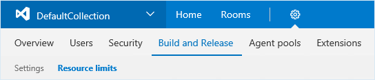

# Configure and pay for parallel jobs

[!INCLUDE [version-tfs-2015-rtm](../includes/version-tfs-2015-rtm.md)]

::: moniker range="< azure-devops-2019"

This article describes the licensing model for Azure Pipelines in Team Foundation Server 2017 (TFS 2017) or newer. We don't charge you for Team Foundation Build (TFBuild) so long as you have a TFS Client Access License (CAL).

A TFS _parallel job_ gives you the ability to run a single release at a time in a project collection. You can keep hundreds or even thousands of release jobs in your collection. But, to run more than one release at a time, you need additional parallel jobs.

One free parallel job is included with every collection in a Team Foundation Server. Every Visual Studio Enterprise subscriber in a Team Foundation Server contributes one additional parallel job. 

You can buy additional private jobs from the Visual Studio Marketplace.

::: moniker-end

::: moniker range=">= azure-devops-2019 < azure-devops"

> [!IMPORTANT]
> Starting with Azure DevOps Server 2019, you do not have to pay for self-hosted concurrent jobs in releases. You are only limited by the number of agents that you have.

::: moniker-end

::: moniker range="azure-devops"

Learn how to estimate how many parallel jobs you need and buy more parallel jobs for your organization. 

> [!NOTE]
> We have temporarily disabled the free grant of parallel jobs for public projects and for certain private projects in new organizations. However, you can request this grant by submitting [a request](https://aka.ms/azpipelines-parallelism-request). Existing organizations and projects are not affected. Please note that it takes us 2-3 business days to respond to your free tier requests.

## What is a parallel job? 

When you define a pipeline, you can define it as a collection of [jobs](../process/phases.md). When a pipeline runs, you can run multiple jobs as part of that pipeline. Each running job consumes a *parallel job* that runs on an agent. When there aren't enough parallel jobs available for your organization, the jobs are queued up and run one after the other.

In Azure Pipelines, you can run parallel jobs on Microsoft-hosted infrastructure or your own (self-hosted) infrastructure. Each parallel job allows you to run a single job at a time in your organization. You do not need to pay for parallel jobs if you are using an on-premises server. The concept of parallel jobs only applies to Azure DevOps Services. 

### Microsoft-hosted vs. self-hosted parallel jobs
If you want to run your jobs on machines that Microsoft manages, use _Microsoft-hosted parallel jobs_. Your jobs will run on [Microsoft-hosted agents](../agents/hosted.md).

If you want Azure Pipelines to orchestrate your builds and releases, but use your own machines to run them, use _self-hosted parallel jobs_. For self-hosted parallel jobs, you'll start by deploying our [self-hosted agents](../agents/agents.md) on your machines. You can register any number of these self-hosted agents in your organization. 

::: moniker-end

::: moniker range="azure-devops"

## How much do parallel jobs cost?

We provide a *free tier* of service by default in every organization for both hosted and self-hosted parallel jobs. 
Parallel jobs are purchased at the organization level, and they are shared by all projects in an organization. 

# [Microsoft-hosted](#tab/ms-hosted)

For Microsoft-hosted parallel jobs, you can get up to 10 free Microsoft-hosted parallel jobs that can run for up to 360 minutes (6 hours) each time for **public projects**. When you create a new Azure DevOps organization, you are not given this free grant by default.

For **private projects**, you can get one free job that can run for up to 60 minutes each time. When you create a new Azure DevOps organization you may not always be given this free grant by default. 

To request the free grant for public or private projects, submit [a request](https://aka.ms/azpipelines-parallelism-request).


> [!NOTE] 
> It takes us 2-3 business days to respond to your free tier request.

There is no time limit on parallel jobs for public projects and a 30 hour time limit per month for private projects.

|           |  Number of parallel jobs |  Time limit |
| ----------| -------------------------| ------------|
| **Public project** | Up to 10 free Microsoft-hosted parallel jobs that can run for up to 360 minutes (6 hours) each time  | No overall time limit per month|
| **Private project** | One free job that can run for up to 60 minutes each time   |   1,800 minutes (30 hours) per month |

When the free tier is no longer sufficient, you can pay for additional capacity per parallel job. For pricing cost per parallel job, see the [Azure DevOps pricing page](https://azure.microsoft.com/pricing/details/devops/azure-devops-services/). Paid parallel jobs remove the monthly time limit and allow you to run each job for up to 360 minutes (6 hours).

[Buy Microsoft-hosted parallel jobs](#how-do-i-buy-more-parallel-jobs).

When you purchase your first Microsoft-hosted parallel job, the number of parallel jobs you have in the organization is still one. To be able to run two jobs concurrently, you will need to purchase two parallel jobs if you are currently on the free tier. The first purchase only removes the time limits on the first job.
 
> [!TIP]
> If your pipeline exceeds the maximum job timeout, try splitting your pipeline 
> into multiple jobs. For more information on jobs, see 
> [Specify jobs in your pipeline](../process/phases.md).

# [Self-hosted](#tab/self-hosted)

For self-hosted parallel jobs, you can register any number of [self-hosted agents](../agents/agents.md) in your organization. We charge based on the number of jobs you want to run at a time, not the number of agents registered. There are no time limits on self-hosted jobs.

For public projects that are self-hosted, you can have unlimited parallel jobs running. For private projects, you can have one job and one additional job for each active Visual Studio Enterprise subscriber who is a member of your organization. 


|           |  Number of parallel jobs |  Time limit |
|:----------|--------------------------| ------------|
| **Public project** | Unlimited | None|
| **Private project** | One self-hosted job; For each active Visual Studio Enterprise subscriber who is a member of your organization, you get one additional self-hosted parallel job.   |   None |


When the free tier is no longer sufficient for your self-hosted private project, you can purchase more additional capacity per parallel job. For pricing cost per parallel job, see the [Azure DevOps pricing page](https://azure.microsoft.com/pricing/details/devops/azure-devops-services/).

[Buy self-hosted parallel jobs](https://marketplace.visualstudio.com/items?itemName=ms.build-release-private-pipelines).

---

::: moniker-end

::: moniker range="= tfs-2015"

> Do I need parallel jobs in TFS 2015? Short answer: no. [More details](#tfs_before_2017)
::: moniker-end


::: moniker range="azure-devops"

## How many parallel jobs do I need?

As the number of queued builds and releases exceeds the number of parallel jobs you have, your build and release queues will grow longer. When you find the queue delays are too long, you can purchase additional parallel jobs as needed. There are several methods you can use to check your parallel job limits and job history.

### View job history using the pool consumption report

You can use the **Pool consumption report**, available on the **Analytics** tab of your agent pool, to see a chart of running and queued jobs graphed with your parallel jobs for the previous 30 days. If you have a backlog of queued jobs and your running jobs are at the concurrency limit, you may wish to purchase more parallel jobs. For more information, see [Pool consumption report](../agents/pool-consumption-report.md).

:::image type="content" source="../agents/media/pool-consumption-report/historical-graph-azure-pipelines.png" alt-text="Microsoft-hosted agent pool historical graph":::

### Check the parallel jobs setting directly

Figure out how many parallel jobs you need by first seeing how many parallel jobs your organization currently uses:

1. Browse to **Organization settings** > **Pipelines** > **Retention and parallel jobs** > **Parallel jobs**.

   :::image type="content" source="media/concurrent-pipelines-vsts/control-panel-account-build-and-release-resource-limits.png" alt-text="Location of parallel jobs in organization settings.":::

   URL example: `https://{your_organization}/_admin/_buildQueue?_a=resourceLimits`

2. View the maximum number of parallel jobs that are available in your organization.

3. Select **View in-progress jobs** to display all the builds and releases that are actively consuming an available parallel job or that are queued waiting for a parallel job to be available.

### Estimate costs

A simple rule of thumb: Estimate that you'll need one parallel job for every four to five users in your organization.

In the following scenarios, you might need multiple parallel jobs:

* If you have multiple teams, and if each of them require CI, you'll likely need a parallel job for each team.
* If your CI trigger applies to multiple branches, you'll likely need a parallel job for each active branch.
* If you develop multiple applications by using one organization or server, you'll likely need additional parallel jobs: one to deploy each application at the same time.

::: moniker-end

::: moniker range="azure-devops"

## How do I buy more parallel jobs?

To buy more parallel jobs:

* [Billing must be set up for your organization](../../organizations/billing/set-up-billing-for-your-organization-vs.md)
* You need [Project Collection Administrator or organization Owner permissions](../../organizations/security/lookup-organization-owner-admin.md)

### Buy parallel jobs

Buy more parallel jobs within your organization settings:

1. Sign in to your organization (```https://dev.azure.com/{yourorganization}```).
2. Select  **Organization settings**.

   

3. Select **Parallel jobs** under Pipelines, and then select either **Purchase parallel jobs** for Microsoft-hosted jobs or **Change** for self-hosted jobs.

   :::image type="content" source="../../organizations/billing/media/shared/manage-parallel-jobs.png" alt-text="manage parallel jobs image":::

4. Enter your desired amount, and then **Save**.

For pricing cost per parallel job, see the [Azure DevOps pricing page](https://azure.microsoft.com/pricing/details/devops/azure-devops-services/).

## How do I change the quantity of parallel jobs for my organization?

1. Sign in to your organization (```https://dev.azure.com/{yourorganization}```).
2. Select  **Organization settings**.
  
   

3. Select **Parallel jobs** under Pipelines, and then select either **Purchase parallel jobs** or **Change** for Microsoft-hosted jobs or **Change** for self-hosted jobs.

   :::image type="content" source="../../organizations/billing/media/shared/manage-parallel-jobs.png" alt-text="image of manage parallel jobs":::

4. Enter a lesser or greater quantity of Microsoft-hosted or self-hosted jobs, and then select **Save**.

  > [!IMPORTANT]
  > Hosted XAML build controller isn't supported. If you have an organization where you need to run [XAML builds](/previous-versions/visualstudio/visual-studio-2013/ms181709(v=vs.120)),
  > set up an [on-premises build server](/previous-versions/visualstudio/visual-studio-2013/ms252495(v=vs.120))
  > and switch to an [on-premises build controller](/previous-versions/visualstudio/visual-studio-2013/ee330987(v=vs.120)). For more information about the hosted XAML model, see [Get started with XAML](../create-first-pipeline.md).

::: moniker-end

::: moniker range="azure-devops"

## How is a parallel job consumed in DevOps Services?

Consider an organization that has only one Microsoft-hosted parallel job. This job allows users in that organization to collectively run only one job at a time. When additional jobs are triggered, they are queued and will wait for the previous job to finish.

If you use release or YAML pipelines, then a run consumes a parallel job only when it's being actively deployed to a stage. While the release is waiting for an approval or a manual intervention, it does not consume a parallel job.

When you run a [server job](../process/phases.md#server-jobs) or deploy to a [deployment group](../process/deployment-group-phases.md) using release pipelines, you don't consume any parallel jobs.


1. FabrikamFiber CI Build 102 (main branch) starts first.
2. Deployment of FabrikamFiber Release 11 is triggered by completion of FabrikamFiber CI Build 102.
3. FabrikamFiber CI Build 101 (feature branch) is triggered. The build can't start yet because Release 11's deployment is active. So the build stays queued.
4. Release 11 waits for approvals. Fabrikam CI Build 101 starts because a release that's waiting for approvals does not consume a parallel job.
5. Release 11 is approved. It resumes only after Fabrikam CI Build 101 is completed.


::: moniker-end


::: moniker range="< azure-devops-2019"

## How is a parallel job consumed?

For example, a collection in a Team Foundation Server has one parallel job. This allows users in that collection to run only one release at a time. When additional releases are triggered, they are queued and will wait for the previous one to complete.

A release requires a parallel job only when it is being actively deployed to a stage. Waiting for an approval does not consume a parallel job. However, waiting for a manual intervention in the middle of a deployment does consume a parallel job.



1. FabrikamFiber Release 10 is first to be deployed.
2. Deployment of FabrikamFiber Release 11 starts after Release 10's deployment is complete.
3. Release 12 is queued until Release 11's deployment is active.
4. Release 11 waits for an approval. Release 12's deployment starts because a release waiting for approvals does not consume a parallel job.
5. Even though Release 11 is approved, it resumes only after Release 12's deployment is completed.
6. Release 11 is waiting for manual intervention. Release 13 cannot start because the manual intervention state consumes a parallel job.

> Manual intervention does not consume a job in TFS 2017.1 and newer.

## Parallel processing within a single release

Parallel processing within a single release does not require additional parallel jobs. So long as you have enough agents, you can deploy to multiple stages in a release at the same time.

For example, suppose your collection has three parallel jobs. You can have more than three agents running at the same time to perform parallel operations within releases. For instance, notice below that four or five agents are actively running jobs from three parallel jobs.


## Parallel jobs in an organization

For example, here's an organization that has multiple  Team Foundation Servers. Two of their users have Visual Studio Enterprise subscriptions that they can use at the same time across all their on-premises servers and in each collection so long as the customer adds them as users to both the servers as explained below.



## Determine the number of parallel jobs you need

You can begin by seeing if your teams can get by with the parallel jobs you've got by default. As the number of queued releases exceeds the number of parallel jobs you have, your release queues will grow longer. When you find the queue delays are too long, you can purchase additional parallel jobs as needed.

### Simple estimate

A simple rule of thumb: Estimate that you'll need one parallel job for every 10 users in your server.

### Detailed estimate

In the following scenarios you might need multiple parallel jobs:

* If you have multiple teams, if each of them require a CI build, and if each of the CI builds is configured to trigger a release, then you'll likely need a parallel job for each team.

* If you develop multiple applications in one collection, then you'll likely need additional parallel jobs: one to deploy each application at the same time.

## Use your Visual Studio Enterprise subscription benefit

Users who have Visual Studio Enterprise subscriptions are assigned to **VS Enterprise** access level in the Users hub of TFS instance. Each of these users contributes one additional parallel job to each collection. You can use this benefit on all Team Foundation Servers in your organization.

1. Browse to **Server settings**, **Access levels**.

   

   URL example: `http://{your_server}:8080/tfs/_admin/_licenses`

2. On the left side of the page, click **VS Enterprise**.

3. Add your users who have Visual Studio Enterprise subscriptions.

After you've added these users, additional licenses will appear on the resource limits page described below.


## Purchase additional parallel jobs

If you need to run more parallel releases, you can [buy additional private jobs from the Visual Studio marketplace](https://marketplace.visualstudio.com/items?itemName=ms.build-release-private-pipelines). Since there is no way to directly purchase parallel jobs from Marketplace for a TFS instance at present, you must first buy parallel jobs for an Azure DevOps organization. After you buy the private jobs for an Azure DevOps organization, you enter the number of purchased parallel jobs manually on the resource limits page described below.

## View and manage parallel jobs

1. Browse to **Collection settings**, **Pipelines**, **Resource limits**.

   

   URL example: `http://{your_server}:8080/tfs/DefaultCollection/_admin/_buildQueue?_a=resourceLimits`

2. View or edit the number of purchased parallel jobs.


::: moniker-end

::: moniker range="< azure-devops-2019 || azure-devops"

## FAQ

::: moniker-end

::: moniker range="azure-devops"

### How do I qualify for the free tier of public projects?

You qualify for the free tier limits for public projects if you meet both of these conditions:

* Your pipeline is part of an Azure Pipelines [public project](../../organizations/public/about-public-projects.md). 
* Your pipeline builds a public repository from GitHub or from the same public project in your Azure DevOps organization.

For information on how to apply for the grant of free parallel jobs, see [How much do parallel jobs cost (Microsoft-hosted)?](concurrent-jobs.md?tabs=ms-hosted#how-much-do-parallel-jobs-cost)

### Can I assign a parallel job to a specific project or agent pool?

Currently, there isn't a way to partition or dedicate parallel job capacity to a specific project or agent pool. For example:

* You purchase two parallel jobs in your organization.
* You start two runs in the first project, and both the parallel jobs are consumed.
* You start a run in the second project. That run won't start until one of the runs in your first project is completed.


### Are there limits on who can use Azure Pipelines?

You can have as many users as you want when you're using Azure Pipelines. There is no per-user charge for using Azure Pipelines. Users with both [basic and stakeholder access](https://visualstudio.microsoft.com/products/visual-studio-team-services-feature-matrix-vs) can author as many builds and releases as they want.

### Are there any limits on the number of builds and release pipelines that I can create?

No. You can create hundreds or even thousands of pipelines for no charge. You can register any number of self-hosted agents for no charge.

### As a Visual Studio Enterprise subscriber, do I get additional parallel jobs for TFS and Azure Pipelines?

Yes. Visual Studio Enterprise subscribers get [one parallel job in Team Foundation Server 2017 or later](concurrent-pipelines-tfs.md) and one self-hosted parallel job in each Azure DevOps Services organization where they are a member.

### What about the option to pay for hosted agents by the minute?

Some of our earlier customers are still on a per-minute plan for the hosted agents. In this plan, you pay $0.05/minute for the first 20 hours after the free tier, and $0.01/minute after 20 hours. Because of the following limitations in this plan, you might want to consider moving to the parallel jobs model:

- When you're using the per-minute plan, you can run only one job at a time.
- If you run builds for more than 14 paid hours in a month, the per-minute plan might be less cost-effective than the parallel jobs model.

### I use XAML build controllers with my organization. How am I charged for those?

You can register one XAML build controller for each self-hosted parallel job in your organization.
Your organization gets at least one free self-hosted parallel job, so you can register one XAML build controller for no additional charge.
For each additional XAML build controller, you'll need an additional self-hosted parallel job.

::: moniker-end

::: moniker range="< azure-devops-2019"

### Who can use the system?

TFS users with a [TFS CAL](https://visualstudio.microsoft.com/team-services/tfs-pricing) can author as many releases as they want.

To approve releases, a TFS CAL is not necessary; any user with [stakeholder access](../..//organizations/security/access-levels.md) can approve or reject releases.

### Do I need parallel jobs to run builds on TFS?

No, on TFS you don't need parallel jobs to run builds. You can run as many builds as you want at the same time for no additional charge.

<a id="tfs_before_2017" />

### Do I need parallel jobs to manage releases in versions before TFS 2017?</h3>

No.

In TFS 2015, so long as your users have a TFS CAL, they can manage releases for no additional charge in trial mode. We called it "trial mode" to indicate that we would eventually charge for managing releases. Despite this label, we fully support managing releases in TFS 2015.

::: moniker-end


## Related articles
- [Set up billing](../../organizations/billing/set-up-billing-for-your-organization-vs.md)
- [Manage paid access](../../organizations/billing/buy-basic-access-add-users.md)
- [Buy access to test hub](../../organizations/billing/buy-access-tfs-test-hub.md)
- [Add user for billing management](../../organizations/billing/add-backup-billing-managers.md)
- [Azure DevOps billing overview](../../organizations/billing/overview.md)
