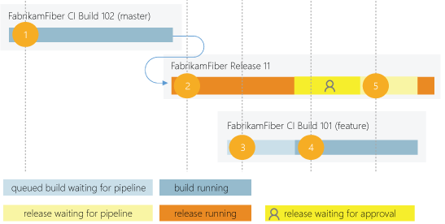
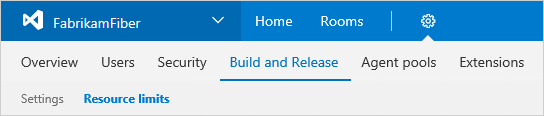

# Parallel jobs

**Azure Pipelines | [TFS 2018](concurrent-pipelines-tfs.md) | [TFS 2017](concurrent-pipelines-tfs.md)**

You can use a _parallel job_ in Azure Pipelines to run a single build job or a single release job at a time in your organization. In Azure Pipelines, you can run parallel jobs on Microsoft-hosted infrastructure or on your own (self-hosted) infrastructure.

## Microsoft-hosted CI/CD

If you want to run your builds and releases on machines that Microsoft manages, use _Microsoft-hosted parallel jobs_. Your jobs run on our pool of [Microsoft-hosted agents](../agents/hosted.md).

We provide a *free tier* of service by default in your organization:

- Public project: 10 free Microsoft-hosted parallel jobs that can run for up to 360 minutes (6 hours) each time, with no overall time limit per month.
- Private project: One free parallel job that can run for up to 60 minutes each time, until you've used 1,800 minutes (30 hours) per month.

When the free tier is no longer sufficient:

- Public project: [Contact us](https://azure.microsoft.com/support/devops/) to get your free tier limits increased.
- Private project: You can pay for additional capacity per parallel job. Paid parallel jobs remove the monthly time limit and allow you to run each job for up to 360 minutes (6 hours). [Buy Microsoft-hosted parallel jobs](https://marketplace.visualstudio.com/items?itemName=ms.build-release-hosted-pipelines).

## Self-hosted CI/CD

If you want Azure Pipelines to orchestrate your builds and releases, but use your own machines to run them, use _self-hosted parallel jobs_. You start by deploying our [self-hosted agents](../agents/agents.md) on your machines. You can register any number of these self-hosted agents in your organization. We charge based on the number of jobs you want to run at a time, not the number of agents registered. 

We provide a *free tier* of service by default in your organization:

- Public project: 10 free self-hosted parallel jobs.
- Private project: One self-hosted parallel job. Additionally, for each active Visual Studio Enterprise subscriber who is a member of your organization, you get one additional self-hosted parallel job.

When the free tier is no longer sufficient:

- Public project: [Contact us](https://azure.microsoft.com/support/devops/) to get your free tier limits increased.
- Private project: You can pay for additional capacity per parallel job. [Buy self-hosted parallel jobs](https://marketplace.visualstudio.com/items?itemName=ms.build-release-private-pipelines).

There are no time limits on self-hosted jobs.

## How a parallel job is consumed by a build or release

For example, consider an organization that has only one Microsoft-hosted parallel job. This job allows users in that organization to collectively run only one build or release job at a time. When additional jobs are triggered, they are queued and will wait for the previous job to finish.

A release consumes a parallel job only when it's being actively deployed to a stage. While the release is waiting for an approval or a manual intervention, it does not consume a parallel job.

1. FabrikamFiber CI Build 102 (master branch) starts first.
2. Deployment of FabrikamFiber Release 11 is triggered by completion of FabrikamFiber CI Build 102.
3. FabrikamFiber CI Build 101 (feature branch) is triggered. The build can't start yet because Release 11's deployment is active. So the build stays queued.
4. Release 11 waits for approvals. Fabrikam CI Build 101 starts because a release that's waiting for approvals does not consume a parallel job.
5. Release 11 is approved. It resumes only after Fabrikam CI Build 101 is completed.

## Relationship between jobs and parallel jobs

The term *job* can refer to multiple concepts, and its meaning depends on the context:

* When you define a build or release, you can define it as a collection of [jobs](../process/phases.md). When a build or release runs, you can run multiple jobs as part of that build or release.

* Each job consumes a *parallel job* that runs on an agent. When there aren't enough parallel jobs available for your organization, the jobs are queued up and run one after the other.

* When you run a [server job](../process/server-phases.md) or deploy to a [deployment group](../process/deployment-group-phases.md), you don't consume any parallel jobs.

## Determine how many parallel jobs you need

You can begin by seeing if the free tier offered in your organization is enough for your teams.
When you've reached the limit of 1,800 minutes per month for the free tier of Microsoft-hosted parallel jobs,
you can start by buying one parallel job to remove this monthly time limit before deciding to purchase more.

As the number of queued builds and releases exceeds the number of parallel jobs you have, your build and release queues will grow longer.
When you find the queue delays are too long, you can purchase additional parallel jobs as needed.

### Simple estimate

A simple rule of thumb: Estimate that you'll need one parallel job for every four to five users in your organization.

### Detailed estimate

In the following scenarios, you might need multiple parallel jobs:

* If you have multiple teams, and if each of them require a CI build, you'll likely need a parallel job for each team.

* If your CI build trigger applies to multiple branches, you'll likely need a parallel job for each active branch.

* If you develop multiple applications by using one organization or server, you'll likely need additional parallel jobs: one to deploy each application at the same time.

## View available parallel jobs

1. Browse to **Organization settings** > **Pipelines** > **Retention and parallel jobs** > **Parallel jobs**.

   

   URL example: `https://{your_organization}/_admin/_buildQueue?_a=resourceLimits`

2. View the maximum number of parallel jobs that are available in your organization.

3. Select **View in-progress jobs** to display all the builds and releases that are actively consuming an available parallel job or that are queued waiting for a parallel job to be available.

## Sharing of parallel jobs across projects in a collection

Parallel jobs are purchased at the organization level, and they are shared by all projects in an organization. Currently, there isn't a way to partition or dedicate parallel job capacity to a specific project or agent pool. For example:

1. You purchase two parallel jobs in your organization.

1. You queue two builds in the first project, and both the parallel jobs are consumed.

1. You queue a build in the second project. That build won't start until one of the builds in your first project is completed.

## Q&A

### How do I qualify for the free tier of public projects?

We'll automatically apply the free tier limits for public projects if you meet both of these conditions:

* Your pipeline is part of an Azure Pipelines [public project](../../organizations/public/index.md). 
* Your pipeline builds a public repository from GitHub or from the same public project in your Azure DevOps organization.

### Are there limits on who can use Azure Pipelines?

You can have as many users as you want when you're using Azure Pipelines. There is no per-user charge for using Azure Pipelines. Users with both [basic and stakeholder access](https://visualstudio.microsoft.com/products/visual-studio-team-services-feature-matrix-vs) can author as many builds and releases as they want.

### Are there any limits on the number of builds and release pipelines that I can create?

No. You can create hundreds or even thousands of definitions for no charge. You can register any number of self-hosted agents for no charge.

### As a Visual Studio Enterprise subscriber, do I get additional parallel jobs for TFS and Azure Pipelines?

Yes. Visual Studio Enterprise subscribers get [one parallel job in Team Foundation Server 2017 or later](concurrent-pipelines-tfs.md) and one self-hosted parallel job in each Azure DevOps Services organization where they are a member.

### What about the option to pay for hosted agents by the minute?

Some of our earlier customers are still on a per-minute plan for the hosted agents. In this plan, you pay $0.05/minute for the first 20 hours after the free tier, and $0.01/minute after 20 hours. Because of the following limitations in this plan, you might want to consider moving to the parallel jobs model:

- When you're using the per-minute plan, you can run only one job at a time.
- If you run builds for more than 14 paid hours in a month, the per-minute plan might be less cost-effective than the parallel jobs model.

### I use XAML build controllers with my organization. How am I charged for those?

You can register one XAML build controller for each self-hosted parallel job in your organization.
Your organization gets at least one free self-hosted parallel job, so you can register one XAML build controller for no additional charge.
For each additional XAML build controller, you'll need an additional self-hosted parallel job.
