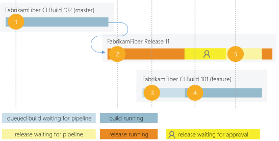

# Configure and pay for parallel jobs

[!INCLUDE [version-lt-eq-azure-devops](../../includes/version-lt-eq-azure-devops.md)]

::: moniker range="<azure-devops"

> [!IMPORTANT]
> When you use Azure DevOps Server, you don't pay for self-hosted concurrent jobs. The number of agents is your only limit.

::: moniker-end

::: moniker range="=azure-devops"

[!INCLUDE [public-projects-retirement](../../organizations/projects/includes/public-projects-retirement.md)]

Learn how to estimate how many parallel jobs you need and buy more parallel jobs for your organization.

## Prerequisites

| Category | Requirements |
|--------------|-------------|
| **Azure DevOps** | <ul><li>An [Azure DevOps project](../../organizations/projects/create-project.md).</li><li>Basic knowledge of YAML and Azure Pipelines. For more information, see [Create your first pipeline](../create-first-pipeline.md).</li><li>**Permissions:**<ul><li>Member of the [**Project Collection Administrators** security group](../../organizations/security/look-up-project-collection-administrators.md). If you created the organization or collection, you're automatically a member of this group.</li></ul></li><li>**Billing:**<ul><li>Billing must be [set up for your organization](../../organizations/billing/set-up-billing-for-your-organization-vs.md).</li></ul></li></ul> |
| **Azure** | <ul><li>An [Azure subscription](https://azure.microsoft.com/pricing/purchase-options/azure-account?cid=msft_learn). </li></ul> |

## What is a parallel job?

A parallel job in Azure DevOps Services represents the compute capacity to run a [pipeline job](../process/phases.md). If you have one parallel job, you can run one pipeline job at a time. If you have five parallel jobs, you can run five pipeline jobs at a time. Parallel jobs are configured at the Azure DevOps organization level and shared by all pipelines in the organization's projects. You can start as many pipelines as you want, but the parallel jobs available in your organization determine how many can run concurrently.

> [!TIP]
> Think of a parallel job like a lane in a swimming pool. If your swimming pool has one lane, only one swimmer at a time can use the pool. If more swimmers want to use the pool, they line up and wait. When the swimmer in the lane finishes, the next swimmer in line can use the lane. If it takes too long for all the swimmers to get a turn, you can add more lanes to the pool.
>
> In Azure Pipelines, if your pipelines take too long to complete, buy more parallel jobs for your organization so more jobs can run concurrently.

Azure DevOps Services has two types of parallel jobs: **Microsoft-hosted** and **self-hosted**. It offers a free tier and a paid tier of service for both types. The self-hosted free tier is automatically granted, but you must [enable the Microsoft-hosted free tier](#how-do-i-enable-the-free-tier-of-parallel-jobs).

# [Microsoft-hosted](#tab/ms-hosted)

When you [enable the free tier](#how-do-i-enable-the-free-tier-of-parallel-jobs), for **private projects** you get one free job that runs for up to 60 minutes each time, with a monthly limit of 1,800 minutes (30 hours). The same allocation applies to existing public projects after [they convert to private in 2027](../../organizations/projects/public-projects-retirement.md). To enable the Microsoft-hosted free tier, see [How do I enable the free tier of parallel jobs?](#how-do-i-enable-the-free-tier-of-parallel-jobs)

| Tier | Job time limit | Monthly time limit |
|----|----------------|--------------------|
| Free tier | One free job  that can run up to 60 minutes each time | 1,800 minutes (30 hours) per month |
| Paid tier | 360 minutes per job | No monthly limit |

> [!TIP]
> If your pipeline exceeds the maximum job time limit, try splitting your pipeline 
> into multiple jobs. For more information on jobs, see 
> [Specify jobs in your pipeline](../process/phases.md).

When the free tier is no longer sufficient, you can pay for more capacity per parallel job. 
 
When you purchase your first Microsoft-hosted parallel job, the number of parallel jobs you have in the organization is still one. To run two jobs concurrently, you need to purchase two parallel jobs if you're currently on the free tier. The first purchase only removes the time limits on the first job.

New organizations have a maximum limit of 25 parallel jobs for Microsoft-hosted agents. [Contact support](https://azure.microsoft.com/support/devops/) to request a limit increase. Limit increases are subject to capacity in your organization's region.

#### How much do parallel jobs cost?

- For pricing cost per parallel job, see the [Azure DevOps pricing page](https://azure.microsoft.com/pricing/details/devops/azure-devops-services/).
- To buy more parallel jobs, see [How do I buy more parallel jobs](#how-do-i-buy-more-parallel-jobs).

# [Self-hosted](#tab/self-hosted)

For self-hosted parallel jobs, you can register any number of [self-hosted agents](../agents/agents.md) in your organization. We charge based on the number of jobs you want to run at a time, not the number of agents registered. There are no time limits on self-hosted jobs.

For private projects, the free tier includes one parallel job plus one parallel job for each active Visual Studio Enterprise subscriber who is a member of your organization. 

|           |  Number of parallel jobs |  Time limit |
|:----------|--------------------------| ------------|
| **Private project** | One self-hosted job plus one parallel job for each active Visual Studio Enterprise subscriber who is a member of your organization.  |   None |

When the free tier is no longer sufficient for your self-hosted private project, you can purchase more capacity per parallel job.

- For pricing cost per parallel job, see the [Azure DevOps pricing page](https://azure.microsoft.com/pricing/details/devops/azure-devops-services/).
- To buy more parallel jobs, see [How do I buy more parallel jobs](#how-do-i-buy-more-parallel-jobs).

---

## How many parallel jobs do I need?

As the number of queued pipelines exceeds the number of parallel jobs you have, your pipeline queues grow longer. When you find the queue delays are too long, you can purchase more parallel jobs as needed.

A simple rule of thumb: Estimate that you need one parallel job for every four to five users in your organization.

In the following scenarios, you might need multiple parallel jobs:

* If you have multiple teams, and if each team requires CI, you might need a parallel job for each team.
* If your CI trigger applies to multiple branches, you might need a parallel job for each active branch.
* If you develop multiple applications by using one organization, you might need more parallel jobs: one to deploy each application at the same time.

Use the following methods to check your parallel job limits and job history.

- [View job history using the pool consumption report](#view-job-history-using-the-pool-consumption-report)
- [Check the parallel jobs setting directly](#check-the-parallel-jobs-setting-directly)

### View job history using the pool consumption report

You can use the **Pool consumption report**, available on the **Analytics** tab of your agent pool, to see a chart of running and queued jobs graphed with your parallel jobs for the previous 30 days. If you have a backlog of queued jobs and your running jobs are at the concurrency limit, you might want to purchase more parallel jobs. For more information, see [Pool consumption report](../agents/pool-consumption-report.md).

:::image type="content" source="../agents/media/pool-consumption-report/historical-graph-azure-pipelines.png" alt-text="Microsoft-hosted agent pool historical graph":::

### Check the parallel jobs setting directly

Figure out how many parallel jobs you need by first seeing how many parallel jobs your organization currently uses:

1. Browse to **Organization settings** > **Pipelines** > **Parallel jobs**.

   :::image type="content" source="media/concurrent-pipelines-vsts/control-panel-account-build-and-release-resource-limits.png" alt-text="Location of parallel jobs in organization settings.":::

   URL example: `https://{Your_Organization}/_admin/_buildQueue?_a=resourceLimits`

2. View the maximum number of parallel jobs that are available in your organization.

3. Select **View in-progress jobs** to display all the builds and releases that are actively consuming an available parallel job or that are queued waiting for a parallel job to be available.

## How do I buy more parallel jobs?

Before you change the number of parallel jobs, make sure that:

* [Billing is set up for your organization](../../organizations/billing/set-up-billing-for-your-organization-vs.md#set-up-billing).
* You're a member of the [**Project Collection Administrators** group](../../organizations/security/look-up-project-collection-administrators.md).

To buy more parallel jobs, or to change the quantity already purchased:

1. Sign in to your organization (`https://dev.azure.com/{yourorganization}`).
1. Select  **Organization settings**.

   

1. Select **Parallel jobs** under Pipelines, and then select either **Purchase parallel jobs** or **Change** for Microsoft-hosted jobs or **Change** for self-hosted jobs.

   :::image type="content" source="../../organizations/billing/media/shared/manage-parallel-jobs.png" alt-text="Screenshot showing how to manage parallel jobs.":::

1. Enter your desired quantity of Microsoft-hosted or self-hosted jobs, and then select **Save**.

It might take up to 30 minutes for the new number of parallel jobs to become active.

::: moniker-end

## How do I enable the free tier of parallel jobs?

::: moniker range="=azure-devops"

To receive the free grant of parallel jobs, link your Azure DevOps organization to a valid Azure subscription. [Set up billing for your organization](../../organizations/billing/set-up-billing-for-your-organization-vs.md) to link an Azure subscription. Once you configure billing, the free grant automatically applies to private projects in the organization.

For more information about the free tier of parallel jobs, see [How much do parallel jobs cost?](./concurrent-jobs.md?view=azure-devops&preserve-view=true#how-much-do-parallel-jobs-cost)

> [!NOTE]
> [Public projects are retired](../../organizations/projects/public-projects-retirement.md). New public projects can no longer be created. Existing public projects retain their current free parallelism grants until they convert to private in 2027.

::: moniker-end

::: moniker range="<azure-devops"

Azure DevOps Server doesn't have a dedicated free tier of parallel jobs. When you use Azure DevOps Server, you don't have to pay for self-hosted concurrent jobs. The number of agents is your only limit.

::: moniker-end

::: moniker range="=azure-devops"

## FAQ

- [Can I assign a parallel job to a specific project or agent pool?](#can-i-assign-a-parallel-job-to-a-specific-project-or-agent-pool)
- [How does Azure DevOps Services consume parallel jobs?](#how-does-azure-devops-services-consume-parallel-jobs)
- [Are there limits on who can use Azure Pipelines?](#are-there-limits-on-who-can-use-azure-pipelines)
- [Are there any limits on the number of builds and release pipelines that I can create?](#are-there-any-limits-on-the-number-of-builds-and-release-pipelines-that-i-can-create)
- [What about the option to pay for hosted agents by the minute?](#what-about-the-option-to-pay-for-hosted-agents-by-the-minute)
- [I use XAML build controllers with my organization. How am I charged for them?](#i-use-xaml-build-controllers-with-my-organization-how-am-i-charged-for-them)

### Can I assign a parallel job to a specific project or agent pool?

Currently, you can't partition or dedicate parallel job capacity to a specific project or agent pool. For example:

* You purchase two parallel jobs in your organization.
* You start two runs in the first project, and both the parallel jobs are consumed.
* You start a run in the second project. That run doesn't start until one of the runs in your first project is completed.

### How does Azure DevOps Services consume parallel jobs?

A pipeline run consumes a parallel job only while it's actively running on an agent:

* For release or YAML pipelines, a run consumes a parallel job only while it's actively being deployed to a stage. A run that's waiting for an approval or a manual intervention doesn't consume a parallel job.
* [Server jobs](../process/phases.md#server-jobs) and releases that deploy to a [deployment group](../process/deployment-group-phases.md) don't consume parallel jobs.

The following example illustrates how parallel jobs are consumed:

1. FabrikamFiber CI Build 102 (main branch) starts first.
1. Completion of FabrikamFiber CI Build 102 triggers deployment of FabrikamFiber Release 11.
1. FabrikamFiber CI Build 101 (feature branch) is triggered. The build can't start yet because Release 11's deployment is active. So the build stays queued.
1. Release 11 waits for approvals. Fabrikam CI Build 101 starts because a release that's waiting for approvals doesn't consume a parallel job.
1. Release 11 is approved. It resumes only after Fabrikam CI Build 101 is completed.

### Are there limits on who can use Azure Pipelines?

You can have as many users as you want when you're using Azure Pipelines. There's no per-user charge for using Azure Pipelines. Users with both [basic and stakeholder access](../../organizations/security/access-levels.md) can author as many builds and releases as they want.

### Are there any limits on the number of builds and release pipelines that I can create?

No. You can create hundreds or even thousands of pipelines for no charge. You can register any number of self-hosted agents for no charge.

### What about the option to pay for hosted agents by the minute?

Some of our earlier customers are still on a per-minute plan for the hosted agents. In this plan, you pay $0.05/minute for the first 20 hours after the free tier, and $0.01/minute after 20 hours. Because of the following limitations in this plan, you might want to consider moving to the parallel jobs model:

- When you're using the per-minute plan, you can run only one job at a time.
- When you run builds for more than 14 paid hours in a month, the per-minute plan might be less cost-effective than the parallel jobs model.

### I use XAML build controllers with my organization. How am I charged for them?

You can register one XAML build controller for each self-hosted parallel job in your organization.
Your organization gets at least one free self-hosted parallel job, so you can register one XAML build controller for no extra charge.
For each additional XAML build controller, you need an additional self-hosted parallel job.

::: moniker-end

## Related articles

- [Set up billing](../../organizations/billing/set-up-billing-for-your-organization-vs.md#set-up-billing)
- [Manage paid access](../../organizations/billing/buy-basic-access-add-users.md)
- [Buy access to test hub](../../organizations/billing/buy-access-tfs-test-hub.md)
- [Add user for billing management](../../organizations/billing/set-up-billing-for-your-organization-vs.md#give-a-user-access-to-manage-billing)
- [Azure DevOps billing overview](../../organizations/billing/overview.md)
