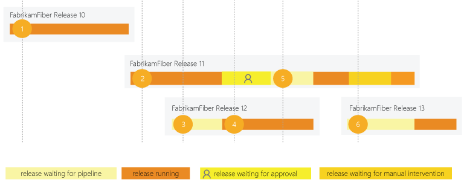
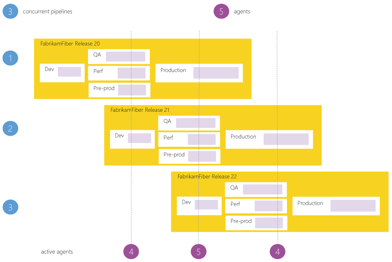
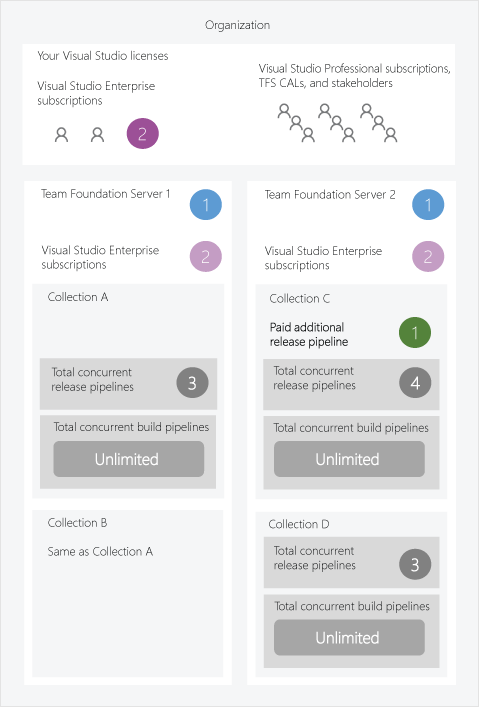
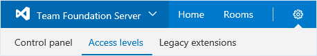
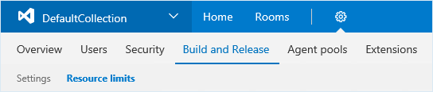

# Concurrent release jobs in Team Foundation Server

**[VSTS](concurrent-jobs-vsts.md) | TFS 2018 | TFS 2017**

This article describes the licensing model for Release Management in Team Foundation Server 2017 (TFS 2017) or newer. We don't charge you for Team Foundation Build (TFBuild) so long as you have a TFS Client Access License (CAL).

A TFS _concurrent job_ gives you the ability to run a single release at a time in a project collection. You can keep hundreds or even thousands of release jobs in your collection. But, to run more than one release at a time, you need additional concurrent jobs.

One free concurrent job is included with every collection in a Team Foundation server. Every Visual Studio Enterprise subscriber in a Team Foundation server contributes one additional concurrent job. You can buy additional private jobs from the Visual Studio Marketplace.

> Do I need concurrent jobs in TFS 2015? Short answer: no. [More details](#tfs_before_2017)

## How a concurrent job is consumed

For example, a collection in a Team Foundation server has one concurrent job. This allows users in that collection to run only one release at a time. When additional releases are triggered, they are queued and will wait for the previous one to complete.

A release requires a concurrent job only when it is being actively deployed to an environment. Waiting for an approval does not consume a concurrent job. However, waiting for a manual intervention in the middle of a deployment does consume a concurrent job.

1. FabrikamFiber Release 10 is first to be deployed.
2. Deployment of FabrikamFiber Release 11 starts after Release 10's deployment is complete.
3. Release 12 is queued until Release 11's deployment is active.
4. Release 11 waits for an approval. Release 12's deployment starts because a release waiting for approvals does not consume a concurrent job.
5. Even though Release 11 is approved, it resumes only after Release 12's deployment is completed.
6. Release 11 is waiting for manual intervention. Release 13 cannot start because the manual intervention state consumes a concurrent job.

> Manual intervention does not consume a job in TFS 2017.1 and newer.

## Concurrent processing within a single release

Concurrent processing within a single release does not require additional concurrent jobs. So long as you have enough agents, you can deploy to multiple environments in a release at the same time.

For example, suppose your collection has three concurrent jobs. You can have more than three agents running at the same time to perform parallel operations within releases. For instance, notice below that four or five agents are actively running jobs from three concurrent jobs.

## Concurrent jobs in an organization

For example, here's an organization that has multiple  Team Foundation Servers. Two of their users have Visual Studio Enterprise subscriptions that they can use at the same time across all their on-premises servers and in each collection so long as the customer adds them as users to both the servers as explained below.

## Determine how many concurrent jobs you need

You can begin by seeing if your teams can get by with the concurrent jobs you've got by default. As the number of queued releases exceeds the number of concurrent jobs you have, your release queues will grow longer. When you find the queue delays are too long, you can purchase additional concurrent jobs as needed.

### Simple estimate

A simple rule of thumb: Estimate that you'll need one concurrent job for every 10 users in your server.

### Detailed estimate

In the following scenarios you might need multiple concurrent jobs:

* If you have multiple teams, if each of them require a CI build, and if each of the CI builds is configured to trigger a release, then you'll likely need a concurrent job for each team.

* If you develop multiple applications in one collection, then you'll likely need additional concurrent jobs: one to deploy each application at the same time.

## Use your Visual Studio Enterprise subscription benefit

Users who have Visual Studio Enterprise subscriptions are assigned to **VS Enterprise** access level in the Users hub of TFS instance. Each of these users contributes one additional concurrent job to each collection. You can use this benefit on all Team Foundation Servers in your organization.

0. Browse to **Server settings**, **Access levels**.

 

 URL example: `http://{your_server}:8080/tfs/_admin/_licenses`

0. On the left side of the page, click **VS Enterprise**.

0. Add your users who have Visual Studio Enterprise subscriptions.

After you've added these users, additional licenses will appear on the resource limits page described below.

## Purchase additional concurrent jobs

If you need to run more concurrent releases, you can [buy additional private jobs from the Visual Studio marketplace](https://marketplace.visualstudio.com/items?itemName=ms.build-release-private-pipelines). Since there is no way to directly purchase concurrent jobs from Marketplace for a TFS instance at present, you must first buy concurrent jobs for a VSTS organization. After you buy the private jobs for a VSTS organization, you enter the number of purchased concurrent jobs manually on the resource limits page described below.

## View and manage concurrent jobs

0. Browse to **Collection settings**, **Build and Release**, **Resource limits**.

 

 URL example: `http://{your_server}:8080/tfs/DefaultCollection/_admin/_buildQueue?_a=resourceLimits`

0. View or edit the number of purchased concurrent jobs.

## Q&A

### Who can use the system?

TFS users with a [TFS CAL](https://visualstudio.microsoft.com/team-services/tfs-pricing) can author as many releases as they want.

To approve releases, a TFS CAL is not necessary; any user with [stakeholder access](../../organizations/security/get-started-stakeholder.md) can approve or reject releases.

### Do I need concurrent jobs to run builds on TFS?

No, on TFS you don't need concurrent jobs to run builds. You can run as many builds as you want at the same time for no additional charge.

<h3 id="tfs_before_2017">Do I need concurrent jobs to use release management in versions before TFS 2017?</h3>

No.

In TFS 2015, so long as your users have a TFS CAL, they can use release management for no additional charge in trial mode. We called it "trial mode" to indicate that we would eventually charge for release management. Despite this label, we fully support release management in TFS 2015.

### How is release management licensed in VSTS?

See [concurrent jobs in VSTS](concurrent-jobs-vsts.md).
