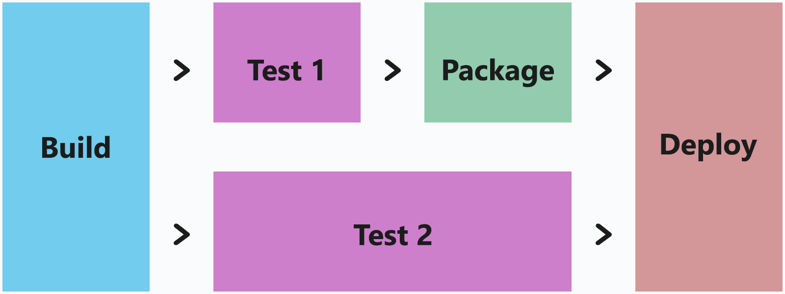

# Migrate from Travis to Azure Pipelines

Azure Pipelines is more than just a Continuous Integration tool, it's a
flexible build and release orchestration platform.  It's designed for
the software development and deployment process, but because of this
extensibility, there are a number of differences from simpler build
systems like Travis.

This purpose of this guide is to help you migrate from Travis to Azure Pipelines. This guide describes the philosophical differences between Travis and
Azure Pipelines, examines the practical effects on the configuration of
each system, and shows how to translate from a Travis configuration to an
Azure Pipelines configuration.

> We need your help to make this guide better! Submit comments below or contribute your changes directly.

## Key differences

There are numerous differences between Travis and Azure
Pipelines, including version control configuration, environment variables,
and virtual machine environments, but at a higher level:

* Azure Pipelines configuration is more precise and relies less on shorthand configuration and implied steps. You'll see this in places like language selection and in the way Azure Pipelines allows flow to be controlled.

* Travis builds have _stages_, _jobs_ and _phases_, while Azure Pipelines simply has steps that can be arranged and executed in an arbitrary order or grouping that you choose.  This gives you flexibility over the way that your steps are executed, including the way they're executed in parallel.

* Azure Pipelines allows job definitions and steps to be stored in separate YAML files in the same or a different repository, enabling steps to be shared across multiple pipelines.

* Azure Pipelines provides full support for building and testing on Microsoft-managed Linux, Windows, and macOS images. See [Microsoft-hosted agents](../agents/hosted.md) for more details.

## Before starting your migration

If you are new to Azure Pipelines, see the following to learn more about Azure Pipelines and how it works prior to starting your migration:

* [Create your first pipeline](../create-first-pipeline.md)
* [Key concepts for new Azure Pipelines users](../get-started/key-pipelines-concepts.md)
* [Building GitHub repositories](../repos/github.md)

## Language

Travis uses the `language` keyword to identify the prerequisite build
environment to provision for your build. For example, to select Node.JS
8.x:

**.travis.yml**
``` yaml
language: node_js
node_js:
  - "8"
```

[Microsoft-hosted agents](../agents/hosted.md) contain the SDKs for many languages out-of-the-box
and most languages need no configuration.  But where a language has multiple
versions installed, you may need to execute a [language selection task](../tasks/tool/node-js.md)
to set up the environment.

For example, to select Node.JS 8.x:

**azure-pipelines.yml**
``` yaml
steps:
- task: NodeTool@0
  inputs:
    versionSpec: '8.x'
```

### Language mappings

The `language` keyword in Travis does not just imply that a particular version
of language tools be used, but also that a number of build steps be implicitly
performed.  Azure Pipelines, on the other hand, does not do any work without
your input, so you'll need to specify the commands that you want to execute.

Here is a translation guide from the `language` keyword to the commands
that are executed automatically for the most commonly-used languages:

| Language      | Commands                       |
|---------------|--------------------------------|
| `c`<br>`cpp`             | `./configure`<br>`make`<br>`make install` |
| `csharp`                 | `nuget restore [solution.sln]`<br>`msbuild /p:Configuration=Release [solution.sln]` |
| `clojure`                | `lein deps`<br>`lein test` |
| `go`                     | `go get -t -v ./...`<br>`make` **or** `go test` |
| `java`<br>`groovy`       | **Gradle**:<br>`gradle assemble`<br>`gradle check`<br><br>**Maven**:<br>`mvn install -DskipTests=true -Dmaven.javadoc.skip=true -B -V`<br>`mvn test -B`<br><br>**Ant**:<br>`ant test` |
| `node_js`                | `npm install` **or** `npm ci` **or** `yarn`<br>`npm test` |
| <span style="white-space: nowrap">`objective-c`</span><br>`swift` | `pod install` **or** `bundle exec pod install`<br>`xcodebuild -scheme [scheme] build test \| xcpretty` |
| `perl`                   | `cpanm --quiet --installdeps --notest .`<br><br>**Build.PL**:<br>`perl ./Build.pl`<br>`./Build test`<br><br>**Makefile.PL**:<br>`perl Makefile.PL`<br>`make test`<br><br>**Makefile**:<br>`make test` |
| `php`                    | `phpunit` |
| `python`                 | `pip install -r requirements.txt`
| `ruby`                   | `bundle install --jobs=3 --retry=3`<br>`rake` |

In addition, less common languages can be enabled but require an additional
dependency installation step or execution inside a docker container:

| Language      | Commands                       |
|---------------|--------------------------------|
| `crystal`     | `docker run -v $(pwd):/src -w /src crystallang/crystal shards install`<br>`docker run -v $(pwd):/src -w /src crystallang/crystal crystal spec` |
| `d`           | `sudo wget http://master.dl.sourceforge.net/project/d-apt/files/d-apt.list -O /etc/apt/sources.list.d/d-apt.list`<br>`sudo apt-get update`<br>`sudo apt-get -y --allow-unauthenticated install --reinstall d-apt-keyring`<br>`sudo apt-get update`<br>`sudo apt-get install dmd-compiler dub`<br>`dub test --compiler=dmd` |
| `dart`        | `wget https://dl-ssl.google.com/linux/linux_signing_key.pub -O - \| sudo apt-key add -`<br>`wget https://storage.googleapis.com/download.dartlang.org/linux/debian/dart_stable.list -O /etc/apt/sources.list.d/dart_stable.list`<br>`sudo apt-get update`<br>`sudo apt-get install dart`<br>`/usr/lib/dart/bin/pub get`<br>`/usr/lib/dart/bin/pub run test` |
| `erlang`      | `sudo apt-get install rebar`<br>`rebar get-deps`<br>`rebar compile`<br>`rebar skip_deps=true eunit` |
| `elixir`      | `sudo apt-get install elixir`<br>`mix local.rebar --force`<br>`mix local.hex --force`<br>`mix deps.get`<br>`mix test` |
| `haskell`     | `sudo apt-get install cabal-install`<br>`cabal install --only-dependencies --enable-tests`<br>`cabal configure --enable-tests`<br>`cabal build`<br>`cabal test` |
| `haxe`        | `sudo apt-get install haxe`<br>`yes \| haxelib install [hxml]`<br>`haxe [hxml]` |
| `julia`       | `sudo apt-get install julia`<br>`julia -e "using Pkg; Pkg.build(); end"`<br>`julia --check-bounds=yes -e "Pkg; Pkg.test(coverage=true); end"` |
| `nix`         | `docker run -v $(pwd):/src -w /src nixos/nix nix-build`
| `perl6`       | `sudo apt-get install rakudo`<br>`PERL6LIB=lib prove -v -r --exec=perl6 t/`
| `rust`        | `sudo apt-get install rustc`<br>`cargo build --verbose`<br>`cargo test --verbose` |
| `scala`       | <code>echo "deb https://dl.bintray.com/sbt/debian /" &#124; sudo tee -a /etc/apt/sources.list.d/sbt.list</code><br>`sudo apt-key adv --keyserver hkp://keyserver.ubuntu.com:80 --recv 2EE0EA64E40A89B84B2DF73499E82A75642AC823`<br>`sudo apt-get update`<br>`sudo apt-get install sbt`<br>`sbt ++2.11.6 test` |
| `smalltalk`   | `docker run -v $(pwd):/src -w /src hpiswa/smalltalkci smalltalkci` |

### Multiple language selection

You can also configure an environment that supports building
different applications in multiple languages.  For example, to ensure the
build environment targets both Node.JS 8.x and Ruby 2.5 or better:

**azure-pipelines.yml**
``` yaml
steps:
- task: NodeTool@0
  inputs:
    versionSpec: '8.x'
- task: UseRubyVersion@0
  inputs:
    versionSpec: '>= 2.5'
```

## Phases

In Travis, steps are defined in a fixed set of named phases such as
`before_install` or `before_script`. Azure Pipelines does not have named phases and steps can be grouped, named, and organized in whatever way makes sense for the pipeline.

For example:

**.travis.yml**
``` yaml
before_install:
    - npm install -g bower
install:
    - npm install
    - bower install
script:
    - npm run build
    - npm test
```

**azure-pipelines.yml**
``` yaml
steps:
- script: npm install -g bower
- script: npm install
- script: bower install
- script: npm run build
- script: npm test
```

Alternatively, steps can be grouped together and optionally named:

**azure-pipelines.yml**
``` yaml
steps:
- script: |
    npm install -g bower
    npm install
    bower install
  displayName: 'Install dependencies'
- script: npm run build
- script: npm test
```

## Parallel jobs

Travis provides parallelism by letting you define a stage, which
is a group of jobs that are executed in parallel.  A Travis build can
have multiple stages; once all jobs in a stage have completed, the execution
of the next stage can begin.

Azure Pipelines gives you finer grained control of parallelism. You can make
each step dependent on any other step you want. In this way, you specify which
steps run serially, and which can run in parallel.
So you can fan out with multiple steps run in parallel after
the completion of one step, and then fan back in with a single step that runs afterward.
This model gives you options to define complex workflows if necessary. For now, here's
a simple example:


For example, to run a build script, then upon its completion run both the
unit tests and the integration tests in parallel, and once all tests have
finished, package the artifacts and then run the deploy to pre-production:

**.travis.yml**
``` yaml
jobs:
  include:
  - stage: build
    script: ./build.sh
  - stage: test
    script: ./test.sh unit_tests
  - script: ./test.sh integration_tests
  - stage: package
    script: ./package.sh
  - stage: deploy
    script: ./deploy.sh pre_prod
```

**azure-pipelines.yml**
``` yaml
jobs:
- job: build
  steps:
  - script: ./build.sh
- job: test1
  dependsOn: build
  steps:
  - script: ./test.sh unit_tests
- job: test2
  dependsOn: build
  steps:
  - script: ./test.sh integration_tests
- job: package
  dependsOn:
  - test1
  - test2
  script: ./package.sh
- job: deploy
  dependsOn: package
  steps:
  - script: ./deploy.sh pre_prod
```

### Advanced parallel execution

In Azure Pipelines you have more options and control over how you orchestrate your pipeline. Unlike Travis, we don't require you to think of
blocks that must be executed together.    Instead, you can focus on the resources that a job needs to start 
and the resources that it produces when it's done.

For example, a team has a set of fast-running unit tests, and another set of and slower integration tests. The team wants to begin creating the .ZIP file for a release as soon as the unit are completed because they provide high confidence 
that the build will provide a good package. But before they deploy to pre-production, they want to wait until all tests have passed:



In Azure Pipelines they can do it this way:

**azure-pipelines.yml**
``` yaml
jobs:
- job: build
  steps:
  - script: ./build.sh
- job: test1
  dependsOn: build
  steps:
  - script: ./test.sh unit_tests
- job: test2
  dependsOn: build
  steps:
  - script: ./test.sh integration_tests
- job: package
  dependsOn: test1
  script: ./package.sh
- job: deploy
  dependsOn:
  - test1
  - test2
  - package
  steps:
  - script: ./deploy.sh pre_prod
```


## Step reuse

Most teams like to reuse as much business logic as possible to save time and 
avoid replication errors, confusion, and staleness. 
Instead of duplicating your change, you can make the change in a common area, and your leverage increases when you have similar processes that build on multiple platforms.

In Travis you can use matrices to run multiple executions across a single
configuration. In Azure Pipelines you can use matrices in the same way, but you can also implement configuration reuse by using YAML templates.

### Example: Environment variable in a matrix

One of the most common ways to run several builds with a slight variation
is to change the execution using environment variables.  For example, your
build script can look for the presence of an environment variable and change
the way your software is built, or the way its tested.

You can use a matrix to have run a build configuration several
times, once for each value in the environment variable.  For example,
to run a given script three times, each time with a different setting for
an environment variable:

**.travis.yml**
``` yaml
os: osx
env:
  matrix:
  - MY_ENVIRONMENT_VARIABLE: 'one'
  - MY_ENVIRONMENT_VARIABLE: 'two'
  - MY_ENVIRONMENT_VARIABLE: 'three'
script: echo $MY_ENVIRONMENT_VARIABLE
```

**azure-pipelines.yml**
``` yaml
pool:
  vmImage: 'macOS-10.13'
strategy:
  matrix:
    set_env_to_one:
      MY_ENVIRONMENT_VARIABLE: 'one'
    set_env_to_two:
      MY_ENVIRONMENT_VARIABLE: 'two'
    set_env_to_three:
      MY_ENVIRONMENT_VARIABLE: 'three'
steps:
- script: echo $(MY_ENVIRONMENT_VARIABLE)
```

### Example: Language versions in a matrix

Another common scenario is to run against several
different language environments.  Travis supports an implicit definition
using the `language` keyword, while Azure Pipelines expects an explicit
task to define how to configure that language version.

You can easily use the environment variable matrix options in Azure Pipelines
to enable a matrix for different language versions.  For example, you can
set an environment variable in each matrix variable that corresponds to the
language version that you want to use, then in the first step, use that
environment variable to run the language configuration task:

**.travis.yml**
``` yaml
os: linux
matrix:
  include:
  - rvm: 2.3.7
  - rvm: 2.4.4
  - rvm: 2.5.1
script: ruby --version
```

**azure-pipelines.yml**
``` yaml
vmImage: 'Ubuntu 16.04'
strategy:
  matrix:
    ruby 2.3:
      ruby_version: '2.3.7'
    ruby 2.4:
      ruby_version: '2.4.4'
    ruby 2.5:
      ruby_version: '2.5.1'
steps:
- task: UseRubyVersion@0
  inputs:
    versionSpec: $(ruby_version)
- script: ruby --version
```

### Example: Operating systems within a matrix

It's also common to run builds in multiple operating systems.  Travis
supports this definition using the `os` keyword, while Azure Pipelines
lets you configure the operating system by selecting the pool to run in
using the `vmImage` keyword.

For example, you can set an environment variable in each matrix variable
that corresponds to the operating system image that you want to use.  Then
you can set the machine pool to the variable you've set:

**.travis.yml**
``` yaml
matrix:
  include:
  - os: linux
  - os: windows
  - os: osx
script: echo Hello, world!
```

**azure-pipelines.yml**
``` yaml
strategy:
  matrix:
    linux:
      imageName: 'ubuntu-16.04'
    mac:
      imageName: 'macos-10.13'
    windows:
      imageName: 'vs2017-win2016'

pool:
  vmImage: $(imageName)

steps:
- script: echo Hello, world!
```

## Success and failure handling

Travis allows you to specify steps that will be run when the build succeeds,
using the `after_success` phase, or when the build fails, using the
`after_failure` phase.  Since Azure Pipelines doesn't limit you to a finite
number of specially-named phases, you can define success and failure 
conditions based on the result of any step, which enables more flexible
and powerful pipelines.

**.travis.yml**
``` yaml
build: ./build.sh
after_success: echo Success 😀
after_failure: echo Failed 🙁
```

**azure-pipelines.yml**
``` yaml
steps:
- script: ./build.sh
- script: echo Success 😀
  condition: succeeded()
- script: echo Failed 🙁
  condition: failed()
```

### Advanced success and failure handling

In Azure Pipelines you can program a flexible set of dependencies and
conditions for flow control between jobs.  
You can configure jobs to run based on the success or
failure of previous jobs or based on environment variables. 
You can even configure jobs to always run, 
regardless of the success of other jobs.

For example, if you want to run a script when the build fails, but only 
if it is running as a build on the master branch:

**azure-pipelines.yml**
``` yaml
jobs:
- job: build
  steps:
  - script: ./build.sh
- job: alert
  dependsOn: build
  condition: and(failed(), eq(variables['Build.SourceBranch'], 'refs/heads/master'))
  steps:
  - script: ./sound_the_alarms.sh
```

## Predefined variables

Both Travis and Azure Pipelines set a number of environment variables
to allow you to inspect and interact with the execution environment of the
CI system.

In most cases there's an Azure Pipelines variable to match 
the environment variable in Travis. Here's a list of commonly-used
environment variables in Travis and their analog in Azure Pipelines:

| Travis                       | Azure Pipelines               | Description                  |
|------------------------------|-------------------------------|------------------------------|
| `CI=true` or `TRAVIS=true`   | `TF_BUILD=True`               | Indicates that your build is running in the CI system; useful for scripts that are also intended to be run locally during development. |
| `TRAVIS_BRANCH`              | **CI builds**:<br>`BUILD_SOURCEBRANCH`<br><br>**Pull request builds**:<br>`SYSTEM_PULLREQUEST_TARGETBRANCH` | The name of the branch the build was queued for, or the name of the branch the pull request is targeting. |
| `TRAVIS_BUILD_DIR`           | `BUILD_SOURCESDIRECTORY`      | The location of your checked out source and the default working directory. |
| `TRAVIS_BUILD_NUMBER`        | `BUILD_BUILDID`               | A unique numeric identifier for the current build invocation. |
| `TRAVIS_COMMIT`              | **CI builds**:<br>`BUILD_SOURCEVERSION` | The commit ID currently being built. |
| `TRAVIS_COMMIT`              | **Pull request builds**:<br>`git rev-parse HEAD^2` | For pull request validation builds, Azure Pipelines sets `BUILD_SOURCEVERSION` to the resulting merge commit of the pull request into master; this command will identify the pull request commit itself. |
| `TRAVIS_COMMIT_MESSAGE`      | `BUILD_SOURCEVERSIONMESSAGE`  | The log message of the commit being built. |
| `TRAVIS_EVENT_TYPE`          | `BUILD_REASON` | The reason the build was queued; a map of values is in the "build reasons" table below. |
| `TRAVIS_JOB_NAME`            | `AGENT_JOBNAME`                | The name of the current job, if specified. |
| `TRAVIS_OS_NAME`             | `AGENT_OS`                     | The operating system that the job is running on; a map of values is in the "operating systems" table below. |
| `TRAVIS_PULL_REQUEST`        | **Azure Repos**:<br>`SYSTEM_PULLREQUEST_PULLREQUESTID`<br><br>**GitHub**:<br>`SYSTEM_PULLREQUEST_PULLREQUESTNUMBER` | The pull request number that triggered this build. (For GitHub builds, this is a unique identifier that is _not_ the pull request number.) |
| `TRAVIS_PULL_REQUEST_BRANCH` | `SYSTEM_PULLREQUEST_SOURCEBRANCH` | The name of the branch where the pull request originated. |
| `TRAVIS_PULL_REQUEST_SHA`    | **Pull request builds**:<br>`git rev-parse HEAD^2` | For pull request validation builds, Azure Pipelines sets `BUILD_SOURCEVERSION` to the resulting merge commit of the pull request into master; this command will identify the pull request commit itself. |
| `TRAVIS_PULL_REQUEST_SLUG`   |                                | The name of the forked repository, if the pull request originated in a fork.  There's no analog to this in Azure Pipelines. |
| `TRAVIS_REPO_SLUG`           | `BUILD_REPOSITORYNAME`         | The name of the repository that this build is configured for. |
| `TRAVIS_TEST_RESULT`         | `AGENT_JOBSTATUS`              | Travis sets this value to `0` if all previous steps have succeeded (returned `0`).  For Azure Pipelines, check that `AGENT_JOBSTATUS=Succeeded`. |
| `TRAVIS_TAG`                 | `BUILD_SOURCEBRANCH`           | If this build was queued by the creation of a tag then this is the name of that tag.  For Azure Pipelines, the `BUILD_SOURCEBRANCH` will be set to the full Git reference name, eg `refs/tags/tag_name`. |
| `TRAVIS_BUILD_STAGE_NAME`    |                                | The name of the stage in Travis. As we saw earlier, Azure Pipelines handles flow control using jobs. You can reference `AGENT_JOBNAME`. |

**Build Reasons**:

The `TRAVIS_EVENT_TYPE` variable contains values that map to values provided by the Azure Pipelines `BUILD_REASON` variable:

| Travis         | Azure Pipelines | Description                  |
|----------------|-----------------|------------------------------|
| `push`         | `IndividualCI`  | The build is a continuous integration build from a push. |
| `pull_request` | `PullRequest`   | The build was queued to validate a pull request. |
| `api`          | `Manual`        | The build was queued by the REST API or a manual request on the web page. |
| `cron`         | `Schedule`      | The build was scheduled. |

**Operating Systems**:

The `TRAVIS_OS_NAME` variable contains values that map to values provided by the Azure Pipelines `AGENT_OS` variable:

| Travis    | Azure Pipelines | Description                      |
|-----------|-----------------|----------------------------------|
| `linux`   | `Linux`         | The build is running on Linux.   |
| `osx`     | `Darwin`        | The build is running on macOS.   |
| `windows` | `Windows_NT`    | The build is running on Windows. |

To learn more, see [Predefined environment variables](../build/variables.md).

If there isn't a variable for the data you need, then you can use a shell
command to get it.  For example, a good substitute of an environment
variable containing the commit ID of the pull request being built is to
run a git command:  `git rev-parse HEAD^2`.

## Building specific branches

By default, both Travis and Azure Pipelines perform CI builds on all
branches.  Similarly, both systems allow you to limit these builds to
specific branches.  In Azure Pipelines, the list of branches to build
should be listed in the `include` list and the branches _not_ to build
should be listed in the `exclude list.  Wildcards are supported.

For example, to build only the master branch and those that begin with
the word "releases":

**.travis.yml**
``` yaml
branches:
  only:
  - master
  - /^releases.*/
```

**azure-pipelines.yml**
``` yaml
trigger:
  branches:
    include:
    - master
    - releases*
```

## Output caching

Travis supports caching dependencies and intermediate build output to improve
build times.  Azure Pipelines does not support caching intermediate build
output, but does offer integration with
[Azure Artifacts](https://azure.microsoft.com/en-us/services/devops/artifacts/)
for dependency storage.

## Git submodules

Travis and Azure Pipelines both clone git repos "recursively" by
default. This means that submodules are cloned by the agent, which 
is useful since submodules usually contain dependencies. 
However, the extra cloning takes time, so if you don't need the dependencies
then you can disable cloning submodules:

**.travis.yml**
``` yaml
git:
  submodules: false
```

**azure-pipelines.yml**
``` yaml
checkout:
  submodules: false
```
