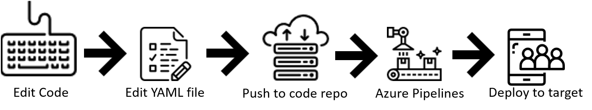

# Overview

::: moniker range="vsts"

Azure Pipelines is a cloud service that you can use to automatically build and test your code project and make it available to other users. It works with just about any language or project type.

Pipelines combines both **Continuous Integration (CI)** and **Continuous Deployment (CD)** to constantly and consistently test and build your code and ship it to any target. 

## Languages

You can use practically any language with Azure Pipelines, including **Python, Java, PHP, Ruby, C#, and Go.**

## Version control systems

The starting point for using CI and CD practices for your applications is to have your source code in a version control system. Azure Pipelines integrates with **GitHub, Azure Repos, BitBucket,** and **Subversion**.

## Application types

You can use Azure Pipelines with most application types, including **Java, JavaScript, Python, .NET, PHP, Go, XCode, and C++**.

## Deployment targets

Azure Pipelines can be used to deploy your code to multiple targets, such as **container registries, virtual machines, Azure services, or to any on-premises or cloud target.**

## Package formats

If your goal is to produce packages that can be consumed by others, you can publish **NuGet, npm, or Maven packages** to the built-in package management repository in Azure Pipelines or any other package management repository of your choice.

## How to use Azure Pipelines

You can either use [YAML](get-started-yaml.md) to define your pipelines or use the [visual designer](get-started-designer.md) to do the same. 

When you use YAML, you define your pipeline mostly in code (a YAML file) alongside the rest of the code for your app. 
When you use the visual designer, you define a **build pipeline** to build and test your code, and then to publish artifacts. You also define a **release pipeline** to consume and deploy those artifacts to deployment targets.

### Use Azure Pipelines with YAML

You can configure your pipelines in a YAML file that exists alongside your code.

1. Configure Azure Pipelines to use your Git repo.
2. Edit your `azure-pipelines.yml` file to define your build.
3. Push your code to your version control repository, this will kick off the default trigger to build and deploy, and monitor the results.
4. Your code is now updated, built, tested, and packaged and can be deployed to any target.

Benefits of using YAML:

* The pipeline is versioned with your code and follows the same branching structure as your code, so you get validation of your changes through code reviews in pull requests and branch build policies.
* Every branch you use can modify the build policy by modifying the `azure-pipelines.yml` file.
* If a change to the build process causes a break or results in an unexpected outcome, you can much more easily identify the issue because the change is in version control with the rest of your codebase.

If you think the YAML workflow is best for you, take the next step by [creating your first pipeline using YAML](get-started-yaml.md).

### Use Azure Pipelines in the visual designer

You can create and configure your build and release pipelines in the Azure DevOps web portal with the visual designer. 

1. Configure Azure Pipelines to use your Git repo.
2. Use the Azure Pipelines visual designer to create  and configure your build and release pipelines.
3. Push your code to your version control repository which triggers your pipeline, running any tasks such as building or testing code.
5. The build creates an artifact that is used by the rest of your pipeline, running any tasks such as deploying to staging or production.
6. Your code is now updated, built, tested, and packaged and can be deployed to any target.

    
Benefits of using the visual designer:

The visual designer is great for users that are new to the world of CI and CD.

* The visual representation of the pipelines makes it easier to get started. 
* The visual designer is located in the same section as the build results, making it easier to switch back and forth and make changes if needed.

If you think the designer workflow is best for you, take the next step by [creating your first pipeline using the visual designer](get-started-designer.md).

## Key Concepts for new users

Understanding the basic terms and parts of Pipelines will help you further explore how it can help you deliver better code more efficiently and reliably.

### Agent

When your build or deployment runs, the system begins one or more jobs. An **agent** is installable software that runs one build or deployment job at a time.

The [Build and Release Agents article](agents/agents.md) goes more in-depth about the different types of agents and how to use them.

### Artifact

A collection of files or packages published by a build and made available to subsequent tasks such as distribution or deployment.

### Build

A build represents one execution of a pipeline and it collects the logs associated with running the steps as well as the results of running tests.

### Deployment target

A virtual machine, container, web app, or any service that is used to host the application being developed. A pipeline may deploy the app to one or more deployment targets after build is completed and tests are run.

### Jobs

A build contains one or more **jobs**, each of which runs on an **agent**. A job represents an execution boundary of a set of steps, all of which run together on the same agent. For example, you may build two configurations - x86 and x64. In this case, you have one build and two jobs.

### Pipeline

A **pipeline** defines the continuous integration and deployment process for your app. It is made up of steps called **tasks** and can be thought of as a script that defines how your test, build, and deploy steps are run.

### Release

When you use the visual designer, you create a release pipeline in addition to a build pipeline. A **release** is the term used to describe one execution of a release pipeline. It is made up of deployments to multiple stages.

### Task

A **task** is the building block of a pipeline. For example, a build pipeline may consists of build tasks and test tasks, while a release pipeline will consist of deployment tasks. Each task runs a specific job in the **pipeline**.

### Triggers

A **trigger** is something that is set up to tell the pipeline when it should be run. You can configure a pipeline to be run upon a push to a repository, at a particular point of time, or upon the completion of another build. All of these are known as **triggers**.

## Next steps

Now that you understand the basics, follow the quickstart to [create your first pipeline](get-started-yaml.md).

::: moniker-end

::: moniker range="< vsts"

Team Foundation Server (TFS) is the on-premises version of Azure DevOps. TFS includes Build and Release and can be installed and managed on your own servers.

Continuous Integration (CI) is the practice used by development teams to automate the merging and testing of code.  Implementing CI helps to catch bugs early in the development cycle, which makes them less expensive to fix.  Automated tests execute as part of the CI process to ensure quality.  Artifacts are produced from CI systems and fed to release processes to drive frequent deployments. The Build service in TFS helps you set up and manage CI for your applications.

Continuous Delivery (CD) is a process by which code is built, tested, and deployed to one or more test and production environments.  Deploying and testing in multiple environments drives quality.  CI systems produce the deployable artifacts including infrastructure and apps.  Automated release processes consume these artifacts to release new versions and fixes to existing systems.  Monitoring and alerting systems run continually to drive visibility into the entire CD process. The Release service in TFS helps you set up and manage CD for your applications.

Continuous Testing (CT) on-premises or in the cloud is the use of automated build-deploy-test workflows, with a choice of technologies and frameworks, that test your changes continuously in a fast, scalable, and efficient manner.

## Version control systems

The starting point for configuring CI and CD for your applications is to have your source code in a version control system. TFS supports two forms of version control - Git and Team Foundation Version Control. The Build service integrates with both of these version control systems. Once you have configured CI, any changes you push to your version control repository will be automatically built and validated. You can also manage your source code in Subversion, Bitbucket, GitHub, or any other Git repository. The Build service integrates with all of these version control systems.

## Application types

To configure CI, you create a build definition. A build definition is a representation of the automation process that you want to run to build and test your application. The automation process is defined as a collection of tasks. TFS has a number of tasks to build and test your application. For example, tasks exist to build .Net, Java, Node, Android, Xcode, and C++ applications. Similarly, there are tasks to run tests using a number of testing frameworks and services. You can also run command line, PowerShell, or Shell scripts in your automation.

## Deployment targets

Once you have continuous integration in place, the next step is to create a release definition to automate the deployment of your application to one or more environments. This automation process is again defined as a collection of tasks. TFS supports deploying your application to virtual machines, containers, on-premises and cloud platforms, or PaaS services. You can also publish your mobile application to a store.

## Continuous testing

Whether your app is on-premises or in the cloud, you can automate build-deploy-test workflows and choose the technologies and frameworks, then [test your changes continuously](test/getting-started-with-continuous-testing.md) in a fast, scalable, and efficient manner. 

* Maintain quality and find problems as you develop. Continuous testing with TFS ensures your app still works after every check-in and build, enabling you to find problems earlier by running tests automatically with each build.
* Any test type and any test framework. Choose the test technologies and frameworks you prefer to use.
* Rich analytics and reporting. When your build is done, review your test results to start resolving the problems you find. Rich and actionable build-on-build reports 
let you instantly see if your builds are getting healthier. But it's not just about speed - detailed and customizable test results measure the quality of your app.

::: moniker-end