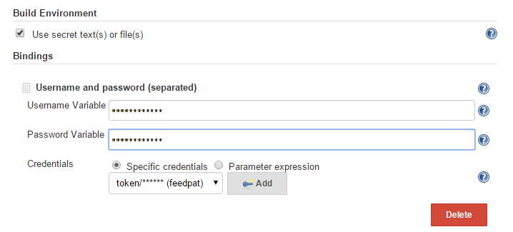
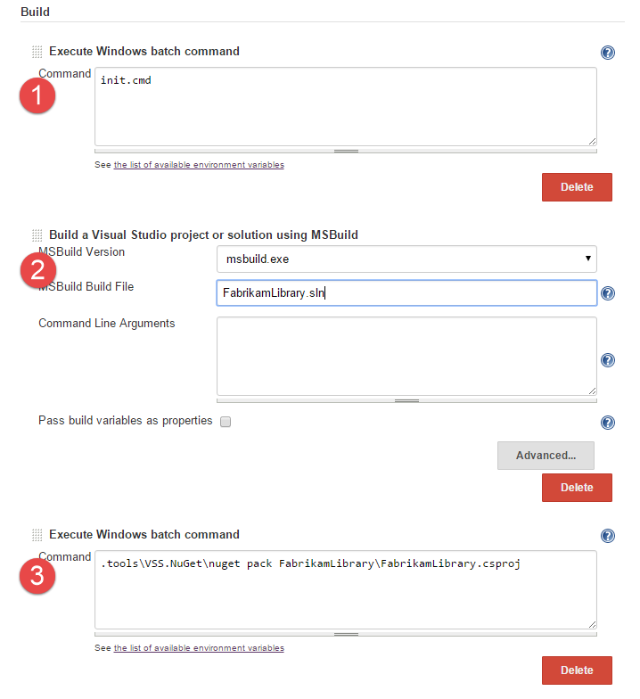

# Publish NuGet packages with Jenkins 

**Azure DevOps Services | TFS 2018 | TFS 2017**

With Azure Artifacts, you can leverage a variety of build and deployment automation tools such as Maven, Gradle, and Jenkins. This article will walk you through creating and publishing NuGet packages using Jenkins.

## Prerequisites

- [Install NuGet CLI](/nuget/tools/nuget-exe-cli-reference).
- [A personal access token](../../organizations/accounts/use-personal-access-tokens-to-authenticate.md) to authenticate your feed.
- [Azure DevOps Services account](https://azure.microsoft.com/services/devops/).
- [Azure Artifacts feed](../get-started-nuget.md).

## Jenkins Setup

This walkthrough uses the latest Jenkins running on Windows 10. Ensure the following Jenkins plugins are enabled:

* [MSBuild](https://plugins.jenkins.io/msbuild/)
* [Git](https://plugins.jenkins.io/git/)
* [Git Client](https://plugins.jenkins.io/git-client/)
* [Credentials Binding plugin](https://plugins.jenkins.io/credentials-binding/)

Some of these plugins are enabled by default, others you will need to install by using the Jenkins's "Manage Plugins" feature.

### The sample project

We will be using a C# class library sample project for this article. 

- In Visual Studio, create a new project, and then select the C# **Class Library** template.

- Name your solution *FabrikamLibrary*.

- Open your solution and then right click on the project and select **Properties**.

- Select **Package** and then fill out the *description*, *product*, and *company* fields.

- Select **Save** when you are done.

- Check the new solution into a Git repository where your Jenkins server can access it later.

:::image type="content" source="media/jenkins-package.png" alt-text="Screenshot showing how to configure the package properties for a class library project.":::

## Add the Azure Artifacts NuGet tools to your repo

The easiest way to use the Azure Artifacts NuGet service is by adding the [Microsoft.VisualStudio.Services.NuGet.Bootstrap package](https://www.nuget.org/packages?q=Microsoft.VisualStudio.Services.NuGet.Bootstrap) to your project.

## Create a package from your project

*Whenever you work from a command line, run `init.cmd` first. This sets up your environment to allow you to work with nuget.exe and the Azure Artifacts NuGet service.*

* Change into the directory containing FabrikamLibrary.csproj.
* Run the command `nuget spec` to create the file FabrikamLibrary.nuspec, which defines how your NuGet package builds.
* Edit FabrikamLibrary.nuspec to remove the boilerplate tags `<licenseUrl>`, `<projectUrl>`, and `<iconUrl>`. Change the tags from `Tag1 Tag2` to `fabrikam`.
* Ensure that you can build the package using the command `nuget pack FabrikamLibrary.csproj`. Note, you should target the .csproj (project) file, not the NuSpec file.
* A file called FabrikamLibrary.1.0.0.0.nupkg will be produced.

## Set up a feed in Azure Artifacts and add it to your project
* [Create a feed](../../artifacts/index.yml) in your Azure DevOps organization called *MyGreatFeed*. Since you're the owner of the feed, you will automatically be able to push packages to it.
* Add the URL for the feed you just generated to the nuget.config in the root of your repo.
  * Find the `<packageSources>` section of nuget.config.
  * Just before `</packageSources>`, add a line using this template: `<add key="MyGreatFeed" value="{feed_url}" />`. Change `{feed_url}` to the URL of your feed.
  * Commit this change to your repo.

* [Generate a PAT (personal access token)](/azure/devops/release-notes/index) for your user account. This PAT will allow the Jenkins job to authenticate to Azure Artifacts as you, so be sure to protect your PAT like a password.
* Save your feed URL and PAT to a text file for use later in the walkthrough.

## Create a build pipeline in Jenkins

* Ensure you have the [correct plugins installed in Jenkins](#setup).
* This will be a Freestyle project. Call it "Fabrikam.Walkthrough".

* Under Source Code Management, set the build to use **Git** and select your Git repo.
* Under Build Environment, select the **Use secret text(s) or file(s)** option.
  * Add a new **Username and password (separated)** binding.
  * Set the **Username Variable** to "FEEDUSER" and the **Password Variable** to "FEEDPASS". These are the environment variables Jenkins will fill in with your credentials when the build runs.
  * Choose the **Add** button to create a new username and password credential in Jenkins.
  * Set the **username** to "token" and the **password** to the PAT you generated earlier. Choose **Add** to save these credentials.

  

* Under Build (see screenshot below), follow these steps:
  * Choose **Execute Windows batch command**. In the **Command** box, type `init.cmd`.
  * Choose **Build a Visual Studio project or solution using MSBuild**. This task should point to msbuild.exe and FabrikamLibrary.sln.
  * Choose **Execute Windows batch command** again, but this time, use this command: `.tools\VSS.NuGet\nuget pack FabrikamLibrary\FabrikamLibrary.csproj`.

* Save this build pipeline and queue a build.
* The build's Workspace will now contain a .nupkg just like the one you built locally earlier.

## Publish a package using Jenkins

These are the last walkthrough steps to publish the package to a feed:
* Edit the build pipeline in Jenkins.
* After the last build task (which runs `nuget pack`), add a new **Execute a Windows batch command** build task.
* In the new **Command** box, add these two lines:
  * The first line puts credentials where NuGet can find them: `.tools\VSS.NuGet\nuget sources update -Name "MyGreatFeed" -UserName "%FEEDUSER%" -Password "%FEEDPASS%"`
  * The second line pushes your package using the credentials saved above: `.tools\VSS.NuGet\nuget push *.nupkg -Name "MyGreatFeed" -ApiKey VSS`

* Queue another build. This time, the build machine will authenticate to Azure Artifacts and push the package to the feed you selected.
