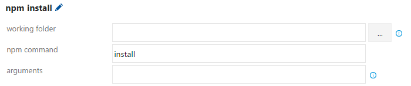

 

# Use Team Build to restore and publish npm packages

**VSTS** | **TFS 2018** | **TFS 2017**

This guide covers the basics of using Team Build to work with npm packages in Package Management feeds.

This walkthrough assumes that you've already:

- [Set up your npmrc files](/vsts/package/npm/npmrc) to point to a Package Management feed
- Created a build
- [Added the correct build service identity](/vsts/package/feeds/common-identities) to your feed

## Install packages at the start of your build

To build a solution that relies on npm packages from Package Management feeds, add the **npm** task. 

First, click **Add build task...**, select the **Package** category, and add the
**npm** task. Then drag to order the task above any build tasks that require 
your packages. 

Next, configure these options:

- **working folder:** Select the folder that contains your `.npmrc`; leave blank if your `.npmrc` is at the root of the repo
- **npm command:** `install`

Finally, save your build.

## Publish a package

To publish an npm package to a Package Management feed, add the **npm** task. 

First, click **Add build task...**, select the **Package** category, and add the
**npm** task. Then drag to order the task above any build tasks that require 
your packages. 

Next, configure these options:

- **working folder:** Select the folder that contains your `.npmrc` and `package.json`; leave blank if those files are at the root of the repo
- **npm command:** `publish`

Finally, save your build.

> [!NOTE]
> Team Build does not support using the `publishConfig` property to specify the `registry` to which you're publishing. Ensure your working folder has a `.npmrc` file with a `registry=` line, as detailed in the Connect to feed screen in your feed.
