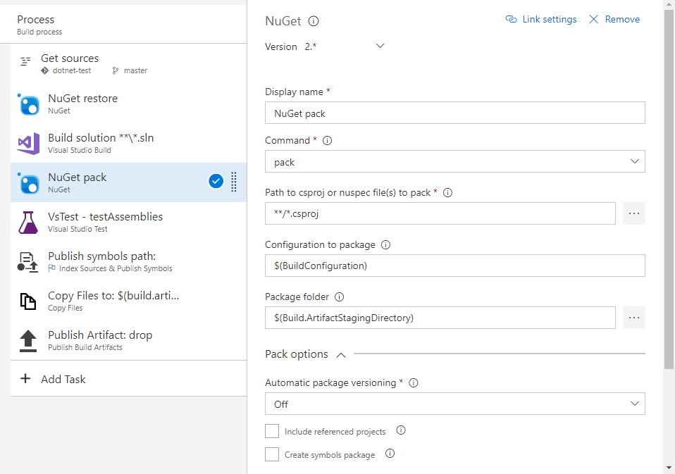
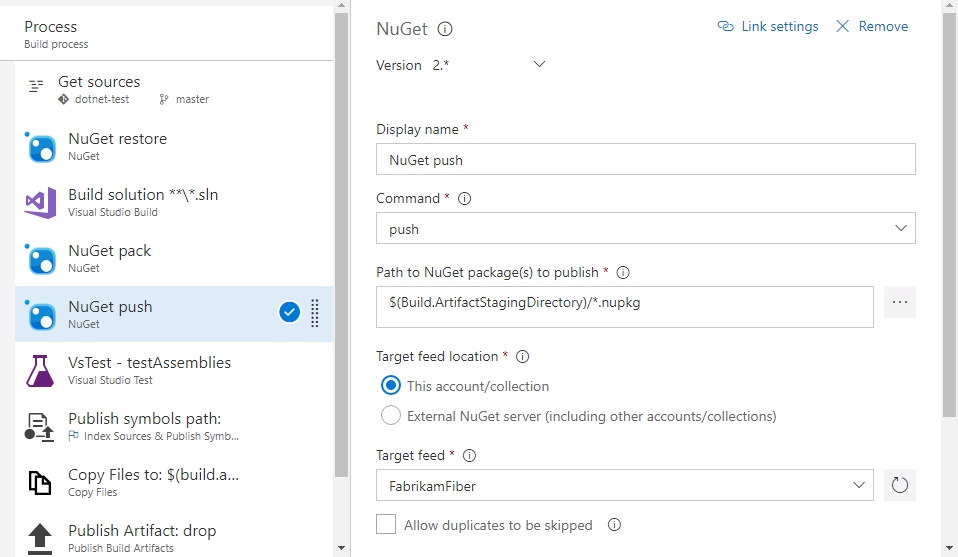

# Publish NuGet packages from Team Build to Package Management

**VSTS | TFS 2018 | TFS 2017**

This walkthrough will cover packing and publishing .NET Framework NuGet packages from Package Management feeds. It assumes that you've already:

- [Created a build](/vsts/pipelines/) for a .NET Framework solution that produces a set of DLLs and/or other content you wish to package and publish
- [Added the correct build service identity](/vsts/package/feeds/common-identities) to your feed

## Creating a NuGet package

There are a variety of ways to create NuGet packages during a build. If you're already using
MSBuild or some other task to create your packages, skip this section and 
[publish those packages](#publish-packages-created-by-your-build). Otherwise, add a **NuGet** task.

First, click **Add build task...**, select the **Package** category, and add the
**NuGet** task. Then drag to order the task below your Visual Studio Build (or similar) task and above any build tasks that require the packages you build.

Next, configure these options:

- **Command:** pack
- **Path to csproj or nuspec file(s) to pack:** The path to the files that describe the package you want to create. If you don't have these, see the [NuGet documentation](/nuget/create-packages/creating-a-package) to get started.
- **Configuration to package:** Leave this as $(BuildConfiguration) unless you wish to always build either Debug or Release packages, or unless you have a custom build configuration.
- **Package folder:** Leave this as $(Build.ArtifactStagingDirectory). If you change this, make a note of the location so you can use it in the [publish task](#publish-packages-created-by-your-build).
- **Pack options > Use Build number to version package:** See the 
[next section](#use-the-build-number-to-version-your-packages)

Finally, save your build.

### Use the build number to version package

Checking the **Use Build number to version package** box requires a change to your build's 
versioning scheme. Work is planned to improve this scenario; right now, it's best to version
packages via other mechanisms (like using the `AssemblyVersionAttribute` from the `csproj`, as
outlined in the [NuGet docs](http://docs.nuget.org/Create/Creating-and-Publishing-a-Package)).

If you choose to use the build number to version your package, you'll need to increment 
the package version for continuous integration builds. This is because specific versions 
of packages in feeds are [immutable](/vsts/package/feeds/immutability) and so cannot be updated or replaced.

To use the build number, check the **Use build number to version package** box and follow the line's instructions (hover over the blue `i` icon) to set the build version format string. You must set the build version format string to have at least three parts separated by periods to avoid an error in NuGet packaging. The default build version format string is `$(date:yyyyMMdd)$(rev:.r)`, so a simple change is to add a zero at the end and a period between the date and build counter: `$(date:yyyyMMdd).$(rev:.r).0`.

Don't forget to save your build.

## Publish packages created by your build

To publish NuGet packages created by your build to Package Management feeds, add the **NuGet** task. This section assumes that a previous task (for example, a **NuGet** task set to the **pack** command) in your build is already producing NuGet packages.

First, click **Add build task...**, select the **Package** category, and add the
**NuGet** task. Then drag to order the task below the build task producing
your NuGet packages.

Next, configure these options:

- **Command:** push
- **Path to NuGet package(s) to publish:** Leave this as $(Build.ArtifactStagingDirectory) unless you elected earlier to pack your packages in another location in the last task.
- **Target feed location:** This account/collection
- **Target feed:** Select the feed you want to publish to

Finally, save your build.

## Publish symbols for your packages
When you push packages to a Package Management feed, you can also [publish symbols](/vsts/pipelines/symbols/index). 
