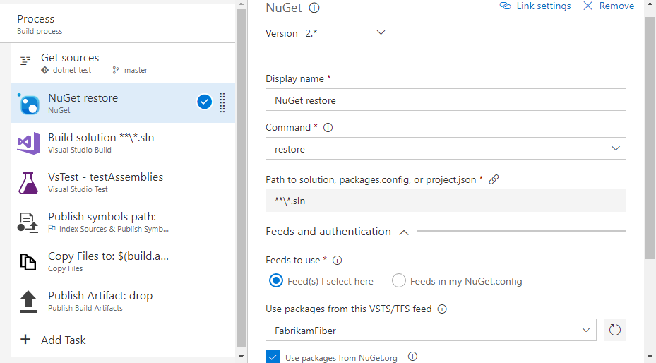
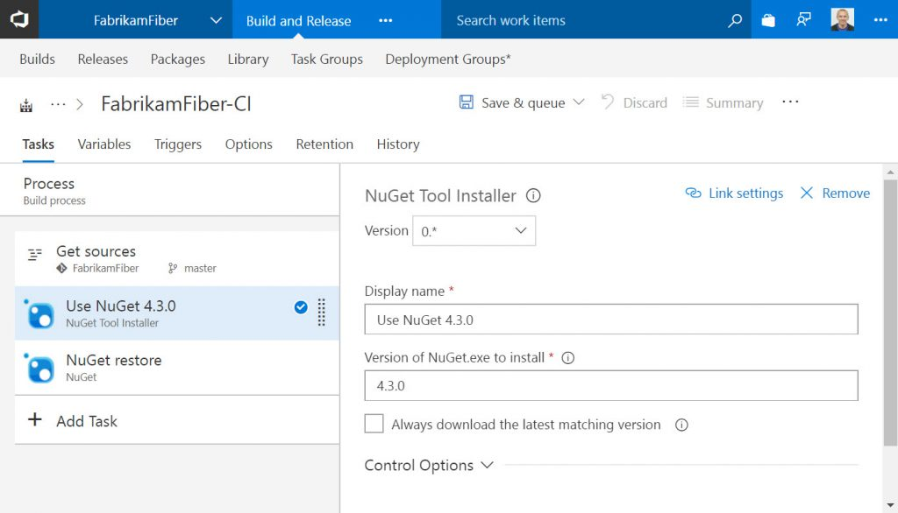

# Restore Package Management NuGet packages in Azure Pipelines

[!INCLUDE [version-tfs-2017-rtm](../_shared/version-tfs-2017-rtm.md)]

::: moniker range="<= tfs-2018"
[!INCLUDE [temp](../_shared/concept-rename-note.md)]
::: moniker-end

This walkthrough will cover setting up an existing build to restore NuGet packages from Package Management feeds. It assumes that you've already:

- [Set up your solution](/azure/devops/artifacts/nuget/consume) to consume packages from a Package Management feed
- [Created a build](/azure/devops/pipelines/) for that solution
- [Added the correct build service identity](/azure/devops/artifacts/feeds/feed-permissions) to your feed

To build a solution that relies on NuGet packages from Package Management feeds, add the **NuGet** task (if one is not already present).

First, click **Add build tasks...**, select the **Package** category, and add the **NuGet** task. Then drag to order the task above any build tasks that require your packages.

Next, configure these options:

- **Command:** restore
- **Path to solution, packages.config, or project.json:** The path to the file that specifies the packages you want to restore

Then, select feeds to use:

- If you've checked in a [NuGet.config](http://docs.nuget.org/Consume/NuGet-Config-File), select **Feeds in my NuGet.config** and select the file from your repo.
- If you're using a single Azure Artifacts/TFS feed, select the **Feed(s) I select here** option and select your feed from the dropdown.



Finally, save your build.

## Specifying sources in NuGet.config

The NuGet.config you check in should list all the package sources you want to consume.
The example below demonstrates how that might look.

```xml
<?xml version="1.0" encoding="utf-8"?>
<configuration>
  <packageSources>
    <!-- remove any machine-wide sources with <clear/> -->
    <clear />
    <!-- add an Azure Artifacts feed -->
    <add key="MyGreatFeed" value="https://fabrikam.pkgs.visualstudio.com/DefaultCollection/_packaging/MyGreatFeed/nuget/v3/index.json" />
    <!-- also get packages from the NuGet Gallery -->
    <add key="nuget.org" value="https://www.nuget.org/api/v2/" />
  </packageSources>
  <activePackageSource>
    <add key="All" value="(Aggregate source)" />
  </activePackageSource>
</configuration>
```

## Restoring packages from feeds in a different organization

If your NuGet.config contains feeds in a different Azure DevOps organization (dev.azure.com/*organization*) than the organization running the build, you'll need to set up credentials for those feeds manually.

1. Select a login account (either a service account (recommended) or a user's account) that has access to the remote feed
2. Using your browser's InPrivate mode, Incognito mode, or similar, go to the Azure DevOps organization that contains the feed, sign in with the login account you selected in step 1, click the user profile circle in the top right, and select Security
3. Create a PAT with the **Packaging (read)** scope and keep it handy
4. In the Azure DevOps organization that contains the build, edit the build's NuGet step and ensure you're using version 2 or greater of the task, using the version selector
5. In the **Feeds and authentication** section, Ensure you've selected the **Feeds in my NuGet.config** radio button
6. Set the path to your NuGet.config in the **Path to NuGet.config**
7. In **Credentials for feeds outside this organization/collection**, click the **+**
8. In the service connection dialog that appears, enter the feed URL (make sure it matches what's in your NuGet.config) and the PAT you created in step 3
9. Save the service connection and the build, then queue a new build

## Q & A

### Why can't my build restore packages?

NuGet restore can fail due to a variety of issues. One of the most common issues is the introduction of a new project in your solution that requires a [target framework](/nuget/schema/target-frameworks) that isn't understood by the version of NuGet your build is using. This issue generally doesn't present itself on a developer machine because Visual Studio updates the NuGet restore mechanism at the same time it adds new project types. We're looking into similar features for Azure Artifacts. In the meantime though, the first thing to try when you can't restore packages is to update to the latest version of NuGet.

### How do I use the latest version of NuGet?

::: moniker range=">= tfs-2018" 

If you're using Azure Pipelines or TFS 2018, new template-based builds will work automatically thanks to a new "NuGet Tool Installer" task that's been added to the beginning of all build templates that use the NuGet task. We periodically update the default version that's selected for new builds around the same time we install Visual Studio updates on the Hosted build agents.

For existing builds, just add or update a NuGet Tool Installer task to select the version of NuGet for all the subsequent tasks. You can see all available versions of NuGet [on nuget.org](https://dist.nuget.org/tools.json).



::: moniker-end 

::: moniker range="tfs-2017" 

#### TFS 2017 and earlier

Because the NuGet Tool Installer is not available in TFS versions prior to TFS 2018, there is a recommended workaround to use versions of NuGet > 4.0.0 in Azure Pipelines.

1. Add the task, if you haven't already. If you have a "NuGet Restore" task in the catalog (it may be in the Deprecated tasks section), insert it into your build. Otherwise, insert a "NuGet" task.
1. For your NuGet/NuGet Installer task, use the version selector under the task name to select version "0.*".
1. In the Advanced section, set the NuGet Version to "Custom" and the Path to NuGet.exe as
$(Build.BinariesDirectory)\nuget.exe
1. Before your NuGet task, add a "PowerShell" task, select "Inline Script" as the Type, enter this PowerShell script as the Inline Script, and enter "4.3.0" (or any version of NuGet from this list) as the Arguments.

Our thanks to [GitHub user leftler](https://github.com/Microsoft/azure-pipelines-tasks/issues/3756#issuecomment-288185011) for creating the original version of the PowerShell script linked above.

::: moniker-end 
