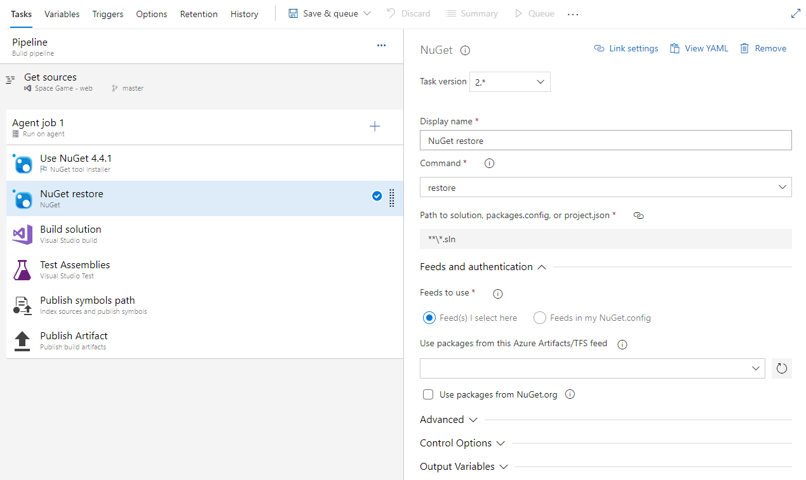
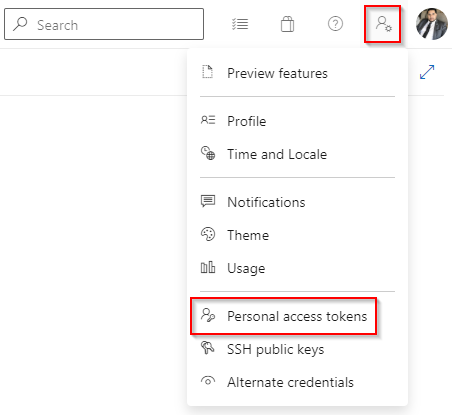
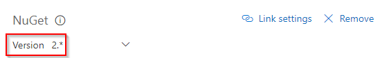
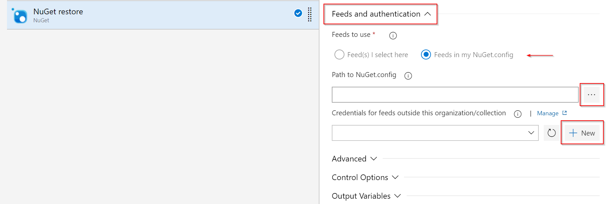
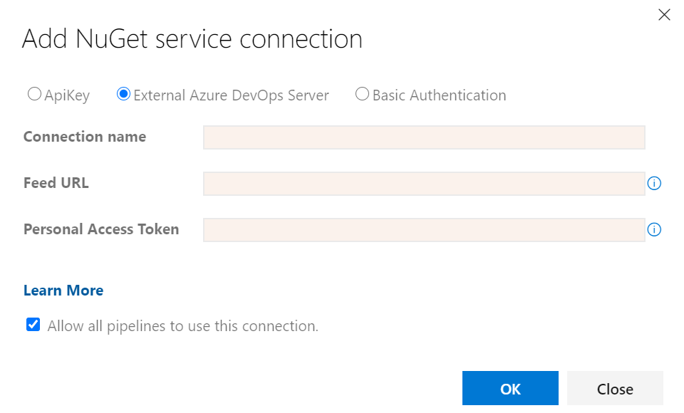

# Restore NuGet packages in Azure Pipelines

[!INCLUDE [version-tfs-2017-rtm](../includes/version-tfs-2017-rtm.md)]

::: moniker range="<= tfs-2018"
[!INCLUDE [temp](../includes/concept-rename-note.md)]
::: moniker-end

NuGet package restore allows you to have all your project's dependencies available without having to store them in source control. This allows for a cleaner development environment and smaller repository size. You can restore your NuGet packages using the NuGet restore build task, the NuGet CLI, or the .NET Core CLI. This article will show you how to restore your NuGet packages using both YAML and the classic Azure Pipelines. 

### Prerequisites

- [Set up your solution](../../artifacts/nuget/consume.md) to consume packages from Azure Artifacts feed.
- [Created your first pipeline](../create-first-pipeline.md) for your repository.
- [Set up pipeline permissions](../../artifacts/feeds/feed-permissions.md#pipelines-permissions) for your feed.

## Restore packages with NuGet restore build task

To build a solution that relies on NuGet packages from Azure Artifacts feeds, we will want to add the **NuGet** build task to our pipeline.

1. Navigate to your build pipeline and select **Edit**.
2. Under **Tasks**, **Agent job**, select the plus sign **"+"** to add a new task. Search for **NuGet** task and add it to your agent job.
3. Fill out the following information:
- **Display name:** NuGet restore.
- **Command:** restore.
- **Path to solution, packages.config, or project.json:** The path to the solution, packages.config, or project.json file that references the packages to be restored.
4. If you've checked in a [NuGet.config](https://docs.nuget.org/Consume/NuGet-Config-File), select **Feeds in my NuGet.config** and specify the file from your repository. If you're using a single Azure Artifacts feed, select the **Feed(s) I select here** option and select your feed from the dropdown.
5. Check the **Use packages from NuGet.org** option if you want to include NuGet.org in the generated NuGet.config.
6. Select **Save & queue** .

> [!div class="mx-imgBorder"]
> 

## Restore your NuGet packages with the NuGet CLI

In order for your project to be set up properly, your `nuget.config` must be in the same folder as your `.csproj` or `.sln`file.
The `nuGet.config` file you check-in also should list all the package sources you want to consume. The example below demonstrates how that might look.

```xml
<?xml version="1.0" encoding="utf-8"?>
<configuration>
  <packageSources>
    <!-- remove any machine-wide sources with <clear/> -->
    <clear />
    <!-- add an Azure Artifacts feed -->
    <add key="FabrikamFiber" value="https://pkgs.dev.azure.com/microsoftLearnModule/_packaging/FabrikamFiber/nuget/v3/index.json" />
    <!-- also get packages from the NuGet Gallery -->
    <add key="nuget.org" value="https://api.nuget.org/v3/index.json" protocolVersion="3" />
  </packageSources>
</configuration>
```

To restore your NuGet packages run the following command in your project directory:

```cmd
nuget.exe restore
```

## Restore NuGet packages with the .NET Core CLI task

To restore your package using YAML and the [.NET Core CLI task](../tasks/build/dotnet-core-cli.md), use the following example:

```YAML
- task: DotNetCoreCLI@2
  displayName: dotnet restore
  inputs:
    command: restore
    projects: '**/*.csproj'
    feedsToUse: 'select'
    vstsFeed: '<projectName>/<feedName>'
    includeNuGetOrg: true
```

* `command`: The dotnet command to run. Options: `build`, `push`, `pack`, `restore`, `run`, `test`, and `custom`.
* `projects`: The path to the csproj file(s) to use. You can use wildcards (e.g. **/*.csproj for all .csproj files in all subfolders).
* `feedsToUse`: You can either choose to select a feed or commit a NuGet.config file to your source code repository and set its path using `nugetConfigPath`. Options: `select`, `config`.
* `vstsFeed`: This argument is required when `feedsToUse` == `Select`. Value format: `<projectName>/<feedName>`.
* `includeNuGetOrg`: Use packages from NuGet.org.

## Restore NuGet packages from feeds in a different organization

If your NuGet.config contains feeds in a different Azure DevOps organization than the one running the build, you'll need to set up credentials for those feeds manually.
 
1. Select an account (either a service account (recommended) or a user account) that has access to the remote feed.
2. In your browser, open a Private mode, Incognito mode, or a similar mode window and navigate to the Azure DevOps organization that hosts the feed. Sign in with the credentials mentioned in step 1, select **User settings** then **Personal Access Tokens**.

    > [!div class="mx-imgBorder"]
    > 

3. Create your PAT with the **Packaging (read)** scope and keep it handy.
4. In the Azure DevOps organization that contains the build, edit the build's NuGet step and ensure you're using version 2 or greater of the task, using the version selector.

    > [!div class="mx-imgBorder"]
    > 

5. In the **Feeds and authentication** section, Ensure you've selected the **Feeds in my NuGet.config** radio button.
6. Set the path to your NuGet.config in the **Path to NuGet.config**.
7. In **Credentials for feeds outside this organization/collection**, select the **+ New**.

    > [!div class="mx-imgBorder"]
    > 

8. In the service connection dialog that appears, select the **External Azure DevOps Server** option and enter a connection name, the feed URL (make sure it matches what's in your NuGet.config) and the PAT you created in step 3.

    > [!div class="mx-imgBorder"]
    > 

9. Save & queue a new build.

## FAQ

### Why can't my build restore NuGet packages?

NuGet restore can fail due to a variety of issues. One of the most common issues is the introduction of a new project in your solution that requires a [target framework](/nuget/schema/target-frameworks) that isn't understood by the version of NuGet your build is using. This issue generally doesn't present itself on a developer machine because Visual Studio updates the NuGet restore mechanism at the same time it adds new project types. We're looking into similar features for Azure Artifacts. In the meantime though, the first thing to try when you can't restore packages is to update to the latest version of NuGet.

### How do I use the latest version of NuGet?

::: moniker range=">= tfs-2018" 

If you're using Azure Pipelines or TFS 2018, new template-based builds will work automatically thanks to a new "NuGet Tool Installer" task that's been added to the beginning of all build templates that use the NuGet task. We periodically update the default version that's selected for new builds around the same time we install Visual Studio updates on the Hosted build agents.

For existing builds, just add or update a NuGet Tool Installer task to select the version of NuGet for all the subsequent tasks. You can see all available versions of NuGet [on nuget.org](https://dist.nuget.org/tools.json).

> [!div class="mx-imgBorder"]
> 

::: moniker-end 

::: moniker range="<=tfs-2017" 

#### TFS 2017 and earlier

Because the NuGet Tool Installer is not available in TFS versions prior to TFS 2018, there is a recommended workaround to use versions of NuGet > 4.0.0 in Azure Pipelines.

1. Add the task, if you haven't already. If you have a "NuGet Restore" task in the catalog (it may be in the Deprecated tasks section), insert it into your build. Otherwise, insert a "NuGet" task.
1. For your NuGet/NuGet Installer task, use the version selector under the task name to select version "0.*".
1. In the Advanced section, set the NuGet Version to "Custom" and the Path to NuGet.exe as
$(Build.BinariesDirectory)\nuget.exe
1. Before your NuGet task, add a "PowerShell" task, select "Inline Script" as the Type, enter this PowerShell script as the Inline Script, and enter "4.3.0" (or any version of NuGet from this list) as the Arguments.

Our thanks to [GitHub user leftler](https://github.com/Microsoft/azure-pipelines-tasks/issues/3756#issuecomment-288185011) for creating the original version of the PowerShell script linked above.

::: moniker-end 

## Related articles

- [Publish to NuGet feeds (YAML/Classic)](../artifacts/nuget.md)
- [Publish and consume build artifacts](../artifacts/build-artifacts.md)
- [How to mitigate risk when using private package feeds](https://azure.microsoft.com/resources/3-ways-to-mitigate-risk-using-private-package-feeds/)
