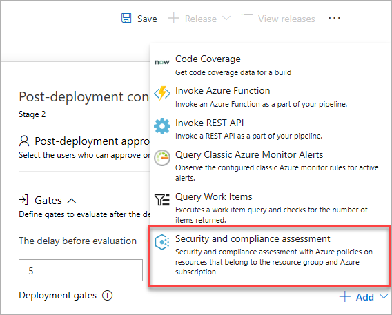
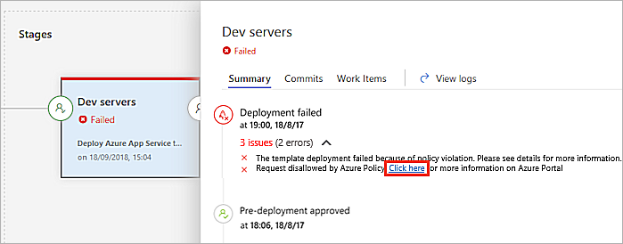
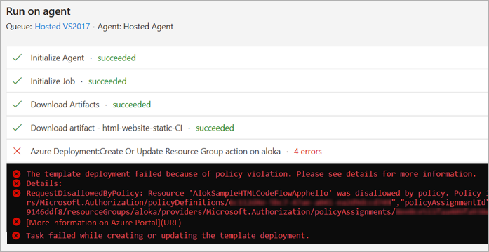
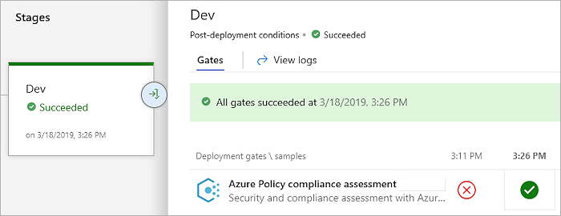
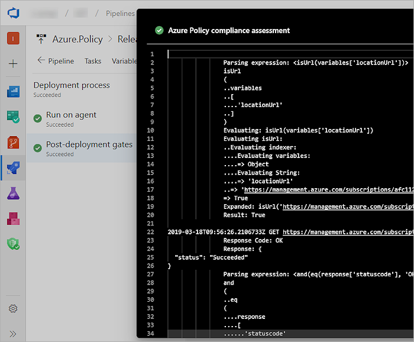

# Check policy compliance with gates

[!INCLUDE [version-team-services](../_shared/version-team-services.md)]

Azure Policy helps you manage and prevent IT issues by using policy definitions
that enforce rules and effects for your resources. When you use Azure Policy,
resources stay compliant with your corporate standards and service level agreements.
Policies can be applied to an entire subscription, a management group, or a resource group. 

This tutorial guides you in enforcing compliance policies on your resources before and after deployment during the release process through Azure Pipelines.

For more information, see [What is Azure Policy?](https://docs.microsoft.com/azure/governance/policy/overview)
and [Create and manage policies to enforce compliance](https://docs.microsoft.com/azure/governance/policy/tutorials/create-and-manage).

## Prepare

1. Create an [Azure Policy](https://docs.microsoft.com/azure/governance/policy/tutorials/create-and-manage) in the Azure portal.
   There are several [pre-defined sample policies](https://docs.microsoft.com/en-gb/azure/governance/policy/samples/)
   that can be applied to a management group, subscription, and resource group.

1. In Azure DevOps create a release pipeline that contains at least one stage, or open an existing release pipeline.

1. Add a pre- or post-deployment condition that includes the **Security and compliance assessment** task as a gate.
   [More details](../release/deploy-using-approvals.md#configure-a-gate).

   

## Validate for any violation(s) during a release

1. Navigate to your team project in Azure DevOps.

1. In the **Pipelines** section, open the **Releases** page and create a new release.

1. Choose the **In progress** link in the release view to open the live logs page.

1. When the release is in progress and attempts to perform an action disallowed by
   the defined policy, the deployment is marked as **Failed**. The error message contains a link to view the policy violations.

   

1. An error message is written to the logs and displayed in the stage status panel in the releases page of Azure Pipelines.

   

1. When the policy compliance gate passes the release, a **Succeeded** status is displayed.

   

1. Choose the successful deployment to view the detailed logs.

   

<!--
## View assigned Azure policies

The **Policy Violations** tab in the **Releases** page of Azure Pipelines
lists the assigned policy violations. Each one links to the matching
policy definition in the Azure portal. From here you can view more information
about the policy and its conditions.

-->

[!INCLUDE [rm-help-support-shared](../_shared/rm-help-support-shared.md)]
