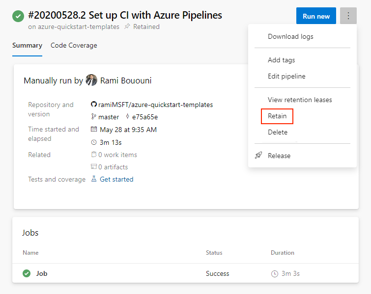

# Set retention policies for builds, releases, and tests

[!INCLUDE [version-lt-eq-azure-devops](../../includes/version-lt-eq-azure-devops.md)]


Retention policies let you set how long to keep runs, releases, and tests stored in the system. To save storage space, you want to delete older runs, tests, and releases.   

The following retention policies are available in Azure DevOps in your **Project settings**:

1. **Pipeline** - Set how long to keep artifacts, symbols, attachments, runs, and pull request runs. 
2. **Release (classic)** - Set whether to save builds and view the default and maximum retention settings.
3. **Test** - Set how long to keep automated and manual test runs, results, and attachments. 
 
> [!div class="mx-imgBorder"]
> 

> [!NOTE]
> If you are using an on-premises server, you can also specify retention policy defaults for a project and when releases are permanently destroyed. Learn more about [release retention](#release) later in this article.

## Prerequisites 

By default, members of the Contributors, Build Admins, Project Admins, and Release Admins groups can manage retention policies. 

To manage retention policies, you must have one of the following subscriptions:
- [Enterprise](https://visualstudio.microsoft.com/vs/enterprise/)
- [Test Professional](https://visualstudio.microsoft.com/vs/test-professional/)
- [MSDN Platforms](https://visualstudio.microsoft.com/msdn-platforms/)

You can also buy monthly access to Azure Test Plans and assign the [Basic + Test Plans](https://marketplace.visualstudio.com/items?itemName=ms.vss-testmanager-web) access level. See [Testing access by user role](../../test/manual-test-permissions.md#access-by-user-role).

::: moniker range="azure-devops-2019"

## Configure retention policies

1. Sign in to your project. 

2. Go to the  **Settings** tab of your project's settings.

3. Select **Release retention** under **Pipelines** or **Retention** under **Test**.
    * Select **Release retention** to set up your release retention policies and configure when to delete or permanently destroy releases.
    * Select **Retention** to set up how long to keep manual and automated test runs.     

    :::image type="content" source="media/devops-2019-retention-menu.png" alt-text="Screenshot of retention settings in Project settings for DevOps 2019.":::

::: moniker-end

::: moniker range="> azure-devops-2019"

## Configure retention policies

1. Sign in to your project. 

2. Go to the  **Settings** tab of your project's settings.

3. Select **Settings** or **Release retention** under **Pipelines** or **Retention** under **Test**.
    * Select **Settings** to configure retention policies for runs, artifacts, symbols, attachments, and pull request runs. 
    * Select **Release retention** to set up your release retention policies and configure when to delete or permanently destroy releases.
    * Select **Retention** to set up how long to keep manual and automated test runs.     

    :::image type="content" source="media/retention-menu.png" alt-text="Screenshot of retention settings in Project settings.":::
::: moniker-end

::: moniker range="azure-devops-2022"

> [!IMPORTANT]
> Azure Pipelines no longer supports per-pipeline retention policies. We recommend using project-level retention rules.

::: moniker-end

## Set run retention policies

In most cases, you don't need to retain completed runs longer than a certain number of days. 
Using retention policies, you can control **how many days** you want to keep each run before deleting it. 


::: moniker range=">= azure-devops-2020"

1. Go to the  **Settings** tab of your project's settings.

2. Select **Settings** in the Pipelines section.
    * Set the number of days to keep [artifacts](../artifacts/artifacts-overview.md), symbols, and attachments.
    * Set the number of days to keep [runs](../process/runs.md)
    * Set the number of days to keep pull request [runs](../process/runs.md)
    * Set the number of recent [runs](../process/runs.md) to keep for each pipeline

::: moniker-end

::: moniker range="azure-devops"

> [!WARNING]
> Azure DevOps no longer supports per-pipeline retention rules. 
> The only way to configure retention policies for YAML and classic pipelines is through the project settings described above. You can no longer configure per-pipeline retention policies. 
>
::: moniker-end

::: moniker range=">= azure-devops-2019"

The setting for number of recent runs to keep for each pipeline requires a little more explanation. The interpretation of this setting varies based on the type of repository you build in your pipeline.

- **Azure Repos:** Azure Pipelines retains the configured number of latest runs for the [pipeline's default branch](../process/pipeline-default-branch.md) and for each protected branch of the repository. A branch that has any branch policies configured is considered to be a protected branch. 
 
    As an example, consider a repository with two branches, `main` and `release`. Imagine the `pipeline's default branch` is the `main` branch, and the `release` branch has a branch policy, making it a protected branch. In this case, if you configured the policy to retain three runs, then both the latest three runs of `main` and the latest three runs of the `release` branch are retained. In addition, the latest three runs of this pipeline (irrespective of the branch) are also retained. 

    To clarify this logic further, let us say the list of runs for this pipeline is as follows, with the most recent run at the top. The table shows which runs will be retained if you have configured to retain the latest three runs (ignoring the effect of the number of days setting):

    | Run # | Branch | Retained / Not retained | Why? |
    |-------|--------|-------------------------|------|
    | Run 10 | main    | Retained | Latest 3 for main and Latest 3 for pipeline |
    | Run 9  | branch1 | Retained | Latest 3 for pipeline |
    | Run 8  | branch2 | Retained | Latest 3 for pipeline |
    | Run 7  | main    | Retained | Latest 3 for main |
    | Run 6  | main    | Retained | Latest 3 for main |
    | Run 5  | main    | Not retained | Neither latest 3 for main, nor for pipeline |
    | Run 4  | main    | Not retained | Neither latest 3 for main, nor for pipeline |
    | Run 3  | branch1 | Not retained | Neither latest 3 for main, nor for pipeline |
    | Run 2  | release | Retained | Latest 3 for release |
    | Run 1  | main    | Not retained | Neither latest 3 for main, nor for pipeline |

- **All other Git repositories:** Azure Pipelines retains the configured number of latest runs for the whole pipeline.

- **TFVC:** Azure Pipelines retains the configured number of latest runs for the whole pipeline, irrespective of the branch.

::: moniker-end

### What parts of the run get deleted


::: moniker range="<=azure-devops"

The following information is deleted when a run is deleted:

* Logs
* All pipeline and build artifacts 
* All symbols
* Binaries
* Test results
* Run metadata
* Source labels (TFVC) or tags (Git)

Universal packages, NuGet, npm, and other packages are not tied to pipelines retention. 

::: moniker-end

### When are runs deleted

::: moniker range="<=azure-devops"

Your retention policies are processed once a day. The time that the policies get processed variables because we spread the work throughout the day for load-balancing purposes. There is no option to change this process.

A run is deleted if all of the following conditions are true:

- It exceeds the number of days configured in the retention settings
- It is not one of the recent runs as configured in the retention settings
- It is not marked to be retained indefinitely
- It is not retained by a release

::: moniker-end


::: moniker range="azure-devops"

### Automatically set retention lease on pipeline runs

Retention leases are used to manage the lifetime of pipeline runs beyond the configured retention periods. Retention leases can be added or deleted on a pipeline run by calling the [Lease API](/rest/api/azure/devops/build/leases). This API can be invoked within the pipeline using a script and using [predefined variables](../build/variables.md) for runId and definitionId.

A retention lease can be added on a pipeline run for a specific period. For example, a pipeline run which deploys to a test environment can be retained for a shorter duration while a run deploying to production environment can be retained longer.

### Manually set retention lease on pipeline runs

You can manually set a pipeline run to be retained using the [More actions menu](../create-first-pipeline.md#pipeline-run-more-actions-menu) on the [Pipeline run details](../create-first-pipeline.md#view-pipeline-run-details) page.



::: moniker-end

::: moniker range=">=azure-devops-2020"

## Delete a run

You can delete runs using the [More actions menu](../create-first-pipeline.md#pipeline-run-more-actions-menu) on the [Pipeline run details](../create-first-pipeline.md#view-pipeline-run-details) page.

> [!NOTE]
> If any retention policies currently apply to the run, they must be removed before the run can be deleted. For instructions, see [Pipeline run details - delete a run](../create-first-pipeline.md#pipeline-run-more-actions-menu).

> The data deletion rate currently experiences delays ranging from 1 to 500 days, depending on the number of test points associated with the host. This processing delay requires improvement, and the Product team is actively working on enhancing the design to address this issue. 

  > [!div class="mx-imgBorder"]
  > 

::: moniker-end

<a id="release"></a>

## Set release retention policies

The release retention policies for a classic release pipeline determine how long a release and the run linked to it are retained. Using these policies, you can control **how many days** you want to keep each release after it has been last modified or deployed and the **minimum number of releases** that should be retained for each pipeline.

The retention timer on a release is reset every time a release is modified or deployed to a stage. The minimum number of releases to retain setting takes precedence over the number of days. For example, if you specify to retain a minimum of three releases, the most recent three will be retained indefinitely - irrespective of the number of days specified. However, you can manually delete these releases when you no longer require them. See FAQ below for more details about how release retention works.

As an author of a release pipeline, you can customize retention policies for releases of your pipeline on the **Retention** tab.

::: moniker range=">=azure-devops-2020"

The retention policy for YAML and build pipelines is the same. You can see your pipeline's retention settings in **Project Settings** for **Pipelines** in the **Settings** section.

::: moniker-end


### Global release retention policy

If you are using an on-premises Team Foundation Server or Azure DevOps Server, you can specify release retention policy defaults and maximums for a project. You can also specify when releases are permanently destroyed (removed from the **Deleted** tab in the build explorer).

:::image type="content" source="media/on-premises-release-retention.png" alt-text="On premises release retention settings":::

If you are using Azure DevOps Services, you can view but not change these settings for your project.

Global release retention policy settings can be reviewed from the **Release retention** settings of your project:

* Azure DevOps Services: `https://dev.azure.com/{organization}/{project}/_settings/release?app=ms.vss-build-web.build-release-hub-group`
* On-premises: `https://{your_server}/tfs/{collection_name}/{project}/_admin/_apps/hub/ms.vss-releaseManagement-web.release-project-admin-hub`

The **maximum retention policy** sets the upper limit for how long releases can be retained for all release pipelines. Authors of release pipelines cannot
configure settings for their definitions beyond the values specified here.

The **default retention policy** sets the default retention values for all the release pipelines. Authors of build pipelines can override these values.

The **destruction policy** helps you keep the releases for a certain period of time after they are deleted. This policy cannot be overridden in individual release pipelines.


::: moniker range="<= azure-devops-2020"

## Set collection-level retention policies

For on-premises servers, you can also set the collection-level retention policies with custom retention rules. These retention policies apply to Classic build pipelines. The page at `https://{your_server}/{collection_name}/_settings/buildqueue` governs your maximum values and default values. 

:::image type="content" source="media/retention-settings-server.png" alt-text="A screenshot showing how to configure collection level retention policies.":::

::: moniker-end


::: moniker range=">=azure-devops-2020"


## Use the Copy Files task to save data longer

You can use the [Copy Files task](/azure/devops/pipelines/tasks/reference/copy-files-v2) to save your build and artifact data for longer than what is set in the retention policies. The **Copy Files task** is preferable to the [Publish Build Artifacts task](/azure/devops/pipelines/tasks/reference/publish-build-artifacts-v1) because data saved with the **Publish Build Artifacts task** will get periodically cleaned up and deleted. 

# [YAML](#tab/yaml)

```yaml
- task: CopyFiles@2
  displayName: 'Copy Files to: \\mypath\storage\$(Build.BuildNumber)'
  inputs:
    SourceFolder: '$(Build.SourcesDirectory)'
    Contents: '_buildOutput/**'
    TargetFolder: '\\mypath\storage\$(Build.BuildNumber)'
```

# [Classic](#tab/classic)

1. Add the **Copy Files task** to your Pipeline.  

  > [!div class="mx-imgBorder"]
  > 

2. Configure the **Copy Files task**. 

  > [!div class="mx-imgBorder"]
  > 

* * *

::: moniker-end


## FAQ

### If I mark a run or a release to be retained indefinitely, does the retention policy still apply?

No. Neither the pipeline's retention policy nor the maximum limits set by the administrator are applied when you mark an individual run or release to be retained indefinitely. It will remain until you stop retaining it indefinitely.

### How do I specify that runs deployed to production will be retained longer?

If you use classic releases to deploy to production, then customize the retention policy on the release pipeline. Specify the number of days that releases deployed to production must be retained. In addition, indicate that runs associated with that release are to be retained. This will override the run retention policy.

If you use multi-stage YAML pipelines to deploy to production, the only retention policy you can configure is in the project settings. You cannot customize retention based on the environment to which the build is deployed.

### I did not mark runs to be retained indefinitely. However, I see a large number of runs being retained. How can I prevent this?

This could be for one of the following reasons:

- The runs are marked by someone in your project to be retained indefinitely.
- The runs are consumed by a release, and the release holds a retention lock on these runs. Customize the release retention policy as explained above.

If you believe that the runs are no longer needed or if the releases have already been deleted, then you can manually delete the runs.

### How does 'minimum releases to keep' setting work?

Minimum releases to keep are defined at stage level. It denotes that Azure DevOps will always retain the given number of last deployed releases for a stage even if the releases are out of retention period. A release will be considered under minimum releases to keep for a stage only when the deployment started on that stage. Both successful and failed deployments are considered. Releases pending approval are not considered.

### How is retention period decided when release is deployed to multiple stages having different retention period?

Final retention period is decided by considering days to retain settings of all the stages on which release is deployed and taking max days to keep among them. **Minimum releases to keep** is governed at stage level and do not change based on release deployed to multiple stages or not. Retain associated artifacts will be applicable when release is deployed to a stage for which it is set true.

### I deleted a stage for which I have some old releases. What retention will be considered for this case?

As the stage is deleted, so the stage level retention settings are not applicable now. Azure DevOps will fall back to project level default retention for such case.

### My organization requires us to retain builds and releases longer than what is allowed in the settings. How can I request a longer retention?

The only way to retain a run or a release longer than what is allowed through retention settings is to manually mark it to be retained indefinitely. There is no way to configure a longer retention setting manually. Please reach out to [Azure DevOps Support](https://developercommunity.visualstudio.com/spaces/21/index.html) for assistance. 

You can also explore the possibility of using the REST APIs in order to download information and artifacts about the runs and upload them to your own storage or artifact repository.

### I lost some runs. Is there a way to get them back?

If you believe that you have lost runs due to a bug in the service, create a support ticket immediately to recover the lost information. If a build definition was manually deleted more than a week earlier, it will not be possible to recover it. If the runs were deleted as expected due to a retention policy, it will not be possible to recover the lost runs. 


### How do I use the `Build.Cleanup` capability of agents?

Setting a `Build.Cleanup` capability on agents will cause the pool's cleanup jobs to be directed to just those agents, leaving the rest free to do regular work. When a pipeline run is deleted, artifacts stored outside of Azure DevOps are cleaned up through a job run on the agents. When the agent pool gets saturated with cleanup jobs, this can cause a problem. The solution to that is to designate a subset of agents in the pool that are the cleanup agents. If any agents have `Build.Cleanup` set, only those agents will run the cleanup jobs, leaving the rest of the agents free to continue running pipeline jobs. The Cleanup functionality can be enabled by navigating to  **Agent** > **Capabilities** and setting `Build.Cleanup` equal to `1`.

### What happens to file share Artifacts when the build is deleted 

When a build with file share Artifacts is deleted, a new build task is queued on a build agent to clean up those files. An agent is picked to perform this task based on the following criteria:
Is there an agent with `Build.Cleanup` capability available?
Is the agent that ran the build available?
Is an agent from the same pool available?
Is an agent from a similar pool available?
Is any agent available?

### Are automated test results that are published as part of a release retained until the release is deleted?

Test results published within a stage of a release are retained as specified by the retention policy configured for the test results. The test results do not get retained until the release is retained. If you need the test results as long as the release, set the retention settings for automated test runs in the Project settings accordingly to Never delete. This makes sure the test results are deleted only when the release is deleted.

### Are manual test results deleted?

No. Manual test results are not deleted. 

::: moniker range=">= azure-devops-2019"

### How do I preserve my version control labels or tags? 

> [!CAUTION]
> Any version control labels or tags that are applied during a build pipeline that arent automatically created from the Sources task will be preserved, even if the build is deleted. 
> However, any version control labels or tags that are automatically created from the Sources task during a build are considered part of the build artifacts and will be deleted when the build is deleted. 

If version control labels or tags need to be preserved, even when the build is deleted, they will need to be either applied as part of a task in the pipeline, manually labeled outside of the pipeline, or the build will need to be retained indefinitely.

::: moniker-end

::: moniker range="= azure-devops"

### What happens to pipelines that are consumed in other pipelines?

Classic releases retain pipelines that they consume automatically.

::: moniker-end

::: moniker range="= azure-devops-2022"

### What happens to pipelines that are consumed in other pipelines?

Classic releases retain pipelines that they consume automatically. If you are using YAML, you can also create a multi-stage YAML pipeline to represent your release and consume another YAML pipeline in it as a [resource](../process/resources.md#define-a-pipelines-resource). The resource pipeline will be retained automatically as long as the release pipeline is retained.

::: moniker-end

## Related articles

- [Control how long to keep test results](../../test/how-long-to-keep-test-results.md)
- [Delete test artifacts](../../boards/backlogs/delete-test-artifacts.md)
- [Using Tasks to Retain Runs in Azure Pipelines](../../pipelines/build/run-retention.md)
