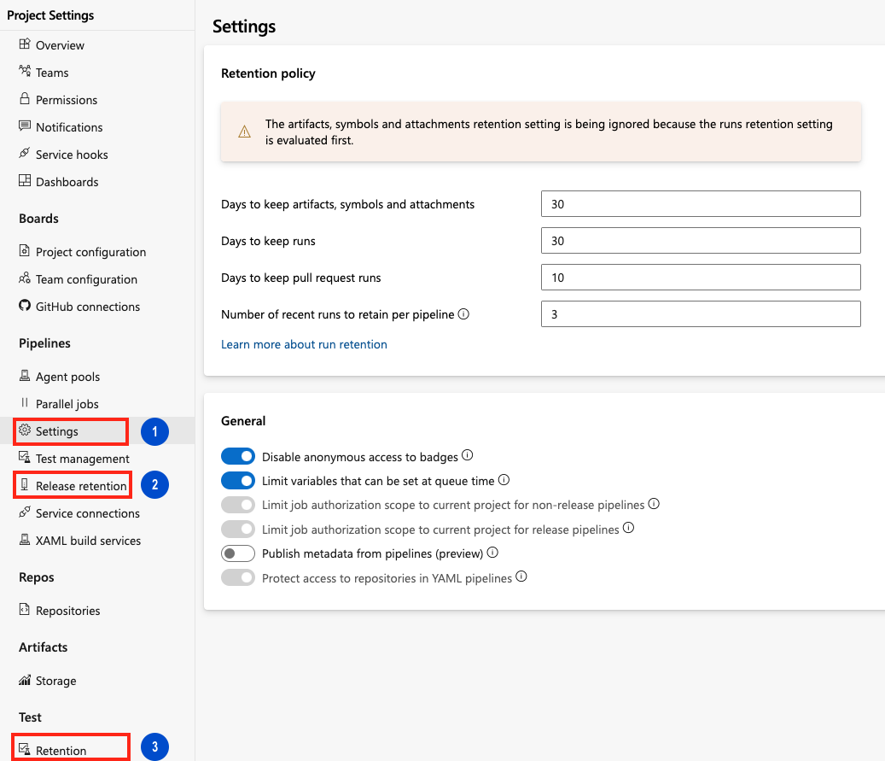
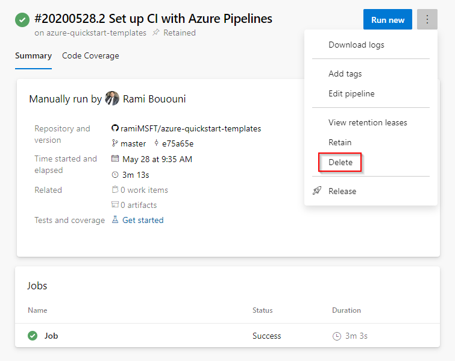
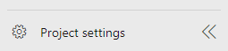
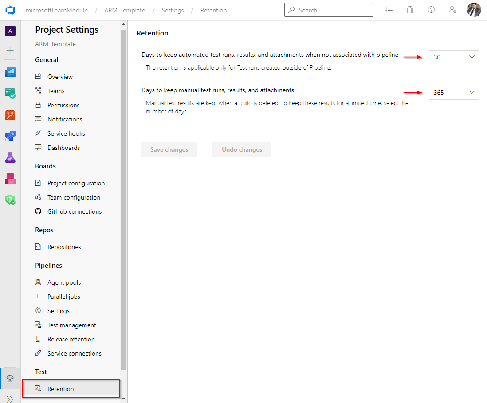
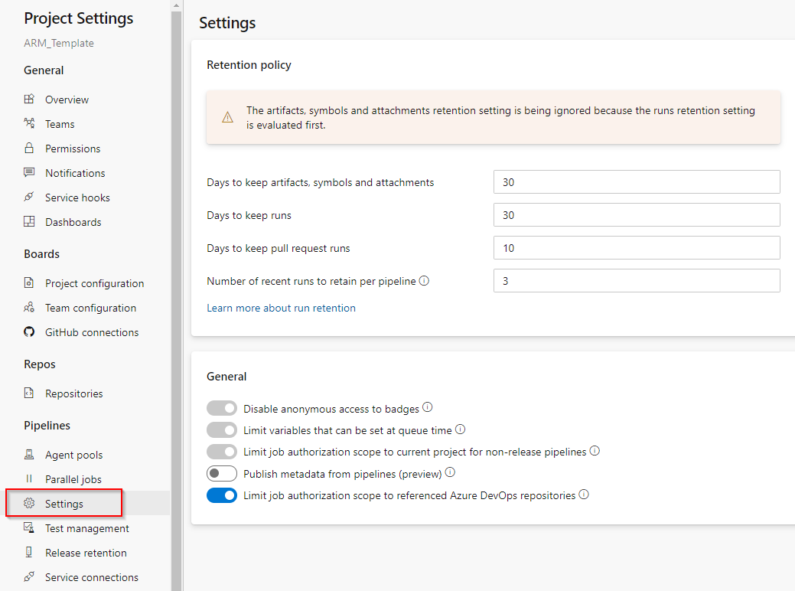
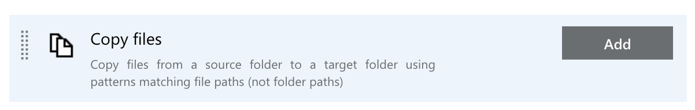
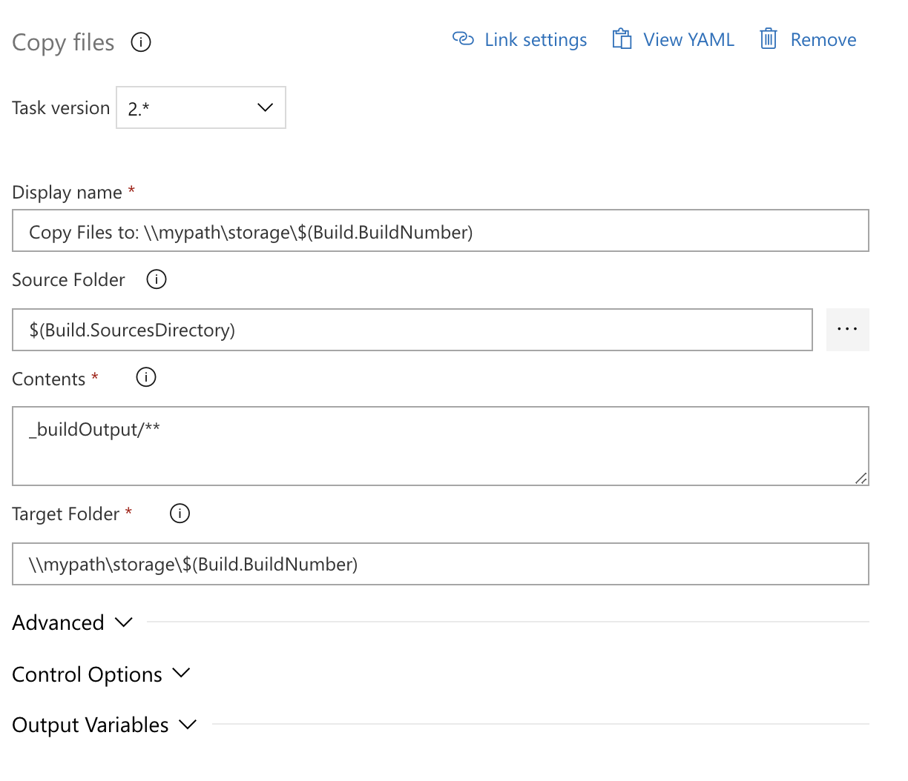
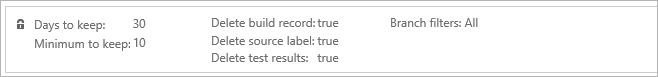

# Set retention policies for builds, releases, and tests

::: moniker range="<= tfs-2018"

[!INCLUDE [temp](../includes/concept-rename-note.md)]

::: moniker-end

Retention policies let you set how long to keep runs, releases, and tests stored in the system. To save storage space, you want to delete older runs, tests, and releases.   

The following retention policies are available in Azure DevOps in your **Project settings**:

1. **Pipeline** - Set how long to keep artifacts, symbols, attachments, runs, and pull request runs. 
2. **Release (classic)** - Set whether to save builds and view the default and maximum retention settings.
3. **Test** - Set how long to keep automated and manual test runs, results, and attachments. 
 
> [!div class="mx-imgBorder"]
> 

> [!NOTE]
> If you are using an on-premises server, you can also specify retention policy defaults for a project and when releases are permanently destroyed. Learn more about [release retention](#release) later in this article.

## Prerequisites 

By default, members of the Contributors, Build Admins, Project Admins, and Release Admins groups can manage retention policies. 

To manage test results, you must have one of the following subscriptions:
- [Enterprise](https://visualstudio.microsoft.com/vs/enterprise/)
- [Test Professional](https://visualstudio.microsoft.com/vs/test-professional/)
- [MSDN Platforms](https://visualstudio.microsoft.com/msdn-platforms/)

You can also buy monthly access to Azure Test Plans and assign the [Basic + Test Plans](https://marketplace.visualstudio.com/items?itemName=ms.vss-testmanager-web) access level. See [Testing access by user role](../../test/manual-test-permissions.md#access-by-user-role).

::: moniker range=">= azure-devops-2019"

## Configure retention policies

1. Sign in to your project (`https://dev.azure.com/{yourorganization}/{yourproject}`). 

2. Go to the  **Settings** tab of your project's settings.

3. Select **Settings** or **Release retention** under **Pipelines** or **Retention** under **Test**.
    * Select **Settings** to configure retention policies for runs, artifacts, symbols, attachments, and pull request runs. 
    * Select **Release retention** to set up your release retention policies and configure when to delete or permanently destroy releases.
    * Select **Retention** to set up how long to keep manual and automated test runs.     

    :::image type="content" source="media/retention-menu.png" alt-text="Retention settings in Project settings":::
::: moniker-end

## Set run retention policies

In most cases, you don't need to retain completed runs longer than a certain number of days. 
Using retention policies, you can control **how many days** you want to keep each run before deleting it. 

::: moniker range="<= tfs-2018"

Along with defining how many days to retain runs, you can also decide the minimum number of runs that should be kept for each pipeline.

::: moniker-end

::: moniker range=">= azure-devops-2019"

1. Go to the  **Settings** tab of your project's settings.

2. Select **Settings** in the Pipelines section.
    * Set the number of days to keep [artifacts](../artifacts/artifacts-overview.md), symbols, and attachments.
    * Set the number of days to keep [runs](../process/runs.md)
    * Set the number of days to keep pull request [runs](../process/runs.md)
    * Set the number of recent [runs](../process/runs.md) to keep for each pipeline

::: moniker-end

::: moniker range="azure-devops"

> [!WARNING]
> Azure DevOps will stop supporting per-pipeline retention rules in an upcoming release. At that time, any classic build pipeline that still has per-pipeline retention rules will be governed by the project-level retention rules instead. If you are using per-pipeline permissions, you should move your permissions to the project-level.
> The only way to configure retention policies for YAML and classic pipelines is through the project settings described above. You can no longer configure per-pipeline retention policies. 
>
> To remove your existing pipeline-level retention settings, edit your release pipeline. Then, remove the values on the **Retention** tab. 

::: moniker-end

::: moniker range=">= azure-devops-2019"

The setting for number of recent runs to keep for each pipeline requires a little more explanation. The interpretation of this setting varies based on the type of repository you build in your pipeline.

- **Azure Repos:** Azure Pipelines always retains the configured number of latest runs for the default branch and for each protected branch of the repository. A branch that has any branch policies configured is considered to be a protected branch. As an example, consider a repository with the default branch called **main**. Also, let us assume that the **release** branch in this repository has a branch policy. In this case, if you configured the policy to retain 3 runs, then the latest 3 runs of main as well as the latest 3 runs of release branch are retained. In addition, the latest 3 runs of this pipeline (irrespective of the branch) are also retained. 

    To clarify this logic further, let us say that the list of runs for this pipeline is as follows with the most recent run at the top. The table shows which runs will be retained if you have configured to retain the latest 3 runs (ignoring the effect of the number of days setting):

    | Run # | Branch | Retained / Not retained | Why? |
    |-------|--------|-------------------------|------|
    | Run 10 | main    | Retained | Latest 3 for main |
    | Run 9  | branch1 | Retained | Latest 3 for pipeline |
    | Run 8  | branch2 | Retained | Latest 3 for pipeline |
    | Run 7  | main    | Retained | Latest 3 for main |
    | Run 6  | main    | Retained | Latest 3 for main |
    | Run 5  | main    | Not retained | Neither latest 3 for main, nor for pipeline |
    | Run 4  | main    | Not retained | Neither latest 3 for main, nor for pipeline |
    | Run 3  | branch1 | Not retained | Neither latest 3 for main, nor for pipeline |
    | Run 2  | release | Retained | Latest 3 for release |
    | Run 1  | main    | Not retained | Neither latest 3 for main, nor for pipeline |

- **All other Git repositories:** Azure Pipelines retains the configured number of latest runs for the default branch of the repository and for the whole pipeline.

- **TFVC:** Azure Pipelines retains the configured number of latest runs for the whole pipeline, irrespective of the branch.

::: moniker-end

### What parts of the run get deleted

::: moniker range="<= tfs-2018"

When the retention policies mark a build for deletion, you can control which information related to the build is deleted:

* Build record: You can choose to delete the entire build record or keep basic information about the build even after the build is deleted.
* Source label: If you label sources as part of the build, then you can choose to delete the tag (for Git) or the label (for TFVC) created by a build.
* Automated test results: You can choose to delete the automated test results associated with the build (for example, results published by the Publish Test Results build task).

The following information is deleted when a build is deleted:

* Logs
* Published artifacts
* Published symbols

::: moniker-end

::: moniker range="> tfs-2018"

The following information is deleted when a run is deleted:

* Logs
* All pipeline and build artifacts 
* All symbols
* Binaries
* Test results
* Run metadata

Universal packages, NuGet, npm, and other packages are not tied to pipelines retention. 

::: moniker-end

### When are runs deleted

::: moniker range="> tfs-2018"

Your retention policies are processed once a day. The time that the policies get processed variables because we spread the work throughout the day for load-balancing purposes. There is no option to change this process.

A run is deleted if all of the following conditions are true:

- It exceeds the number of days configured in the retention settings
- It is not one of the recent runs as configured in the retention settings
- It is not marked to be retained indefinitely
- It is not retained by a release

::: moniker-end

::: moniker range="<= tfs-2018"

Your retention policies run every day at 3:00 A.M. UTC. There is no option to change the time the policies run.

::: moniker-end

### Automatically set retention lease on pipeline runs

Retention leases are used to manage the lifetime of pipeline runs beyond the configured retention periods. Retention leases can be added or deleted on a pipeline run by calling the [Lease API](/rest/api/azure/devops/build/leases). This API can be invoked within the pipeline using a script and using [predefined variables](../build/variables.md) for runId and definitionId.

A retention lease can be added on a pipeline run for a specific period. For example, a pipeline run which deploys to a test environment can be retained for a shorter duration while a run deploying to production environment can be retained longer.

::: moniker range=">=azure-devops-2020"

## Delete a run

You can delete runs using the [More actions menu](../get-started/multi-stage-pipelines-experience.md#pipeline-run-more-actions-menu) on the [Pipeline run details](../get-started/multi-stage-pipelines-experience.md#view-pipeline-run-details) page.

> [!NOTE]
> If any retention policies currently apply to the run, they must be removed before the run can be deleted. For instructions, see [Pipeline run details - delete a run](../get-started/multi-stage-pipelines-experience.md#pipeline-run-more-actions-menu).

  > [!div class="mx-imgBorder"]
  > 

::: moniker-end

<a id="release"></a>

## Set release retention policies

The release retention policies for a classic release pipeline determine how long a release and the run linked to it are retained. Using these policies, you can control **how many days** you want to keep each release after it has been last modified or deployed and the **minimum number of releases** that should be retained for each pipeline.

The retention timer on a release is reset every time a release is modified or deployed to a stage. The minimum number of releases to retain setting takes precedence over the number of days. For example, if you specify to retain a minimum of three releases, the most recent three will be retained indefinitely - irrespective of the number of days specified. However, you can manually delete these releases when you no longer require them. See FAQ below for more details about how release retention works.

As an author of a release pipeline, you can customize retention policies for releases of your pipeline on the **Retention** tab.

::: moniker range=">=azure-devops-2020"

The retention policy for YAML and build pipelines is the same. You can see your pipeline's retention settings in **Project Settings** for **Pipelines** in the **Settings** section.

::: moniker-end

::: moniker range="<= tfs-2018"
You can also learn how to customize these policies on a [stage-by-stage basis](#stage-specific-retention-policies) later in this article.
::: moniker-end

### Global release retention policy

If you are using an on-premises Team Foundation Server or Azure DevOps Server, you can specify release retention policy defaults and maximums for a project. You can also specify when releases are permanently destroyed (removed from the **Deleted** tab in the build explorer).

:::image type="content" source="media/on-premises-release-retention.png" alt-text="On premises release retention settings":::

If you are using Azure DevOps Services, you can view but not change these settings for your project.

Global release retention policy settings can be managed from the **Release retention** settings of your project:

* Azure DevOps Services: `https://dev.azure.com/{organization}/{project}/_settings/release?app=ms.vss-build-web.build-release-hub-group`
* On-premises: `https://{your_server}/tfs/{collection_name}/{project}/_admin/_apps/hub/ms.vss-releaseManagement-web.release-project-admin-hub`

The **maximum retention policy** sets the upper limit for how long releases can be retained for all release pipelines. Authors of release pipelines cannot
configure settings for their definitions beyond the values specified here.

The **default retention policy** sets the default retention values for all the release pipelines. Authors of build pipelines can override these values.

The **destruction policy** helps you keep the releases for a certain period of time after they are deleted. This policy cannot be overridden in individual release pipelines.

::: moniker range="<=tfs-2018"

> [!NOTE]
> In TFS, release retention management is restricted to specifying the number of days, and this is available only in TFS 2015.3 and newer.

## Stage-specific retention policies

You may want to retain more releases that have been deployed to specific stages. For example, your team may want to keep:

* Releases deployed to Production stage for 60 days, with a minimum of three last deployed releases.
* Releases deployed to Pre-production stage for 15 days, with a minimum of one last deployed release.
* Releases deployed to QA stage for 30 days, with a minimum of two last deployed releases.
* Releases deployed to Dev stage for 10 days, with a minimum of one last deployed release.

The following example retention policy for a release pipeline meets the above requirements:

  > [!div class="mx-imgBorder"]
  > 

In this example, if a release that is deployed to Dev is not promoted to QA for 10 days, it is a potential candidate for deletion. However, if that same release is deployed to QA eight days after being deployed to Dev, its retention timer is reset, and it is retained in the system for another 30 days.

When specifying custom policies per pipeline, you cannot exceed the maximum limits set by administrator.

::: moniker-end

::: moniker range=">= tfs-2017"

### Interaction between build and release retention policies

The build linked to a release has its own retention policy, which may be shorter than that of the release. If you want to retain the build for the same period as the release, set the **Retain associated artifacts** checkbox for the appropriate stages. This overrides the retention policy for the build, and ensures that the
artifacts are available if you need to redeploy that release.

When you delete a release pipeline, delete a release, or when the retention policy deletes a release automatically, the retention policy for the associated build will determine when that build is deleted.

> [!NOTE]
> In TFS, interaction between build and release retention is available in TFS 2017 and newer.

## Set test retention policies

You can set manual and automated test run policies. 

### Manual test-runs retention policies

To delete manual test results after a specific number of days, set the retention limit at the project level. Azure DevOps keeps manual test results related to builds, even after you delete those builds. That way, build policies don't delete your test results before you can analyze the data.

1. Sign into your Azure DevOps. You'll need at least project administrator permissions.

2. Go to your project and then select  project settings at the bottom of the page.
 
  > [!div class="mx-imgBorder"]
  > 

3. In the Retention page under the Test section, select a limit for how long you want to keep manual test data.

  > [!div class="mx-imgBorder"]
  > 

### Automated test-runs retention policies

By default, Azure DevOps keeps automated test results related to builds only as long as you keep those builds. To keep test results after you delete your builds, edit the build retention policy. If you use Git for version control, you can specify how long to keep automated test results based on the branch.

1. Sign into Azure DevOps. You'll need at least build level permissions to edit build pipelines.
 
2. Go to your project and then select  project settings at the bottom of the page.

  > [!div class="mx-imgBorder"]
  > 

3. Select  Settings under Pipelines and modify your retention policies.

  > [!div class="mx-imgBorder"]
  > 

### Other automated test results

To clean up automated test results that are left over from deleted builds or test results that aren't related to builds, for example, results published from external test systems, set the retention limits at the project level as shown in the [Manual test-runs retention policies](#manual-test-runs-retention-policies)

## Set artifact retention policies

You can set artifact retention policies for pipeline runs in the Pipeline settings. 

1. Sign in to your project (`https://dev.azure.com/{yourorganization}/{yourproject}`). 

2. Go to on the  **Settings** tab of your project's settings.

3. Select **Settings** in **Pipelines**.

4. Edit **Days to keep artifacts, symbols, and attachments**. 

::: moniker-end


::: moniker range=">=azure-devops-2020"


## Use the Copy Files task to save data longer

You can use the [Copy Files task](../tasks/utility/copy-files.md) to save your build and artifact data for longer than what is set in the retention policies. The **Copy Files task** is preferable to the [Publish Build Artifacts task](../tasks/utility/publish-build-artifacts.md) because data saved with the **Publish Build Artifacts task** will get periodically cleaned up and deleted. 

# [YAML](#tab/yaml)

```yaml
- task: CopyFiles@2
  displayName: 'Copy Files to: \\mypath\storage\$(Build.BuildNumber)'
  inputs:
    SourceFolder: '$(Build.SourcesDirectory)'
    Contents: '_buildOutput/**'
    TargetFolder: '\\mypath\storage\$(Build.BuildNumber)'
```

# [Classic](#tab/classic)

1. Add the **Copy Files task** to your Pipeline.  

  > [!div class="mx-imgBorder"]
  > 

2. Configure the **Copy Files task**. 

  > [!div class="mx-imgBorder"]
  > 

* * *

::: moniker-end

::: moniker range="<= tfs-2018"

You can also customize these policies on a branch-by-branch basis if you are building from [Git repositories](#git-repositories).

## Global build retention policy

You can specify build retention policy defaults and maximums for a project collection. You can also specify when builds are permanently destroyed (removed from the **Deleted** tab in the build explorer).

::: moniker-end

::: moniker range=">= tfs-2017 <= tfs-2018"

* TFS 2017 and newer: `https://{your_server}/tfs/DefaultCollection/_admin/_buildQueue`

::: moniker-end

::: moniker range="tfs-2015"

* TFS 2015.3: `http://{your_server}:8080/tfs/DefaultCollection/_admin/_buildQueue`

* TFS 2015 RTM: `http://{your_server}:8080/tfs/DefaultCollection/_admin/_buildQueue#_a=settings`

::: moniker-end

::: moniker range="<= tfs-2018"

The **maximum retention policy** sets the upper limit for how long runs can be retained for all build pipelines.
Authors of build pipelines cannot configure settings for their definitions beyond the values specified here.

The **default retention policy** sets the default retention values for all the build pipelines. Authors of build pipelines can override these values.

The **Permanently destroy releases** helps you keep the runs for a certain period of time after they are deleted. This policy cannot be overridden in individual build pipelines.

## Git repositories

If your [repository type](../repos/index.md) is one of the following, you can define multiple retention policies with branch filters:

* Azure Repos Git or TFS Git.
* GitHub.
* Other/external Git.

For example, your team may want to keep:

* User branch builds for five days, with a minimum of a single successful or partially successful build for each branch.
* Main and feature branch builds for 10 days, with a minimum of three successful or partially successful builds for each of these branches. You exclude a special feature branch that you want to keep for a longer period of time.
* Builds from the special feature branch and all other branches for 15 days, with a minimum of a single successful or partially successful build for each branch.

The following example retention policy for a build pipeline meets the above requirements:

  > [!div class="mx-imgBorder"]
  > 

When specifying custom policies for each pipeline, you cannot exceed the maximum limits set by administrator.

<a id="branch-policy-pr-builds"></a>

### Clean up pull request builds

If you [protect your Git branches with pull request builds](../../repos/git/branch-policies.md#build-validation), then you can use retention policies to automatically delete the completed builds. To do it, add a policy that keeps a minimum of `0` builds with the following branch filter:

```
  refs/pull/*
```

  > [!div class="mx-imgBorder"]
  > 

### TFVC and Subversion repositories

For TFVC and Subversion [repository types](../repos/index.md) you can modify a single policy with the same options shown above.

### Policy order

When the system is purging old builds, it evaluates each build against the policies in the order you have specified. You can drag and drop a policy lower or higher in the list to change this order.

The "All" branches policy is automatically added as the last policy in the evaluation order to enforce the maximum limits for all other branches.

  > [!div class="mx-imgBorder"]
  > 

::: moniker-end


## FAQ


### If I mark a run or a release to be retained indefinitely, does the retention policy still apply?

No. Neither the pipeline's retention policy nor the maximum limits set by the administrator are applied when you mark an individual run or release to be retained indefinitely. It will remain until you stop retaining it indefinitely.

### How do I specify that runs deployed to production will be retained longer?

If you use classic releases to deploy to production, then customize the retention policy on the release pipeline. Specify the number of days that releases deployed to production must be retained. In addition, indicate that runs associated with that release are to be retained. This will override the run retention policy.

If you use multi-stage YAML pipelines to production, the only retention policy you can configure is in the project settings. You cannot customize retention based on the environment to which the build is deployed.

### I did not mark runs to be retained indefinitely. However, I see a large number of runs being retained. How can I prevent this?

This could be for one of the following reasons:

- The runs are marked by someone in your project to be retained indefinitely.
- The runs are consumed by a release, and the release holds a retention lock on these runs. Customize the release retention policy as explained above.

If you believe that the runs are no longer needed or if the releases have already been deleted, then you can manually delete the runs.

### How does 'minimum releases to keep' setting work?
Minimum releases to keep are defined at stage level. It denotes that Azure DevOps will always retain the given number of last deployed releases for a stage even if the releases are out of retention period. A release will be considered under minimum releases to keep for a stage only when the deployment started on that stage. Both successful and failed deployments are considered. Releases pending approval are not considered.

### How is retention period decided when release is deployed to multiple stages having different retention period?
Final retention period is decided by considering days to retain settings of all the stages on which release is deployed and taking max days to keep among them. Minimum releases to keep is governed at stage level and do not change based on release deployed to multiple stages or not. Retain associated artifacts will be applicable when release is deployed to a stage for which it is set true.

### I deleted a stage for which I have some old releases. What retention will be considered for this case?
As the stage is deleted, so the stage level retention settings are not applicable now. Azure DevOps will fall back to project level default retention for such case.

### My organization requires us to retain builds and releases longer than what is allowed in the settings. How can I request a longer retention?

The only way to retain a run or a release longer than what is allowed through retention settings is to manually mark it to be retained indefinitely. There is no way to configure a longer retention setting. You can also explore the possibility of using the REST APIs in order to download information and artifacts about the runs and upload them to your own storage or artifact repository.

### I lost some runs. Is there a way to get them back?

If you believe that you have lost runs due to a bug in the service, create a support ticket immediately to recover the lost information. If the runs were manually deleted more than a week earlier, it isn't possible to recover the lost runs. If the runs were deleted as expected due to a retention policy, it isn't possible to recover the lost runs. 


### How do I use the `Build.Cleanup` capability of agents?

Setting a `Build.Cleanup` capability on agents will cause the pool's cleanup jobs to be directed to just those agents, leaving the rest free to do regular work. When a pipeline run is deleted, artifacts stored outside of Azure DevOps are cleaned up through a job run on the agents. When the agent pool gets saturated with cleanup jobs, this can cause a problem. The solution to that is to designate a subset of agents in the pool that are the cleanup agents. If any agents have `Build.Cleanup` set, only those agents will run the cleanup jobs, leaving the rest of the agents free to continue running pipeline jobs.

### Are automated test results that are published as part of a release retained until the release is deleted?

Test results published within a stage of a release are retained as specified by the retention policy configured for the test results. The test results do not get retained until the release is retained. If you need the test results as long as the release, set the retention settings for automated test runs in the Project settings accordingly to Never delete. This makes sure the test results are deleted only when the release is deleted.

### Are manual test results deleted?

No. Manual test results are not deleted. 

::: moniker range=">= azure-devops-2019"

### How do I preserve my version control labels? 

Version control labels created during a build will be deleted when your build is deleted. If you need to preserve version control labels, you'll need to retain any associated builds. 

::: moniker-end

## Related articles

- [Control how long to keep test results](../../test/how-long-to-keep-test-results.md)
- [Delete test artifacts](../../boards/backlogs/delete-test-artifacts.md)
