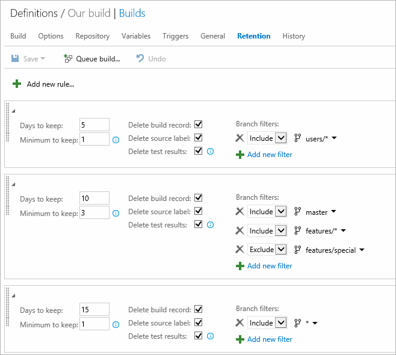
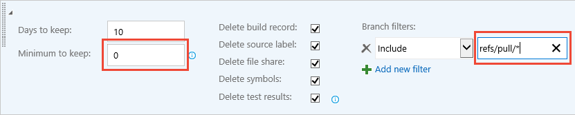
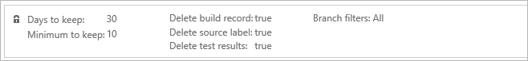
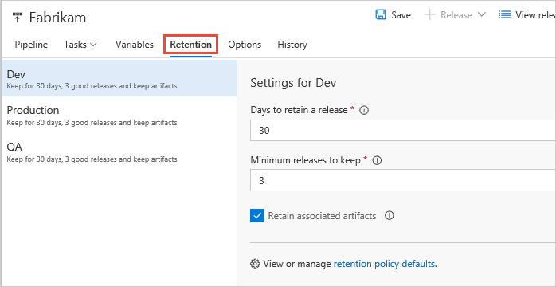

# Build and release retention policies

**Azure Pipelines | TFS 2018 | TFS 2017 | TFS 2015 | [Previous versions (XAML builds)](https://msdn.microsoft.com/library/ms181716%28v=vs.120%29.aspx)**

::: moniker range="<= tfs-2018"
[!INCLUDE [temp](../_shared/concept-rename-note.md)]
::: moniker-end

Retention policies are used to configure how long builds and
releases are to be retained by the system. The primary reasons to
delete older builds and releases are to conserve storage and to
reduce clutter. The main reasons to keep builds and releases are
for audit and tracking.

## Build retention

In most cases you don't need to retain completed builds longer than
a certain number of days. Using build retention policies, you can
control **how many days** you want to keep each build before
deleting it and the **minimum number of builds** that should be
retained for each pipeline.

As an author of a build pipeline, you can customize retention
policies for builds of your pipeline on the **Retention** tab.
You can also customize these policies on a branch-by-branch basis
if you are building from [Git repositories](#git-repositories).

### Global build retention policy

If you are using an on-premises Team Foundation Server, you can specify build retention policy defaults and maximums for a project collection. You can also specify when builds are permanently destroyed (removed from the **Deleted** tab in the build explorer).

If you are using Azure Pipelines, you can view but not change these settings for your organization.

Global build retention policy settings can be managed from the **Pipelines** settings of your organization or project collection:

::: moniker range="azure-devops"

* Azure Pipelines: `https://dev.azure.com/{your_organization}/_admin/_buildQueue`

::: moniker-end

::: moniker range=">= tfs-2017"

* TFS 2017 and newer: `https://{your_server}/tfs/DefaultCollection/_admin/_buildQueue`

::: moniker-end

::: moniker range="tfs-2015"

* TFS 2015.3: `http://{your_server}:8080/tfs/DefaultCollection/_admin/_buildQueue`

* TFS 2015 RTM: `http://{your_server}:8080/tfs/DefaultCollection/_admin/_buildQueue#_a=settings`

::: moniker-end

The **maximum retention policy** sets the upper limit for how longs
builds can be retained for all build pipelines.
Authors of build pipelines cannot configure settings for their
definitions beyond the values specified here.

The **default retention policy** sets the default retention values for all the build pipelines. Authors of build pipelines can override these values.

The **build destruction policy** helps you keep the builds for a certain period of time after they are deleted. This policy cannot be overridden in individual build pipelines.

### Git repositories

If your [repository type](../repos/index.md) is one of the following, you can define multiple retention policies with branch filters:

* Azure Repos Git or TFS Git
* GitHub
* Other/external Git

For example, your team may want to keep:

* User branch builds for five days, with a minimum of a single successful or partially successful build for each branch.
* Master and feature branch builds for 10 days, with a minimum of three successful or partially successful builds for each of these branches. You exclude a special feature branch that you want to keep for a longer period of time.
* Builds from the special feature branch and all other branches for 15 days, with a minimum of a single successful or partially successful build for each branch.

The following example retention policy for a build pipeline
meets the above requirements:



When specifying custom policies for each pipeline, you cannot exceed the maximum limits set by administrator.

<h4 id="branch-policy-pr-builds">Clean up pull request builds</h4>

If you [protect your Git branches with pull request builds](../../repos/git/branch-policies.md#build-validation), then you can use retention policies to automatically delete the completed builds. To do it, add a policy that keeps a minimum of `0` builds with the following branch filter:

```
refs/pull/*
```



### TFVC and Subversion repositories

For TFVC and Subversion [repository types](../repos/index.md) you can modify a single policy with the same options shown above.

### Policy order

When the system is purging old builds, it evaluates each build against the policies in the order you have specified. You can drag and drop a policy lower or higher in the list to change this order.

The "All" branches policy is automatically added as the last policy in the evaluation order to enforce the maximum limits for all other branches.



### What parts of the build get deleted

When the retention policies mark a build for deletion, you can control which information related to the build is deleted:

* Build record: You can choose to delete the entire build record or keep basic information about the build even after the build is deleted.
* Source label: If you label sources as part of the build, then you can choose to delete the tag (for Git) or the label (for TFVC) created by a build.
* Automated test results: You can choose to delete the automated test results associated with the build (for example, results published by the Publish Test Results build task).

The following information is deleted when a build is deleted:

* Logs
* [Published artifacts](../tasks/utility/publish-build-artifacts.md)
* [Published symbols](../tasks/build/index-sources-publish-symbols.md)

### When are builds deleted

#### Azure Pipelines

Your retention policies are processed once per day. The timing of this process varies because we spread the work throughout the day for load balancing purposes. There is no option to change this process.

#### TFS

Your retention policies run every day at 3:00 A.M. UTC. There is no option to change this process.

<h2 id="release">Release retention</h2>

The release retention policies for a release pipeline determine how long a release
and the build linked to it are retained. Using these policies, you can control **how many days** you want to keep each release after it has been last modified or deployed and the **minimum number of releases** that should be retained for each pipeline. The retention timer on a release is reset every time a release is modified or deployed to a stage. The minimum number or releases to retain setting takes precedence over the number of days. For example, if you specify to retain a minimum of three releases, the most
recent three will be retained indefinitely - irrespective of the number of
days specified. However, you can manually delete these releases when you no longer require them.

As an author of a release pipeline, you can customize retention policies for releases of your pipeline on the **Retention** tab.
You can also customize these policies on a [stage-by-stage basis](#stage-specific-retention).

### Global release retention policy

If you are using an on-premises Team Foundation Server, you can specify release retention policy defaults and maximums for a project. You can also specify when releases are permanently destroyed (removed from the **Deleted** tab in the build explorer).

If you are using Azure Pipelines, you can view but not change these settings for your project.

Global release retention policy settings can be managed from the **Release** settings of your project:

* Azure Pipelines: `https://dev.azure.com/{your_organization}/{project}/_admin/_apps/hub/ms.vss-releaseManagement-web.release-project-admin-hub`
* On-premises: `https://{your_server}/tfs/{collection_name}/{project}/_admin/_apps/hub/ms.vss-releaseManagement-web.release-project-admin-hub`

The **maximum retention policy** sets the upper limit for how long releases can be retained
for all release pipelines. Authors of release pipelines cannot
configure settings for their definitions beyond the values specified here.

The **default retention policy** sets the default retention values for all the release pipelines. Authors of build pipelines can override these values.

The **destruction policy** helps you keep the releases for a certain period of time after they are deleted. This policy cannot be overridden in individual release pipelines.

> In TFS, release retention management is restricted to specifying the number of days, and this is available only in TFS 2015.3 and newer.

### Stage-specific retention

You may want to retain more releases that have been deployed to specific stages.
For example, your team may want to keep:

* Releases deployed to Production stage for 60 days, with a minimum of three last deployed releases.
* Releases deployed to Pre-production stage for 15 days, with a minimum of one last deployed release.
* Releases deployed to QA stage for 30 days, with a minimum of two last deployed releases.
* Releases deployed to Dev stage for 10 days, with a minimum of one last deployed release.

The following example retention policy for a release pipeline meets the above requirements:



In this example, if a release that is deployed to Dev is not
promoted to QA for 10 days, it is a potential candidate for
deletion. However, if that same release is deployed to QA eight
days after being deployed to Dev, its retention timer is reset,
and it is retained in the system for another 30 days.

When specifying custom policies per pipeline, you cannot exceed the maximum limits set by administrator.

::: moniker range=">= tfs-2017"

### Interaction between build and release retention

The build linked to a release has its own retention policy,
which may be shorter than that of the release. If you want to retain
the build for the same period as the release, set the
**Retain build** checkbox for the appropriate stages. This
overrides the retention policy for the build, and ensures that the
artifacts are available if you need to redeploy that release.

When you delete a release pipeline, delete a release, or when the
retention policy deletes a release automatically, the retention policy
for the associated build will determine when that build is deleted.

> In TFS, interaction between build and release retention is available in TFS 2017 and newer.

::: moniker-end

## Q&A

<!-- BEGINSECTION class="md-qanda" -->

### Are manual test results deleted?

No

### If I mark a build or a release to be retained indefinitely, does the retention policy still apply?

No. Neither the pipeline's retention policy nor the maximum
limits set by the administrator are applied when you mark an
individual build or release to be retained indefinitely.
It will remain until you stop retaining it indefinitely.

### How do I specify that builds deployed to production will be retained longer?

Customize the retention policy on the release pipeline. Specify
the number of days that releases deployed to production must be
retained. In addition, indicate that builds associated with that
release are to be retained. This will override the build retention
policy.

### I did not mark builds to be retained indefinitely. However, I see a large number of builds being retained. How can I prevent this?

Builds that are deployed as part of releases are also governed by
the release retention policy. Customize the release retention
policy as explained above.

### Are automated test results that are published as part of a release retained until the release is deleted?

Test results published within a stage of a release are
associated with both the release and the build. These test results
are retained as specified by the retention policy configured for
the build and for the test results. If you are not deploying Team
Foundation or Azure Pipelines Build, and are still
publishing test results, the retention of these results is
governed by the retention settings of the release they belong to.

<!-- [!INCLUDE [temp](../_shared/qa-agents.md)] -->

<!-- [!INCLUDE [temp](../_shared/qa-versions.md)] -->

<!-- ENDSECTION -->
