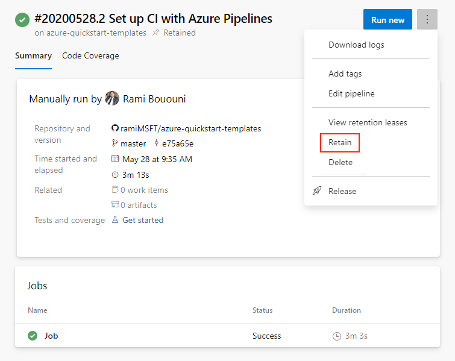
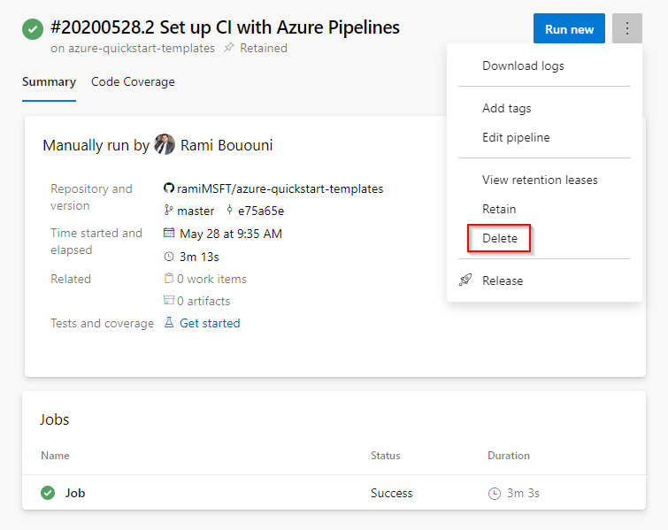
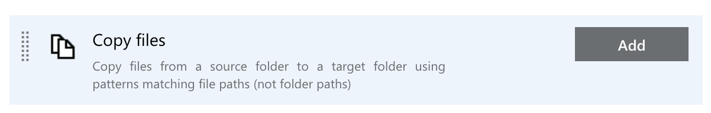
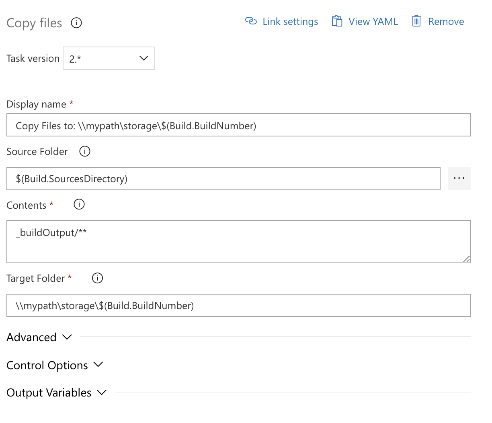

# Retention policies

[!INCLUDE [version-lt-eq-azure-devops](../../includes/version-lt-eq-azure-devops.md)]

Retention policies control how long pipeline runs, classic releases, and test data are kept in Azure DevOps. These settings help you balance storage usage, compliance, and traceability by defining when older data should be deleted and what should be retained longer. This article explains the retention options available and how they apply to Pipelines, Releases, and Tests.

## Prerequisites

| **Product** | **Requirements** |
|-------------|------------------|
| **Azure DevOps** | - An [Azure DevOps organization](../../organizations/accounts/create-organization.md).<br>- An [Azure DevOps project](../../organizations/projects/create-project.md). |
| **Permissions** | - By default, users in the Contributors, Build Admins, Project Admins, and Release Admins groups can manage retention policies.<br>- To manage retention policies, you need one of the following subscriptions: [Enterprise](https://visualstudio.microsoft.com/vs/enterprise/), [Test Professional](https://visualstudio.microsoft.com/vs/test-professional/), or [MSDN Platforms](https://visualstudio.microsoft.com/msdn-platforms/).<br>- You can also purchase monthly Azure Test Plans access and assign the [Basic + Test Plans](https://marketplace.visualstudio.com/items?itemName=ms.vss-testmanager-web) access level. See [Testing access by user role](../../test/manual-test-permissions.md#access-by-user-role) for more details. |

::: moniker range="azure-devops-2022"

> [!IMPORTANT]
> Azure Pipelines no longer supports per-pipeline retention policies. We recommend using project-level retention rules.

::: moniker-end

::: moniker range="<=azure-devops"

## Configure retention policies

Use these steps to open the retention settings pages in your project and choose the policy area you want to manage.

1. Sign in to your Azure DevOps project.

1. Select  **Project settings**.

1. Select one of the following options:
  * Under **Pipelines**, select **Settings** to configure retention for runs, artifacts, symbols, attachments, and pull request runs.
  * Under **Pipelines**, select **Release retention** to configure release retention settings, including when releases are deleted or permanently destroyed.
  * Under **Test**, select **Retention** to configure how long manual and automated test runs are kept.

::: moniker-end

## Pipeline runs retention policies

In most cases, you don't need to keep completed runs indefinitely. Run retention policies let you define how long runs and related data are kept before deletion.

::: moniker range="<=azure-devops"

1. Go to the  **Settings** tab of your project's settings.

1. Select **Settings** in the **Pipelines** section.
  * Set how many days to keep [artifacts](../artifacts/artifacts-overview.md), symbols, and attachments.
  * Set how many days to keep [runs](../process/runs.md).
  * Set how many days to keep pull request [runs](../process/runs.md).
  * Set the number of recent [runs](../process/runs.md) to keep for each pipeline.

::: moniker-end

::: moniker range="azure-devops"

> [!WARNING]
> Azure DevOps no longer supports per-pipeline retention rules. The only way to configure retention policies for YAML and classic pipelines is through the project settings described above. You can no longer configure per-pipeline retention policies. 

::: moniker-end

::: moniker range="<=azure-devops"

The **number of recent runs to keep for each pipeline** setting is interpreted differently based on repository type.

- **Azure Repos:** Azure Pipelines retains the configured number of latest runs for the [pipeline's default branch](../process/pipeline-default-branch.md) and for each protected branch in the repository. A protected branch is any branch with branch policies configured.
 
  For example, consider a repository with two branches: `main` and `release`. If the pipeline default branch is `main` and `release` has a branch policy, then `release` is treated as a protected branch. If you configure retention to keep three runs, Azure Pipelines keeps the latest three runs for `main`, the latest three runs for `release`, and the latest three runs for the pipeline overall (regardless of branch).

  The following example assumes the most recent run is listed first. It shows which runs are retained when you configure retention to keep the latest three runs (ignoring the days-based setting):

    | Run # | Branch | Retained / Not retained | Why? |
    |-------|--------|-------------------------|------|
    | Run 10 | main    | Retained | Latest 3 for main and Latest 3 for pipeline |
    | Run 9  | branch1 | Retained | Latest 3 for pipeline |
    | Run 8  | branch2 | Retained | Latest 3 for pipeline |
    | Run 7  | main    | Retained | Latest 3 for main |
    | Run 6  | main    | Retained | Latest 3 for main |
    | Run 5  | main    | Not retained | Neither latest 3 for main, nor for pipeline |
    | Run 4  | main    | Not retained | Neither latest 3 for main, nor for pipeline |
    | Run 3  | branch1 | Not retained | Neither latest 3 for main, nor for pipeline |
    | Run 2  | release | Retained | Latest 3 for release |
    | Run 1  | main    | Not retained | Neither latest 3 for main, nor for pipeline |

- **All other Git repositories:** Azure Pipelines retains the configured number of latest runs for the whole pipeline.

- **TFVC:** Azure Pipelines retains the configured number of latest runs for the whole pipeline, irrespective of the branch.

::: moniker-end

### What parts of the run get deleted

::: moniker range="<=azure-devops"

When a run is deleted, the following data is removed:

* Logs
* All pipeline and build artifacts 
* All symbols
* Binaries
* Test results
* Run metadata
* Source labels (TFVC) or tags (Git)

Universal Packages, NuGet, npm, and other packages aren't governed by pipeline run retention.

::: moniker-end

### When are runs deleted

::: moniker range="<=azure-devops"

A run is deleted if all of the following conditions are true:

- It exceeds the number of days configured in the retention settings
- It is not one of the recent runs as configured in the retention settings
- It is not marked to be retained indefinitely
- It is not retained by a release

Retention policies are processed once per day. Processing time varies because the work is distributed throughout the day for load balancing, and this schedule can't be changed.

::: moniker-end

::: moniker range="azure-devops"

### Automatically set retention lease on pipeline runs

Retention leases let you extend or control the lifetime of pipeline runs beyond configured retention periods. You can add or delete leases for a pipeline run by using the [Lease API](/rest/api/azure/devops/build/leases). You can call this API from within a pipeline by using a script and [predefined variables](../build/variables.md) for `runId` and `definitionId`.

You can set a lease for a specific duration. For example, a run that deploys to a test environment can be retained for a shorter period, while a run that deploys to production can be retained longer.

### Manually set retention lease on pipeline runs

You can manually retain a pipeline run from the [More actions menu](../create-first-pipeline.md#pipeline-run-more-actions-menu) on the [Pipeline run details](../create-first-pipeline.md#view-pipeline-run-details) page.



::: moniker-end

::: moniker range="<=azure-devops"

### Delete a run

You can delete runs from the [More actions menu](../create-first-pipeline.md#pipeline-run-more-actions-menu) on the [Pipeline run details](../create-first-pipeline.md#view-pipeline-run-details) page.

> [!div class="mx-imgBorder"]
> 

> [!NOTE]
> If any retention policies currently apply to the run, they must be removed before the run can be deleted. For instructions, see [Pipeline run details - delete a run](../create-first-pipeline.md#pipeline-run-more-actions-menu).

::: moniker-end

## Releases retention policies

Release retention policies for classic release pipelines determine how long a release and its associated run are kept. With these policies, you can configure both:

- The number of days to retain each release after it was last modified or deployed.
- The minimum number of releases to retain for each pipeline.

The retention timer resets each time a release is modified or deployed to a stage. The minimum releases setting takes precedence over the days-based setting. For example, if you set the minimum to three releases, the three most recent releases are retained regardless of the number of days configured. You can still delete these releases manually when you no longer need them. For more details, see the FAQ later in this article.

::: moniker range="<=azure-devops"

YAML and build pipelines use the same run retention policy. You can view these settings under **Project settings** > **Pipelines** > **Settings**.

::: moniker-end

::: moniker range="azure-devops"

### Global release retention policy

In Azure DevOps Services, you can view these settings but can't change them at the project level.

You can review global release retention settings from your project's **Release retention** page in your **Project settings**.

The **maximum retention policy** defines the upper limit for how long releases can be retained across all release pipelines. Pipeline authors can't configure retention beyond this limit.

The **default retention policy** defines the default retention values applied to release pipelines. Pipeline authors can override these defaults.

The **Permanently destroy releases** controls how long deleted releases are kept before permanent removal. Individual release pipelines can't override this policy.

::: moniker-end

::: moniker range="< azure-devops"

### Global release retention policy

If you're using Azure DevOps Server on-premises, you can configure project-level defaults and maximums for release retention. You can also set when deleted releases are permanently destroyed (removed from the **Deleted** tab in Build Explorer).

The **maximum retention policy** defines the upper limit for how long releases can be retained across all release pipelines. Pipeline authors can't configure retention beyond this limit.

The **default retention policy** defines the default retention values applied to release pipelines. Pipeline authors can override these defaults.

The **Permanently destroy releases** controls how long deleted releases are kept before permanent removal. Individual release pipelines can't override this policy.

:::image type="content" source="media/on-premises-release-retention.png" alt-text="On premises release retention settings":::

## Set collection-level retention policies

If you're using an on-premises server, you can also configure collection-level retention with custom rules. These settings apply to Classic build pipelines and define the default and maximum retention values for the collection.

:::image type="content" source="media/retention-settings-server.png" alt-text="A screenshot showing how to configure collection level retention policies.":::

::: moniker-end

::: moniker range="<=azure-devops"

## Use the Copy Files task to save data longer

If you need to keep build output longer than your configured retention period, copy it to your own storage location by using the [Copy Files task](/azure/devops/pipelines/tasks/reference/copy-files-v2).

Use **Copy Files** instead of [Publish Build Artifacts](/azure/devops/pipelines/tasks/reference/publish-build-artifacts-v1), because data published as build artifacts is still subject to retention cleanup.

# [YAML](#tab/yaml)

```yaml
- task: CopyFiles@2
  displayName: 'Copy Files to: \\mypath\storage\$(Build.BuildNumber)'
  inputs:
    SourceFolder: '$(Build.SourcesDirectory)'
    Contents: '_buildOutput/**'
    TargetFolder: '\\mypath\storage\$(Build.BuildNumber)'
```

# [Classic](#tab/classic)

1. Add the **Copy Files** task to your pipeline.

  > [!div class="mx-imgBorder"]
  > 

1. Configure the **Copy Files** task.

  > [!div class="mx-imgBorder"]
  > 

* * *

::: moniker-end

## FAQ

### If I mark a run or a release to be retained indefinitely, does the retention policy still apply?

No. Neither the pipeline's retention policy nor the maximum limits set by the administrator are applied when you mark an individual run or release to be retained indefinitely. It will remain until you stop retaining it indefinitely.

### How do I specify that runs deployed to production will be retained longer?

If you use classic releases to deploy to production, customize retention on the release pipeline. Set how many days releases deployed to production should be retained, and specify that runs associated with those releases are retained. This overrides the run retention policy.

If you use multi-stage YAML pipelines, retention can only be configured in project settings. You can't configure retention by deployment environment.

### I did not mark runs to be retained indefinitely. However, I see a large number of runs being retained. How can I prevent this?

This could be for one of the following reasons:

- The runs are marked by someone in your project to be retained indefinitely.
- The runs are consumed by a release, and the release holds a retention lock on these runs. Customize the release retention policy as explained above.

If the runs are no longer needed, or if the releases that retained them were already deleted, you can manually delete the runs.

### How does 'minimum releases to keep' setting work?

The **minimum releases to keep** value is defined at the stage level. Azure DevOps always keeps that number of most recently deployed releases for the stage, even if they are outside the retention period. A release counts toward this minimum only when deployment to that stage has started. Both successful and failed deployments are counted. Releases pending approval aren't counted.

### How is retention period decided when release is deployed to multiple stages having different retention period?

The final retention period is determined by the **days to retain** settings across all stages where the release is deployed, using the maximum value among those stages. **Minimum releases to keep** is stage-specific and doesn't change based on whether a release was deployed to one or multiple stages. **Retain associated artifacts** applies only when a release is deployed to a stage where that option is enabled.

### I deleted a stage for which I have some old releases. What retention will be considered for this case?

After a stage is deleted, its stage-level retention settings no longer apply. In that case, Azure DevOps uses the project-level default retention settings.

### My organization requires us to retain builds and releases longer than what is allowed in the settings. How can I request a longer retention?

To retain a run or release longer than the configured retention limits, mark it to be retained indefinitely. There's no setting to manually configure a longer retention period. For assistance, contact [Azure DevOps Support](https://developercommunity.visualstudio.com/spaces/21/index.html).

You can also use REST APIs to download run information and artifacts, then store them in your own storage account or artifact repository.

### I lost some runs. Is there a way to get them back?

If you believe runs were lost because of a service bug, create a support ticket immediately. If a build definition was manually deleted more than a week earlier, it can't be recovered. If runs were deleted as expected by retention policy, they can't be recovered.

### How do I use the `Build.Cleanup` capability of agents?

Setting the `Build.Cleanup` capability on agents routes cleanup jobs only to those agents, which keeps other agents available for regular pipeline work. When a pipeline run is deleted, artifacts stored outside Azure DevOps are cleaned up through an agent job. If cleanup jobs saturate your pool, designate a subset of agents as cleanup agents. When any agents have `Build.Cleanup` set, only those agents run cleanup jobs. To enable this, go to **Agent** > **Capabilities** and set `Build.Cleanup` to `1`.

### What happens to file share Artifacts when the build is deleted 

When a build with file share Artifacts is deleted, a new build task is queued on a build agent to clean up those files. An agent is picked to perform this task based on the following criteria:
Is there an agent with `Build.Cleanup` capability available?
Is the agent that ran the build available?
Is an agent from the same pool available?
Is an agent from a similar pool available?
Is any agent available?

### Are automated test results that are published as part of a release retained until the release is deleted?

Test results published in a release stage are retained according to the test retention policy, not the release retention policy. If you need test results retained as long as the release, set automated test run retention in **Project settings** to **Never delete**. This ensures test results are deleted only when the release is deleted.

### Are manual test results deleted?

No. Manual test results are not deleted. 

::: moniker range="<=azure-devops"

### How do I preserve my version control labels or tags? 

If labels or tags must be preserved after a build is deleted, apply them in a pipeline task, add them manually outside the pipeline, or retain the build indefinitely.

> [!IMPORTANT]
> Any version control labels or tags applied during a build pipeline that aren't automatically created by the Sources task are preserved, even if the build is deleted.
> However, labels or tags automatically created by the Sources task during a build are treated as build artifacts and are deleted with the build.

::: moniker-end

::: moniker range="= azure-devops"

### What happens to pipelines that are consumed in other pipelines?

Classic releases retain pipelines that they consume automatically.

::: moniker-end

::: moniker range="= azure-devops-2022"

### What happens to pipelines that are consumed in other pipelines?

Classic releases retain pipelines that they consume automatically. If you are using YAML, you can also create a multi-stage YAML pipeline to represent your release and consume another YAML pipeline in it as a [resource](../process/resources.md#define-a-pipelines-resource). The resource pipeline will be retained automatically as long as the release pipeline is retained.

::: moniker-end

## Related content

- [Set test retention policies](../../test/how-long-to-keep-test-results.md)

- [Delete test artifacts](../../boards/backlogs/delete-test-artifacts.md)

- [Use tasks to increase run retention](../../pipelines/build/run-retention.md)
