# Set build and release permissions

[!INCLUDE [version-tfs-2015-rtm](../_shared/version-tfs-2015-rtm.md)]

[!INCLUDE [temp](../_shared/concept-rename-note.md)]

::: moniker range="> tfs-2018"

## Add your teammates

If your teammates want to edit pipelines, then have an administrator add them to your project:

1. Make sure you are a member of the Project Administrators group ([learn more](../../organizations/security/set-project-collection-level-permissions.md)).

1. Go to your project summary: `https://dev.azure.com/{your-organization}/{your-project}`

1. Invite the teammates to join the project.

 > [!div class="mx-imgBorder"]
 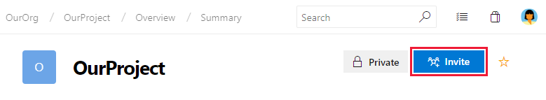

 > [!div class="mx-imgBorder"]
 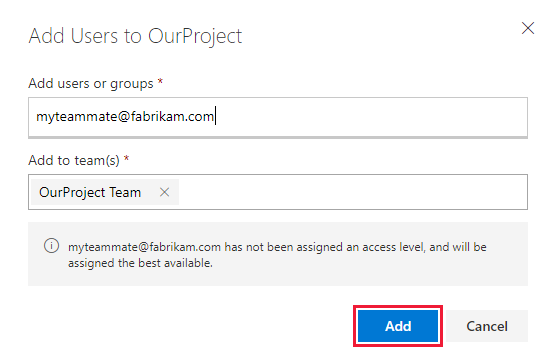

1. After the teammates accept the invitation, ask them to verify that they can [create and edit pipelines](../create-first-pipeline.md).

## Confirm that contributors have pipeline permissions 

If you created your project after about October 2018, then the above procedure is probably sufficient. However, in some cases your team members might see errors or grayed-out controls when they try to work with pipelines. In these cases, make sure that your project contributors have the necessary permissions:

1. Make sure you are a member of the Build Administrators group or the Project Administrators group ([learn more](../../organizations/security/set-project-collection-level-permissions.md)).

1. Open the build security dialog box.

 > [!div class="mx-imgBorder"]
 

1. On the permissions dialog box, make sure the following permissions are set to Allow.

 > [!div class="mx-imgBorder"]
 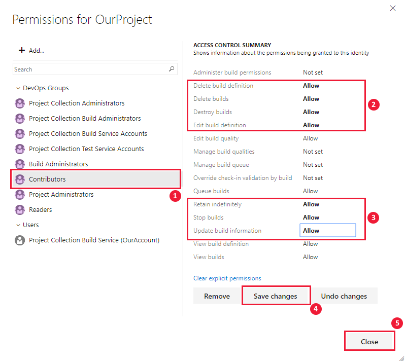

::: moniker-end

::: moniker range="<= tfs-2018"

Permissions for build and release functions are primarily set at the object-level for a specific build or release, or for select tasks, at the collection level. For a simplified view of permissions assigned to built-in groups, see [Permissions and access](../../organizations/security/permissions-access.md).

In addition to permission assignments, you manage security for several resources&mdash;such as variable groups, secure files, and deployment groups&mdash;by adding users or groups to a role. You grant or restrict permissions by setting the [permission state to Allow or Deny](../../organizations/security/about-permissions.md), either for a security group or an individual user. For definitions of each build and release permission and role, see [Build and release permissions](permissions.md).  

## Set permissions for build pipelines

1. To set the permissions for all build pipelines, click the Security From the web portal **Build-Release** hub, **Builds** page

   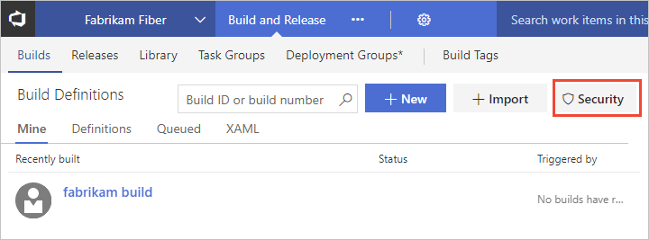

  To set the permissions for a specific build pipeline, open the context menu for the build and click Security.

   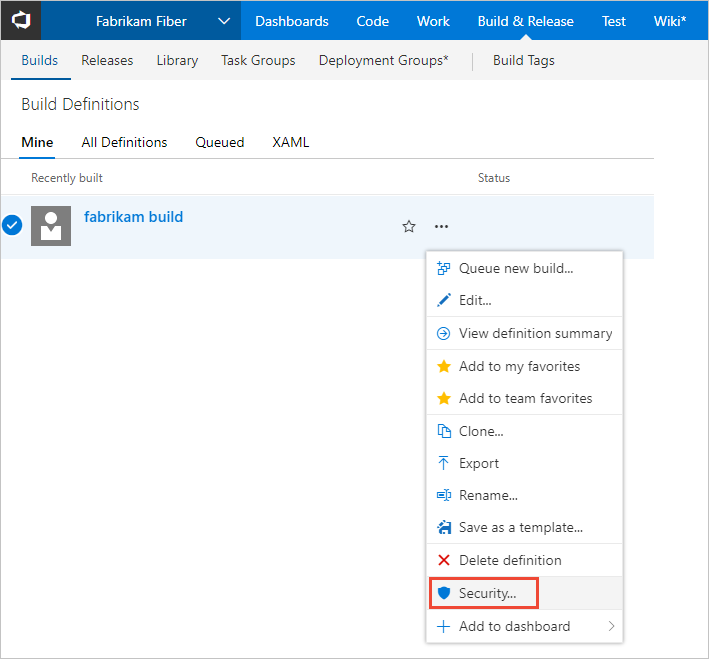

1. Choose the group you want to set permissions for, and then change the permission setting to Allow or Deny.

   For example, here we change the permission for Edit build pipeline for the Contributors group to Allow.

   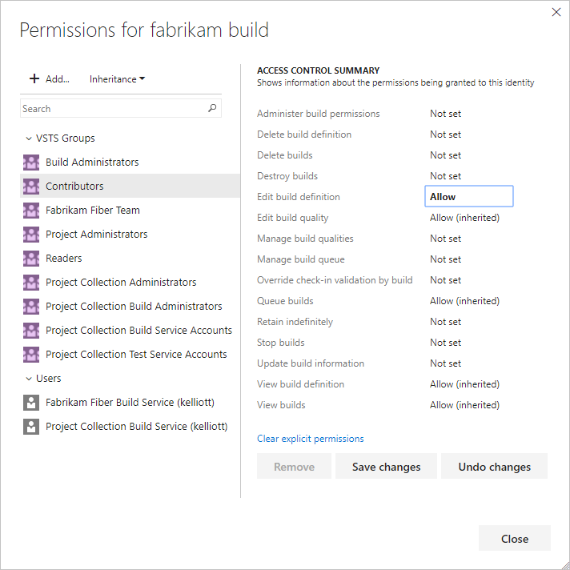

1. Save your changes.

## Set permissions for release pipelines

1. From the web portal **Build-Release** hub, **Releases** page, open the Security dialog for all release pipelines.

   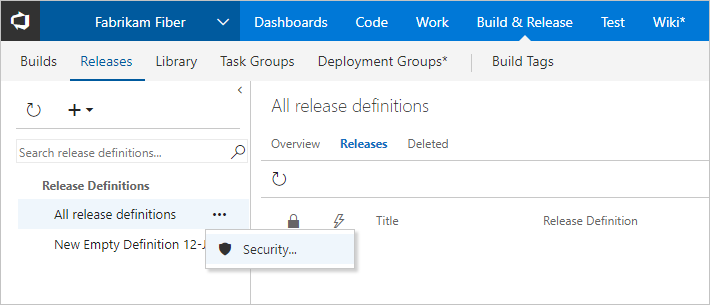

   If you want to manage the permissions for a specific release, then open the Security dialog for that release.

1. Choose the group you want to set permissions for, and then change the permission setting to Allow or Deny.

   For example, here we deny access to several permissions for the Contributors group.

   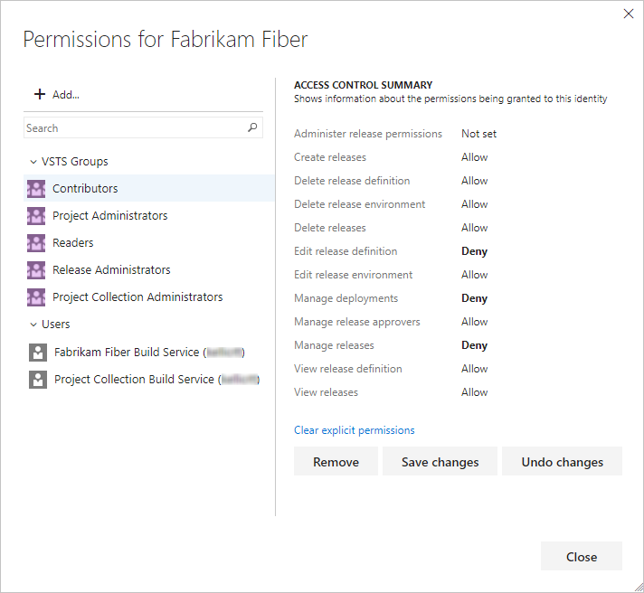

1. Save your changes.

<a id="deployment-group" />
<a id="variable-group" />
<a id="library" />

::: moniker-end

::: moniker range=">= tfs-2017 <= tfs-2018"

## Manage Library roles for variable groups, secure files, and deployment groups

Permissions for [variable groups](../library/variable-groups.md), [secure files](../library/secure-files.md), and [deployment groups](../release/deployment-groups/index.md) are managed by roles. For a description of the roles, see [About security roles](../../organizations/security/about-security-roles.md).

> [!NOTE]
> **Feature availability**: These features are available on Azure Pipelines and TFS 2017 and later versions.

You can set the security for all artifacts for a project, as well as set the security for individual artifacts. The method is similar for all three artifact types. You set the security for variable groups and secure files from **Azure Pipelines**, **Library** page, and for deployment groups, from the **Deployment groups** page.

For example, here we show how to set the security for variable groups.  

1. **Build-Release** hub, **Library** page, open the Security dialog for all variable groups.

    

   If you want to manage the permissions for a specific variable group, then open the Security dialog for that group.

    

1. Add the user or group and choose the role you want them to have.

   For example, here we deny access to several permissions for the Contributors group.

   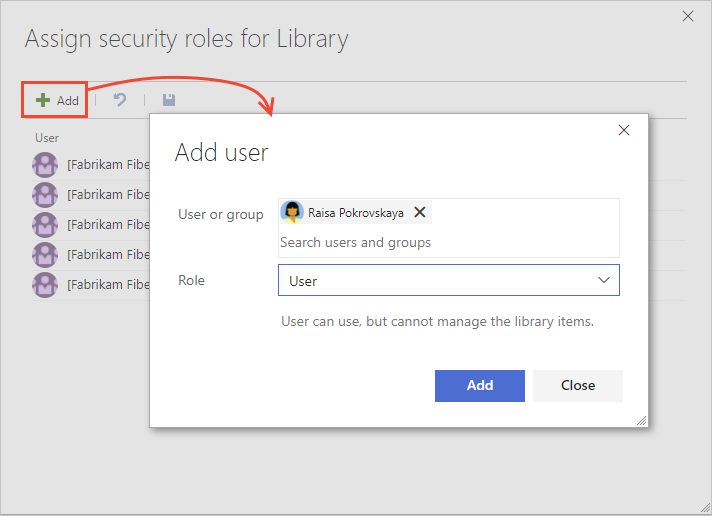 

1. Click **Add**.  

::: moniker-end

::: moniker range=">= tfs-2017 <= tfs-2018"

<a id="task-group" />

## Manage task group permissions

Permissions for task groups are subject to a hierarchical model. You use task groups to encapsulate a sequence of tasks already defined in a build or a release pipeline into a single reusable task. You [define and manage task groups](../library/task-groups.md) in the **Task groups** tab of **Azure Pipelines**.

> [!NOTE]
> **Feature availability**: These features are available on Azure Pipelines and TFS 2017 and later versions.

1. From the web portal **Build-Release** hub, **Task groups** page, open the Security dialog for all task groups.

    

   If you want to manage the permissions for a specific task group, then open the Security dialog for that group.

1. Add the user or group and then set the permissions you want them to have.

   For example, here we add Raisa and set her permissions to Administer all task groups.

   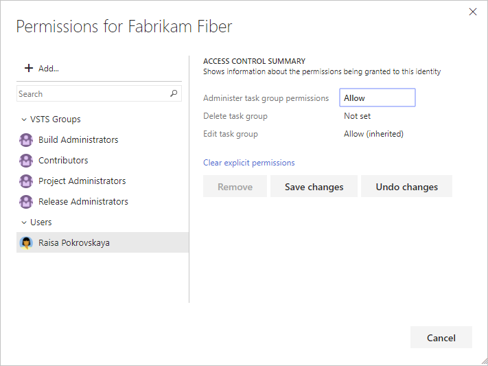 

1. Click **Add**.

::: moniker-end

::: moniker range="<= tfs-2018"

<a id="collection-level" /> 

## Set collection-level permissions to administer build resources
 
1. From the web portal user context, open the admin context by clicking the  gear Settings icon and choosing **Organization settings** or **Collection settings**.

1. Click **Security**, and then choose the group whose permissions you want to modify.

   Here we choose the Build Administrators group and change the **Use build resources** permission. For a description of each permissions, see [Permissions and groups reference, Collection-level permissions](../../organizations/security/permissions.md#collection-level).

   

1. Save your changes.

::: moniker-end

::: moniker range=">= tfs-2015 <= tfs-2018"

## Manage permissions for agent pools and service connections

You manage the security for [agent pools](../agents/pools-queues.md) and [service connections](../library/service-endpoints.md) by adding users or groups to a role. The method is similar for both agent pools and service connections. You will need to be a member of the Project  Administrator group to manage the security for these resources.
 
> [!NOTE]
> **Feature availability**: These features are available on Azure Pipelines and TFS 2015 and later versions.

For example, here we show how to add a user to the Administrator role for a service connection.  

1. From the web portal, click the  gear Settings icon to open the project settings admin context.

1. Click **Services**, click the service connection that you want to manage, and then click **Roles**.   

   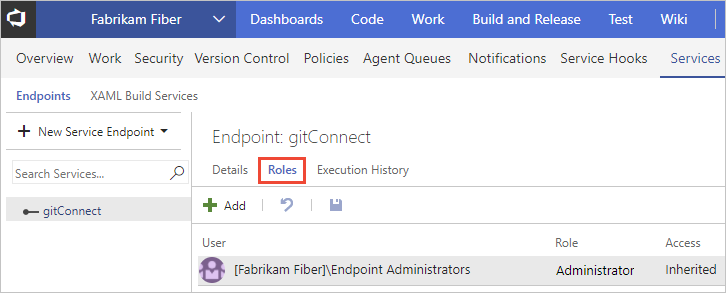

1. Add the user or group and choose the role you want them to have. For a description of each role, see [About security roles](../../organizations/security/about-security-roles.md).

   For example, here we add Raisa to the Administrator role.

     

1. Click **Add**.  

::: moniker-end

::: moniker range=">= tfs-2018 <= tfs-2018"

## Manage permissions for agent pools and deployment pools  

You manage the security for [agent pools](../agents/pools-queues.md) and [deployment pools](../release/deployment-groups/index.md) by adding users or groups to a role. The method is similar for both types of pools.
 
> [!NOTE]
> **Feature availability**: These features are available on Azure Pipelines and TFS 2018 and later versions.

You will need to be a member of the Project Collection Administrator group to manage the security for a pool. Once you've been added to the Administrator role, you can then manage the pool. For a description of each role, see [About security roles](../../organizations/security/about-security-roles.md).

1. From the web portal, click the  gear Settings icon and choose Organization settings or Collection settings to open the collection-level settings admin context.

1. Click **Deployment Pools**, and then open the **Security** dialog for all deployment pools.    

   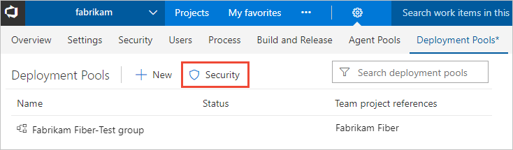 

   If you want to manage the permissions for a specific deployment group, then open the Security dialog for that group.

1. Add the user or group and choose the role you want them to have.

   For example, here we add Raisa to the Administrator role.

     

1. Click **Add**.  

::: moniker-end

::: moniker range="<= tfs-2018"

## Related notes 

[Default build and release permissions](../policies/permissions.md)
- [Default permissions and access](../../organizations/security/permissions-access.md) 
- [Permissions and groups reference](../../organizations/security/permissions.md) 

::: moniker-end
