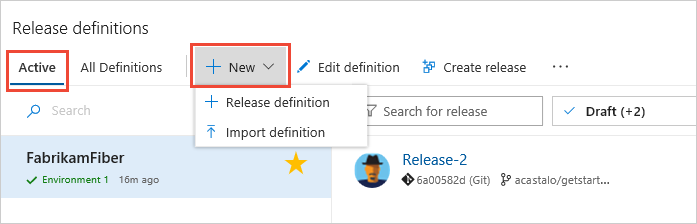
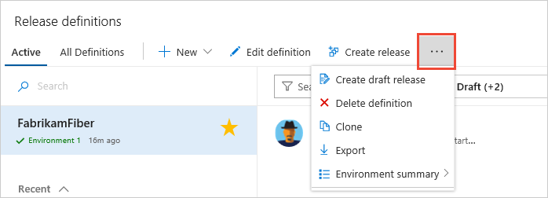
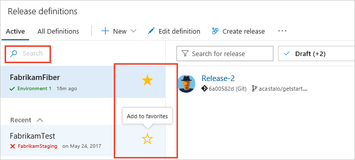
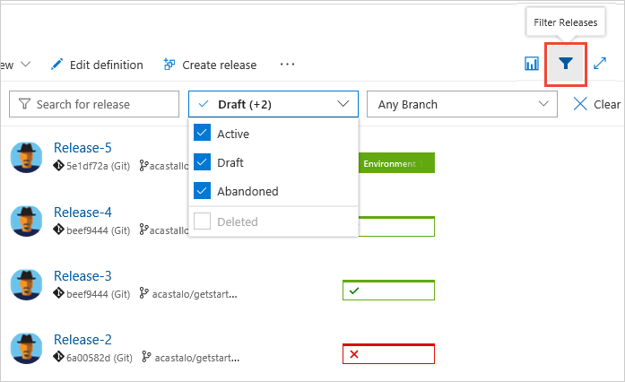
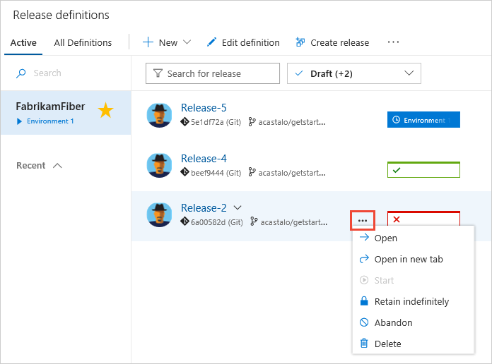
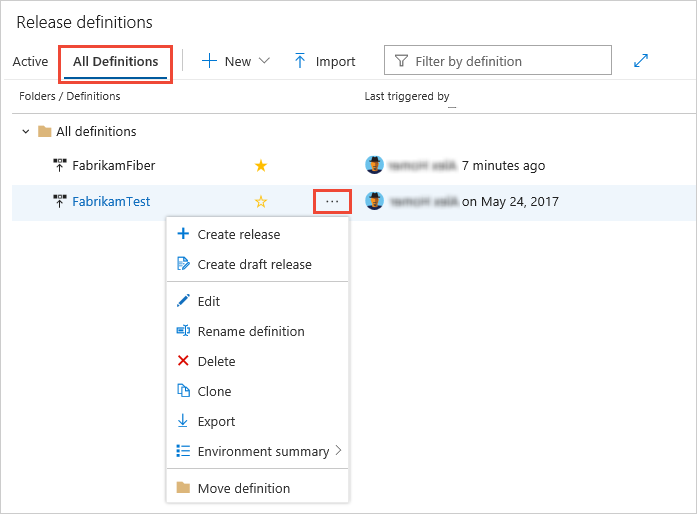

# New release landing page

**Azure Pipelines**

A new and fully redesigned user experience is available for release landing page in Azure Pipelines.
To use this page, you may need to switch it on using one of the on-screen prompts,
or from the [user profile **Previews** panel](../../project/navigation/preview-features.md#enable-features-for-your-use).

## Highlights

* [See a list of the release pipelines you release often](#listdefs)
* [Search your pipelines and favorite them](#favorite) 
* [Get great artifact traceability - see only the most relevant releases for a pipeline currently deployed to a stage](#filter) 
* [View the pipeline easily by expanding a release](#pipeline)
* [Create folders for organization and security](#folders)
* [Set permissions at a folder level](#folders)

## Active tab

The **Active** tab shows a list of release pipelines, and contains links to create or import a pipeline,
edit the selected pipeline, and create a release.

Use the drop-down menu to create a draft release, or to delete, clone, or export the selected release pipeline.

Search for pipelines if you have many in your list, or make it easy to select regularly used pipelines by adding them to your list of favorites...

... or use the filter options to show the required subset of pipelines.

Use the drop-down menu to open a release and see the pipeline, abandon an executing release, delete a release, or to retain a release indefinitely.

##All definitions tab

The **All pipelines** tab shows all your release pipelines as a folder tree.
Create folders and set permissions at folder level.
Use the drop-down menu to create a release or work with the selected pipeline.

Because this is currently a preview, expect to see changes to the features and layout as development of the page continues.

[!INCLUDE [rm-help-support-shared](../_shared/rm-help-support-shared.md)]
