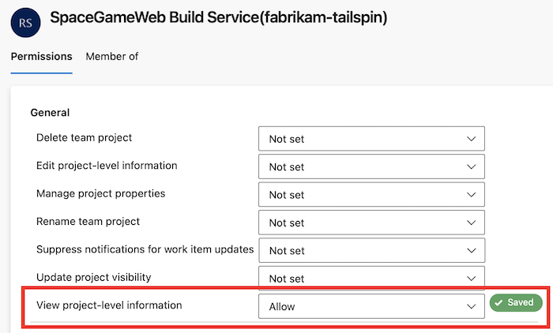
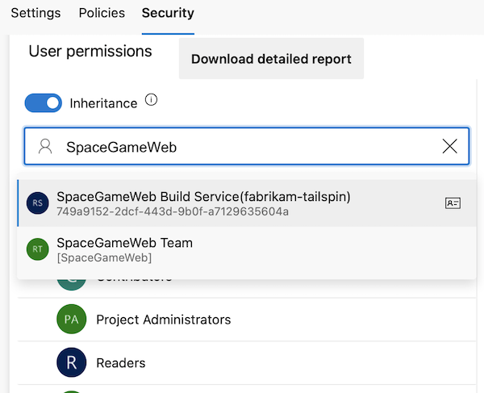
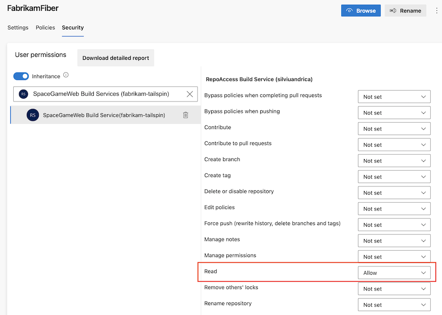
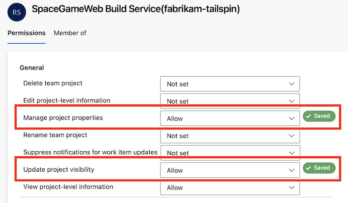

# Access repositories, artifacts, and other resources

[!INCLUDE [version-lt-eq-azure-devops](../../includes/version-lt-eq-azure-devops.md)]

::: moniker range="tfs-2018"
[!INCLUDE [temp](../includes/concept-rename-note.md)]
::: moniker-end

At run-time, each job in a pipeline may access other resources in Azure DevOps. For example, a job may:
- Check out source code from a Git repository
- Add a tag to the repository
- Access a feed in Azure Artifacts
- Upload logs from the agent to the service
- Upload test results and other artifacts from the agent to the service
- Update a work item

Azure Pipelines uses job access tokens to perform these tasks. A **job access token** is a security token that is dynamically generated by Azure Pipelines for each job at run time. The agent on which the job is running uses the job access token in order to access these resources in Azure DevOps. You can control which resources your pipeline has access to by controlling how permissions are granted to job access tokens.

The token's permissions are derived from (a) job authorization scope and (b) the permissions you set on project or collection build service account.

## Job authorization scope

You can set the job authorization scope to be **collection** or **project**. By setting the scope to **collection**, you choose to let pipelines access all repositories in the collection or organization. By setting the scope to **project**, you choose to restrict access to only those repositories that are in the same project as the pipeline.

# [YAML](#tab/yaml/)

::: moniker range=">=azure-devops-2020"

Job authorization scope can be set for the entire Azure DevOps organization or for a specific project. 

::: moniker-end

:::moniker range="azure-devops-2020"

> [!NOTE]
> In Azure DevOps Server 2020, **Limit job authorization scope to current project** applies only to YAML pipelines and classic build pipelines. It does not apply to classic release pipelines. Classic release pipelines always run with project collection scope.

To set job authorization scope for the organization:

- Navigate to your organization settings page in the Azure DevOps user interface.
- Select **Settings** under **Pipelines**.
- Enable **Limit job authorization scope to current project** to limit the scope to project. This is the recommended setting, as it enhances security for your pipelines.

To set job authorization scope for a specific project:

- Navigate to your project settings page in the Azure DevOps user interface.
- Select **Settings** under **Pipelines**.
- Enable **Limit job authorization scope to current project** to limit the scope to project. This is the recommended setting, as it enhances security for your pipelines.

:::moniker-end

:::moniker range=">azure-devops-2020"

- To set job authorization scope at the organization level for all projects, choose **Organization settings** > **Pipelines** > **Settings**.
- To set job authorization scope for a specific project, choose **Project settings** > **Pipelines** > **Settings**.

Enable one or more of the following settings. Enabling these settings are recommended, as it enhances security for your pipelines.
- **Limit job authorization scope to current project for non-release pipelines** - This setting applies to YAML pipelines and classic build pipelines, and does not apply to [classic release pipelines](../release/index.md).
- **Limit job authorization scope to current project for release pipelines** - This setting applies to [classic release pipelines](../release/index.md) only.

:::moniker-end

::: moniker range=">=azure-devops-2020"

>[!NOTE]
>If the scope is set to **project** at the organization level, you cannot change the scope in each project.

>[!IMPORTANT]
> If the scope is not restricted at either the organization level or project level, then every job in your YAML pipeline gets a collection scoped job access token. In other words, your pipeline has access to any repository in any project of your organization. If an adversary is able to gain access to a single pipeline in a single project, they will be able to gain access to any repository in your organization. This is why, it is recommended that you restrict the scope at the highest level (organization settings) in order to contain the attack to a single project.

::: moniker-end

::: moniker range="<= azure-devops-2019"

If you use Azure DevOps Server 2019, then all YAML jobs run with the job authorization scope set to **collection**. In other words, these jobs have access to all repositories in your project collection. You cannot change this in Azure DevOps Server 2019.

YAML pipelines are not available in TFS.

::: moniker-end

# [Classic](#tab/classic/)

::: moniker range=">=azure-devops-2020"

Job authorization scope can be set for the entire Azure DevOps organization, for a specific project, or for a specific pipeline. 

::: moniker-end

:::moniker range="azure-devops-2020"

> [!NOTE]
> In Azure DevOps Server 2020, **Limit job authorization scope to current project** applies only to YAML pipelines and classic build pipelines. It does not apply to classic release pipelines. Classic release pipelines always run with project collection scope.

To set job authorization scope for the organization:

- Navigate to your organization settings page in the Azure DevOps user interface.
- Select **Settings** under **Pipelines**.
- Enable **Limit job authorization scope to current project** to limit the scope to project. This is the recommended setting, as it enhances security for your pipelines.

To set job authorization scope for a specific project:

- Navigate to your project settings page in the Azure DevOps user interface.
- Select **Settings** under **Pipelines**.
- Enable **Limit job authorization scope to current project** to limit the scope to project. This is the recommended setting, as it enhances security for your pipelines.

:::moniker-end

:::moniker range=">azure-devops-2020"

- To set job authorization scope at the organization level for all projects, choose **Organization settings** > **Pipelines** > **Settings**.
- To set job authorization scope for a specific project, choose **Project settings** > **Pipelines** > **Settings**.

Enable one or more of the following settings. Enabling these settings are recommended, as it enhances security for your pipelines.
- **Limit job authorization scope to current project for non-release pipelines** - This setting applies to YAML pipelines and classic build pipelines, and does not apply to [classic release pipelines](../release/index.md).
- **Limit job authorization scope to current project for release pipelines** - This setting applies to [classic release pipelines](../release/index.md) only.

:::moniker-end

::: moniker range=">=azure-devops-2020"

>[!NOTE]
>If the scope is set to **project** at the organization level, you cannot change the scope in each project.

::: moniker-end

::: moniker range=">=azure-devops-2020"

To set job authorization scope for a specific pipeline:

- Navigate to the pipeline in the **Pipelines** page.
- Select **Edit** to edit the pipeline.
- In the **Options** tab, select **Project collection** or **Current project** for **Build job authorization scope**.
- Save the build pipeline.

>[!IMPORTANT]
>If the scopes are not restricted at either the organization level or project level, then you are allowing the pipeline authors to determine the access they need to repositories. If an adversary is able to create or edit a pipeline in one project, they will be able to gain access to any repository in your organization. This is why, it is recommended that you restrict the scope at the highest level (organization settings) in order to contain the attack to a single project.

::: moniker-end

::: moniker range="<= azure-devops-2019"

Job authorization scope can be set for each pipeline. To set this scope:

- Navigate to the pipeline in the **Pipelines** page.
- Select **Edit** to edit the pipeline.
- In the **Options** tab, select **Project collection** or **Current project** for **Build job authorization scope**.
- Save the build pipeline.

::: moniker-end

---

>[!NOTE]
> If your pipeline is in a **public project**, then the job authorization scope is automatically restricted to **project** no matter what you configure in any setting. Jobs in a public project can access resources such as build artifacts or test results only within the project and not from other projects of the organization.

:::moniker range="azure-devops-2020"

### Limit job authorization scope to referenced Azure DevOps repositories

In addition to the job authorization scope settings described in the previous section, Azure Pipelines provides a **Limit job authorization scope to referenced Azure DevOps repositories** setting.

Pipelines can access any Azure DevOps repositories in authorized projects unless **Limit job authorization scope to referenced Azure DevOps repositories** is enabled. With this option enabled, you can reduce the scope of access for all pipelines to only Azure DevOps repositories explicitly referenced by a `checkout` step or a `uses` statement in the pipeline job that uses that repository.

For more information, see [Azure Repos Git repositories - Limit job authorization scope to referenced Azure DevOps repositories](../repos/azure-repos-git.md#limit-job-authorization-scope-to-referenced-azure-devops-repositories).

:::moniker-end

:::moniker range=">azure-devops-2020"

### Protect access to repositories in YAML pipelines

In addition to the job authorization scope settings described in the previous section, Azure Pipelines provides a **Protect access to repositories in YAML pipelines** setting.

Pipelines can access any Azure DevOps repositories in authorized projects unless **Protect access to repositories in YAML pipelines** is enabled. With this option enabled, you can reduce the scope of access for all pipelines to only Azure DevOps repositories explicitly referenced by a `checkout` step or a `uses` statement in the pipeline job that uses that repository.

For more information, see [Azure Repos Git repositories - Protect access to repositories in YAML pipelines](../repos/azure-repos-git.md#protect-access-to-repositories-in-yaml-pipelines).

> [!IMPORTANT]
> **Protect access to repositories in YAML pipelines** is enabled by default for new organizations and projects created after May 2020.
:::moniker-end

## Scoped build identities

Azure DevOps uses two built-in identities to execute pipelines.

* A **collection-scoped identity**, which has access to all projects in the collection (or organization for Azure DevOps Services)
* A **project-scoped identity**, which has access to a single project

 These identities are allocated permissions necessary to perform build/release execution time activities when calling back to the Azure DevOps system. There are built-in default permissions, and you may also manage your own permissions as needed.
 
The **collection-scoped identity** name has the following format:
- `Project Collection Build Service ({OrgName})`
- For example, if the organization name is `fabrikam-tailspin`, this account has the name `Project Collection Build Service (fabrikam-tailspin)`.
 
The **project-scoped identity** name has the following format:
- `{Project Name} Build Service ({Org Name})`
- For example, if the organization name is `fabrikam-tailspin` and the project name is `SpaceGameWeb`, this account has the name `SpaceGameWeb Build Service (fabrikam-tailspin)`.

By default, the collection-scoped identity is used, unless configured otherwise as described in the previous [Job authorization scope](#job-authorization-scope) section.

## Manage build service account permissions

One result of setting project-scoped access may be that the project-scoped identity may not have permissions to a resource that the collection-scoped one did have.

You may want to change the permissions of job access token in scenarios such as the following:

- You want your pipeline to access a feed that is in a different project.
- You want your pipeline to be restricted from changing code in the repository.
- You want your pipeline to be restricted from creating work items.

To update the permissions of the job access token:

- First, determine the job authorization scope for your pipeline. See the section above to understand job authorization scope. If the job authorization scope is **collection**, then the corresponding build service account to manage permissions on is **Project Collection Build Service (your-collection-name)**. If the job authorization scope is **project**, then the build service account to manage permissions on is **Your-project-name Build Service (your-collection-name)**.

- To restrict or grant additional access to **Project Collection Build Service (your-collection-name)**:
  - Select **Manage security** in the overflow menu on **Pipelines** page.
  - Under **Users**, select **Project Collection Build Service (your-collection-name)**.
  - Make any changes to the pipelines-related permissions for this account.
  - Navigate to organization settings for your Azure DevOps organization (or collection settings for your project collection).
  - Select **Permissions** under **Security**.
  - Under the **Users** tab, look for **Project Collection Build Service (your-collection-name)**.
  - Make any changes to the non-pipelines-related permissions for this account.
  - Since **Project Collection Build Service (your-collection-name)** is a user in your organization or collection, you can add this account explicitly to any resource - for e.g., to a feed in Azure Artifacts.

- To restrict or grant additional access to **Your-project-name Build Service (your-collection-name)**:
  - The build service account on which you can manage permissions will only be created after you run the pipeline once. Make sure that you already ran the pipeline once.
  - Select **Manage security** in the overflow menu on **Pipelines** page.
  - Under **Users**, select **Your-project-name Build Service (your-collection-name)**.
  - Make any changes to the pipelines-related permissions for this account.
  - Navigate to organization settings for your Azure DevOps organization (or collection settings for your project collection).
  - Select **Permissions** under **Security**.
  - Under the **Users** tab, look for **Your-project-name build service (your-collection-name)**.
  - Make any changes to the non-pipelines-related permissions for this account.
  - Since **Your-project-name Build Service (your-collection-name)** is a user in your organization or collection, you can add this account explicitly to any resource - for e.g., to a feed in Azure Artifacts.

:::moniker range=">=azure-devops-2019"

### Configure permissions for a project to access another project in the same project collection

In this example, the `fabrikam-tailspin/SpaceGameWeb` project-scoped build identity is granted permissions to access the `fabrikam-tailspin/FabrikamFiber` project.

1. In the **FabrikamFiber** project, navigate to **Project settings**, **Permissions**.

    

2. Create a new Group named *External Projects* and add the **SpaceGameWeb Build Service** account.
:::image type="content" source="media/access-tokens/create-new-security-group.png" alt-text="Screenshot of creating a new security group.":::

3.  Choose **Users**, start to type in the name **SpaceGameWeb**, and select the **SpaceGameWeb Build Service** account. If you don't see any search results initially, select **Expand search**.

    

4. Grant the *View project-level information* permission for that user.

    

### Example - Configure permissions to access another repo in the same project collection

In this example, the `fabrikam-tailspin/SpaceGameWeb` project-scoped build identity is granted permission to access the `FabrikamFiber` repository in the `fabrikam-tailspin/FabrikamFiber` project.

1. Follow the steps to [grant the `SpaceGameWeb` project-scoped build identity permission to access the `FabrikamFiber` project](#configure-external-project).

2. In the **FabrikamFiber** project, navigate to **Project settings**, **Repositories**, **FabrikamFiber**.

    

:::moniker-end

:::moniker range=">=azure-devops-2019 <= azure-devops-2020"
3.  Choose the **+** icon, start to type in the name **SpaceGameWeb**, and select the **SpaceGameWeb Build Service** account.

    
:::moniker-end

:::moniker range=">azure-devops-2020"
3.  Start to type in the name **SpaceGameWeb**, and select the **SpaceGameWeb Build Service** account.

    
:::moniker-end

:::moniker range=">=azure-devops-2019"

4. Grant *Read* permissions for that user.

    

### Example - Configure permissions to access other resources in the same project collection

In this example, the `fabrikam-tailspin/SpaceGameWeb` project-scoped build identity is granted permissions to access other resources in the `fabrikam-tailspin/FabrikamFiber` project.

1. Follow the steps to [grant the `SpaceGameWeb` project-scoped build identity permission to access the `FabrikamFiber` project](#configure-external-project).

2. Configure the desired permissions for that user.

    

:::moniker-end

## FAQ

::: moniker range=">=azure-devops-2019"

### How do I determine the job authorization scope of my YAML pipeline?

:::moniker-end

:::moniker range="azure-devops"

- If your project is a public project, the job authorization scope is always **project** regardless of any other settings.

:::moniker-end

:::moniker range="azure-devops-2019"

All YAML pipelines in Azure DevOps Server 2019 run under **collection** job authorization scope.

:::moniker-end

:::moniker range="azure-devops-2020"

* Check the Pipeline settings under your Azure DevOps **Organization settings**:
  * If **Limit job authorization scope to current project** is enabled, then the scope is **project**.
  * If **Limit job authorization scope to current project** is not enabled, then check the Pipeline settings under your **Project settings** in Azure DevOps:
    * If **Limit job authorization scope to current project** is enabled, then the scope is **project**.
    * Otherwise, the scope is **collection**.

:::moniker-end

:::moniker range=">azure-devops-2020"

* If the pipeline is in a private project, check the Pipeline settings under your Azure DevOps **Organization settings**:
  * If **Limit job authorization scope to current project for non-release pipelines** is enabled, then the scope is **project**.
  * If **Limit job authorization scope to current project for non-release pipelines** is not enabled, then check the Pipeline settings under your **Project settings** in Azure DevOps:
    * If **Limit job authorization scope to current project for non-release pipelines** is enabled, then the scope is **project**.
    * Otherwise, the scope is **collection**.

:::moniker-end

### How do I determine the job authorization scope of my classic build pipeline?

:::moniker range="azure-devops"

* If the pipeline is in a public project, then the job authorization scope is **project** regardless of any other settings.

:::moniker-end

:::moniker range="<azure-devops-2020"

* Open the editor for the pipeline and navigate to the **Options** tab.
  * If the **Build job authorization scope** is **Current project**, then scope is **project**.
  * Otherwise, scope is **collection**.

:::moniker-end

:::moniker range="azure-devops-2020"

* Check the Pipeline settings under your Azure DevOps **Organization settings**:
  * If **Limit job authorization scope to current project** is enabled, then the scope is **project**.
  * If **Limit job authorization scope to current project** is not enabled, then check the Pipeline settings under your **Project settings** in Azure DevOps:
    * If **Limit job authorization scope to current project** is enabled, then the scope is **project**.
    * If **Limit job authorization scope to current project** is not enabled, open the editor for the pipeline, and navigate to the **Options** tab.
      * If the **Build job authorization scope** is **Current project**, then scope is **project**.
      * Otherwise, scope is **collection**.

:::moniker-end

:::moniker range=">azure-devops-2020"

* If the pipeline is in a private project, check the Pipeline settings under your Azure DevOps **Organization settings**:
  * If **Limit job authorization scope to current project for non-release pipelines** is enabled, then the scope is **project**.
  * If **Limit job authorization scope to current project for non-release pipelines** is not enabled, then check the Pipeline settings under your **Project settings** in Azure DevOps:
    * If **Limit job authorization scope to current project for non-release pipelines** is enabled, then the scope is **project**.
    * If **Limit job authorization scope to current project for non-release pipelines** is not enabled, open the editor for the pipeline, and navigate to the **Options** tab.
      * If the **Build job authorization scope** is **Current project**, then scope is **project**.
      * Or else, scope is **collection**.

:::moniker-end

### How do I determine the job authorization scope of my classic release pipeline?

:::moniker range="<=azure-devops-2020"

Classic release pipelines in Azure DevOps Server 2020 and below run with **collection** scope.

:::moniker-end

:::moniker range="azure-devops"

* If the pipeline is in a public project, then the job authorization scope is **project** regardless of any other settings.

:::moniker-end

:::moniker range=">azure-devops-2020"

* If the pipeline is in a private project, check the Pipeline settings under your Azure DevOps **Organization settings**:
  * If **Limit job authorization scope to current project for release pipelines** is enabled, then the scope is **project**.
  * If **Limit job authorization scope to current project for release pipelines** is not enabled, then check the Pipeline settings under your **Project settings** in Azure DevOps:
    * If **Limit job authorization scope to current project for release pipelines** is enabled, then the scope is **project**.
    * Otherwise, the scope is **collection**.

:::moniker-end
