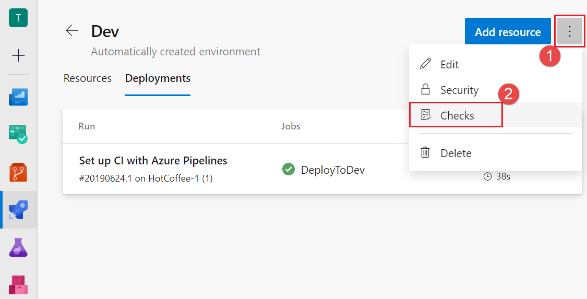

# Approvals and other checks

[!INCLUDE [include](../_shared/version-team-services.md)]

A pipeline is made up of stages. A pipeline author can control whether a stage should run by defining [conditions](conditions.md) on the stage. Another way to control if and when a stage should run is through **checks**. Checks are a mechanism available to the _resource owner_ to control if and when a stage in a pipeline can consume a resource. Pipelines rely on resources such as environments, service connections, agent pools, variable groups, and secure files. As an owner of a resource, you can define checks that must be satisfied before a stage consuming that resource can start. For example, a _manual approval check_ on an [environment](environments.md) would ensure that deployment to that environment only happens after a person has reviewed the changes being deployed. 

A stage can consist of many jobs, and each job can consume several resources. Before the execution of a stage can begin, all checks on all the resources used in that stage must be satisfied. Azure Pipelines pauses the execution of a pipeline prior to each stage, and waits for all pending checks to be completed. If any of the checks fails (for example, if you reject an approval on one of the resources), then that stage is not executed.

Approvals and other checks are not defined in the yaml file. Users modifying the pipeline yaml file cannot modify the checks performed before start of a stage. Administrators of resources manage the checks using the web interface of Azure Pipelines.

> [!IMPORTANT]
> Currently, the only check that is supported is a manual approval check, and the only resource that it is supported on is environments.

## Approvals

You can manually control when a stage should run using approval checks. This is commonly used to control deployments to production environments.

To define an approval on an environment:

1. In your Azure DevOps Services project, navigate to the environment that needs to be protected. (Learn more about [creating an environment](environments.md#creation)).

2. Navigate to **Checks** for the environment.

   > [!div class="mx-imgBorder"]
   > 

3. Select **Create**, provide the approvers and an optional message, and select **Create** again to to complete addition of the manual approval check.

You can add multiple approvers to an environment. These approvers can be individual users or groups of users. When a group is specified as an approver, only one of the users in that group needs to approve for the run to move forward.   

> [!NOTE]
> Currently, all the specified approvers must approve for the stage to proceed.

When you run a pipeline, the execution of that run pauses before entering a stage that uses the environment. Users configured as approvers must review and approve or reject the deployment. If you have multiple runs executing simultaneously, you must approve or reject each of them independently.
