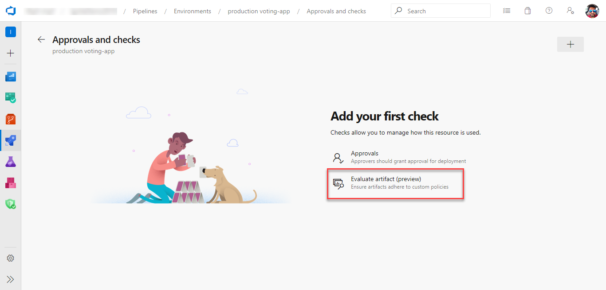
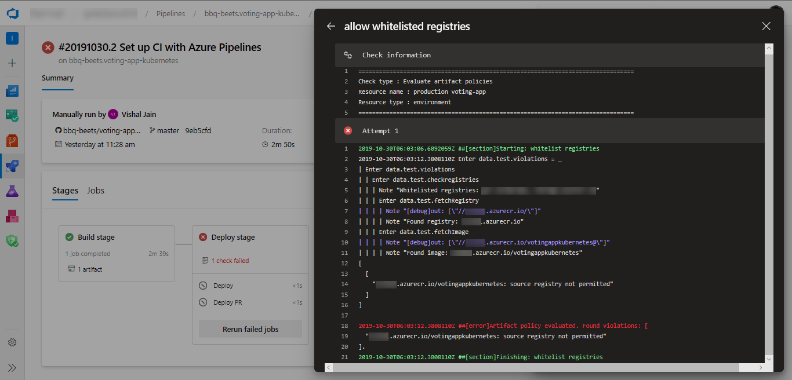

# Approvals and checks

[!INCLUDE [include](../_shared/version-team-services.md)]

A pipeline is made up of stages. A pipeline author can control whether a stage should run by defining [conditions](conditions.md) on the stage. Another way to control if and when a stage should run is through **approvals and checks**. 

 Pipelines rely on resources such as environments, service connections, agent pools, variable groups, and secure files. Checks enable the _resource owner_ to control if and when a stage in any pipeline can consume a resource. As an owner of a resource, you can define checks that must be satisfied before a stage consuming that resource can start. For example, a _manual approval check_ on an [environment](environments.md) would ensure that deployment to that environment only happens after the designated user(s) has reviewed the changes being deployed. 

A stage can consist of many jobs, and each job can consume several resources. Before the execution of a stage can begin, all checks on all the resources used in that stage must be satisfied. Azure Pipelines pauses the execution of a pipeline prior to each stage, and waits for all pending checks to be completed. If any of the checks fails (for example, if you reject an approval on one of the resources), then that stage is not executed.

Approvals and other checks are not defined in the yaml file. Users modifying the pipeline yaml file cannot modify the checks performed before start of a stage. Administrators of resources manage checks using the web interface of Azure Pipelines.

> [!IMPORTANT]
> Currently, manual approval and evaluate artifact are the only available checks, and they can be configured on environments, service connections and agent pools only.

## Approvals

You can manually control when a stage should run using approval checks. This is commonly used to control deployments to production environments.

To define an approval on an environment:

1. In your Azure DevOps Services project, navigate to the environment that needs to be protected. (Learn more about [creating an environment](environments.md#creation)).

2. Navigate to **Approvals and Checks** for the environment.

   > [!div class="mx-imgBorder"]
   > 

3. Select **Create**, provide the approvers and an optional message, and select **Create** again to to complete addition of the manual approval check.

You can add multiple approvers to an environment. These approvers can be individual users or groups of users. When a group is specified as an approver, only one of the users in that group needs to approve for the run to move forward. 
Using the advanced options, you can configure if a subset of approvals is enough or if you need all the specified users to complete the approval. You can also restrict the user who requested (initiated or created) the run from completing the approval. This option is commonly used for segregation of roles amongst the users.

When you run a pipeline, the execution of that run pauses before entering a stage that uses the environment. Users configured as approvers must review and approve or reject the deployment. If you have multiple runs executing simultaneously, you must approve or reject each of them independently. If all required approvals are not complete within the **Timeout** specified for the approval, the stage is marked failed.

## Evaluate artifact

You can evaluate artifact(s) to be deployed to an environment against custom policies.

> [!NOTE]
> Currently, this works with container image artifacts only

To define a custom policy evaluation over the artifact(s), follow the below steps.

1. In your Azure DevOps Services project, navigate to the environment that needs to be protected. Learn more about [creating an environment](environments.md).
    
   > [!div class="mx-imgBorder"]
   > 

2. Navigate to **Approvals and checks** for the environment.

   > [!div class="mx-imgBorder"]
   > 

3. Select **Evaluate artifact**.
    
   > [!div class="mx-imgBorder"]
   > 

4. Paste the policy definition and click **Save**. [See more](artifact-policy.md) about writing policy definitions.

    > [!div class="mx-imgBorder"]
    > 

When you run a pipeline, the execution of that run pauses before entering a stage that uses the environment. The specified policy is evaluated against the available image metadata. The check passes when the policy is successful and fails otherwise. The stage is marked failed if the check fails.

### [Passed](#tab/check-pass)

> [!div class="mx-imgBorder"]
> 

You can also see the complete logs of the policy checks from the pipeline view.

> [!div class="mx-imgBorder"]
> 

### [Failed](#tab/check-failed)

> [!div class="mx-imgBorder"]    
> 

You can also see the complete logs of the policy checks from the pipeline view.

> [!div class="mx-imgBorder"]
> 

* * *
