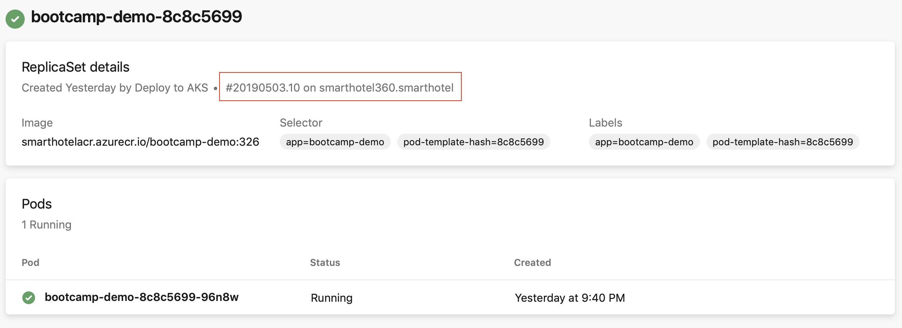
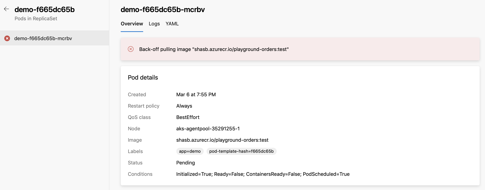

# Environment - Kubernetes resource
[!INCLUDE [include](../_shared/version-team-services.md)]

Kubernetes resource view within environments provides a glimpse of the status of objects within the namespace mapped to the resource. It also overlays pipeline traceability on top of these objects so that one can trace back from a Kubernetes object to the pipeline and then back to the commit.

## Overview

The advantages of using Kubernetes resource views within environments include - 
- **Pipeline traceability** - The [Kubernetes manifest task](../tasks/deploy/kubernetes-manifest.md) used for deployments adds additional annotations to portray pipeline traceability in resource views. This can help in identifying the originating Azure DevOps organization, project and pipeline responsible for updates made to an object within the namespace.

  > [!div class="mx-imgBorder"]
  > 

- **Diagnose resource health** - Workload status can be useful in quickly debugging potential mistakes or regressions that could have been introduced by a new deployment. For example, in the case of unconfigured *imagePullSecrets* resulting in ImagePullBackOff errors, pod status information can help identify the root cause for this issue.
  > [!div class="mx-imgBorder"]
  > 

## Kubernetes resource creation
### Azure provider
A [ServiceAccount](https://kubernetes.io/docs/tasks/configure-pod-container/configure-service-account/) is created in the chosen cluster and namespace. For an RBAC enabled cluster, [RoleBinding](https://kubernetes.io/docs/reference/access-authn-authz/rbac/#service-account-permissions) is created as well to limit the scope of the created service account to the chosen namespace. For an RBAC disabled cluster, the ServiceAccount created has cluster-wide privileges (across namespaces).

1. In the environment details page, click on **Add resource** and choose **Kubernetes**.
2. Select **Azure Kubernetes Service** in the Provider dropdown.
3. Choose the Azure subscription, cluster and namespace (new/existing).
4. Click on **Validate and create** to create the Kubernetes resource.

### Generic provider (using existing service account)
While the Azure Provider option creates a new ServiceAccount, the generic provider allows for using an existing ServiceAccount to allow a Kubernetes resource within environment to be mapped to a namespace.

> [!TIP]
> Generic provider (existing service account) is useful for mapping a Kubernetes resource to a namespace from a non-AKS cluster.

1. In the environment details page, click on **Add resource** and choose **Kubernetes**.
2. Select **Generic provider (existing service account)** in the Provider dropdown.
3. Input cluster name and namespace values.
4. For fetching Server URL, execute the following command on your shell - 

   ```
   kubectl config view --minify -o jsonpath={.clusters[0].cluster.server}
   ```
5. For fetching Secret object required to connect and authenticate with the cluster, the following sequence of commands need to be run -

   ```
   kubectl get serviceAccounts <service-account-name> -n <namespace> -o=jsonpath={.secrets[*].name}
   ```   

   The above command fetches the name of the secret associated with a ServiceAccount. The output of the above command is to be substituted in the following command for fetching Secret object - 

   ```
   kubectl get secret <service-account-secret-name> -n <namespace> -o json
   ```

   Copy and paste the Secret object fetched in JSON form into the Secret text-field.

6. Click on **Validate and create** to create the Kubernetes resource.