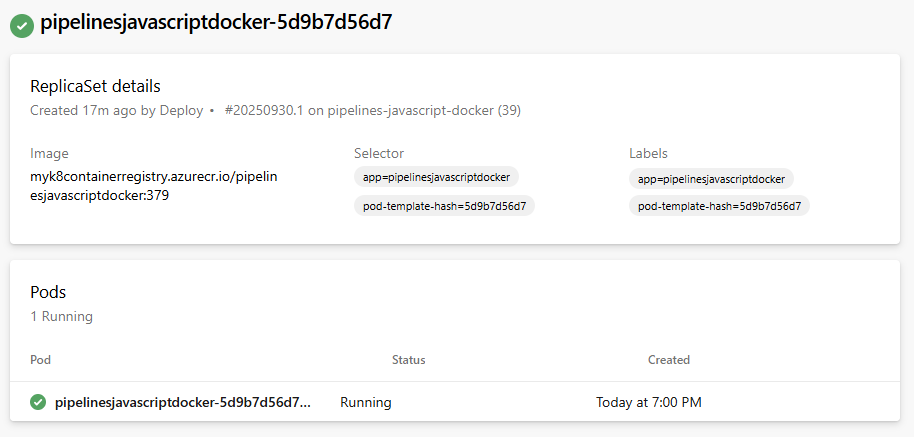
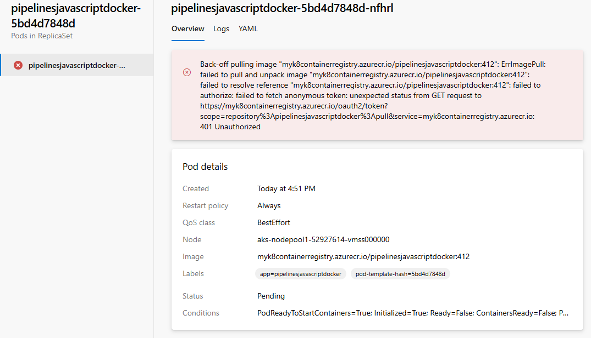

# Environment - Kubernetes resource

[!INCLUDE [include](../includes/version-team-services.md)]

The Kubernetes resource view provides a glimpse into the status of objects within the namespace that's mapped to the resource. This view also overlays pipeline traceability so you can trace back from a Kubernetes object to the pipeline, and then back to the commit.

Use Kubernetes resources to target Kubernetes clusters in an [environment](environments.md) for deployment. Use pipelines to deploy to Azure Kubernetes Service (AKS) and clusters from any other cloud provider.

To learn more about how resources work, see [resources in YAML](resources.md) and [security with resources](../security/resources.md).

## Overview

See the following advantages of using Kubernetes resource views within environments:

- **Pipeline traceability** - The [Kubernetes manifest task](../tasks/deploy/kubernetes-manifest.md), used for deployments, adds more annotations to show pipeline traceability in resource views. Pipeline traceability helps to identify the originating Azure DevOps organization, project, and pipeline responsible for updates that were made to an object within the namespace.

  > [!div class="mx-imgBorder"]
  > 

- **Diagnose resource health** - Workload status can be useful for quickly debugging mistakes or regressions that might have been introduced by a new deployment. For example, for unconfigured *imagePullSecrets* resulting in ImagePullBackOff errors, pod status information can help you identify the root cause for the issue.
  > [!div class="mx-imgBorder"]
  > 

- **Review App** - Review App works by deploying every pull request from your Git repository to a dynamic Kubernetes resource under the environment. Reviewers can see how those changes look and work with other dependent services before they're merged into the target branch and deployed to production.

## Use Azure Kubernetes Service

A [ServiceAccount](https://kubernetes.io/docs/tasks/configure-pod-container/configure-service-account/) gets created in your chosen cluster and namespace when you use Azure Kubernetes Service (AKS). For a [Kubernetes RBAC](/azure/aks/azure-ad-rbac)-enabled cluster, [RoleBinding](https://kubernetes.io/docs/reference/access-authn-authz/rbac/#service-account-permissions) also gets created to limit the scope of the created service account to the chosen namespace. For a Kubernetes RBAC-disabled cluster, the ServiceAccount created has cluster-wide privileges (across namespaces).
### Add an AKS Kubernetes resource

1. In the environment details page, select **Add resource** and choose **Kubernetes**.
2. Select **Azure Kubernetes Service** in the Provider dropdown.
3. Choose the Azure subscription, cluster, and namespace (new/existing).
4. Select **Validate and create** to create the Kubernetes resource.
5. Verify that you see a cluster for your environment.

    :::image type="content" source="media/kubernetes-environment-cluster.png" alt-text="Add a Kubernetes cluster.":::

## Use an existing service account

The Azure Kubernetes Service creates a new ServiceAccount, but the generic provider option lets you use an existing ServiceAccount. The existing ServiceAccount can be mapped to a Kubernetes resource within your environment to a namespace.

For more information about setting up a Kubernetes service connection outside of an environment, see the [Kubernetes service connection](../library/service-endpoints.md#common-service-connection-types) section in [Service connections](../library/service-endpoints.md).

> [!TIP]
> Use the generic provider (existing service account) to map a Kubernetes resource to a namespace from a non-AKS cluster.

### Add a non-AKS Kubernetes resource

1. In the environment details page, select **Add resource** and choose **Kubernetes**.
2. Select **Generic provider (existing service account)** for your provider.
3. Add the cluster name and namespace values.
4. Add the server URL. You can get the URL with the following command:

   ```
   kubectl config view --minify -o 'jsonpath={.clusters[0].cluster.server}'
   ```

5. To get your secret object, find the service account secret name.

   ```
   kubectl get serviceAccounts <service-account-name> -n <namespace> -o 'jsonpath={.secrets[*].name}'
   ```

6. Get the secret object using the output of the previous step.

   ```
   kubectl get secret <service-account-secret-name> -n <namespace> -o json
   ```

7. Copy and paste the Secret object fetched in JSON form into the Secret field.

8. Select **Validate and create** to create the Kubernetes resource.

## Reference your Kubernetes resources in a pipeline

If you're using Azure Kubernetes Service and building a YAML pipeline, the easiest way to configure your pipeline is to use a template. Connect to your repository and select one of the following two Kubernetes Service options:

- [Deploy to Azure Kubernetes Services template](../ecosystems/kubernetes/aks-template.md)
- Deploy to Kubernetes - Review App with Azure DevSpaces

The templates let you set up Review App without needing to write YAML code from scratch or manually create explicit role bindings.

:::image type="content" source="media/kubernetes-yaml-templates.png" alt-text="Kubernetes template options.":::

### Set up Review App

In the following example, the first deployment job is run for non-PR branches and does deployments against a regular Kubernetes resource under environments. The second job runs only for PR branches and deploys against Review App resources (namespaces inside Kubernetes cluster) generated on demand. Resources get labeled with "Review" in the resource listing view of the environment.
Define variables to use in the pipeline. If you use the [Deploy to Azure Kubernetes Services template](../ecosystems/kubernetes/aks-template.md), these variables get defined for you.

```YAML
trigger: main

resources:
- repo: self

variables:
  dockerRegistryServiceConnection: '12345' # Docker service connection identifier
  vmImageName: 'myVM' # name of your VM
  envName: 'myEnv' # name of your environment
  resourceName: 'myResource' # name of the resource you are referencing
  dockerfilePath: '**/Dockerfile'
  tag: '$(Build.BuildId)' # tag added for your build
  k8sNamespaceForPR: 'my-namespace' # namespace used in your PR
  imagePullSecret: 'my-app-secret' # image pull secret
  imageRepository: 'name-of-image-repository' # name of image repository
  containerRegistry: 'mycontainer.azurecr.io' # path to container registry


- stage: Deploy
  displayName: Deploy stage
  dependsOn: Build

  jobs:
  - deployment: Deploy
    condition: and(succeeded(), not(startsWith(variables['Build.SourceBranch'], 'refs/pull/')))
    displayName: Deploy
    pool:
      vmImage: $(vmImageName)
    environment: $(envName).$(resourceName)
    strategy:
      runOnce:
        deploy:
          steps:
          - task: KubernetesManifest@0
            displayName: Create imagePullSecret
            inputs:
              action: createSecret
              secretName: $(imagePullSecret)
              dockerRegistryEndpoint: $(dockerRegistryServiceConnection)
              
          - task: KubernetesManifest@0
            displayName: Deploy to Kubernetes cluster
            inputs:
              action: deploy
              manifests: |
                $(Pipeline.Workspace)/manifests/deployment.yml
                $(Pipeline.Workspace)/manifests/service.yml
              imagePullSecrets: |
                $(imagePullSecret)
              containers: |
                $(containerRegistry)/$(imageRepository):$(tag)

  - deployment: DeployPullRequest
    displayName: Deploy Pull request
    condition: and(succeeded(), startsWith(variables['Build.SourceBranch'], 'refs/pull/'))
    pool:
      vmImage: $(vmImageName)
      
    environment: '$(envName).$(k8sNamespaceForPR)'
    strategy:
      runOnce:
        deploy:
          steps:
          - reviewApp: $(resourceName)

          - task: Kubernetes@1
            displayName: 'Create a new namespace for the pull request'
            inputs:
              command: apply
              useConfigurationFile: true
              inline: '{ "kind": "Namespace", "apiVersion": "v1", "metadata": { "name": "$(k8sNamespaceForPR)" }}'

          - task: KubernetesManifest@0
            displayName: Create imagePullSecret
            inputs:
              action: createSecret
              secretName: $(imagePullSecret)
              namespace: $(k8sNamespaceForPR)
              dockerRegistryEndpoint: $(dockerRegistryServiceConnection)
          
          - task: KubernetesManifest@0
            displayName: Deploy to the new namespace in the Kubernetes cluster
            inputs:
              action: deploy
              namespace: $(k8sNamespaceForPR)
              manifests: |
                $(Pipeline.Workspace)/manifests/deployment.yml
                $(Pipeline.Workspace)/manifests/service.yml
              imagePullSecrets: |
                $(imagePullSecret)
              containers: |
                $(containerRegistry)/$(imageRepository):$(tag)
```

To use this job in an **existing** pipeline, the service connection backing the regular Kubernetes environment resource must be modified to "Use cluster admin credentials". Otherwise, role bindings must be created for the underlying service account to the Review App namespace.

## Next steps

> [!div class="nextstepaction"]
> [Build and deploy to Azure Kubernetes Service](../ecosystems/kubernetes/aks-template.md)

## Related articles

- [Deploy manifests](../ecosystems/kubernetes/deploy.md) and [bake manifests](../ecosystems/kubernetes/bake.md)
- [Multi-cloud Kubernetes deployments](../ecosystems/kubernetes/multi-cloud.md)
- [Deployment strategies for Kubernetes in Azure Pipelines](../ecosystems/kubernetes/deployment-strategies.md)
- [Deploy ASP.NET Core apps to Azure Kubernetes Service with Azure DevOps Starter](/azure/devops-project/azure-devops-project-aks)
- [REST API: Kubernetes with Azure DevOps](/rest/api/azure/devops/distributedtask/kubernetes/add)
