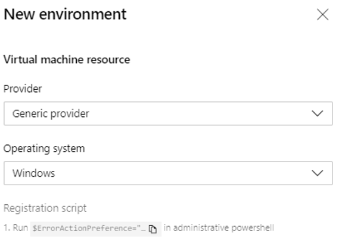

# Environment - virtual machine resource
[!INCLUDE [include](../_shared/version-team-services.md)]

Virtual machines can be added as resources within environments and can be targeted for multi-VM deployments. Deployment history views within the environment provide traceability from VM to the pipeline and then to the commit.

## Virtual machine resource creation

You can define environments in the **Environments** hub within the **Pipelines** section.
1.	Sign into your Azure DevOps organization and navigate to your project.
2.	In your project, navigate to the Pipelines page. Then choose **Environments** and click **Create Environment**.  Specify a **Name** (required) for the environment and a **Description**.
3.	Choose  **Virtual Machines** as a  **Resource** to be added to the environment and click **Next**.
4.	Choose **Operating System (Windows/Linux)** and **copy PS registration script**. 
5.	Now run the copied script from an administrator PowerShell command prompt on each of the target VMs to be registered with this Environment.
    > [!NOTE]
    > - Personal Access Token of the logged in user is pre-inserted in the script which expires on the same day making the copied script unusable thereon.
    > - If your VM already has any agent running on it, provide a unique name for “agent” to register with environment.
6.	Once VM is registered, it will start appearing as an environment resource under “resources” tab of the environment.
    > [!div class="mx-imgBorder"]
    > 

7.	For adding more VMs, you can view and copy the script again by clicking on “Add resource” and choosing “Virtual Machines” as resource. This script would remain same for all the VMs to be added to this environment. 
8.	Each machine interacts with Azure Pipelines to coordinate deployment of your app.
    > [!div class="mx-imgBorder"]
    > 

## Adding and managing tags

You can add tags to the VM as part of the interactive PS registration script (or) 
you can also add/remove the same from the resource view by clicking on the triple dots at the end of each VM resource in the resources view.

The tags you assign allow you to limit deployment to specific virtual machines when the environment is used in a Deployment job. Tags are each limited to 256 characters, but there is no limit to the number of tags you can use.
> [!div class="mx-imgBorder"]
> 
  
## Reference VM resources in pipelines

Create a new pipeline by referencing the environment and VM resources in a pipeline YAML:
```YAML
jobs:  
  - deployment: VMDeploy
    displayName: web
    environment:
      name:  VMenv
      resourceType: VirtualMachine
      tags: web1
    strategy:
```

You can select specific sets of virtual machines from the environment to receive the deployment by specifying the **tags** that you have defined for each virtual machine in the environment.
[Here](https://docs.microsoft.com/azure/devops/pipelines/yaml-schema?view=azure-devops&tabs=schema#deployment-job) is the complete YAML schema for Deployment job.

## Apply deployment strategy 

You can apply a deployment strategy to define how your application is rolled out. We currently support the `runOnce` strategy and the `rolling` strategy for VMs.
[Here](https://docs.microsoft.com/azure/devops/pipelines/process/deployment-jobs?view=azure-devops#deployment-strategies) is the reference documentation for deployment strategies and the details about various life cycle hooks.

## Deployment history views

Deployments view of the environment provides complete traceability of commits and work items, and a cross-pipeline deployment history per environment/resource.
> [!div class="mx-imgBorder"]
> 
  
> [!div class="mx-imgBorder"]
> 
  
## Known limitations
There are a few known gaps in VM support. When you retry a stage, it will re-run the deployment on all VMs not just failed targets. 

## Next steps
Learn more about [deployment job](deployment-jobs.md) and [environment](environments.md).

To learn what else you can do in YAML pipelines, see [YAML schema reference](../yaml-schema.md).
