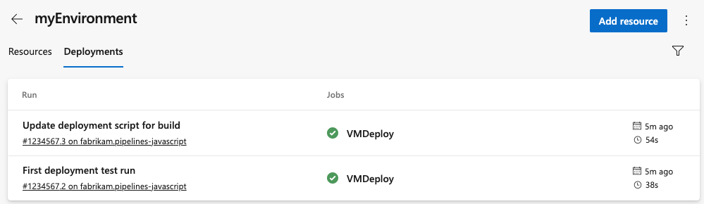

# Environment - virtual machine resource

[!INCLUDE [include](../includes/version-server-2020-rtm.md)]

Use virtual machine (VM) resources to manage deployments across multiple machines with YAML pipelines. VM resources let you install agents on your own servers for rolling deployments.

VM resources connect to [environments](environments.md). After you define an environment, you can add VMs to target with deployments. The deployment history view in an environment provides traceability from your VM to your pipeline.

## Prerequisites

You must have at least a Basic license and access to the following areas:

- the pipeline
- the repository connected to your pipeline
- the VM you want to connect to the environment

For more information about security for Azure Pipelines, see [Pipeline security resources](../security/resources.md)

## Create a VM resource

> [!NOTE]
> You can use this same process to set up physical machines with a registration script.

The first step in adding a VM resource is to define an environment.

### Define an environment

1. Select **Create environment** or **New environment**, depending on whether it's your first environment.
1. Add a **Name** (required) for the environment and a **Description**.
1. Save the new environment.

### Add a resource

1. Select your environment and choose **Add resource**.
1. Select **Virtual machines** for your  **Resource** type. Then select **Next**.

   :::image type="content" source="media/create-environment.png" alt-text="Add an environment.":::

1. Choose Windows or Linux for the **Operating System**.  
1. Copy the registration script. Your script will be a [PowerShell script](/powershell/scripting/overview) if you've selected Windows and a Linux script if you've selected Linux.

   :::image type="content" source="media/vm-creation.png" alt-text="Add a virtual machine.":::    

1. Run the copied script on each of the target virtual machines that you want to register with this environment. 
   - If you're installing on Windows, you'll need to run the script an PowerShell administrator.
   - If you're installing on Linux, you'll need to have permission to download and run executable scripts. 

   > [!NOTE]
   >
   > - The Personal Access Token (PAT) for the signed-in user gets included in the script. The PAT expires on the day you generate the script.
   > - If your VM already has any other agent running on it, provide a unique name for **agent** to register with the environment.
   > - To learn more about installing the agent script, see [Self-hosted Linux agents](../agents/v2-linux.md) and [Self-hosted Windows agents](../agents/v2-windows.md). The agent scripts for VM resources are like the scripts for self-hosted agents and you can use the same commands.

1. Once your VM is registered, it appears as an environment resource under the **Resources** tab of the environment.
1. To add more VMs, copy the script again. Select **Add resource** > **Virtual machines**. The Windows and Linux scripts are the same for all the VMs added to the environment.
1. When the VM script is successfully installed, your VM appears in the list of resources for the environment.

   :::image type="content" source="media/vm-resourceview.png" alt-text="View resources.":::

## Use VM in pipelines

Target VMs in your pipeline by referencing the environment. By default, the pipeline job runs for all of the VMs defined for an environment.

```yaml
trigger: 
- main

pool: 
   vmImage: ubuntu-latest

jobs:
- deployment: VMDeploy
displayName: Deploy to VM
environment: 
   name: ContosoDeploy
   resourceType: VirtualMachine
strategy:
   runOnce:
   deploy:   
      steps:
      - script: echo "Hello world"
```

You can select specific sets of virtual machines from the environment to receive the deployment with tags. For example, if you only want to deploy to resources with the `windows` tag, add the `tags` parameter and the value `windows` to your pipeline.

```yaml
trigger: 
- main

pool: 
   vmImage: ubuntu-latest

jobs:
- deployment: VMDeploy
displayName: Deploy to VM
environment: 
   name: ContosoDeploy
   resourceType: VirtualMachine
   tags: windows # only deploy to virtual machines with this tag
strategy:
   runOnce:
   deploy:   
      steps:
      - script: echo "Hello world"
```

To learn more about deployment jobs, see the [YAML schema](../yaml-schema.md?tabs=schema#deployment-job).

## Add and manage tags

Tags give you a way to target specific VMs in an environment for deployment. You can add tags to the VM as part of the interactive registration script or through the UI. Tags are each limited to 256 characters. There's no limit to the number of tags that you can use.

Add or remove tags in the UI from the resource view by selecting **More actions** :::image type="icon" source="../../media/icons/more-actions.png" border="false"::: for a VM resource.

:::image type="content" source="media/vm-tags.png" alt-text="Set VM tags.":::

When you select multiple tags, VMs that include all the tags get used in your pipeline.  For example, this pipeline targets VMs with both the `windows` and `prod` tags. If a VM only has one of these tags, it's not targeted.

```yaml
trigger: 
- master

pool: 
   vmImage: ubuntu-latest

jobs:
- deployment: VMDeploy
displayName: Deploy to VM
environment: 
   name: ContosoDeploy
   resourceType: VirtualMachine
   tags: windows,prod # only deploy to virtual machines with both windows and prod tags
strategy:
   runOnce:
   deploy:   
      steps:
      - script: echo "Hello world"
```

## Apply deployment strategy

Apply a deployment strategy to define how your application gets rolled out. The `runOnce` strategy and the `rolling` strategy for VMs are both supported.
For more information about deployment strategies and life-cycle hooks, see [Deployment jobs/Deployment strategies](./deployment-jobs.md#deployment-strategies).

## View deployment history

Select the **Deployments** tab for complete traceability of commits and work items, and a cross-pipeline deployment history per environment and resource.
> [!div class="mx-imgBorder"]
> 
  
> [!div class="mx-imgBorder"]
> 
  
## Remove a VM from an environment

### Windows environment

To remove VMs from a Windows environment, run the following command.
Ensure you do the following tasks:

- Run the command from an administrator PowerShell command prompt
- Run the command on each machine
- Run the command in the same folder path as the environment registration command was run

```
./config.cmd remove
```

### Linux environment

To remove a VM from a Linux environment, run the following command on each machine.

```
./config.sh remove
```

## Known limitations

When you retry a stage, it reruns the deployment on all VMs and not just failed targets.

## Next steps

> [!div class="nextstepaction"]
> [Learn about deployment jobs](deployment-jobs.md).

## Related articles

- [About environments](environments.md)
- [YAML schema reference](../yaml-schema.md)
