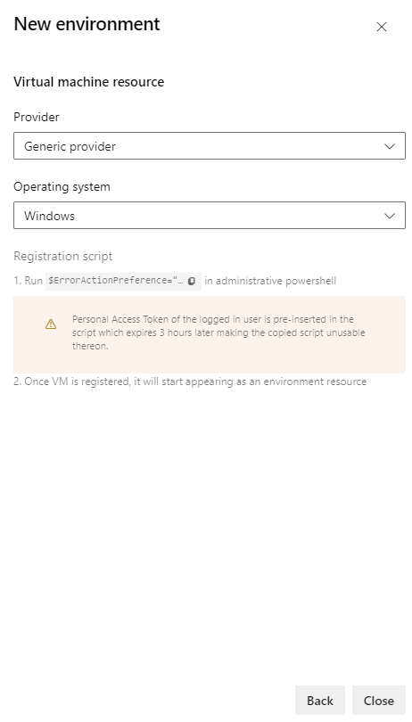
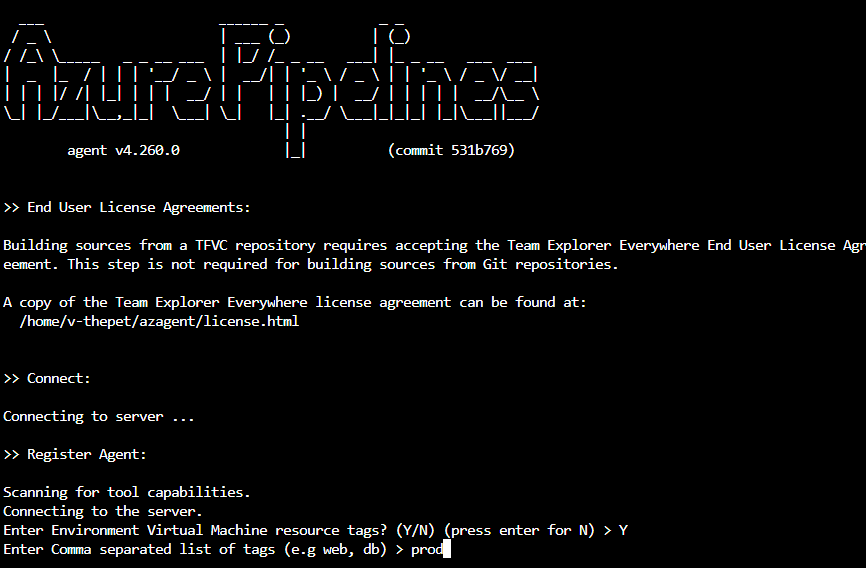

# Environment - virtual machine resource
[!INCLUDE [include](../includes/version-team-services.md)]

Virtual machines can be added as resources within environments and can be targeted for multi-VM deployments. Deployment history views within the environment provide traceability from the VM to the pipeline and then to the commit.

## Virtual machine resource creation

You can define environments in **Environments** under **Pipelines**.
1. Click **Create Environment**.  
2. Specify a **Name** (required) for the environment and a **Description**.
3.    Choose **Virtual Machines** as a  **Resource** to be added to the environment and click **Next**.
4.    Choose Windows or Linux for the **Operating System**.
5.  Copy the  registration script. 
6.    Run the copied script from an administrator PowerShell command prompt on each of the target VMs that you want to register with this environment.

   > [!NOTE]
   > - The Personal Access Token (PAT) of the logged in user is included in the script.  The PAT expires on the day you generate the script.
   > - If your VM already has any agent other running on it, provide a unique name for **agent** to register with the environment.
7.    Once your VM is registered, it will start appearing as an environment resource under the **Resources** tab of the environment.

   > [!div class="mx-imgBorder"]
   > 

8.    To add more VMs, copy the script again by clicking **Add resource** and selecting **Virtual Machines**. This script remains the same for all the VMs added to the environment. 
9.    Each machine interacts with Azure Pipelines to coordinate deployment of your app.

   > [!div class="mx-imgBorder"]
   > 

## Adding and managing tags

You can add tags to the VM as part of the interactive PS registration script. 
You can also add or remove tags from the resource view by clicking on `...` at the end of each VM resource on the **Resources** tab.

The tags you assign allow you to limit deployment to specific virtual machines when the environment is used in a deployment job. Tags are each limited to 256 characters. There is no limit to the number of tags you can use.
> [!div class="mx-imgBorder"]
> 
  
## Reference VM resources in pipelines

Create a new pipeline by referencing the environment and VM resources in a pipeline YAML. The environment will be created if it does not already exist.
```YAML
jobs:  
- deployment: VMDeploy
  displayName: web
  environment:
    name:  VMenv
    resourceType: VirtualMachine
    tags: web1
  strategy:
```

You can select specific sets of virtual machines from the environment to receive the deployment by specifying the **tags** that you have defined.
[Here](https://docs.microsoft.com/azure/devops/pipelines/yaml-schema?view=azure-devops&tabs=schema#deployment-job) is the complete YAML schema for a deployment job.

## Apply deployment strategy 

You can apply a deployment strategy to define how your application is rolled out. The `runOnce` strategy and the `rolling` strategy for VMs are both supported.
[Here](https://docs.microsoft.com/azure/devops/pipelines/process/deployment-jobs?view=azure-devops#deployment-strategies) is the reference documentation for deployment strategies and the details about various life-cycle hooks.

## Deployment history views

The **Deployments** tab provides complete traceability of commits and work items, and a cross-pipeline deployment history per environment and resource.
> [!div class="mx-imgBorder"]
> 
  
> [!div class="mx-imgBorder"]
> 
  
## Remove a VM from an Environment
To unconfigure virtual machines that are previously added to an environment, run this command from an administrator PowerShell command prompt on each of the machines, in the same folder path where the script to register to the environment has been previously run:

```
./config.cmd remove
```

## Known limitations
When you retry a stage, it will rerun the deployment on all VMs and not just failed targets. 

## Next steps
Learn more about [deployment jobs](deployment-jobs.md) and [environments](environments.md).

To learn what else you can do in YAML pipelines, see the [YAML schema reference](../yaml-schema.md).
