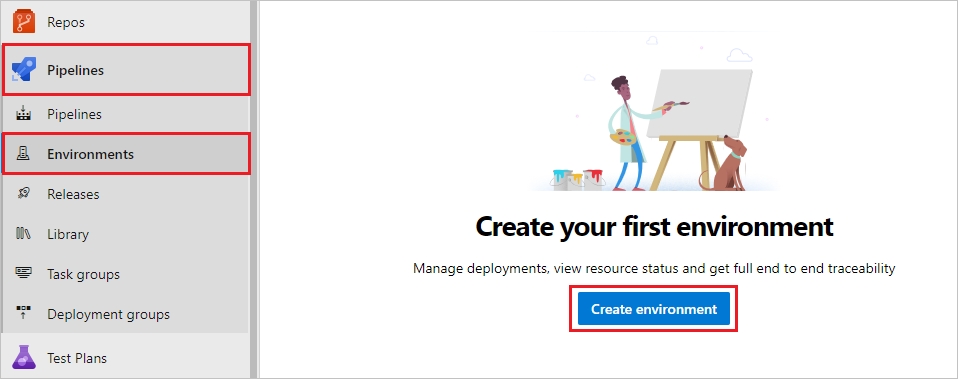
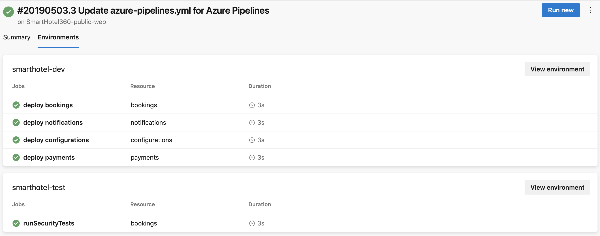
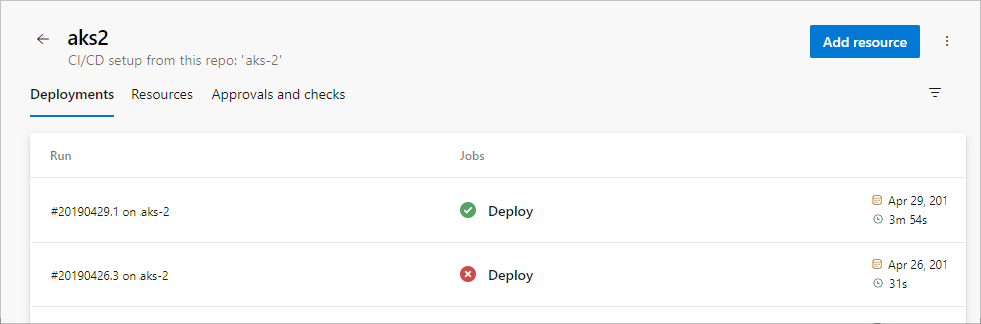
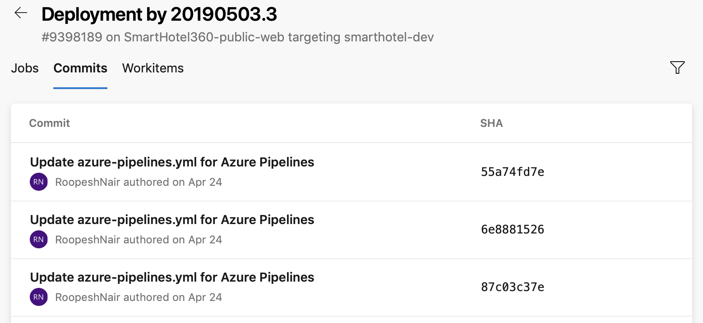

# Create and target an environment

[!INCLUDE [include](../includes/version-server-2020-rtm.md)]

An environment is a collection of [resources](about-resources.md) that you can target with deployments from a pipeline. Typical examples of environment names are Dev, Test, QA, Staging, and Production.

Environments provide the following benefits.

| Benefit                                    | Description                                                                                                                                                                                                                                                                                                 |
|--------------------------------------------|-------------------------------------------------------------------------------------------------------------------------------------------------------------------------------------------------------------------------------------------------------------------------------------------------------------|
| **Deployment history**                     | Pipeline name and run details get recorded for deployments to an environment and its resources. In the context of multiple pipelines targeting the same environment or resource, [deployment history](#deployment-history) of an environment is useful to identify the source of changes.                   |
| **Traceability of commits and work items** | View jobs within the pipeline run that target an environment. You can also view the [commits and work items](#deployment-history) that were newly deployed to the environment. Traceability also allows one to track whether a code change (commit) or feature/bug-fix (work items) reached an environment. |
| **Diagnostic resource health**               | Validate whether the application is functioning at its wanted state.                                                                                                                                                                                                                                       |
| **Security**                            | Secure environments by specifying which users and pipelines are allowed to target an environment.                                                                                                                                                                                                           |

While an environment is a grouping of resources, the resources themselves represent actual deployment targets. The [Kubernetes resource](environments-kubernetes.md) and [virtual machine resource](environments-virtual-machines.md) types are currently supported.

<a name="creation"></a>

## Create an environment

1. Sign in to your organization: ```https://dev.azure.com/{yourorganization}``` and select your project.

2. Select **Pipelines** > **Environments** > **Create environment**.

   > [!div class="mx-imgBorder"]
   > 

3. Enter information for the environment, and then select **Create**. Resources can be added to an existing environment later.

   :::image type="content" source="media/create-new-environment.png" alt-text="Screenshot of creating a new environment.":::

Use a Pipeline to create and deploy to environments, too. For more information, see the [how-to guide](../ecosystems/kubernetes/aks-template.md).

> [!TIP]
> You can create an empty environment and reference it from deployment jobs. This lets you record the deployment history against the environment.

<a name="target-from-deployment-job"></a>

## Target an environment from a deployment job

A [deployment job](deployment-jobs.md) is a collection of steps to be run sequentially. A deployment job can be used to target an entire environment (group of resources) as shown in the following YAML snippet.

```YAML
- stage: deploy
  jobs:
  - deployment: DeployWeb
    displayName: deploy Web App
    pool:
      vmImage: 'Ubuntu-latest'
    # creates an environment if it doesn't exist
    environment: 'smarthotel-dev'
    strategy:
      runOnce:
        deploy:
          steps:
          - script: echo Hello world
```

If the specified environment doesn't already exist, an empty environment gets created using the environment name provided.

<a name="target-resource-from-deployment-job"></a>

## Target a specific resource within an environment from deployment job

You can scope the target of deployment to a particular resource within the environment. Then, you can record deployment history on a specific resource within the environment. The steps of the deployment job *automatically inherit* the service connection details from the resource targeted by the deployment job.

```YAML
environment: 'smarthotel-dev.bookings'
strategy: 
 runOnce:
   deploy:
     steps:
     - task: KubernetesManifest@0
       displayName: Deploy to Kubernetes cluster
       inputs:
         action: deploy
         namespace: $(k8sNamespace)
         manifests: $(System.ArtifactsDirectory)/manifests/*
         imagePullSecrets: $(imagePullSecret)
         containers: $(containerRegistry)/$(imageRepository):$(tag)
         # value for kubernetesServiceConnection input automatically passed down to task by environment.resource input
```

<a name="in-run-details"></a>

## Environment in run details

All environments that get targeted by deployment jobs of a specific run of a pipeline can be found under the *Environments* tab of pipeline run details.

  > [!div class="mx-imgBorder"]
  > 
  
If you're using an AKS private cluster, the **Environments** tab isn't available.

## Approvals

Manually control when a stage should run using approval checks. Use approval checks to control deployments to production environments. Checks are available to the resource Owner to control when a stage in a pipeline consumes a resource. As the owner of a resource, such as an environment, you can [define approvals and checks](approvals.md) that must be satisfied before a stage consuming that resource starts.

We support manual approval checks on environments. For more information, see [Approvals](approvals.md).

The Creator, Administrator, and user roles can manage approvals and checks. The Reader role can't manage approvals and checks.

<a name="deployment-history"></a>

## Deployment history

The deployment history view within environments provides the following advantages.

- View jobs from all pipelines that target a specific environment. For example, two micro-services, each having its own pipeline, are deploying to the same environment. The deployment history listing helps identify all pipelines that effect this environment and also helps visualize the sequence of deployments by each pipeline.

   > [!div class="mx-imgBorder"]
   > 

- Drill down into the job details to see the list of commits and work items that were newly deployed to the environment.

   > [!div class="mx-imgBorder"]
   > 

## Security

### User permissions

Control who can create, view, use, and manage the environments with user permissions. There are four roles - Creator (scope: all environments), Reader, User, and Administrator. In the specific environment's **user permissions** panel, you can set the permissions that are inherited and you can override the roles for each environment.

- Go to the specific **Environment** that you want to authorize.
- Select :::image type="icon" source="../../media/icons/more-actions.png" border="false"::: > **Security** to view the settings.
- Select **User permissions** > **+Add** > **User or group**, and then select a suitable role.

[!INCLUDE [temp](../../organizations/security/includes/environment-roles.md)]

> [!NOTE]
>
> - If you create an environment within a YAML, contributors and project administrators are granted the **Administrator** role. This is typically used in provisioning Dev/Test environments.
> - If you create an environment through the UI, only the creator is granted the **Administrator** role. You should use the UI to create protected environments like for a production environment.

### Pipeline permissions

Use pipeline permissions to authorize all or selected pipelines for deployment to the environment.

- To remove **Open access** on the environment or resource, select **Restrict permission** in **Pipeline permissions**.
- To allow specific pipelines to deploy to an environment or specific resource, select **+** and choose from the list of pipelines.

## Next steps

[Define approvals and checks](approvals.md)

## FAQ

### Q: Why do I get an error message when I try to create an environment?

A: If you see the message "Access denied: {User} needs Create permissions to do the action", check your organization-level permissions. Go to **Organization Settings** > **Users** and check if you have the stakeholder role. The stakeholder role can't create environments. Change your access level and then check to see if you can create environments. For more information, see [User and permissions management FAQ](../../organizations/accounts/faq-user-and-permissions-management.yml).

## Related articles

[Define variables](variables.md)
[Define resources in YAML](resources.md)
