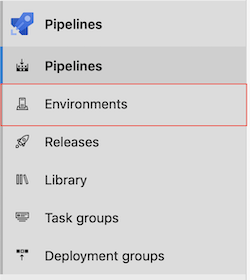
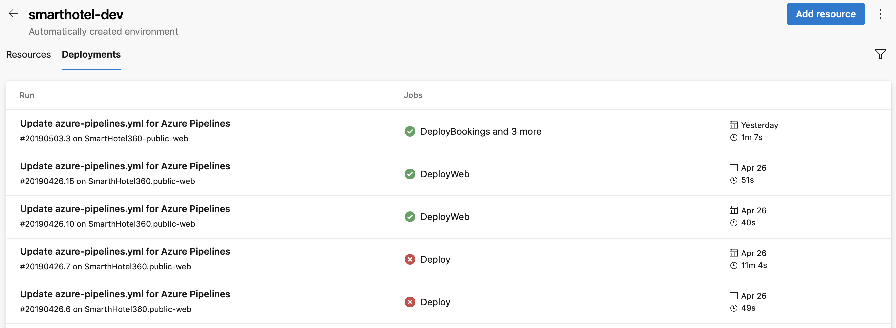
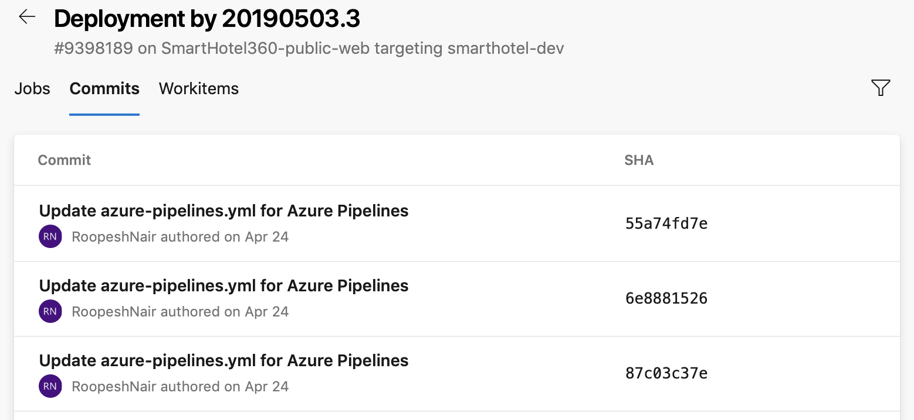

# Environment
[!INCLUDE [include](../_shared/version-team-services.md)]

Environment represents a collection of resources such as namespaces within Kubernetes clusters, Azure Web Apps, virtual machines, databases, which can be targeted by deployments from a pipeline. Typical examples of environments include *Dev, Test, QA, Staging and Production.*

## Overview

The advantages of using environments include - 
- **Deployment history** - Pipeline name and run details are recorded for deployments to an environment and its resources. In the context of multiple pipelines targeting the same environment or resource, [deployment history](#deployment-history) of an environment is useful to identify the source of changes.
- **Traceability of commits and work items** - View jobs within the pipeline run that targeted an environment and the corresponding [commits and work items](#deployment-history) that were newly deployed to the environment. This allows one to track whether a code change (commit) or feature/bug-fix (work items) reached an environment.
- **Diagnose resource health** - The resource health related information shown in resource views allows one to validate whether the application is functioning at its desired state or whether it has regressed post deployments.
- **Permissions** - User permissions and pipeline permissions can be used to secure environments by specifying which users and pipelines are allowed to target an environment.

## Resources
While environment at its core is a grouping of resources, the resources themselves represent actual deployment targets. Currently, only [Kubernetes resource](environments-kubernetes.md) type is supported, with the roadmap of environments including support for other resources such as virtual machines, databases and more.

## Environment creation
1. Sign in to your Azure DevOps organization and navigate to your project.

2. In your project, navigate to the Pipelines page. Then choose Environments and click on **Create Environment**.

  > [!div class="mx-imgBorder"]
  > 

3. After keying in the name of an environment (required) and the description (optional), one can choose to either create an environment with no resources or create an environment with a Kubernetes resource. Note that resources can be added to an existing environment later as well.

> [!TIP]
> It is possible to create an empty environment and reference the same from deployment jobs to record the deployment history against the environment.

## Targeting an environment from a deployment job
A [deployment job](deployment-jobs.md) is a collection of steps to be run sequentially. A deployment job can be used to target an entire environment (group of resources) as shown in the following YAML snippet - 

```YAML
- stage: deploy
  jobs:
  - deployment: DeployWeb
    displayName: deploy Web App
    pool:
      vmImage: 'Ubuntu-16.04'
    # creates an environment if it doesn't exist
    environment: 'smarthotel-dev'
    strategy:
      runOnce:
        deploy:
          steps:
          - script: echo Hello world
```

> [!NOTE]
> If the specified environment doesn't already exist, an empty environment is created using the environment name provided.

## Targeting a specific resource within an environment from deployment job
It is possible to scope down the target of deployment to a particular resource within the environment as shown below. This allows for recording deployment history on a specific resource within the environment as opposed to recoding the history on all resources in the environment. Also, the steps of the deployment job **automatically inherit** the service connection details from resource targeted by the deployment job as shown below - 

```YAML
environment: 'smarthotel-dev.bookings'
  strategy: 
    runOnce:
      deploy:
        steps:
        - task: KubernetesManifest@0
          displayName: Deploy to Kubernetes cluster
          inputs:
            action: deploy
            namespace: $(k8sNamespace)
            manifests: $(System.ArtifactsDirectory)/manifests/*
            imagePullSecrets: $(imagePullSecret)
            containers: $(containerRegistry)/$(imageRepository):$(tag)
            # value for kubernetesServiceConnection input automatically passed down to task by environment.resource input
```

## Environment in run details
All  environments targeted by deployment jobs of a specific run of a pipeline can be found under the *Environments* tab of pipeline run details as shown below -

  > [!div class="mx-imgBorder"]
  > 

<h2 id="deployment-history"> Deployment history within environments </h2>
The deployment history view within environments provides the following advantages - 

1. View jobs from all pipelines that are targeting a specific environment. Consider the scenario where two microservices, each having its own pipeline, are deploying to the same environment. In that case, the deployment history listing helps identify all pipelines that are impacting this environment and also helps visualize the sequence of deployments by each of these pipelines.

  > [!div class="mx-imgBorder"]
  > 


2. Drilldown into the job details reveals the listing of commits and work items that were newly deployed to the environment - 

  > [!div class="mx-imgBorder"]
  > 

## Security

<h3 id="user-permissions">User permissions</h3>
Set appropriate user permissions to ensure that the users are pre-authorized to define a pipeline that targets the environment.

-  Navigate to the specific **environment** that you would like to authorize. 
-  Click on overflow menu button located at the top right part of the page next to "Add resource" and choose **Security** to view the settings.
-  In the **User permissions** blade, click on **+Add** to add a **User or group** and select a suitable **Role**. 

<h3 id="pipeline-permissions">Pipeline permissions</h3>
Pipeline permissions can be used to authorize either all or specific pipelines for deploying to the environment of concern.

- To remove **Open access** on the environment/resource to all the pipelines in the project, click on **Restrict permission** button in the **Pipeline permissions** blade.
- To allow specific pipelines to deploy to the environment or a specific resource, click on **+** button and choose from the list of pipelines.