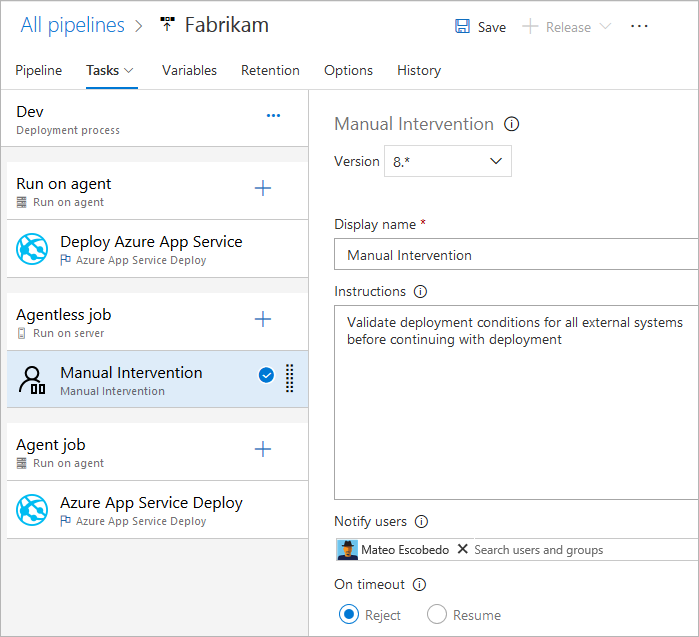

# Multiple jobs

[!INCLUDE [version-tfs-2017-rtm](../_shared/version-tfs-2017-rtm.md)]

::: moniker range="<= tfs-2018"
[!INCLUDE [temp](../_shared/concept-rename-note.md)]
::: moniker-end

You can add multiple [jobs](phases.md) to a pipeline. By using different jobs in a pipeline, you can:

::: moniker range="> tfs-2018"

* Partition your pipeline into sections targeting different agent pools
* Partition your pipeline into sections targeting different sets of self-hosted agents using different demands
* Partition your pipeline into sections that run on agents and those that run without an agent
* Publish build artifacts in one job and consume those in subsequent jobs
* Pause the deployment in the middle using a manual intervention task
* Reduce build time by running multiple jobs in parallel
* Reduce deployment time by selectively downloading different artifacts in different jobs of a deployment pipeline
* [Conditionally execute](conditions.md) a set of tasks

> [!NOTE]
> Running multiple jobs in parallel is supported only in build pipelines at present. It is not yet supported in release pipelines.

::: moniker-end

::: moniker range="tfs-2018"

* Partition your process into sections targeting different agent pools
* Partition your process into sections targeting different sets of self-hosted agents using different demands
* Partition your process into sections that run on agents and those that run without an agent
* Publish build artifacts in one job and consume those in subsequent jobs
* Pause the deployment in the middle using a manual intervention task
* Reduce deployment time by selectively downloading different artifacts in different jobs of a deployment process
* [Conditionally execute](conditions.md) a set of tasks

::: moniker-end

::: moniker range="tfs-2017"

* Partition your process into sections targeting different agent pools
* Partition your process into sections targeting different sets of self-hosted agents using different demands
* Partition your process into sections that run on agents and those that run without an agent
* Pause the deployment in the middle using a manual intervention task

> [!NOTE]
> Jobs are not supported in build pipelines in TFS 2017.

::: moniker-end

> [!NOTE]
> Each agent can run only one job at a time. To run multiple jobs in parallel you must configure multiple agents. You also need sufficient [parallel jobs](../licensing/concurrent-jobs.md).

# [YAML](#tab/yaml)

::: moniker range="azure-devops"

The syntax for defining multiple jobs and their dependencies is:

```yaml
jobs:
- job: string
  dependsOn: string
  condition: string
```

::: moniker-end

::: moniker range="< azure-devops"
YAML builds are not yet available on TFS.
::: moniker-end

# [Designer](#tab/designer)

To add a new job, select '...' on the pipeline channel in the **Tasks** tab of the pipeline. The conditions and order of execution for a job are displayed when you select the job in the editor.

---

## Dependencies

# [YAML](#tab/yaml)

::: moniker range="azure-devops"

Example jobs that build sequentially:

```yaml
jobs:
- job: Debug
  steps:
  - script: echo hello from the Debug build
- job: Release
  dependsOn: Debug
  steps:
  - script: echo hello from the Release build
```

Example jobs that build in parallel (no dependencies):

```yaml
jobs:
- job: Windows
  pool:
    vmImage: 'vs2017-win2016'
  steps:
  - script: echo hello from Windows
- job: macOS
  pool:
    vmImage: 'macOS-10.13'
  steps:
  - script: echo hello from macOS
- job: Linux
  pool:
    vmImage: 'ubuntu-16.04'
  steps:
  - script: echo hello from Linux
```

Example of fan out:

```yaml
jobs:
- job: InitialJob
  steps:
  - script: echo hello from initial job
- job: SubsequentA
  dependsOn: InitialJob
  steps:
  - script: echo hello from subsequent A
- job: SubsequentB
  dependsOn: InitialJob
  steps:
  - script: echo hello from subsequent B
```

Example of fan in:

```yaml
jobs:
- job: InitialA
  steps:
  - script: echo hello from initial A
- job: InitialB
  steps:
  - script: echo hello from initial B
- job: Subsequent
  dependsOn:
  - InitialA
  - InitialB
  steps:
  - script: echo hello from subsequent
```

::: moniker-end
::: moniker range="< azure-devops"
YAML is not yet supported in TFS.
::: moniker-end

# [Designer](#tab/designer)

::: moniker range="> tfs-2018"
When you specify multiple jobs in a build pipeline, they run in parallel by default. You can specify the order in which jobs must execute by configuring dependencies between jobs. Job dependencies are not yet supported in release pipelines. Multiple jobs in a release pipeline run in sequence.
::: moniker-end

::: moniker range="tfs-2018"
Multiple jobs you add to a build or a release pipeline run in sequence. You cannot configure the order of dependencies between jobs in this version of TFS.
::: moniker-end

::: moniker range="< tfs-2018"
Multiple jobs you add to a release pipeline run in sequence. You cannot configure the order of dependencies between jobs in this version of TFS. You cannot also use jobs with build pipelines.
::: moniker-end

For example, the pipeline shown below divides the overall release
execution into separate execution jobs by using two agent jobs
and a [server job](server-phases.md).



In the example above:

1. The tasks in the first job of the release run on an agent
   and, after this job is complete, the agent is released.

1. The server job contains a Manual Intervention task
   that runs on the Azure Pipelines or TFS.
   It does not execute on, or require, an agent or any target servers.
   The Manual Intervention task displays its message and waits for a
   "resume" or "reject" response from the user. In this example, if
   the configured timeout is reached, the task will
   automatically reject the deployment (set the timeout in the control options section to zero if
   you do not want an automated response to be generated).   

1. If the release is resumed, tasks in the third job run -
   possibly on a different agent. If the release is rejected,
   this job does not run and the release is marked as failed.

It's important to understand some of the consequences of
phased execution:

* Each job may use different
  agents. You should not assume that the state from an earlier
  job is available during subsequent jobs.

* The **Continue on Error** and **Always run** options for
  tasks in each job do not have any effect on tasks in
  subsequent jobs. For example, setting
  **Always run** on a task at the end of the first job will
  not guarantee that tasks in subsequent jobs will run.

---

::: moniker range=">=tfs-2018"

## Conditions

You can specify the conditions under which each job runs. By default, a job runs if it does not depend on any other job, or if all of the jobs that it depends on have completed and succeeded. You can customize this behavior by forcing a job to run even if a previous job fails or by specifying a custom condition.

# [YAML](#tab/yaml)

> YAML builds are not yet available on TFS.

Example to run a job based upon the status of running a previous job:

```yaml
jobs:
- job: A
  steps:
  - script: exit 1

- job: B
  dependsOn: A
  condition: failed()
  steps:
  - script: echo this will run when A fails

- job: C
  dependsOn:
  - A
  - B
  condition: succeeded('B')
  steps:
  - script: echo this will run when B runs and succeeds
```

Example of using a [custom condition](conditions.md):

```yaml
jobs:
- job: A
  steps:
  - script: echo hello

- job: B
  dependsOn: A
  condition: and(succeeded(), eq(variables['build.sourceBranch'], 'refs/heads/master'))
  steps:
  - script: echo this only runs for master
```

You can specify that a job run based on the value of an output variable set in a previous job. In this case, you can only use variables set in directly dependent jobs:

```yaml
jobs:
- job: A
  steps:
  - script: "echo ##vso[task.setvariable variable=skipsubsequent;isOutput=true]false"
    name: printvar

- job: B
  condition: and(succeeded(), ne(dependencies.A.outputs['printvar.skipsubsequent'], 'true'))
  dependsOn: A
  steps:
  - script: echo hello from B
```

# [Designer](#tab/designer)

Use the **Run this job** option on an agent or server job to run the tasks
  only when specific [conditions](conditions.md) are met. Select a predefined
  condition, or select "custom" and enter an [expression](conditions.md) that evaluates
  to **true** or **false**. Nested expressions can be used, and the
  expressions can access variables available in the release pipeline.

---

::: moniker-end

## Related topics

* [Jobs](phases.md)
* [Server jobs](server-phases.md)
* [Deployment group jobs](deployment-group-phases.md)
* [Specify conditions](conditions.md)
