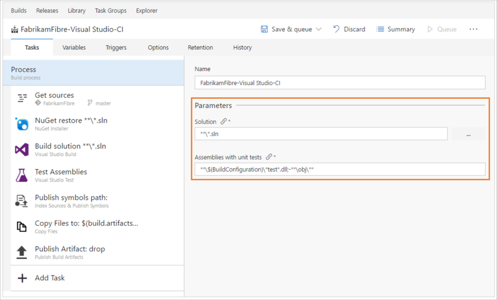
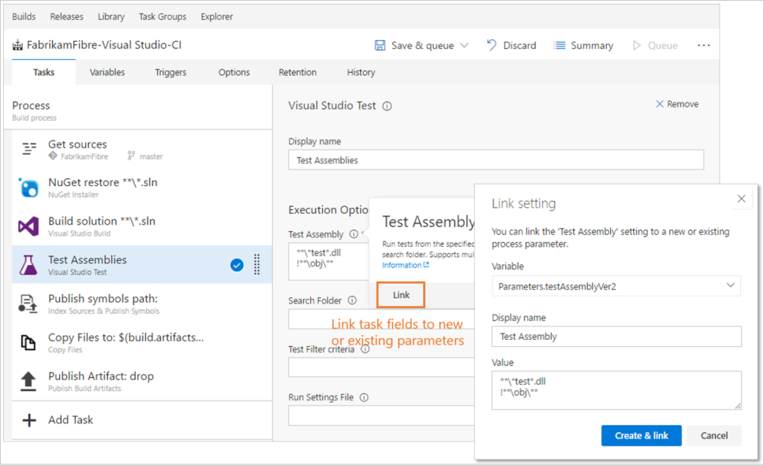
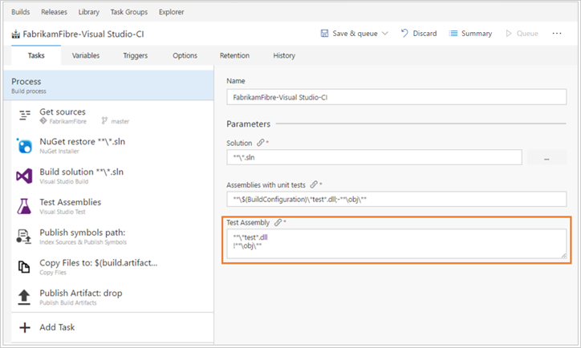
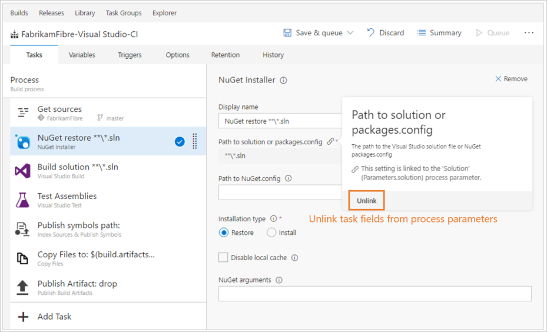

# Process parameters

[!INCLUDE [version-tfs-2017-rtm](../_shared/version-tfs-2017-rtm.md)]

> [!NOTE]
> 
> This guidance applies to TFS version 2017.3 and newer.
> 
> This guidance applies only to designer pipelines. It does not apply to YAML pipelines.

You can link all important arguments for tasks used across the build definition as process parameters, which are then shown at one place - the Pipeline view.
This means you can quickly edit these arguments without needing to click through all the tasks.

Templates come with a set of predefined process parameters.
::: moniker range="<= tfs-2018"

::: moniker-end

::: moniker range="> tfs-2018"
To link additional arguments across all tasks to new or existing process parameters, select **Link** from the task argument.
::: moniker-end
::: moniker range="<= tfs-2018"
You can link additional arguments across all tasks to new or existing process parameters.

::: moniker-end

::: moniker range="> tfs-2018"
Select **Unlink** if you need to disconnect an argument from a process parameter.
::: moniker-end
::: moniker range="<= tfs-2018"
You can also unlink arguments from process parameters.

::: moniker-end

Process parameters differ from variables in the kind of input supported by them. Variables only take in string inputs while process parameters in addition to string inputs support additional data types like check boxes and drop-down list boxes.
