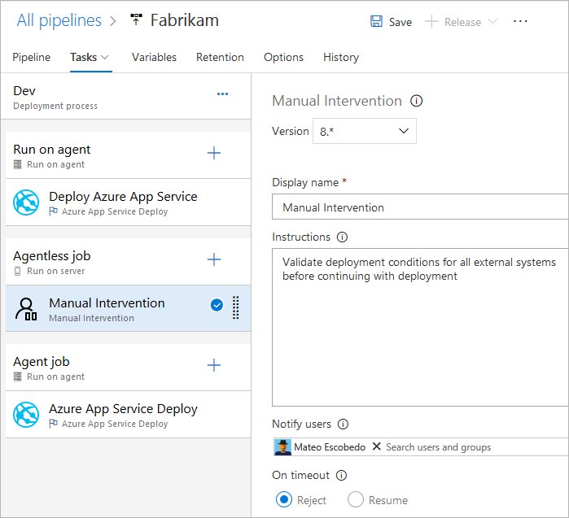

# Specify jobs in your pipeline

[!INCLUDE [version-lt-eq-azure-devops](../../includes/version-lt-eq-azure-devops.md)]

You can organize your pipeline into jobs. Every pipeline has at least one job. A job is a series of steps that run sequentially as a unit. In other words, a job is the smallest unit of work that can be scheduled to run.

To learn about the key concepts and components that make up a pipeline, see [Key concepts for new Azure Pipelines users](../get-started/key-pipelines-concepts.md). 

Azure Pipelines doesn't support job priority for YAML pipelines. To control when jobs run, you can specify [conditions](#conditions) and [dependencies](#dependencies).


## Define a single job

#### [YAML](#tab/yaml/)


In the simplest case, a pipeline has a single job. In that case, you don't have to explicitly use the `job` keyword unless you're using a [template](templates.md). You can directly specify the steps in your YAML file. 

This YAML file has a job that runs on a [Microsoft-hosted agent](../agents/hosted.md) and outputs `Hello world`. 

```yaml
pool:
  vmImage: 'ubuntu-latest'
steps:
- bash: echo "Hello world"
```

You might want to specify more properties on that job. In that case, you can use the `job` keyword. 

```yaml
jobs:
- job: myJob
  timeoutInMinutes: 10
  pool:
    vmImage: 'ubuntu-latest'
  steps:
  - bash: echo "Hello world"
```

Your pipeline could have multiple jobs. In that case, use the `jobs` keyword.

```yaml
jobs:
- job: A
  steps:
  - bash: echo "A"

- job: B
  steps:
  - bash: echo "B"
```

::: moniker range=">=azure-devops-2020"

Your pipeline can have multiple stages, each with multiple jobs. In that case, use the `stages` keyword.

```yaml
stages:
- stage: A
  jobs:
  - job: A1
  - job: A2

- stage: B
  jobs:
  - job: B1
  - job: B2
```

::: moniker-end

::: moniker range="< azure-devops"

The full syntax to specify a job is:

```yaml
- job: string  # name of the job, A-Z, a-z, 0-9, and underscore
  displayName: string  # friendly name to display in the UI
  dependsOn: string | [ string ]
  condition: string
  strategy:
    parallel: # parallel strategy
    matrix: # matrix strategy
    maxParallel: number # maximum number simultaneous matrix legs to run
    # note: `parallel` and `matrix` are mutually exclusive
    # you may specify one or the other; including both is an error
    # `maxParallel` is only valid with `matrix`
  continueOnError: boolean  # 'true' if future jobs should run even if this job fails; defaults to 'false'
  pool: pool # agent pool
  workspace:
    clean: outputs | resources | all # what to clean up before the job runs
  container: containerReference # container to run this job inside
  timeoutInMinutes: number # how long to run the job before automatically cancelling
  cancelTimeoutInMinutes: number # how much time to give 'run always even if cancelled tasks' before killing them
  variables: { string: string } | [ variable | variableReference ] 
  steps: [ script | bash | pwsh | powershell | checkout | task | templateReference ]
  services: { string: string | container } # container resources to run as a service container
```

::: moniker-end

::: moniker range="azure-devops"

The full syntax to specify a job is:

```yaml
- job: string  # name of the job, A-Z, a-z, 0-9, and underscore
  displayName: string  # friendly name to display in the UI
  dependsOn: string | [ string ]
  condition: string
  strategy:
    parallel: # parallel strategy
    matrix: # matrix strategy
    maxParallel: number # maximum number simultaneous matrix legs to run
    # note: `parallel` and `matrix` are mutually exclusive
    # you may specify one or the other; including both is an error
    # `maxParallel` is only valid with `matrix`
  continueOnError: boolean  # 'true' if future jobs should run even if this job fails; defaults to 'false'
  pool: pool # agent pool
  workspace:
    clean: outputs | resources | all # what to clean up before the job runs
  container: containerReference # container to run this job inside
  timeoutInMinutes: number # how long to run the job before automatically cancelling
  cancelTimeoutInMinutes: number # how much time to give 'run always even if cancelled tasks' before killing them
  variables: { string: string } | [ variable | variableReference ] 
  steps: [ script | bash | pwsh | powershell | checkout | task | templateReference ]
  services: { string: string | container } # container resources to run as a service container
  uses: # Any resources (repos or pools) required by this job that are not already referenced
    repositories: [ string ] # Repository references to Azure Git repositories
    pools: [ string ] # Pool names, typically when using a matrix strategy for the job
```

::: moniker-end

::: moniker range=">=azure-devops-2020"

If the primary intent of your job is to deploy your app (as opposed to build or test your app), then you can use a special type of job called **deployment job**.

The syntax for a deployment job is:

```yaml
- deployment: string        # instead of job keyword, use deployment keyword
  pool:
    name: string
    demands: string | [ string ]
  environment: string
  strategy:
    runOnce:
      deploy:
        steps:
        - script: echo Hi!
```

::: moniker-end

::: moniker range="> azure-devops-2019"

Although you can add steps for deployment tasks in a `job`, we recommend that you instead use a [deployment job](deployment-jobs.md). A deployment job has a few benefits. For example, you can deploy to an environment, which includes benefits such as being able to see the history of what you deployed.

::: moniker-end


#### [Classic](#tab/classic/)
To add jobs to your build pipeline, edit the pipeline on the Pipelines page. Select **...**  to add a job.

:::image type="content" source="media/build-pipeline-jobs.png" alt-text="Add a job to the pipeline.":::

To add jobs to your release pipeline, edit the pipeline from **Pipelines** > **Releases**. View the stage tasks in the stage where you want to add your job. Select **...**  to add a job.

* * *
## Types of jobs

Jobs can be of different types, depending on where they run.

::: moniker range=">=azure-devops-2020"

# [YAML](#tab/yaml)

* **Agent pool jobs** run on an agent in an agent pool.
* **Server jobs** run on the Azure DevOps Server.
* **Container jobs** run in a container on an agent in an agent pool. For more information about choosing containers, see [Define container jobs](container-phases.md).

# [Classic](#tab/classic)

* **Agent pool jobs** run on an agent in an agent pool.
* **Server jobs** run on the Azure DevOps Server.
* **Deployment group jobs** run on machines in a deployment group. These jobs are only available in a release pipeline. For more information about defining groups of target servers for deployment, see [Deployment group jobs](deployment-group-phases.md).

---

::: moniker-end

::: moniker range="azure-devops-2019"

# [YAML](#tab/yaml)

* **Agent pool jobs** run on an agent in an agent pool.
* **Server jobs** run on the Azure DevOps Server.

# [Classic](#tab/classic)

* **Agent pool jobs** run on an agent in an agent pool.
* **Server jobs** run on the Azure DevOps Server.
* **Deployment group jobs** run on machines in a deployment group. These jobs are only available in a release pipeline.

---

::: moniker-end


### Agent pool jobs

Agent pool obs are the most common jobs. These jobs run on an agent in an agent pool. You can specify the pool to run the job on, and you can also specify demands to specify what capabilities an agent must have to run your job. Agents can be Microsoft-hosted or self-hosted. For more information, see [Azure Pipelines agents](../agents/agents.md).

* When you're using Microsoft-hosted agents, each job in a pipeline gets a fresh agent.
* When you're using self-hosted agents, you can use [demands](/azure/devops/pipelines/yaml-schema/pool-demands) to specify what capabilities an agent must have to run your job. You can get the same agent for consecutive jobs, depending on whether there's more than one agent in your agent pool that matches your pipeline's demands. If there's only one agent in your pool that matches the pipeline's demands, the pipeline waits until this agent is available.

> [!NOTE]
> Demands and capabilities are designed for use with self-hosted agents so that jobs can be matched with an agent that meets the requirements of the job. When using Microsoft-hosted agents, you select an image for the agent that matches the requirements of the job. Although it's possible to add capabilities to a Microsoft-hosted agent, you don't need to use capabilities with Microsoft-hosted agents.

#### [YAML](#tab/yaml/)

```yaml
pool:
  name: myPrivateAgents    # your job runs on an agent in this pool
  demands: agent.os -equals Windows_NT    # the agent must have this capability to run the job
steps:
- script: echo hello world
```

Or multiple demands:

```yaml
pool:
  name: myPrivateAgents
  demands:
  - agent.os -equals Darwin
  - anotherCapability -equals somethingElse
steps:
- script: echo hello world
```

#### [Classic](#tab/classic/)

You can specify demands in the pipeline, in the jobs, or both. If you specify demands in both the pipeline and in a job, the union of the two sets of demands is required for the system to select an agent.

* * *

Learn more about [agent capabilities](../agents/agents.md#capabilities).

### Server jobs

The server orchestrates and executes tasks in a server job. A server job doesn't require an agent or any target computers. Only a few tasks are supported in a server job now. The maximum time for a server job is 30 days. 

### Agentless jobs supported tasks

Currently, only the following tasks are supported out of the box for agentless jobs:

* [Delay task](/azure/devops/pipelines/tasks/reference/delay-v1)
* [Invoke Azure Function task](/azure/devops/pipelines/tasks/reference/azure-function-v1)
* [Invoke REST API task](/azure/devops/pipelines/tasks/reference/invoke-rest-api-v1)
* [Manual Validation task](/azure/devops/pipelines/tasks/reference/manual-validation-v1)
* [Publish To Azure Service Bus task](/azure/devops/pipelines/tasks/reference/publish-to-azure-service-bus-v2)
* [Query Azure Monitor Alerts task](/azure/devops/pipelines/tasks/reference/azure-monitor-v1)
* [Query Work Items task](/azure/devops/pipelines/tasks/reference/query-work-items-v0)

Because tasks are extensible, you can add more agentless tasks by using extensions. The default timeout for agentless jobs is 60 minutes.  

#### [YAML](#tab/yaml/)


The full syntax to specify a server job is:

```yaml
jobs:
- job: string
  timeoutInMinutes: number
  cancelTimeoutInMinutes: number
  strategy:
    maxParallel: number
    matrix: { string: { string: string } }

  pool: server # note: the value 'server' is a reserved keyword which indicates this is an agentless job
```

You can also use the simplified syntax:

```yaml
jobs:
- job: string
  pool: server # note: the value 'server' is a reserved keyword which indicates this is an agentless job
```

#### [Classic](#tab/classic/)
You add a server job in the editor by selecting '...' on the **Pipeline** channel in the **Tasks** tab of a pipeline. The properties for the server job are displayed when you select the job in the editor.

* * *

## Dependencies

When you define multiple jobs in a single stage, you can specify dependencies between them. Pipelines must contain at least one job with no dependencies. By default Azure DevOps YAML pipeline jobs run in parallel unless the `dependsOn` value is set.

> [!NOTE]
> Each agent can run only one job at a time. To run multiple jobs in parallel, you must configure multiple agents. You also need sufficient [parallel jobs](../licensing/concurrent-jobs.md).

#### [YAML](#tab/yaml/)


The syntax for defining multiple jobs and their dependencies is:

```yaml
jobs:
- job: string
  dependsOn: string
  condition: string
```

Example jobs that build sequentially:

```yaml
jobs:
- job: Debug
  steps:
  - script: echo hello from the Debug build
- job: Release
  dependsOn: Debug
  steps:
  - script: echo hello from the Release build
```

Example jobs that build in parallel (no dependencies):

```yaml
jobs:
- job: Windows
  pool:
    vmImage: 'windows-latest'
  steps:
  - script: echo hello from Windows
- job: macOS
  pool:
    vmImage: 'macOS-latest'
  steps:
  - script: echo hello from macOS
- job: Linux
  pool:
    vmImage: 'ubuntu-latest'
  steps:
  - script: echo hello from Linux
```

Example of fan-out:

```yaml
jobs:
- job: InitialJob
  steps:
  - script: echo hello from initial job
- job: SubsequentA
  dependsOn: InitialJob
  steps:
  - script: echo hello from subsequent A
- job: SubsequentB
  dependsOn: InitialJob
  steps:
  - script: echo hello from subsequent B
```

Example of fan-in:

```yaml
jobs:
- job: InitialA
  steps:
  - script: echo hello from initial A
- job: InitialB
  steps:
  - script: echo hello from initial B
- job: Subsequent
  dependsOn:
  - InitialA
  - InitialB
  steps:
  - script: echo hello from subsequent
```

#### [Classic](#tab/classic/)
To add a new job, select '...' on the pipeline channel in the **Tasks** tab of the pipeline. The conditions and order of execution for a job are displayed when you select the job in the editor.

When you specify multiple jobs in a build pipeline, they run in parallel by default. You can specify the order in which jobs must execute by configuring dependencies between jobs. Job dependencies aren't supported in release pipelines. Multiple jobs in a release pipeline run in sequence. 

For example, the pipeline divides the overall release execution into separate execution jobs by using two agent jobs and a [server job](#server-jobs).



1. The tasks in the first job of the release run on an agent. The agent is released after the job is complete.

1. The server job contains a Manual Intervention task that runs on the Azure Pipelines or DevOps Server. The job doesn't execute on, or require, an agent or any target servers. The Manual Intervention task displays its message and waits for a "resume" or "reject" response from the user. In this example, if the task reaches the configured timeout, the task automatically rejects the deployment. Set the timeout in the control options section to zero if you don't want an automated response to be generated.

1. The tasks in the third jobs are run if the release is resumed, possibly on a different agent. If the release is rejected, this job doesn't run and the release is marked as failed.

It's important to understand some of the consequences of phased execution:

* Each job might use different agents. Don't assume that the state from an earlier job is available during subsequent jobs.

* The **Continue on Error** and **Always run** options for tasks in each job don't have any effect on tasks in subsequent jobs. For example, setting **Always run** on a task at the end of the first job doesn't guarantee that tasks in subsequent jobs run.

* * *

## Conditions

You can specify the conditions under which each job runs. By default, a job runs if it doesn't depend on any other job, or if all of the jobs that it depends on completed successfully. You can customize this behavior by forcing a job to run even if a previous job fails or by specifying a custom condition.

#### [YAML](#tab/yaml/)


Example to run a job based upon the status of running a previous job:

```yaml
jobs:
- job: A
  steps:
  - script: exit 1

- job: B
  dependsOn: A
  condition: failed()
  steps:
  - script: echo this will run when A fails

- job: C
  dependsOn:
  - A
  - B
  condition: succeeded('B')
  steps:
  - script: echo this will run when B runs and succeeds
```

Example of using a [custom condition](conditions.md):

```yaml
jobs:
- job: A
  steps:
  - script: echo hello

- job: B
  dependsOn: A
  condition: and(succeeded(), eq(variables['build.sourceBranch'], 'refs/heads/main'))
  steps:
  - script: echo this only runs for master
```

You can specify that a job run based on the value of an output variable set in a previous job. In this case, you can only use variables set in directly dependent jobs:

```yaml
jobs:
- job: A
  steps:
  - script: "echo '##vso[task.setvariable variable=skipsubsequent;isOutput=true]false'"
    name: printvar

- job: B
  condition: and(succeeded(), ne(dependencies.A.outputs['printvar.skipsubsequent'], 'true'))
  dependsOn: A
  steps:
  - script: echo hello from B
```


#### [Classic](#tab/classic/)


Use the **Run this job** option on an agent or server job to run the tasks only when specific [conditions](conditions.md) are met. Select a predefined condition, or select "custom" and enter an [expression](expressions.md) that evaluates  to **true** or **false**. Nested expressions can be used, and the expressions can access variables available in the release pipeline.


* * *

## Timeouts

To avoid taking up resources when your job is unresponsive or waiting too long, you can set a limit on how long your job can run. Use the job timeout setting to specify the limit in minutes for running the job. Setting the value to **zero** means that the job can run:

* Forever on self-hosted agents
* For 360 minutes (6 hours) on Microsoft-hosted agents with a public project and public repository
* For 60 minutes on Microsoft-hosted agents with a private project or private repository (unless [extra capacity](../agents/hosted.md#capabilities-and-limitations) is paid for)

The timeout period begins when the job starts running. It doesn't include the
time the job is queued or is waiting for an agent.

#### [YAML](#tab/yaml/)


The `timeoutInMinutes` allows a limit to be set for the job execution time. When not specified, the default is 60 minutes. When `0` is specified, the maximum limit is used.

The `cancelTimeoutInMinutes` allows a limit to be set for the job cancel time when the deployment task is set to keep running if a previous task failed. When not specified, the default is 5 minutes. The value should be in range from **1** to **35790** minutes.

```yaml
jobs:
- job: Test
  timeoutInMinutes: 10 # how long to run the job before automatically cancelling
  cancelTimeoutInMinutes: 2 # how much time to give 'run always even if cancelled tasks' before stopping them
```

#### [Classic](#tab/classic/)
Select the job and then specify the timeout value.

On the Options tab, you can specify default values for all jobs in the pipeline. If you specify a nonzero value for the job timeout, then it overrides any value that is specified in the pipeline options. If you specify a zero value, then the timeout value from the pipeline options is used. If the pipeline value is also set to zero, then there's no timeout.

* * *

Timeouts have the following level of precedence.

1. On Microsoft-hosted agents, jobs are [limited in how long they can run based on project type and whether they're run using a paid parallel job](../agents/hosted.md#capabilities-and-limitations). When the Microsoft-hosted job timeout interval elapses, the job is terminated. On Microsoft-hosted agents, jobs can't run longer than this interval, regardless of any job level timeouts specified in the job.
1. The timeout configured at the job level specifies the maximum duration for the job to run. When the job level timeout interval elapses, the job is terminated. When the job is run on a Microsoft-hosted agent, setting the job level timeout greater than the [built-in Microsoft-hosted job level timeout](../agents/hosted.md#capabilities-and-limitations) has no effect.
1. You can also set the timeout for each task individually - see [task control options](tasks.md#controloptions). If the job level timeout interval elapses before the task completes, the running job is terminated, even if the task is configured with a longer timeout interval.


## Multi-job configuration

From a single job you author, you can run multiple jobs on multiple agents in parallel. Some examples include:

* **Multi-configuration builds:** You can build multiple configurations in parallel. For
  example, you could build a Visual C++ app for both `debug` and `release` configurations on both `x86` and `x64` platforms. For more information, see [Visual Studio Build - multiple configurations for multiple platforms](../tasks/build/visual-studio-build.md#multiconfiguration).

* **Multi-configuration deployments:** You can run multiple deployments
   in parallel, for example, to different geographic regions.

* **Multi-configuration testing:** You can run test multiple configurations in parallel.

* Multi-configuration always generates at least one job, even if a multi-configuration variable is empty. 

#### [YAML](#tab/yaml/)

The `matrix` strategy enables a job to be dispatched multiple times, with different variable sets. The `maxParallel` tag restricts the amount of parallelism. The following job is dispatched three times with the values of Location and Browser set as specified. However, only two jobs run at the same time.

```yaml
jobs:
- job: Test
  strategy:
    maxParallel: 2
    matrix: 
      US_IE:
        Location: US
        Browser: IE
      US_Chrome:
        Location: US
        Browser: Chrome
      Europe_Chrome:
        Location: Europe
        Browser: Chrome
```

> [!NOTE]
> Matrix configuration names (like `US_IE` in the example) must contain only basic Latin alphabet letters (A - Z, a - z), numbers, and underscores (`_`).
> They must start with a letter.
> Also, they must be 100 characters or less.

It's also possible to use [output variables](variables.md#set-a-multi-job-output-variable) to generate a matrix.
This method can be handy if you need to generate the matrix using a script.

`matrix` accepts a runtime expression containing a stringified JSON object.
That JSON object, when expanded, must match the matrixing syntax.
In the following example, we hard-coded the JSON string, but you can be generate it with a scripting language or command-line program.

```yaml
jobs:
- job: generator
  steps:
  - bash: echo "##vso[task.setVariable variable=legs;isOutput=true]{'a':{'myvar':'A'}, 'b':{'myvar':'B'}}"
    name: mtrx
  # This expands to the matrix
  #   a:
  #     myvar: A
  #   b:
  #     myvar: B
- job: runner
  dependsOn: generator
  strategy:
    matrix: $[ dependencies.generator.outputs['mtrx.legs'] ]
  steps:
  - script: echo $(myvar) # echos A or B depending on which leg is running
```

#### [Classic](#tab/classic/)
To run multiple jobs using multi-configuration option,
  you identify a variable named a **multiplier**, and specify a list
  of values for that multiplier. A separate job is run for each value
  in the list. To use multipliers for build or deployment, you must:

* Define one or more [variables](../release/variables.md)
  on the **Variables** tab of the pipeline or in a [variable group](../library/variable-groups.md).
  Each variable, known in this context as a _multiplier_ variable,
  must be defined as a comma-delimited list of the values you want
  to pass individually to the agents. 

* Enter the name of the multiplier variable, without the **$** and parentheses, as the
  value of the **Multipliers** parameter. Using a secret variable as a multiplier variable isn't supported.

* If you want to execute the job for more than one multiplier variable, enter
  the variable names as a comma-delimited list - omitting the **$** and parentheses
  for each one.

* If you want to limit the number of agents used during the deployment to a
  number less than you configured for your subscription, enter that value as the
  **Maximum number of agents** parameter.

For example, you might define two variables named **Location** and **Browser** as follows:

* **Location** = `US,Europe`
* **Browser** = `IE,Chrome,Edge,Firefox`

The following configuration executes the deployment eight times using
a maximum of four agents at any one time:

* **Multipliers** = `Location,Browser`
* **Maximum number of agents** = `4`

With multi-configuration you can run multiple jobs, each with a different value for one, or more variables (multipliers). If you want to run the same job on multiple agents, then you can use **multi-agent** option of parallelism. The previous test slicing example can be accomplished through multi-agent option.

* * *

## Slicing

An agent job can be used to run a suite of tests in parallel. For example, you can run a large suite of 1,000 tests on a single agent. Or, you can use two agents and run 500 tests on each one in parallel.

To apply slicing, the tasks in the job should be smart enough to understand the slice they belong to.

The Visual Studio Test task is one such task that supports test slicing. If you installed multiple agents, you can specify how the Visual Studio Test task runs in parallel on these agents.

#### [YAML](#tab/yaml/)

The `parallel` strategy enables a job to be duplicated many times.
Variables `System.JobPositionInPhase` and `System.TotalJobsInPhase` are added to each job. The variables can then be used within your scripts to divide work among the jobs.
See [Parallel and multiple execution using agent jobs](#multi-job-configuration).

The following job is dispatched five times with the values of `System.JobPositionInPhase` and `System.TotalJobsInPhase` set appropriately.

```yaml
jobs:
- job: Test
  strategy:
    parallel: 5
```

#### [Classic](#tab/classic/)
Specify the **multi-agent** option on an agent job to apply slicing.
The job is dispatched as many times as the number of agents you specify,
and the variables `System.JobPositionInPhase` and `System.TotalJobsInPhase` are automatically set in each job.

* * *
## Job variables

If you're using YAML, variables can be specified on the job. The variables can be passed to task inputs using the macro syntax $(variableName), or accessed within a script using the stage variable.

#### [YAML](#tab/yaml/)

Here's an example of defining variables in a job and using them within tasks.

```yaml
variables:
  mySimpleVar: simple var value
  "my.dotted.var": dotted var value
  "my var with spaces": var with spaces value

steps:
- script: echo Input macro = $(mySimpleVar). Env var = %MYSIMPLEVAR%
  condition: eq(variables['agent.os'], 'Windows_NT')
- script: echo Input macro = $(mySimpleVar). Env var = $MYSIMPLEVAR
  condition: in(variables['agent.os'], 'Darwin', 'Linux')
- bash: echo Input macro = $(my.dotted.var). Env var = $MY_DOTTED_VAR
- powershell: Write-Host "Input macro = $(my var with spaces). Env var = $env:MY_VAR_WITH_SPACES"
```

#### [Classic](#tab/classic/)
Job variables aren't yet supported in the web editor.

* * *
For information about using a **condition**, see [Specify conditions](conditions.md).

## Workspace

When you run an agent pool job, it creates a workspace on the agent. The workspace is a directory in which it downloads the source, runs steps, and produces outputs. The workspace directory can be referenced in your job using `Pipeline.Workspace` variable. Under this, various subdirectories are created:

* `Build.SourcesDirectory` is where tasks download the application's source code.
* `Build.ArtifactStagingDirectory` is where tasks download artifacts needed for the pipeline or upload artifacts before they're published.
* `Build.BinariesDirectory` is where tasks write their outputs.
* `Common.TestResultsDirectory` is where tasks upload their test results.

#### [YAML](#tab/yaml/)

The `$(Build.ArtifactStagingDirectory)` and `$(Common.TestResultsDirectory)` are always deleted and recreated before every build.

When you run a pipeline on a **self-hosted agent**, by default, none of the subdirectories other than `$(Build.ArtifactStagingDirectory)` and `$(Common.TestResultsDirectory)` are cleaned in between two consecutive runs. As a result, you can do incremental builds and deployments, if tasks are implemented to make use of them. You can override this behavior using the `workspace` setting on the job.

> [!IMPORTANT]
> The workspace clean options are applicable only for self-hosted agents. Jobs are always run on a new agent with Microsoft-hosted agents. 

```yaml
- job: myJob
  workspace:
    clean: outputs | resources | all # what to clean up before the job runs
```

When you specify one of the `clean` options, they're interpreted as follows:

* `outputs`: Delete `Build.BinariesDirectory` before running a new job.
* `resources`: Delete `Build.SourcesDirectory` before running a new job.
* `all`: Delete the entire `Pipeline.Workspace` directory before running a new job.

```yaml
  jobs:
  - deployment: MyDeploy
    pool:
      vmImage: 'ubuntu-latest'
    workspace:
      clean: all
    environment: staging
```

> [!NOTE]
> Depending on your agent capabilities and pipeline demands, each job could be routed to a different agent in your self-hosted pool. As a result, you can get a new agent for subsequent pipeline runs (or stages or jobs in the same pipeline), so **not** cleaning isn't a guarantee that subsequent runs, jobs, or stages are able to access outputs from previous runs, jobs, or stages. You can configure agent capabilities and pipeline demands to specify which agents are used to run a pipeline job. But unless there's only a single agent in the pool that meets the demands, there's no guarantee that subsequent jobs use the same agent as previous jobs. For more information, see [Specify demands](demands.md).

In addition to workspace clean, you can also configure cleaning by configuring the **Clean** setting in the pipeline settings UI. When the **Clean** setting is **true**, which is also its default value, it's equivalent to specifying `clean: true` for every [checkout](/azure/devops/pipelines/yaml-schema/steps-checkout) step in your pipeline. When you specify `clean: true`, you run `git clean -ffdx` followed by `git reset --hard HEAD` before git fetching. To configure the **Clean** setting:

1. Edit your pipeline, choose **...**, and select **Triggers**.

    :::image type="content" source="media/pipeline-triggers/edit-triggers.png" alt-text="Edit triggers."::: 

1. Select **YAML**, **Get sources**, and configure your desired **Clean** setting. The default is **true**. 

    :::image type="content" source="media/clean-setting.png" alt-text="Clean setting."::: 

#### [Classic](#tab/classic/)

When you run a pipeline on a self-hosted agent, by default, none of the subdirectories are cleaned in between two consecutive runs. As a result, you can run incremental builds and deployments, if tasks are implemented to do that. However, you can override this behavior using the `Clean build` option under `Get sources` task. The options vary depending on the type of repository that you use.

- [GitHub](../repos/github.md#checkout)
- [Azure Repos Git](../repos/azure-repos-git.md)
- [TFVC](../repos/tfvc.md)

* * *

## Artifact download

This example YAML file publishes the artifact `WebSite` and then downloads the artifact to `$(Pipeline.Workspace)`. The Deploy job only runs if the Build job is successful. 

#### [YAML](#tab/yaml/)

```yaml
# test and upload my code as an artifact named WebSite
jobs:
- job: Build
  pool:
    vmImage: 'ubuntu-latest'
  steps:
  - script: npm test
  - task: PublishBuildArtifacts@1
    inputs:
      pathtoPublish: '$(System.DefaultWorkingDirectory)'
      artifactName: WebSite

# download the artifact and deploy it only if the build job succeeded
- job: Deploy
  pool:
    vmImage: 'ubuntu-latest'
  steps:
  - checkout: none #skip checking out the default repository resource
  - task: DownloadBuildArtifacts@0
    displayName: 'Download Build Artifacts'
    inputs:
      artifactName: WebSite
      downloadPath: $(Pipeline.Workspace)

  dependsOn: Build
  condition: succeeded()
```

#### [Classic](#tab/classic/)

In a release pipeline, you can choose to skip the [download of artifacts](../release/artifacts.md) during the job execution. Use this option if you want to implement your own custom logic for downloading artifacts by using tasks, or if the tasks in a particular job don't rely on the artifacts.

Alternatively, you can choose to download specific [artifacts](../release/artifacts.md) during the job execution in a release. Use this option if the tasks in a particular job rely on only specific artifacts.

* * *

For information about using **dependsOn** and **condition**, see [Specify conditions](conditions.md).

## Access to OAuth token

 You can allow scripts running in a job to access the current Azure Pipelines OAuth security token. The token can be used to authenticate to the Azure Pipelines REST API.

#### [YAML](#tab/yaml/)

The OAuth token is always available to YAML pipelines.
It must be explicitly mapped into the task or step using `env`.
Here's an example:

```yaml
steps:
- powershell: |
    $url = "$($env:SYSTEM_TEAMFOUNDATIONCOLLECTIONURI)$env:SYSTEM_TEAMPROJECTID/_apis/build/definitions/$($env:SYSTEM_DEFINITIONID)?api-version=4.1-preview"
    Write-Host "URL: $url"
    $pipeline = Invoke-RestMethod -Uri $url -Headers @{
      Authorization = "Bearer $env:SYSTEM_ACCESSTOKEN"
    }
    Write-Host "Pipeline = $($pipeline | ConvertTo-Json -Depth 100)"
  env:
    SYSTEM_ACCESSTOKEN: $(system.accesstoken)
```

#### [Classic](#tab/classic/)
Select the **Allow scripts to access OAuth token** option in the control options for the job. The token is available as the environment variable `SYSTEM_ACCESSTOKEN`.

* * *
## What's next

* [Deployment group jobs](deployment-group-phases.md)
* [Conditions](conditions.md)
