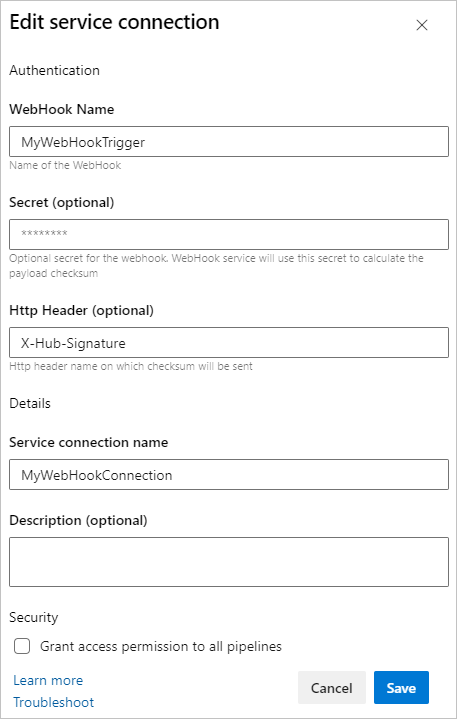
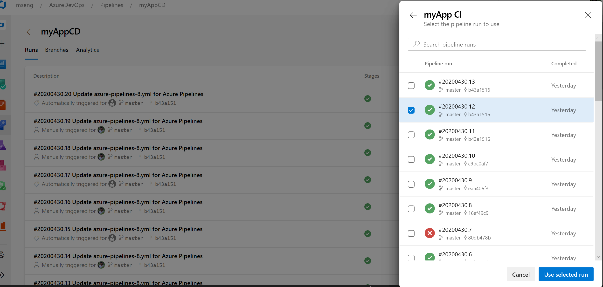
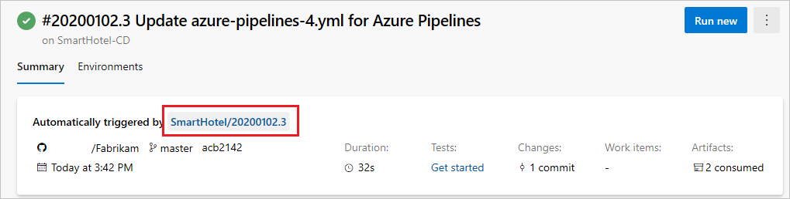
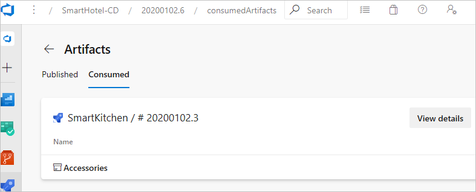
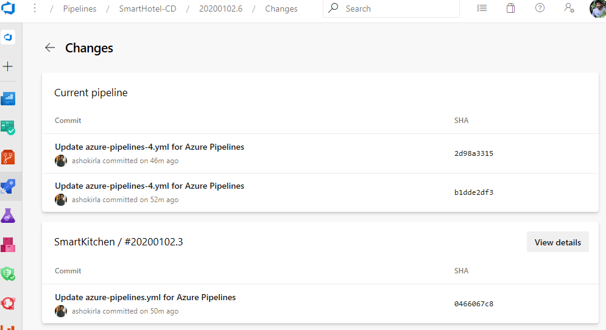
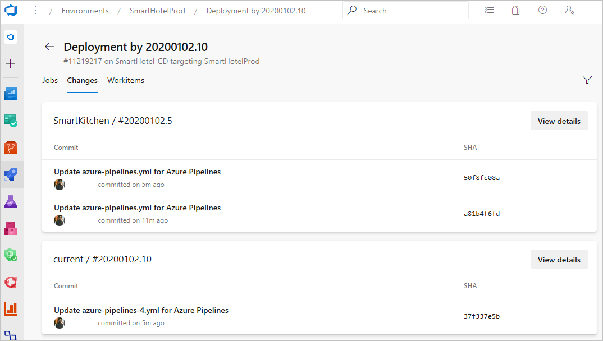
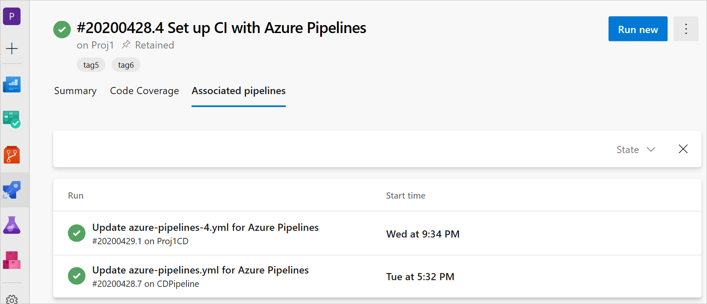
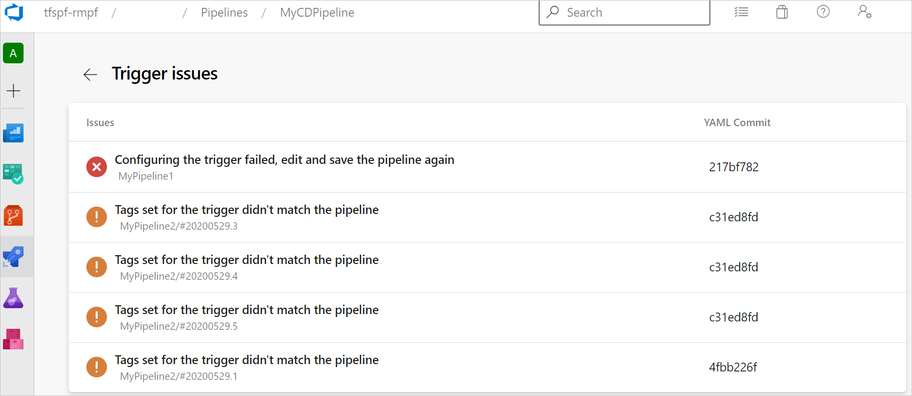

# Define resources in YAML

**Azure Pipelines**

Resources in YAML represent sources of pipelines, builds, repositories, containers, packages, and webhooks.
Resources also provide you the full traceability of the services used in your pipeline including the version, artifacts, associated commits, and work items. When you define a resource, it can be consumed anywhere in your pipeline. And, you can fully automate your DevOps workflow by subscribing to trigger events on your resources.

For more information, see [About resources](about-resources.md)
### Schema

```yaml
resources:
  pipelines: [ pipeline ]  
  builds: [ build ]
  repositories: [ repository ]
  containers: [ container ]
  packages: [ package ]
  webhooks: [ webhook ]
```

### Variables

When a resource triggers a pipeline, the following variables get set:

```yaml
resources.triggeringAlias
resources.triggeringCategory
```

These values are empty if a resource doesn't trigger a pipeline run. The variable `Build.Reason` must be `ResourceTrigger` for these values to get set.

## Define a `pipelines` resource

If you have a pipeline that produces artifacts, you can consume the artifacts by defining a `pipelines` resource. `pipelines` is a dedicated resource only for Azure Pipelines. You can also set triggers on a pipeline resource for your CD workflows.

In your resource definition, `pipeline` is a unique value that you can use to reference the pipeline resource later on. `source` is the name of the pipeline that produces an artifact.

For an alternative way to download pipelines, see the tasks in [Pipeline Artifacts](../artifacts/pipeline-artifacts.md).

## [Schema](#tab/schema)

```yaml
resources:        # types: pipelines | builds | repositories | containers | packages
  pipelines:
  - pipeline: string  # identifier for the resource used in pipeline resource variables
    project: string # project for the source; optional for current project
    source: string  # name of the pipeline that produces an artifact
    version: string  # the pipeline run number to pick the artifact, defaults to latest pipeline successful across all stages; Used only for manual or scheduled triggers
    branch: string  # branch to pick the artifact, optional; defaults to all branches; Used only for manual or scheduled triggers
    tags: [ string ] # list of tags required on the pipeline to pickup default artifacts, optional; Used only for manual or scheduled triggers
    trigger:     # triggers aren't enabled by default unless you add trigger section to the resource
      branches:  # branch conditions to filter the events, optional; Defaults to all branches.
        include: [ string ]  # branches to consider the trigger events, optional; Defaults to all branches.
        exclude: [ string ]  # branches to discard the trigger events, optional; Defaults to none.
      tags: [ string ]  # list of tags to evaluate for trigger event, optional
      stages: [ string ] # list of stages to evaluate for trigger event, optional
```

## [Example](#tab/example)

To consume artifacts from a pipeline within the same project, use the following schema.

```yaml
resources:
  pipelines:
  - pipeline: SmartHotel-resource # identifier for the resource (used in pipeline resource variables)
    source: SmartHotel-CI # name of the pipeline that produces an artifact
```

To consume a pipeline from another project, include the project name and source name.

```yaml
resources:
  pipelines:
  - pipeline: SmartHotel
    project: DevOpsProject
    source: SmartHotel-CI
    branch: releases/M142   # This branch is used for resolving default version when the pipeline is triggered manually or scheduled. The branch input should not have wild cards
```

Pipeline resource with simple trigger.

```yaml
resources:
  pipelines:
  - pipeline: SmartHotel
    project: DevOpsProject
    source: SmartHotel-CI
    trigger: true
```

Pipeline resource trigger with branch conditions.

```yaml
resources:
  pipelines:
  - pipeline: SmartHotel
    project: DevOpsProject
    source: SmartHotel-CI
    trigger:
      branches:
      - releases/*
      - resources.triggeringAlias
```

Stages filters for triggers.

```yml
resources:
  pipelines:
  - pipeline: MyCIAlias  
    project: Fabrikam  
    source: Farbrikam-CI  
    trigger:    
      stages:            ### This stage filter is used when evaluating conditions for triggering your CD pipeline
      - PreProduction    ### stages are AND'ed. On successful completion of all the stages provided, your CD pipeline gets triggered. 
      - Production
```

Tag filters for default version evaluation and for triggers.

```yml
resources:
  pipelines:
  - pipeline: MyCIAlias
    project: Fabrikam
    source: Farbrikam-CI
    tags:               ### tags are used for resolving default version when the pipeline is triggered manually or scheduled
    - Production        ### Tags are AND'ed
    trigger:
      tags:             ### This filter is used for triggering the pipeline run
      - Production      ### Tags are AND'ed
      - Signed
```

These examples are tags set on the continuous integration (CI) pipeline. These tags are different from the tags set on the branches in the git repository.

---

> [!IMPORTANT]
> When you define a resource trigger, if its pipeline resource is from the same repository (say self) as the current pipeline, triggering follows the same branch and commit on which the event is raised.
> But, if the pipeline resource is from a different repository, the current pipeline triggers on the default branch of the self repository.


### Evaluation of artifact version

The pipeline version, CI build run, that gets picked in your pipeline run, gets controlled by how your pipeline run is triggered.

In case you create your pipeline run is created manually or by a scheduled trigger, the default version, branch, and tags get used to evaluate the CI pipeline version.

|Provided information|Outcome |
|---------|---------|
|Build version #     | That version runs.        |
|Branch     |The latest version from the given branch runs.         |
|Tags list    | The latest run that has all the matching tags runs.        |
|Branch and tags list   |The latest run from the branch provided and that has the matching tags runs.        |
|Nothing    | The latest version across all the branches runs.        |

```yml
resources:
  pipelines:
  - pipeline: MyCIAlias
    project: Fabrikam
    source: Farbrikam-CI
    branch: main      ### This branch input cannot have wild cards. It is used for evaluating default version when pipeline is triggered manually or scheduled.
    tags:               ### These tags are used for resolving default version when the pipeline is triggered manually or scheduled
    - Production        ### Tags are AND'ed
    - PreProduction
```

If your pipeline gets triggered automatically, the CI pipeline version gets picked, based on the trigger event. The default version information provided is irrelevant.

|Provided information  |Outcome  |
|---------|---------|
|Branches     | A new pipeline gets triggered whenever a CI run successfully completes that matches to the branches that are included.        |
|Tags     | A new pipeline gets triggered whenever a CI run successfully completes that matches all the tags mentioned.        |
|Stages     | A new pipeline gets triggered whenever a CI run has all the stages mentioned are completed successfully.        |
|Branches, tags, and stages    | aA new pipeline run gets triggered whenever a CI run matches all the conditions.        |
|Only `trigger: true`    | A new pipeline run gets triggered whenever a CI run successfully completes.        |
|Nothing    | No pipeline run gets triggered. Triggers are disabled by default unless you specifically enable them.        |

```yaml
resources:
  pipelines:
  - pipeline: SmartHotel
    project: DevOpsProject
    source: SmartHotel-CI
    trigger:
      branches:
        include:
        - releases/*
        - main
        exclude:
        - topic/*
      tags: 
      - Verified
      - Signed
      stages:
      - Production
      - PreProduction
      
```

### `download` for pipelines

All artifacts from the current pipeline and from all `pipeline` resources are automatically downloaded and made available at the beginning of each `deployment` job. You can override this behavior. For more information, see [Pipeline Artifacts](../artifacts/pipeline-artifacts.md). Regular 'job' artifacts aren't automatically downloaded. Use `download` explicitly when needed.

## [Schema](#tab/schema)

```yaml
steps:
- download: [ current | pipeline resource identifier | none ] # disable automatic download if "none"
  artifact: string ## artifact name, optional; downloads all the available artifacts if not specified
  terns: string # terns representing files to include; optional
```

## [Example](#tab/example)

```yaml
- job: deploy_windows_x86_agent
  steps:
  - download: SmartHotel   # pipeline resource identifier.
    artifact: WebTier1  # artifact to download, optional; defaults to all the artifacts from the resource.
    patterns: '**/*.zip'  # mini match pattern to download specific files, optional; defaults to all files.
```

Or, to avoid downloading any of the artifacts:

```yaml
- download: none
```

---
Artifacts from the `pipeline` resource get downloaded to `$(PIPELINE.WORKSPACE)/<pipeline-identifier>/<artifact-identifier>` folder.

### Pipeline resource variables

In each run, the metadata for a pipeline resource is available to all jobs in the form of [predefined variables](../build/variables.md). The `<Alias>` is the identifier that you gave for your pipeline resource. Pipeline resources variables are only available at runtime.

## [Schema](#tab/schema)

```yaml
resources.pipeline.<Alias>.projectID
resources.pipeline.<Alias>.pipelineName
resources.pipeline.<Alias>.pipelineID
resources.pipeline.<Alias>.runName
resources.pipeline.<Alias>.runID
resources.pipeline.<Alias>.runURI
resources.pipeline.<Alias>.sourceBranch
resources.pipeline.<Alias>.sourceCommit
resources.pipeline.<Alias>.sourceProvider
resources.pipeline.<Alias>.requestedFor
resources.pipeline.<Alias>.requestedForID
```

## [Example](#tab/example)

```yaml
resources:
  pipelines:
  - pipeline: myresourcevars  # identifier for the pipeline resource
    source: mypipeline # source pipeline definition name
    trigger: true 

steps:
- script: |
    echo $(resources.pipeline.myresourcevars.pipelineID)
    echo $(resources.pipeline.myresourcevars.runName)
    echo $(resources.pipeline.myresourcevars.runID)
    echo $(resources.pipeline.myresourcevars.runURI)
    echo $(resources.pipeline.myresourcevars.sourceBranch)
    echo $(resources.pipeline.myresourcevars.sourceCommit)
    echo $(resources.pipeline.myresourcevars.sourceProvider)
    echo $(resources.pipeline.myresourcevars.requestedFor)
    echo $(resources.pipeline.myresourcevars.requestedForID)
```

---

## Define a `builds` resource

If you have an external CI build system that produces artifacts, you can consume artifacts with a `builds` resource. A `builds` resource can be any external CI systems like Jenkins, TeamCity, CircleCI, and so on.

## [Schema](#tab/schema)

```yaml
resources:        # types: pipelines | builds | repositories | containers | packages
  builds:
  - build: string   # identifier for the build resource
    type: string   # the type of your build service like Jenkins, circleCI etc.
    connection: string   # service connection for your build service.
    source: string   # source definition of the build
    version: string   # the build number to pick the artifact, defaults to Latest successful build
    trigger: boolean    # Triggers aren't enabled by default and should be explicitly set
```

`builds` is an extensible category. You can write an extension to consume artifacts from your builds service  and introduce a new type of service as part of `builds`. Jenkins is a type of resource in `builds`.

## [Example](#tab/example)

```yaml
resources:
  builds:
  - build: Spaceworkz
    type: Jenkins
    connection: MyJenkinsServer 
    source: SpaceworkzProj   # name of the jenkins source project
    trigger: true
```

---

> [!IMPORTANT]
> Triggers are only supported for hosted Jenkins where Azure DevOps has line of sight with Jenkins server.

### `downloadBuild` task for builds

You can consume artifacts from the `build` resource as part of your jobs using the `downloadBuild` task. Based on the type of `build` resource defined, this task automatically resolves to the corresponding download task for the service during the run time.

Artifacts from the `build` resource get downloaded to `$(PIPELINE.WORKSPACE)/<build-identifier>/` folder.

> [!IMPORTANT]
> `build` resource artifacts aren't automatically downloaded in your jobs/deploy-jobs. You need to explicitly add the `downloadBuild` task for consuming the artifacts.

## [Schema](#tab/schema)

```yaml
- downloadBuild: string # identifier for the resource from which to download artifacts
  artifact: string # artifact to download; if left blank, downloads all artifacts associated with the resource provided
  patterns: string | [ string ] # a minimatch path or list of [minimatch paths](tasks/file-matching-patterns.md) to download; if blank, the entire artifact is downloaded
```

## [Example](#tab/example)
You can customize the download behavior for each deployment or job.

```yaml
- job: deploy_windows_x86_agent
  steps:
  - downloadBuild: Spaceworkz   # build resource identifier.
    patterns: '**/*.zip'  # mini match pattern to download specific files, optional; defaults to all files.
```

---

## Define a `repositories` resource

If your pipeline has [templates in another repository](../process/templates.md#use-other-repositories), or if you want to use [multi-repo checkout](../repos/multi-repo-checkout.md) with a repository that requires a service connection, you must let the system know about that repository.
The `repository` keyword lets you specify an external repository.

## [Schema](#tab/schema)

```yaml
resources:
  repositories:
  - repository: string  # identifier (A-Z, a-z, 0-9, and underscore)
    type: enum  # see the following "Type" topic
    name: string  # repository name (format depends on `type`)
    ref: string  # ref name to use; defaults to 'refs/heads/main'
    endpoint: string  # name of the service connection to use (for types that aren't Azure Repos)
    trigger:  # CI trigger for this repository, no CI trigger if skipped (only works for Azure Repos)
      branches:
        include: [ string ] # branch names which trigger a build
        exclude: [ string ] # branch names which won't
      tags:
        include: [ string ] # tag names which trigger a build
        exclude: [ string ] # tag names which won't
      paths:
        include: [ string ] # file paths which must match to trigger a build
        exclude: [ string ] # file paths which won't trigger a build
```

## [Example](#tab/example)

```yaml

resources:
  repositories:
  - repository: common
    type: github
    name: Contoso/CommonTools
    endpoint: MyContosoServiceConnection
```

---

### Type

Pipelines support the following values for the repository type: `git`, `github`, `githubenterprise`, and `bitbucket`.
The `git` type refers to Azure Repos Git repos.

|Type specified |Outcome  |Example  |
|---------|---------|---------|
|`type: git`   | The `name` value refers to another repository in the same project.        | `name: otherRepo` To refer to a repository in another project within the same organization, prefix the name with that project's name. An example is `name: OtherProject/otherRepo`.  |
|`type: github`     | The `name` value is the full name of the GitHub repository and includes the user or organization.  | `name: Microsoft/vscode`  |
|`type: githubenterprise`    | the `name` value is the full name of the GitHub Enterprise repository and includes the user or organization. | `name: Microsoft/vscode`        |
|`type: bitbucket`   | The `name` value is the full name of the Bitbucket Cloud repository and includes the user or organization.        | `name: MyBitbucket/vscode`        |

GitHub Enterprise repos require a [GitHub Enterprise service connection](../library/service-endpoints.md#github-enterprise-server-service-connection) for authorization.

Bitbucket Cloud repos require a [Bitbucket Cloud service connection](../library/service-endpoints.md#bitbucket-cloud-service-connection) for authorization.

### Use `checkout` to consume repository

Use `checkout` keyword to consume your repos defined as part of `repository` resource.

### Schema

```yaml
steps:
- checkout: string  # identifier for your repository resource
  clean: boolean  # if true, execute `execute git clean -ffdx && git reset --hard HEAD` before fetching
  fetchDepth: number  # the depth of commits to ask Git to fetch; defaults to no limit
  lfs: boolean  # whether to download Git-LFS files; defaults to false
  submodules: true | recursive  # set to 'true' for a single level of submodules or 'recursive' to get submodules of submodules; defaults to not checking out submodules
  path: string  # path to check out source code, relative to the agent's build directory (e.g. \_work\1); defaults to a directory called `s`
  persistCredentials: boolean  # if 'true', leave the OAuth token in the Git config after the initial fetch; defaults to false
```

Repos from the `repository` resource aren't automatically synced in your jobs. Use `checkout` to fetch your repos as part of your jobs.

For more information, see [Check out multiple repositories in your pipeline](../repos/multi-repo-checkout.md).

## Define a `containers` resource

If you need to consume a container image as part of your continuous integration/continuous delivery (CI/CD) pipeline, you can achieve it using `containers`. A container resource can be a public or private Docker Registry, or Azure Container Registry.

If you need to consume images from Docker registry as part of your pipeline, you can define a generic container resource (not `type` keyword required).

## [Schema](#tab/schema)

```yaml
resources:
  containers:
  - container: string  # identifier (A-Z, a-z, 0-9, and underscore)
    image: string  # container image name
    options: string  # arguments to pass to container at startup
    endpoint: string  # reference to a service connection for the private registry
    env: { string: string }  # list of environment variables to add
    ports: [ string ] # ports to expose on the container
    volumes: [ string ] # volumes to mount on the container
    mapDockerSocket: bool # whether to map in the Docker daemon socket; defaults to true
    mountReadOnly:  # volumes to mount read-only - all default to false
      externals: boolean  # components required to talk to the agent
      tasks: boolean  # tasks required by the job
      tools: boolean  # installable tools like Python and Ruby
      work: boolean # the work directory
```

You can use a generic container resource as an image consumed as part of your job, or it can also be used for [Container jobs](../process/container-phases.md).

## [Example](#tab/example)

```yaml
resources:         
  containers:
  - container: smartHotel 
    endpoint: myDockerRegistry
    image: smartHotelApp 
```

---

You can use a first class container resource type for Azure Container Registry (ACR) to consume your ACR images. This resources type can be used as part of your jobs and also to enable automatic pipeline triggers.

## [Schema](#tab/schema)

```yaml
resources:          # types: pipelines | repositories | containers | builds | packages
  containers:
  - container: string # identifier for the container resource      
    type: string # type of the registry like ACR, GCR etc. 
    azureSubscription: string # Azure subscription (ARM service connection) for container registry;
    resourceGroup: string # resource group for your ACR
    registry: string # registry for container images
    repository: string # name of the container image repository in ACR
    trigger: # Triggers aren't enabled by default and need to be set explicitly
      enabled: boolean # set to 'true' to trigger on all image tags if 'tags' is unset.
      tags:
        include: [ string ]  # image tags to consider the trigger events, optional; defaults to any new tag
        exclude: [ string ]  # image tags on discard the trigger events, optional; defaults to none
```

> [!NOTE]
> The syntax that's used to enable container triggers for all image tags (`enabled: 'true'`) is different from the syntax that's used for other resource triggers. Pay close attention to use the correct syntax for a specific resource.

## [Example](#tab/example)

```yaml
resources:         
  containers:
  - container: petStore      
    type: ACR  
    azureSubscription: ContosoARMConnection
    resourceGroup: ContosoGroup
    registry: petStoreRegistry
    repository: myPets
    trigger: 
      tags:
        include: 
        - production* 
```

---
#### Container resource variables

Once you define a container as a resource, container image metadata gets passed to the pipeline in the form of variables. Information like image, registry, and connection details are accessible across all the jobs to be used in your container deploy tasks.

## [Schema](#tab/schema)

```yaml
resources.container.<Alias>.type
resources.container.<Alias>.registry
resources.container.<Alias>.repository
resources.container.<Alias>.tag 
resources.container.<Alias>.digest
resources.container.<Alias>.URI
resources.container.<Alias>.location
```

Location variable is only applicable for `ACR` type of container resources.

## [Example](#tab/example)

In this example, there's an [Azure Resource Manager service connection](../library/service-endpoints.md#common-service-connection-types) named `arm-connection`. For more information, see [Azure container registries, repositories, and images](/azure/container-registry/container-registry-concepts).

```yaml
resources:
  containers:
  - container: mycontainer # name of the container (Alias) 
    type: ACR # type of registry
    azureSubscription: arm-connection # name of the ARM service connection
    resourceGroup: rg-storage-eastus # Azure resource group with the container
    registry: mycontainerregistry # Azure container registry name
    repository: hello-world # name of the of container image collection
    trigger:
      tags:
      - latest # tag for the container image to use

steps:
- script: echo |
    echo $(resources.container.mycontainer.type)
    echo $(resources.container.mycontainer.registry)
    echo $(resources.container.mycontainer.repository)
    echo $(resources.container.mycontainer.tag)
    echo $(resources.container.mycontainer.digest)
    echo $(resources.container.mycontainer.URI)
    echo $(resources.container.mycontainer.location)

```

---

## Define a `packages` resource

You can consume NuGet and npm GitHub packages as a resource in YAML pipelines. 

When you're specifying `package` resources, set the package as NuGet or npm. You can also enable automated pipeline triggers when a new package version gets released.

To use GitHub packages, use personal access token (PAT)-based authentication and create a GitHub service connection that uses PATs.

By default, packages aren't automatically downloaded into jobs. To download, use `getPackage`.

## [Schema](#tab/schema)

```yaml
resources:
  packages:
    - package: myPackageAlias # alias for the package resource
      type: Npm # type of the package NuGet/npm
      connection: GitHubConnectionName # Github service connection with the PAT type
      name: nugetTest/nodeapp # <Repository>/<Name of the package>
      version: 1.0.1 # Version of the packge to consume; Optional; Defaults to latest
      trigger: true # To enable automated triggers (true/false); Optional; Defaults to no triggers
```

## [Example](#tab/example)

In this example, there's a [GitHub service connection](../library/service-endpoints.md#common-service-connection-types) named `pat-contoso` to a GitHub npm package named `contoso`. For more information, see [GitHub packages](https://github.com/features/packages).

```yaml
resources:
  packages:
    - package: contoso
      type: npm
      connection: pat-contoso
      name: yourname/contoso 
      version: 7.130.88 
      trigger: true

pool:
  vmImage: 'ubuntu-latest'

steps:
- getPackage: contoso 
```

---

## Define a `webhooks` resource

With other resources (such as pipelines, containers, build, and packages) you can consume artifacts and enable automated triggers. However, you can't automate your deployment process based on other external events or services. The `webhooks` resource enables you to integrate your pipeline with any external service and automate the workflow. You can subscribe to any external events through its webhooks (GitHub, GitHub Enterprise, Nexus, Artifactory, and so on) and trigger your pipelines.

Do the following steps to configure the webhook triggers.

1. Set up a webhook on your external service. When you're creating your webhook, you need to provide the following info:

    - Request Url - `https://dev.azure.com/<ADO Organization>/_apis/public/distributedtask/webhooks/<WebHook Name>?api-version=6.0-preview`
    - Secret - Optional. If you need to secure your JSON payload, provide the **Secret** value.
2. Create a new "Incoming Webhook" service connection. This connection is a newly introduced Service Connection Type that allows you to define the following important information:
    - **Webhook Name**: The name of the webhook should match webhook created in your external service.
    - **HTTP Header** - The name of the HTTP header in the request that contains the payload's HMAC-SHA1 hash value for request verification. For example, for GitHub, the request header is "**X-Hub-Signature**".
    - **Secret** - The secret is used to verify the payload's HMAC-SHA1 hash used for verification of the incoming request (optional). If you used a secret when creating your webhook, you must provide the same secret key.
  
   

3. A new resource type called `webhooks` is introduced in YAML pipelines. To subscribe to a webhook event, define a webhook resource in your pipeline and point it to the Incoming webhook service connection. You can also define more filters on the webhook resource, based on the JSON payload data, to customize the triggers for each pipeline. Consume the payload data in the form of variables in your jobs.

4. Whenever the Incoming Webhook service connection receives a webhook event, a new run gets triggered for all the pipelines subscribed to the webhook event. You can consume the JSON payload data in your jobs using the format `${{ parameters.<WebhookAlias>.<JSONPath>}}`

## [Schema](#tab/schema)

```yml
resources:
  webhooks:
    - webhook: MyWebhookTriggerAlias           ### Webhook alias
      connection: IncomingWebhookConnection    ### Incoming webhook service connection
      filters:                                 ### List of JSON parameters to filter; Parameters are AND'ed
        - path: JSONParameterPath              ### JSON path in the payload
          value: JSONParameterExpectedValue    ### Expected value in the path provided
```

Webhooks automate your workflow based on any external webhook event that isn't supported by first class resources. Resources like pipelines, builds, containers, and packages. Also, for on-premise services where Azure DevOps doesn't have visibility into the process, you can configure webhooks on the service and to trigger your pipelines automatically.

## [Example](#tab/example)

```yml
resources:
  webhooks:
    - webhook: MyWebhookTrigger          
      connection: MyWebhookConnection    
      filters:
        - path: repositoryName      
          value: maven-releases     
        - path: action
          value: CREATED
steps:
- task: PowerShell@2
  inputs:
    targetType: 'inline'
    script: |
      Write-Host ${{ parameters.MyWebhookTrigger.repositoryName}} ### JSON payload data is available in the form of ${{ parameters.<WebhookAlias>.<JSONPath>}}
      Write-Host ${{ parameters.MyWebhookTrigger.component.group}}
```

---

## Manual version picker for resources in the create run dialogue

When you manually trigger a CD YAML pipeline, we automatically evaluate the default version for the resources defined in the pipeline, based on the inputs provided. However, you can choose to pick a different version from resource version picker when you create a run.

1. In the **Create run** pane, select **Resources**. You see a list of resources consumed in this pipeline.
1. Select a resource and pick a specific version from the list of versions available. Resource version picker is supported for pipeline, build, repository, container, and package resources.

   

For pipeline resources, you can see all the available runs across all branches. Search them based on the pipeline number or branch. And, pick a run that's successful, failed, or in-progress. This flexibility ensures that you can run your CD pipeline if you're sure it produced all the artifacts that you need. You don't need to wait for the CI run to complete or rerun because of an unrelated stage failure in the CI run. However, we only consider successfully completed CI runs when we evaluate the default version for scheduled triggers, or if you don't use manual version picker.

For resources where you can't fetch available versions, like GitHub packages, we show a text box as part of version picker so you can provide the version for the run to pick.

## Authorize a YAML pipeline

Resources must be authorized before they can be used. A resource owner controls the users and pipelines that can access that resource. The pipeline must be authorized to use the resource. See the following ways you can authorize a YAML pipeline.

* Go to the administration experience of the resource. For example, variable groups and secure files are managed in the **Library** page under **Pipelines**. Agent pools and service connections are managed in **Project settings**. Here you can authorize **all pipelines** to access that resource. This authorization is convenient if you don't have a need to restrict access to a resource - for example, test resources.

* When you create a pipeline for the first time, all the resources that are referenced in the YAML file get automatically authorized for use by the pipeline, if you're a member of the **User** role for that resource. So, resources that are referenced in the YAML file when you create a pipeline get automatically authorized.

* When you make changes to the YAML file and add resources, then the build fails with an error similar to the following error: `Could not find a <resource> with name <resource-name>. The <resource> does not exist or has not been authorized for use.`

   In this case, you see an option to authorize the resources on the failed build. If you're a member of the **User** role for the resource, you can select this option. Once the resources are authorized, you can start a new build.

* Verify that the [agent pool security roles](../../organizations/security/about-security-roles.md) for your project are correct.

## Set approval checks for resources

You can manually control when a resource runs with approval checks and templates. With the [required template approval check](approvals.md#required-template), you can require any pipeline using a resource or environment also extends from a specific YAML template.
Setting a required template approval enhances security. Make sure your resource only gets used under specific conditions with a template. Learn more about how to [enhance pipeline security](../security/templates.md#set-required-templates) with templates and resources.

## Traceability

We provide full traceability for any resource consumed at a pipeline- or deployment job-level.

### Pipeline traceability

For every pipeline run, we show the following information.

* The resource that has triggered the pipeline, if it's triggered by a resource.

   

* Version of the resource and the artifacts consumed.

   

* Commits associated with each resource.

   

* Work items associated with each resource.

### Environment traceability

Whenever a pipeline deploys to an environment, you can see a list of resources that are consumed. The following view includes resources consumed as part of the deployment jobs and their associated commits and work items.



### Show associated CD pipelines information in CI pipelines

To provide end-to-end traceability, you can track which CD pipelines are consuming a giving CI pipeline. You can see the list of CD YAML pipelines runs where a CI pipeline run is consumed through the `pipeline` resource. If other pipelines consume your CI pipeline, you see an "Associated pipelines" tab in the run view. Here you can find all the pipeline runs that consume your pipeline and artifacts from it.



### YAML resource trigger issues support and traceability

It can be confusing when pipeline triggers fail to execute. We've added a new menu item in the pipeline definition page called **Trigger Issues**, where you can learn why triggers aren't executing. To access this page, open your pipeline history. **Trigger Issues** is only available for non-repository resources.

:::image type="content" source="media/trigger-menu.png" alt-text="Select Trigger Issues from the navigation.":::

Resource triggers can fail to execute for the following reasons.

* If the source of the service connection that's provided is invalid, or if there are any syntax errors in the trigger, the trigger isn't configured, resulting in an error.
* If trigger conditions aren't matched, the trigger won't execute. A warning is surfaced so you can understand why the conditions weren't matched.  

   

## Next steps

> [!div class="nextstepaction"]
> [Add and use variable groups](../library/variable-groups.md)

## FAQ

### Why should I use pipelines `resources` instead of the `download` shortcut?

Using a `pipelines` resource is a way to consume artifacts from a CI pipeline and also configure automated triggers. A resource gives you full visibility into the process by displaying the version consumed, artifacts, commits, and work items. When you define a pipeline resource, the associated artifacts get automatically downloaded in deployment jobs.

You can choose to download the artifacts in build jobs or to override the download behavior in deployment jobs with `download`. The `download` task internally uses the [Download Pipeline Artifacts task](../tasks/utility/download-pipeline-artifact.md).

### Why should I use `resources` instead of the Download Pipeline Artifacts task?

When you use the [Download Pipeline Artifacts task](../tasks/utility/download-pipeline-artifact.md) directly, you miss traceability and triggers. Sometimes it makes sense to use the Download Pipeline Artifacts task directly. For example, you might have a script task stored in a different template and the script task requires artifacts from a build to be downloaded. Or, you may not know if someone using a template wants to add a pipeline resource. To avoid dependencies, you can use the Download Pipeline Artifacts task to pass all the build information to a task.

## Related articles

* [Define variables](variables.md)
* [Create and target an environment](environments.md)
* [Use YAML pipeline editor](../get-started/yaml-pipeline-editor.md)
* [YAML schema reference](../yaml-schema.md)
