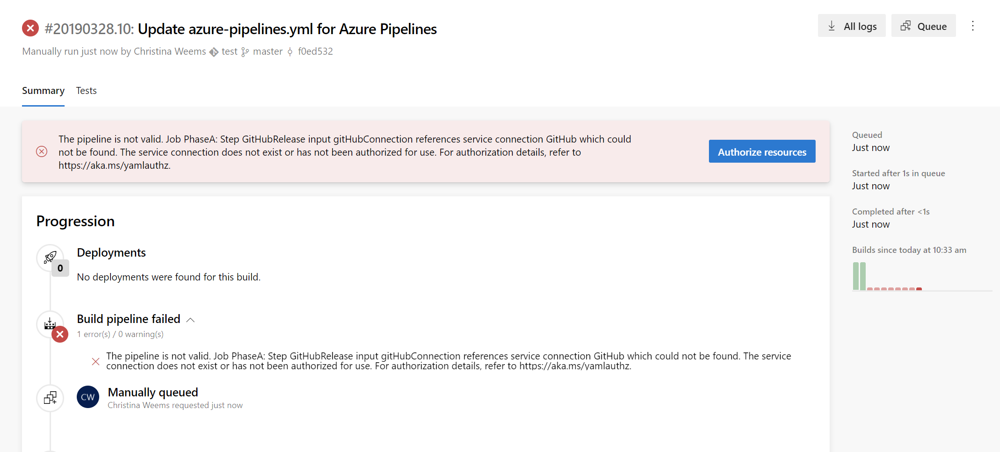

# Resources

**Azure Pipelines**

A resource is anything used by a pipeline that lives outside the pipeline itself. Examples include:

- [secure files](../library/secure-files.md)
- [variable groups](../library/variable-groups.md)
- [service connections](../library/service-endpoints.md)
- [agent pools](../agents/pools-queues.md)
- [other repositories](../yaml-schema.md#repository-resource)
- [containers](../yaml-schema.md#container-resource)

Resources must be authorized before they can be used. A resource owner controls the users and pipelines that can access that resource.

If you create a pipeline with the classic editor, then the user creating or editing the pipeline must be given **User** role on that resource in order to be able to refer to that resource in the pipeline. A resource administrator can add users by navigating to administration page of the corresponding resource and selecting **Security** for that resource.

If you use YAML pipelines, then the pipeline must directly be authorized to use the resource. There are multiple ways to accomplish this.

1. Navigate to the administration experience of the resource. For example, variable groups and secure files are managed in the **Library** page under **Pipelines**. Agent pools and service connections are managed in **Project settings**. Here you can authorize **all pipelines** to be able to access that resource. This is convenient if you do not have a need to restrict access to a resource - for e.g., test resources.

1. When you create a pipeline for the first time, all the resources that are referenced in the YAML file are automatically authorized for use by the pipeline, provided that you are a member of the **User** role for that resource. So, resources that are referenced in the YAML file at pipeline creation time are automatically authorized.

1. When you make changes to the YAML file and add additional resources (assuming that these not authorized for use in all pipelines as explained above), then the build fails with a resource authorization error that is similar to the following: `Could not find a <resource> with name <resource-name>. The <resource> does not exist or has not been authorized for use.`

    In this case, you will see an option to authorize the resources on the failed build. If you are a member of the **User** role for the resource, you can select this option. Once the resources are authorized, you can start a new build.

    