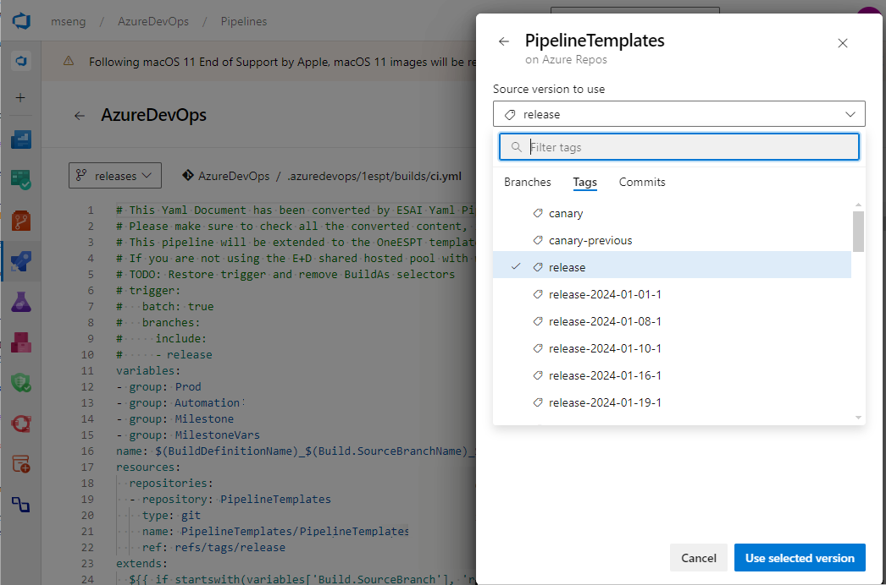
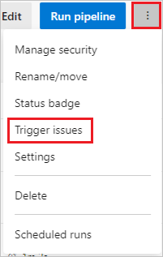

# Resources in YAML pipelines

[!INCLUDE [version-gt-eq-2019](../../includes/version-gt-eq-2019.md)]

This article discusses resources for YAML pipelines. A resource is anything a pipeline uses that exists outside that pipeline. After you define a resource, you can consume it anywhere in your pipeline.

Resources provide full traceability for the services a pipeline uses, including the version, artifacts, associated commits, and work items. If you subscribe to trigger events on your resources, you can fully automate your DevOps workflows.

For a resource to trigger a pipeline run, the variable `Build.Reason` must be `ResourceTrigger`. If a resource triggers a pipeline run, the following variables are set:

```yaml
resources.triggeringAlias
resources.triggeringCategory
```

The values are empty if a resource didn't trigger the pipeline run.

## Resource definitions

YAML pipeline resources can be other pipelines, builds, containers, packages, repositories, and webhooks. For complete schema information, see the [resources](/azure/devops/pipelines/yaml-schema/resources) definition in the [YAML schema reference for Azure Pipelines](/azure/devops/pipelines/yaml-schema).

<a name="define-a-pipelines-resource"></a>
### Pipelines resource

If you have a pipeline that produces artifacts, you can consume the artifacts as a `pipelines` resource. Only Azure Pipelines can use the `pipelines` resource. You can use pipelines resources as triggers for your continuous deployment (CD) workflows.

In the resource definition:
- `pipeline` is a unique name you use to reference the pipeline resources.
- `source` is the name of the pipeline that produced the pipeline artifacts.

For complete schema information, see the [resources.pipelines.pipeline](/azure/devops/pipelines/yaml-schema/resources-pipelines-pipeline) definition.

You use the `pipeline` label to reference the pipeline resource from other parts of your pipeline, such as to use pipeline resource variables or download artifacts. For an alternative way to download pipeline artifacts, see [Download artifacts](../artifacts/pipeline-artifacts.md#download-artifacts).

> [!IMPORTANT]
> When you define a pipeline resource trigger:
> - If the `pipeline` resource is from the same repository as the current pipeline, or `self`, triggering is on the same branch and commit that raises the triggering event.
> - If the `pipeline` resource is from a different repository than the current pipeline, triggering is on the default branch of the `pipeline` resource repository.

#### Example pipeline resource definitions

The following example resource definition consumes artifacts from a pipeline within the same Azure DevOps project.

```yaml
resources:
  pipelines:
  - pipeline: SmartHotel-resource # identifier to use in pipeline resource variables
    source: SmartHotel-CI # name of the pipeline that produces the artifacts
```

To consume a pipeline from another project, include the project name and source name in the resource definition. The following example uses `branch` to resolve the default version when the pipeline is triggered manually or by schedule. The branch input can't have wildcards.

```yaml
resources:
  pipelines:
  - pipeline: SmartHotel
    project: otherDevOpsProject
    source: SmartHotel-CI
    branch: releases/M142
```

#### Example pipeline resource trigger definitions

To use a `pipeline` resource as a trigger to run the current pipeline, set the `trigger` property in the resource definition. The following example shows a pipelines resource definition with a simple `trigger`.

```yaml
resources:
  pipelines:
  - pipeline: SmartHotel
    project: otherDevOpsProject
    source: SmartHotel-CI
    trigger: true
```

The following example shows a pipeline resource `trigger` with branch conditions.

```yaml
resources:
  pipelines:
  - pipeline: SmartHotel
    project: otherDevOpsProject
    source: SmartHotel-CI
    trigger:
      branches:
      - releases/*
      - resources.triggeringAlias
```

The following example uses `stages` filters to evaluate trigger conditions for CD pipelines. Trigger `stages` use the `AND` operator. The CD pipeline triggers upon successful completion of all the provided stages.

```yml
resources:
  pipelines:
  - pipeline: MyCIAlias  
    project: Fabrikam  
    source: Fabrikam-CI  
    trigger:    
      stages:
      - PreProduction
      - Production
```

The following example uses `tags` filters for default version evaluation and for `trigger`. The trigger tags use the `AND` operator.

The `tags` set in pipeline resource definitions for continuous integration (CI) or CD pipelines are different from the tags set on branches in the Git repository.

```yml
resources:
  pipelines:
  - pipeline: MyCIAlias
    project: Fabrikam
    source: Fabrikam-CI
    tags: 
    - Production 
    trigger:
      tags:
      - Production
      - Signed
```

<a name="evaluation-of-artifact-version"></a>
#### Pipelines artifact version evaluation and triggering

The pipeline's artifact version depends on whether the pipeline triggers manually or on schedule, or triggers because one of its `pipeline` resource pipelines runs.

# [Manual or scheduled trigger](#tab/manual/)

When the pipeline run is manually triggered or scheduled, the values of the `version`, `branch`, and `tags` properties define the artifact versions. The `branch` input can't have wildcards. The `tags` properties use the `AND` operator.

The following table lists `pipeline` resource definition properties and the artifact versions they specify.

|Specified properties | Artifact version |
|---------|---------|
| `version`     | Build that has the specified run number |
| `branch`      | Latest build that ran on the specified branch |
| `tags`    | Latest build that has all the specified tags    |
| `branch` and `tags`    | Latest build run on the specified branch that has all the specified tags |
| `version` and `branch` | Build with the specified run number and the specified branch |
| None    | Latest build across all branches |

The following `pipeline` resource definition uses the `branch` and `tags` properties to evaluate the default version when the pipeline is scheduled or triggered manually. When you manually trigger the pipeline, the `myCIAlias` artifacts version is the latest build run on the `main` branch that has the `Production` and `PreProduction` tags.

```yaml
resources:
  pipelines:
  - pipeline: myCIAlias
    project: Fabrikam
    source: Fabrikam-CI
    branch: main
    tags:
    - Production
    - PreProduction
```

# [Resource pipeline trigger](#tab/pipeline/)

To use a `pipeline` resource as a trigger to run the current pipeline, set the `trigger` property in the `pipeline` resource definition. If you don't include a `trigger` property, resource pipeline runs don't trigger current pipeline runs.

When a pipeline triggers based on a `trigger` value in a `pipeline` resource definition, the values of the overall resource definition `version`, `branch`, and `tags` properties are ignored. The properties of the `trigger` property set the artifacts versions.

The following table lists `trigger` properties and how they affect triggering.

|Trigger property  | When triggering occurs  |
|---------|---------|
| `true`    | The resource pipeline successfully completes a run. |
| `branches` | The resource pipeline successfully completes a run on one of the `include` branches. |
| `tags`     | The resource pipeline successfully completes a run tagged with all of the specified tags. |
| `stages`     | The resource pipeline successfully runs the specified `stages`. |
| `branches`, `tags`, and `stages`    | The resource pipeline run satisfies all branch, tag, and stage conditions. |

The following pipeline runs whenever the `SmartHotel-CI` resource pipeline:

- Runs on one of the `releases` branches or on the `main` branch.
- Is tagged with both `Verified` and `Signed`.
- Completes both the `Production` and `PreProduction` stages.

```yaml
resources:
  pipelines:
  - pipeline: SmartHotel
    project: otherDevOpsProject
    source: SmartHotel-CI
    trigger:
      branches:
        include:
        - releases/*
        - main
        exclude:
        - topic/*
      tags: 
      - Verified
      - Signed
      stages:
      - Production
      - PreProduction
      
```

---

#### Pipeline artifact download

You can use the `download` step in a YAML pipeline to download artifacts associated with the current run or with another `pipeline` resource.

All artifacts from the current pipeline and all its `pipeline` resources automatically download and are available at the beginning of each deployment job. You can override this behavior by setting `download` to `none`, or by specifying another `pipeline` resource identifier.

Regular job artifacts don't automatically download. Use `download` explicitly when needed.

Artifacts from the `pipeline` resource download to the *$(PIPELINE.WORKSPACE)/\<pipeline-identifier>/\<artifact-identifier>* folder. For more information, see [Publish and download pipeline artifacts](../artifacts/pipeline-artifacts.md).

In the `download` step, the optional `artifact` property specifies artifact names. If not specified, all available artifacts download.

The optional `patterns` property defines patterns that represent files to include. For full schema information, see the [steps.download](/azure/devops/pipelines/yaml-schema/steps-download) definition.

```yaml
- job: deploy_windows_x86_agent
  steps:
  - download: SmartHotel
    artifact: WebTier1
    patterns: '**/*.zip'
```

:::moniker range=">=azure-devops-2020"

#### Pipeline resource variables

The metadata for a pipeline resource is available to all jobs in each run as [predefined variables](../build/variables.md). These variables are available to your pipeline only at runtime, and therefore can't be used in template expressions, which are evaluated at pipeline compile time.

For more information, see [Define variables](variables.md) and [Pipeline resource metadata as predefined variables](/azure/devops/pipelines/yaml-schema/resources-pipelines-pipeline#pipeline-resource-metadata-as-predefined-variables).

The following example returns the predefined variable values for the `myresourcevars` pipeline resource.

```yaml
resources:
  pipelines:
  - pipeline: myresourcevars
    source: mypipeline
    trigger: true 

steps:
- script: |
    echo $(resources.pipeline.myresourcevars.pipelineID)
    echo $(resources.pipeline.myresourcevars.runName)
    echo $(resources.pipeline.myresourcevars.runID)
    echo $(resources.pipeline.myresourcevars.runURI)
    echo $(resources.pipeline.myresourcevars.sourceBranch)
    echo $(resources.pipeline.myresourcevars.sourceCommit)
    echo $(resources.pipeline.myresourcevars.sourceProvider)
    echo $(resources.pipeline.myresourcevars.requestedFor)
    echo $(resources.pipeline.myresourcevars.requestedForID)
```

:::moniker-end

<a name="define-a-builds-resource"></a>
### Builds resource

If you have a CI build system that produces artifacts, you can consume the artifacts with `builds` resources.

The `builds` category is extensible. A `build` resource can be from any external CI system like Jenkins, TeamCity, or CircleCI. You can use `builds` to write an extension to consume artifacts from your build service or introduce a new type of service.

In the `build` definition, `version` defaults to the latest successful build. You must explicitly set `trigger` if desired. For complete schema information, see the [resources.builds.build] (/azure/devops/pipelines/yaml-schema/resources-builds-build) definition.

In the following example, Jenkins is the resource type.

```yaml
resources:
  builds:
  - build: Spaceworkz
    type: Jenkins
    connection: MyJenkinsServer 
    source: SpaceworkzProj   # name of the Jenkins source project
    trigger: true
```

> [!IMPORTANT]
> Triggers are supported for hosted Jenkins only where Azure DevOps has line of sight with the Jenkins server.

#### The downloadBuild task

The `build` resource artifacts don't automatically download to *jobs/deploy-jobs*. To consume artifacts from the `build` resource as part of your jobs, you need to explicitly add the `downloadBuild` task. You can customize the download behavior for each deployment or job.

The `downloadBuild` task automatically resolves to the corresponding download task for the type of `build` resource the runtime defines. Artifacts from the `build` resource download to the *$(PIPELINE.WORKSPACE)/\<build-identifier>/* folder. 

In the `downloadBuild` definition, you specify the resource to download artifacts from. The optional `artifact` property specifies artifacts to download. If not specified, all artifacts associated with the resource download.

The optional `patterns` property defines a minimatch path or list of [minimatch paths](../tasks/file-matching-patterns.md) to download. If blank, the entire artifact downloads. The following example downloads only the *\*.zip* files.

```yaml
- job: deploy_windows_x86_agent
  steps:
  - downloadBuild: Spaceworkz
    patterns: '**/*.zip'
```

For complete schema information, see the [steps.downloadBuild](/azure/devops/pipelines/yaml-schema/steps-download-build) definition.

<a name="define-a-repositories-resource"></a>
### Repository resource

Use the `repository` keyword to let the system know about external repositories if:

- Your pipeline has [templates in another repository](templates.md#store-templates-in-other-repositories).
- You want to use [multi-repo checkout](../repos/multi-repo-checkout.md) with a repository that requires a service connection.

For example:

```yaml
resources:
  repositories:
  - repository: common
    type: github
    name: Contoso/CommonTools
    endpoint: MyContosoServiceConnection
```

For complete schema information, see the [resources.repositories.repository](/azure/devops/pipelines/yaml-schema/resources-repositories-repository) definition.

#### Repository resource types

Azure Pipelines supports the `git`, `github`, `githubenterprise`, and `bitbucket` repository types.

- The `git` type refers to Azure Repos Git repos.
- GitHub Enterprise repos require a [GitHub Enterprise service connection](../library/service-endpoints.md#github-enterprise-server-service-connection) for authorization.
- Bitbucket Cloud repos require a [Bitbucket Cloud service connection](../library/service-endpoints.md#bitbucket-cloud-service-connection) for authorization.

The following table describes the `repository` resource types:

|Type |Name value  |Example  |
|---------|---------|---------|
|`git`   | A different repository in the same project or same organization. | Same project: `name: otherRepo`<br>Another project in the same organization: `name: otherProject/otherRepo`. |
|`github`     | Full name of the GitHub repository including the user or organization.  | `name: myOrganization/otherRepo`  |
|`githubenterprise`    | Full name of the GitHub Enterprise repository including the user or organization. | `name: myEnterpriseOrg/otherRepo`        |
|`bitbucket`   | Full name of the Bitbucket Cloud repository including the user or organization.        | `name: MyBitbucketOrg/otherRepo`        |

#### Repository resource variables

:::moniker range=">=azure-devops-2020 <azure-devops"

The metadata for a repository resource is available to all jobs in every run as runtime variables. The `<alias>` is the `repository` identifier from your `repository` resource definition.

```yaml
resources.repositories.<alias>.name
resources.repositories.<alias>.ref
resources.repositories.<alias>.type
resources.repositories.<alias>.id
resources.repositories.<alias>.url
```

The following `repository` resource definition has an alias of `common`, so you access the repository resource variables using `resources.repositories.common.*`.

```yaml
resources:
  repositories:
    - repository: common
      type: git
      ref: main
      name: repo

variables:
  ref: $[ resources.repositories.common.ref ]
  name: $[ resources.repositories.common.name ]
  id: $[ resources.repositories.common.id ]
  type: $[ resources.repositories.common.type ]
  url: $[ resources.repositories.common.url ]

steps:
- bash: |
    echo "name = $(name)"
    echo "ref = $(ref)"
    echo "id = $(id)"
    echo "type = $(type)"
    echo "url = $(url)"
```

::: moniker-end

:::moniker range=">=azure-devops"
The metadata for a repository resource is available to all jobs in every run as runtime variables. The `<alias>` is the `repository` identifier from your `repository` resource definition.

```yaml
resources.repositories.<alias>.name
resources.repositories.<alias>.ref
resources.repositories.<alias>.type
resources.repositories.<alias>.id
resources.repositories.<alias>.url
resources.repositories.<alias>.version
```

The following example has an alias of `common`, , so you access the repository resource variables using `resources.repositories.common.*`.

```yaml
resources:
  repositories:
    - repository: common
      type: git
      ref: main
      name: Repo

variables:
  ref: $[ resources.repositories.common.ref ]
  name: $[ resources.repositories.common.name ]
  id: $[ resources.repositories.common.id ]
  type: $[ resources.repositories.common.type ]
  url: $[ resources.repositories.common.url ]
  version: $[ resources.repositories.common.version ]

steps:
- bash: |
    echo "name = $(name)"
    echo "ref = $(ref)"
    echo "id = $(id)"
    echo "type = $(type)"
    echo "url = $(url)"
    echo "version = $(version)"
```

::: moniker-end

#### Checkout keyword for repositories

Repos from the `repository` resource aren't automatically synced in your jobs. You can use the `checkout` keyword to fetch a repository defined in a `repository` resource. For more information, see [Check out multiple repositories in your pipeline](../repos/multi-repo-checkout.md). For complete schema information, see the [steps.checkout](/azure/devops/pipelines/yaml-schema/steps-checkout) definition.

<a name="define-a-containers-resource"></a>
### Containers resource

If you need to consume container images in your CI/CD pipelines, you can use `containers` resources. A `container` resource can be a public or private Docker registry or an Azure Container Registry instance.

You can consume a generic container resource image as part of your job, or use the resource for [container jobs](../process/container-phases.md). If your pipeline requires the support of one or more services, you need to create and connect to [service containers](service-containers.md). You can use volumes to share data between services.

If you need to consume images from a Docker registry as part of your pipeline, you can define a generic container resource. No `type` keyword is required. For example:

```yaml
resources:         
  containers:
  - container: smartHotel 
    endpoint: myDockerRegistry
    image: smartHotelApp 
```

For complete schema information, see the [resources.containers.container](/azure/devops/pipelines/yaml-schema/resources-containers-container) definition.

> [!NOTE]
> The `enabled: 'true'` syntax to enable container triggers for image tags is different from the syntax for other resource triggers. Be sure to use the correct syntax for specific resources.

#### Azure Container Registry resource type

To consume your Azure Container Registry images, you can use the first-class container resource type `acr`. You can use this resource type in your jobs and to enable automatic pipeline triggers.

You need Azure Container Registry **Contributor** or **Owner** permissions to use automatic pipeline triggers. For more information, see [Azure Container Registry roles and permissions](/azure/container-registry/container-registry-roles).

To use the `acr` resource type, you must specify the `azureSubscription`, `resourceGroup`, and `repository` values for your Azure container registry. For example:

```yaml
resources:         
  containers:
  - container: petStore      
    type: acr  
    azureSubscription: ContosoConnection
    resourceGroup: ContosoGroup
    registry: petStoreRegistry
    repository: myPets
    trigger: 
      tags:
        include: 
        - production* 
```

> [!NOTE]
> Trigger evaluation occurs only on the default branch. Make sure to set the correct default branch or merge the YAML file into the current default branch. For more information on how to change the pipeline default branch, see [Pipeline default branch](pipeline-default-branch.md).

#### Container resource variables

Once you define a container as a resource, container image metadata passes to the pipeline as variables. Information like image, registry, and connection details are accessible across all the jobs used in your container deployment tasks.

Container resource variables work with Docker and Azure Container Registry. You can't use container resource variables for local image containers. The `location` variable applies only to the `acr` container resource type.

The following example has an [Azure Resource Manager service connection](../library/service-endpoints.md#common-service-connection-types) named `arm-connection`. For more information, see [Azure container registries, repositories, and images](/azure/container-registry/container-registry-concepts).

```yaml
resources:
  containers:
  - container: mycontainer
    type: acr
    azureSubscription: arm-connection
    resourceGroup: rg-storage-eastus
    registry: mycontainerregistry
    repository: hello-world
    trigger:
      tags:
      - latest

steps:
- script: echo |
    echo $(resources.container.mycontainer.type)
    echo $(resources.container.mycontainer.registry)
    echo $(resources.container.mycontainer.repository)
    echo $(resources.container.mycontainer.tag)
    echo $(resources.container.mycontainer.digest)
    echo $(resources.container.mycontainer.URI)
    echo $(resources.container.mycontainer.location)

```

::: moniker range=">= azure-devops-2020"

<a name="define-a-packages-resource"></a>
### Packages resource

You can consume NuGet and npm GitHub packages as resources in YAML pipelines. To enable automated pipeline triggers when a new package version releases, set the `trigger` property to `true`.

When you define `package` resources, specify the package `<repository>\<name>` in the `name` property, and set the package `type` as `NuGet` or `npm`. To use GitHub packages, use personal access token (PAT)-based authentication and create a GitHub service connection that uses the PAT.

For complete schema information, see the [resources.packages.package](/azure/devops/pipelines/yaml-schema/resources-packages-package) definition.

Packages aren't automatically downloaded into jobs by default. To download, use [getPackage](/azure/devops/pipelines/yaml-schema/steps-get-package).

The following example has a [GitHub service connection](../library/service-endpoints.md#common-service-connection-types) named `pat-contoso` to a GitHub npm package named `contoso`. For more information, see [GitHub packages](https://github.com/features/packages).

```yaml
resources:
  packages:
    - package: contoso
      type: npm
      connection: pat-contoso
      name: myname/contoso 
      version: 7.130.88 
      trigger: true

steps:
- getPackage: contoso
```

<a name="define-a-webhooks-resource"></a>
### Webhooks resource

> [!NOTE]
> Webhooks released in Azure DevOps Server 2020.1. 

You can consume artifacts and enable automated triggers with pipeline, container, build, and package resources. However, you can't use these resources to automate your deployments based on external events or services.

The `webhooks` resource in YAML pipelines lets you integrate your pipelines with external services like GitHub, GitHub Enterprise, Nexus, and Artifactory to automate workflows. You can subscribe to external events through webhooks and use the events to trigger your pipelines.

Webhooks automate your workflow based on any external webhook events that aren't supported by first-class resources like pipelines, builds, containers, or packages. For on-premises services where Azure DevOps doesn't have visibility into the process, you can configure webhooks on the service and trigger your pipelines automatically.

To subscribe to a webhook event, you define a webhook resource in your pipeline and point it to an incoming webhook service connection. You can define more filters on the webhook resource based on the JSON payload data to customize the triggers for each pipeline.

Whenever the incoming webhook service connection receives a webhook event, a new run triggers for all the pipelines subscribed to the webhook event. You can consume the JSON payload data in your jobs as variables by using the format `${{ parameters.<WebhookAlias>.<JSONPath>}}`.

For complete schema information, see the [resources.webhooks.webhook](/azure/devops/pipelines/yaml-schema/resources-webhooks-webhook) definition.

The following example defines and calls a webhook resource:

```yaml
resources:
  webhooks:
    - webhook: WebHook
      connection: IncomingWH

steps:  
- script: echo ${{ parameters.WebHook.resource.message.title }}
```

#### Webhook triggers

To configure webhook triggers, you first set up a webhook on your external service, providing the following information:

- **Request Url**: `https://dev.azure.com/<org_name>/_apis/public/distributedtask/webhooks/<webhook_connection_name>?api-version=6.0-preview`
- **Secret** (Optional): If you need to secure your JSON payload, provide a secret value.

Next, you create a new incoming webhook service connection. For this service connection type, you define the following information:

- **WebHook Name**: Same as the webhook created in your external service.
- **Secret** (Optional): Uses the payload's HMAC-SHA1 hash to verify the incoming request. If you used a secret when creating your webhook, you must provide the same secret.
- **Http Header**: The HTTP header in the request that contains the payload's HMAC-SHA1 hash value for request verification. For example, the GitHub request header is `X-Hub-Signature`.


To trigger your pipeline using a webhook, you make a `POST` request to `https://dev.azure.com/<org_name>/_apis/public/distributedtask/webhooks/<webhook_connection_name>?api-version=6.0-preview`. This endpoint is publicly available and needs no authorization. The request should have a body like the following example:

```json
{
    "resource": {
        "message": {
            "title": "Hello, world!",
            "subtitle": "I'm using WebHooks!"
        }
    }
}
```

>[!NOTE]
>Accessing data from the webhook's request body can lead to incorrect YAML. For example, the pipeline step `- script: echo ${{ parameters.WebHook.resource.message }}` pulls in the entire JSON message, which generates invalid YAML. Any pipeline triggered via this webhook doesn't run, because the generated YAML is invalid.

The following example uses webhook filters.

```yml
resources:
  webhooks:
    - webhook: MyWebhookTrigger          
      connection: MyWebhookConnection    
      filters:
        - path: repositoryName      
          value: maven-releases     
        - path: action
          value: CREATED

steps:
- task: PowerShell@2
  inputs:
    targetType: 'inline'
    script: |
      Write-Host ${{ parameters.MyWebhookTrigger.repositoryName}}
      Write-Host ${{ parameters.MyWebhookTrigger.component.group}}
```

::: moniker-end

## Manual version picker for resources

When you manually trigger a CD YAML pipeline, Azure Pipelines automatically evaluates the default versions for the resources defined in the pipeline, based on the inputs you provided. Azure Pipelines considers only successfully completed CI runs when evaluating default version for scheduled triggers, or if you don't manually choose a version.

You can use the resource version picker to manually choose a different version when you create a run. The resource version picker is supported for pipeline, build, repository, container, and package resources.

For pipeline resources, you can see all the available runs across all branches, search them based on the pipeline number or branch, and pick a run that's successful, failed, or in progress. This flexibility ensures that you can run your CD pipeline if you're sure a run produced all the artifacts you need. You don't need to wait for a CI run to complete, or rerun it because of an unrelated stage failure.

To use the resource version picker, in the **Run pipeline** pane, select **Resources**, then select a resource and pick a specific version from the list of available versions.



For resources where you can't fetch available versions, like GitHub packages, the version picker provides a text field so you can enter the version for the run to pick.

<a name="authorize-a-yaml-pipeline"></a>
## Resource authorization in YAML pipelines

Resources must be authorized before they can be used in pipelines. Resource owners control the users and pipelines that can access their resources. There are several ways to authorize a YAML pipeline to use resources.

- Use the resource administration experience to authorize **all pipelines** to access the resource. For example, variable groups and secure files are managed in the **Library** page under **Pipelines**, and agent pools and service connections are managed in **Project settings**. This authorization is convenient if you don't need to restrict access to resources, such as for test resources.

- When you create a pipeline, all the resources referenced in the YAML file are automatically authorized for use by the pipeline if you have the **User** role for those resources.

- If you add a resource to a YAML file and the build fails with an error like `Could not find a <resource> with name <resource-name>. The <resource> does not exist or has not been authorized for use.`, you see an option to authorize the resources on the failed build.

  If you're a member of the **User** role for the resource, you can select this option and authorize the resource on the failed build. Once the resource is authorized, you can start a new build.

- Verify that the [agent pool security roles](../../organizations/security/about-security-roles.md) for your project are correct.

## Approval checks for resources

You can use approval checks and templates to manually control when a resource runs. With the [required template approval check](approvals.md#required-template), you can require that any pipeline using a resource or environment extends from a specific YAML template.

Setting a required template approval ensures that your resource is used only under specific conditions, and enhances security. To learn more about how to [enhance pipeline security](../security/templates.md#set-required-templates) with templates, see [Use templates for security](../security/templates.md).

## Traceability

Azure Pipelines provides full traceability for any resource consumed at a pipeline or deployment job level.

### Pipeline traceability

Azure Pipelines shows the following information for every pipeline run:

- If a resource triggered the pipeline, the resource that triggered the pipeline.
- The resource version and the artifacts consumed.
- Commits associated with each resource.
- Work items associated with each resource.

### Environment traceability

Whenever a pipeline deploys to an environment, you can see a list of resources that are consumed. The view includes resources consumed as part of the deployment jobs and their associated commits and work items.


### Associated CD pipelines information in CI pipelines

To provide end-to-end traceability, you can track which CD pipelines consume a specific CI pipeline through the `pipelines` resource. If other pipelines consume your CI pipeline, you see an **Associated pipelines** tab in the **Run** view. The view shows all the CD YAML pipeline runs that consumed your CI pipeline and the artifacts from it.


### Resource trigger issues

Resource triggers can fail to execute because:

- The source of the provided service connection is invalid, there are syntax errors in the trigger, or the trigger isn't configured.
- Trigger conditions aren't matched.

To see why pipeline triggers failed to execute, select the **Trigger issues** menu item on the pipeline definition page. **Trigger issues** is available only for nonrepository resources.



On the **Trigger issues** page, the error and warning messages describe why the trigger failed.


## FAQ

### When should I use pipelines resources, the download shortcut, or the Download Pipeline Artifacts task?

Using a `pipelines` resource is a way to consume artifacts from a CI pipeline and also configure automated triggers. A resource gives you full visibility into the process by displaying the version consumed, artifacts, commits, and work items. When you define a pipeline resource, the associated artifacts are automatically downloaded in deployment jobs.

You can use the `download` shortcut to download the artifacts in build jobs or to override the download behavior in deployment jobs. For more information, see the [steps.download definition](/azure/devops/pipelines/yaml-schema/steps-download).

The [Download Pipeline Artifacts task](/azure/devops/pipelines/tasks/reference/download-pipeline-artifact-v2) doesn't provide traceability or triggers, but sometimes it makes sense to use this task directly. For example, you might have a script task stored in a different template that requires artifacts from a build to be downloaded. Or, you might not want to add a pipeline resource to a template. To avoid dependencies, you can use the Download Pipeline Artifacts task to pass all the build information to a task.

### How can I trigger a pipeline run when my Docker Hub image gets updated? 

The container resource trigger isn't available for Docker Hub for YAML pipelines, so you need to set up a [classic release pipeline](../release/index.md). 

1. Create a new Docker Hub [service connection](../library/service-endpoints.md). 
1. Create a classic release pipeline and add a Docker Hub artifact. Set your service connection and select the namespace, repository, version, and source alias. 
1. Select the trigger and toggle the continuous deployment trigger to **Enable**. Every Docker push that occurs to the selected repository creates a release.
1. Create a new stage and job. Add two tasks, Docker login and Bash.
   - The Docker task has the `login` action and signs you in to Docker Hub.
   - The Bash task runs `docker pull <hub-user>/<repo-name>[:<tag>]`.

### How can I validate and troubleshoot my webhook?

1. Create a service connection.

1. Reference your service connection and name your webhook in the `webhooks` section. 

    ```yml
    resources:
      webhooks:
        - webhook: MyWebhookTriggerAlias
          connection: MyServiceConnection
    ```

1. Run your pipeline. The webhook is created in Azure as a distributed task for your organization.

1. Perform a `POST` API call with valid JSON in the body to `https://dev.azure.com/<organization>/_apis/public/distributedtask/webhooks/<webhook-name>?api-version=<apiversion>`. If you receive a 200 status code response, your webhook is ready for consumption by your pipeline.

If you receive a 500 status code response with the error `Cannot find webhook for the given webHookId ...`, your code might be in a branch that's not your default branch. To address this issue:

1. Select **Edit** on your pipeline page.
1. From the **More actions** menu, select **Triggers**.
1. Select the **YAML** tab and then select **Get sources**.
1. Under **Default branch for manual and scheduled builds**, update your feature branch. 
1. Select **Save & queue**.
1. After this pipeline runs successfully, perform a `POST` API call with valid JSON in the body to 
`https://dev.azure.com/<organization>/_apis/public/distributedtask/webhooks/<webhook-name>?api-version=<apiversion>`. You should now receive a 200 status code response.

## Related content

- [About resources for Azure Pipelines](about-resources.md)
- [Define variables](variables.md)
- [Add and use variable groups](../library/variable-groups.md)
- [Create and target an environment](environments.md)
- [Use YAML pipeline editor](../get-started/yaml-pipeline-editor.md)
- [YAML schema reference](/azure/devops/pipelines/yaml-schema)
