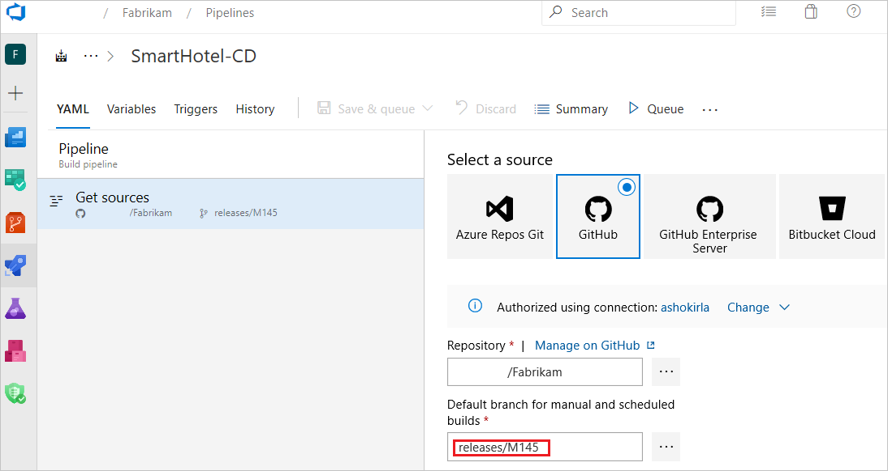

# Resources in YAML

**Azure Pipelines**

A resource is anything used by a pipeline that lives outside the pipeline. Any of these can be pipeline resources:
* CI/CD pipeline that produces artifacts (Azure Pipelines, Jenkins, etc.)
* code repositories (GitHub, Azure Repos, Git)
* container image registries (Azure Container Registry, Docker Hub, etc.) 
* package feeds (Azure Artifact feed, Artifactory package etc.)  

## Why resources?

Resources are defined at one place and can be consumed anywhere in your pipeline. Resources provide you the full traceability of the services consumed in your pipeline including the version, artifacts, associated commits, and work-items. You can fully automate your DevOps workflow by subscribing to trigger events on your resources.

Resources in YAML represent sources of types pipelines, builds, repositories, containers, and packages. 

### Schema

```yaml
resources:
  pipelines: [ pipeline ]  
  builds: [ build ]
  repositories: [ repository ]
  containers: [ container ]
  packages: [ package ]
```
---

## Resources: `pipelines`

If you have an Azure Pipeline that produces artifacts, you can consume the artifacts by defining a `pipelines` resource. `pipelines` is a dedicated resource only for Azure Pipelines. You can also set triggers on pipeline resource for your CD workflows.

In your resource definition, `pipeline` is a unique value that you can use to reference the pipeline resource later on. `source` is the name of the pipeline that produces an artifact. 

## [Schema](#tab/schema)

```yaml
resources:        # types: pipelines | builds | repositories | containers | packages
  pipelines:
  - pipeline: string  # identifier for the resource used in pipeline resource variables
    connection: string  # service connection for pipelines from other Azure DevOps organizations
    project: string # project for the source; optional for current project
    source: string  # name of the pipeline that produces an artifact
    version: string  # the pipeline run number to pick the artifact, defaults to Latest pipeline successful across all stages
    branch: string  # branch to pick the artifact, optional; defaults to all branches
    tag: string # picks the artifacts on from the pipeline with given tag, optional; defaults to no tags
    trigger:     # triggers are not enabled by default unless you add trigger section to the resource
      branches:  # branch conditions to filter the events, optional; Defaults to all branches.
        include: [ string ]  # branches to consider the trigger events, optional; Defaults to all branches.
        exclude: [ string ]  # branches to discard the trigger events, optional; Defaults to none.
```

## [Example](#tab/example)

If you need to consume artifacts from an Azure pipeline within the current project, here is simple schema.

```yaml
resources:
  pipelines:
  - pipeline: SmartHotel-resource # identifier for the resource (used in pipeline resource variables)
    source: SmartHotel-CI # name of the pipeline that produces an artifact
```

If you need to consume a pipeline from other project, then you need to include the project name while providing source name.

```yaml
resources:
  pipelines:
  - pipeline: SmartHotel
    project: DevOpsProject
    source: SmartHotel-CI
    branch: releases/M142
```

Pipeline resource with simple trigger.

```yaml
resources:
  pipelines:
  - pipeline: SmartHotel
    project: DevOpsProject
    source: SmartHotel-CI
    trigger: true
```

Pipeline resource trigger with branch conditions.

```yaml
resources:
  pipelines:
  - pipeline: SmartHotel
    project: DevOpsProject
    source: SmartHotel-CI
    trigger:
      branches:
      - releases/*
      - master
```
---


> [!IMPORTANT]
> When you define a resource trigger, if its pipeline resource is from the same repo as the current pipeline, triggering follows the same branch and commit on which the event is raised.
> But if the pipeline resource is from a different repo, the current pipeline is triggered on the default branch.

### Default branch for triggers
Triggers for resources are created based on the default branch configuration of your YAML, which is master. However, if you want to configure resource triggers from a different branch, you need to change the default branch for the pipeline. 
1. Go to the edit view of the pipeline and click on the overflow menu on the top right corner and choose **Triggers**.

1. Now select 'YAML' tab and go to 'Get sources'.
1. Now you can set the default branch for your pipeline.

### `download` for pipelines

All artifacts from the current pipeline and from all `pipeline` resources are automatically downloaded and made available at the beginning of each `deployment` job. You can override this behavior. For more information, see [Pipeline Artifacts](../artifacts/pipeline-artifacts.md). Regular 'job' artifacts are not automatically downloaded. Use `download` explicitly when needed.

## [Schema](#tab/schema)

```yaml
steps:
- download: [ current | pipeline resource identifier | none ] # disable automatic download if "none"
  artifact: string ## artifact name, optional; downloads all the available artifacts if not specified
  patterns: string # patterns representing files to include; optional
```

## [Example](#tab/example)

```yaml
- job: deploy_windows_x86_agent
  steps:
  - download: SmartHotel   # pipeline resource identifier.
    artifact: WebTier1  # artifact to download, optional; defaults to all the artifacts from the resource.
    patterns: '**/*.zip'  # mini match pattern to download specific files, optional; defaults to all files.
```

Or to avoid downloading any of the artifacts at all:

```yaml
- download: none
```
---
Artifacts from the `pipeline` resource are downloaded to `$(PIPELINE.WORKSPACE)/<pipeline-identifier>/<artifact-identifier>` folder.

### pipeline resource variables
In each run, the metadata for a pipeline resource is available to all jobs in the form of below predefined variables:

```yaml
resources.pipeline.<Alias>.projectName
resources.pipeline.<Alias>.projectID
resources.pipeline.<Alias>.pipelineName
resources.pipeline.<Alias>.pipelineID
resources.pipeline.<Alias>.runName
resources.pipeline.<Alias>.runID
resources.pipeline.<Alias>.runURI
resources.pipeline.<Alias>.sourceBranch
resources.pipeline.<Alias>.sourceCommit
resources.pipeline.<Alias>.sourceProvider
resources.pipeline.<Alias>.requestedFor
resources.pipeline.<Alias>.requestedForID
```

## Resources: `builds`

If you have any external CI build system that produces artifacts, you can consume artifacts with a `builds` resource. A `builds` resource can be any external CI systems like Jenkins, TeamCity, CircleCI etc.

## [Schema](#tab/schema)

```yaml
resources:        # types: pipelines | builds | repositories | containers | packages
  builds:
  - build: string   # identifier for the build resource
    type: string   # the type of your build service like Jenkins, circleCI etc.
    connection: string   # service connection for your build service.
    source: string   # source definition of the build
    version: string   # the build number to pick the artifact, defaults to Latest successful build
    trigger: boolean    # Triggers are not enabled by default and should be explicitly set
```

`builds` is an extensible category. You can write an extension to consume artifacts from your builds service (CircleCI, TeamCity etc.) and introduce a new type of service as part of `builds`. Jenkins is a type of resource in `builds`.

## [Example](#tab/example)

```yaml
resources:
  builds:
  - build: Spaceworkz
    type: Jenkins
    connection: MyJenkinsServer 
    source: SpaceworkzProj   # name of the jenkins source project
    trigger: true
```
---

> [!IMPORTANT]
> Triggers are only supported for hosted Jenkins where Azure DevOps has line of sight with Jenkins server.

### `downloadBuild` for builds

You can consume artifacts from the `build` resource as part of your jobs using `downloadBuild` task. Based on the type of `build` resource defined (Jenkins, TeamCity etc.), this task automatically resolves to the corresponding download task for the service during the run time.

Artifacts from the `build` resource are downloaded to `$(PIPELINE.WORKSPACE)/<build-identifier>/` folder. 

> [!IMPORTANT]
> `build` resource artifacts are not automatically downloaded in your jobs/deploy-jobs. You need to explicitly add `downloadBuild` task for consuming the artifacts.

## [Schema](#tab/schema)

```yaml
- downloadBuild: string # identifier for the resource from which to download artifacts
  artifact: string # artifact to download; if left blank, downloads all artifacts associated with the resource provided
  patterns: string | [ string ] # a minimatch path or list of [minimatch paths](tasks/file-matching-patterns.md) to download; if blank, the entire artifact is downloaded
```

## [Example](#tab/example)
You can customize the download behavior for each deployment or job.
```yaml
- job: deploy_windows_x86_agent
  steps:
  - downloadBuild: Spaceworkz   # build resource identifier.
    patterns: '**/*.zip'  # mini match pattern to download specific files, optional; defaults to all files.
```
---

## Resources: `repositories`

If your pipeline has [templates in another repository](../process/templates.md), or if you want to use [multi-repo checkout](../repos/multi-repo-checkout.md) with a repository that requires a service connection, you must let the system know about that repository. 
The `repository` keyword lets you specify an external repository.

## [Schema](#tab/schema)

```yaml
resources:
  repositories:
  - repository: string  # identifier (A-Z, a-z, 0-9, and underscore)
    type: enum  # see the following "Type" topic
    name: string  # repository name (format depends on `type`)
    ref: string  # ref name to use; defaults to 'refs/heads/master'
    endpoint: string  # name of the service connection to use (for types that aren't Azure Repos)
```

## [Example](#tab/example)
```yaml

resources:
  repositories:
  - repository: common
    type: github
    name: Contoso/CommonTools
    endpoint: MyContosoServiceConnection
```

---

### Type

Pipelines support the following values for the repository type: `git`, `github`, and `bitbucket`.
The `git` type refers to Azure Repos Git repos.

- If you specify `type: git`, the `name` value refers to another repository in the same project.
  An example is `name: otherRepo`.
  To refer to a repo in another project within the same organization, prefix the name with that project's name.
  An example is `name: OtherProject/otherRepo`.

- If you specify `type: github`, the `name` value is the full name of the GitHub repo and includes the user or organization.
  An example is `name: Microsoft/vscode`.
  GitHub repos require a [GitHub service connection](../library/service-endpoints.md) for authorization.

- If you specify `type: bitbucket`, the `name` value is the full name of the Bitbucket Cloud repo and includes the user or organization.
  An example is `name: MyBitBucket/vscode`.
  Bitbucket Cloud repos require a [Bitbucket Cloud service connection](../library/service-endpoints.md#sep-bbucket) for authorization.


### `checkout` your repository

Use `checkout` keyword to consume your repos defined as part of `repository` resource. 


### Schema

```yaml
steps:
- checkout: string  # identifier for your repository resource
  clean: boolean  # if true, execute `execute git clean -ffdx && git reset --hard HEAD` before fetching
  fetchDepth: number  # the depth of commits to ask Git to fetch; defaults to no limit
  lfs: boolean  # whether to download Git-LFS files; defaults to false
  submodules: true | recursive  # set to 'true' for a single level of submodules or 'recursive' to get submodules of submodules; defaults to not checking out submodules
  path: string  # path to check out source code, relative to the agent's build directory (e.g. \_work\1); defaults to a directory called `s`
  persistCredentials: boolean  # if 'true', leave the OAuth token in the Git config after the initial fetch; defaults to false
```

Repos from the `repository` resource are not automatically synced in your jobs. Use `checkout` to fetch your repos as part of your jobs.

For more information, see [Check out multiple repositories in your pipeline](../repos/multi-repo-checkout.md).

## Resources: `containers`

If you need to consume a container image as part of your CI/CD pipeline, you can achieve it using `containers`. A container resource can be a public or private Docker Registry, or Azure Container Registry.


If you need to consume images from Docker registry as part of your pipeline, you can define a generic container resource (not `type` keyword required). 

## [Schema](#tab/schema)

```yaml
resources:
  containers:
  - container: string  # identifier (A-Z, a-z, 0-9, and underscore)
    image: string  # container image name
    options: string  # arguments to pass to container at startup
    endpoint: string  # reference to a service connection for the private registry
    env: { string: string }  # list of environment variables to add
    ports: [ string ] # ports to expose on the container
    volumes: [ string ] # volumes to mount on the container
```
A generic container resource can be used as an image consumed as part of your job or it can also be used for [Container jobs](../process/container-phases.md).

## [Example](#tab/example)

```yaml
resources:         
  containers:
  - container: smartHotel 
    endpoint: myDockerRegistry
    image: smartHotelApp 
```
---

You can use a first class container resource type for Azure Container Registry (ACR) to consume your ACR images. This resources type can be used as part of your jobs and also to enable automatic pipeline triggers.

## [Schema](#tab/schema)

```yaml
resources:          # types: pipelines | repositories | containers | builds | packages
  containers:
  - container: string # identifier for the container resource      
    type: string # type of the registry like ACR, GCR etc. 
    azureSubscription: string # Azure subscription (ARM service connection) for container registry;
    resourceGroup: string # resource group for your ACR
    registry: string: # registry for container images
    repository: string # name of the container image repository in ACR
    trigger: # Triggers are not enabled by default and need to be set explicitly
      tags:
        include: [ string ]  # image tags to consider the trigger events, optional; defaults to any new tag
        exclude: [ string ]  # image tags on discard the trigger events, optional; defaults to none
```
## [Example](#tab/example)

```yaml
resources:         
  containers:
  - container: petStore      
    type: ACR  
    azureSubscription: ContosoARMConnection
    resourceGroup: ContosoGroup
    registry: petStoreRegistry
    repository: myPets
    trigger: 
      tags:
        include: 
        - production* 
```
---
#### Container resource variables
Once you define a container as resource, container image metadata is passed to the pipeline in the form of variables. Information like image, registry, and connection details are made accessible across all the jobs to be used in your container deploy tasks.

```yaml
resources.container.<Alias>.type
resources.container.<Alias>.registry
resources.container.<Alias>.repository
resources.container.<Alias>.tag 
resources.container.<Alias>.digest
resources.container.<Alias>.URI
resources.container.<Alias>.location
```
Note: location variable is only applicable for `ACR` type of container resources.

## Traceability
We provide full traceability for any resource consumed at a pipeline or deployment-job level.

### Pipeline traceability
For every pipeline run, we show the info about the 
1. The resource that has triggered the pipeline (if it is triggered by a resource).

2. Version of the resource and the artifacts consumed.
 
3. Commits associated with each resource.

4. Work-items for each resource.

### Environment traceability
Whenever a pipeline deploys to an environment, you can see a list of resources that are consumed in the environments view. This view includes resources consumed as part of the deployment-jobs and their associated commits and work-items.

