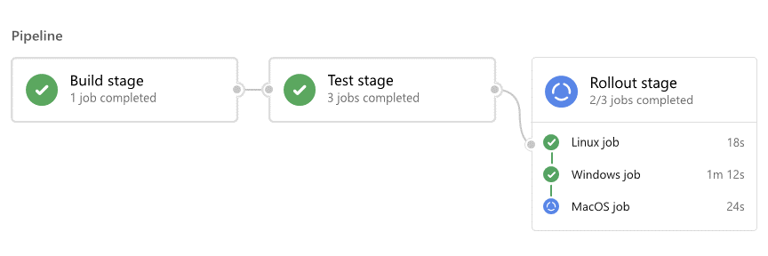
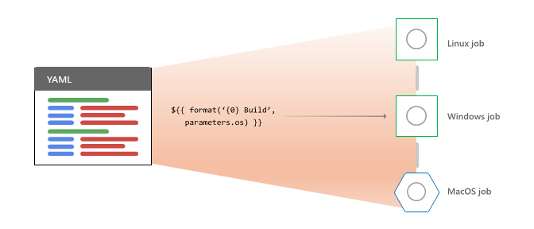
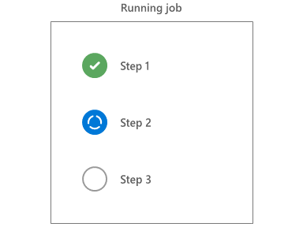
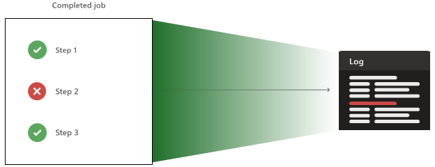

# Pipeline runs

[!INCLUDE [version-gt-eq-2019](../../includes/version-gt-eq-2019.md)]

This article explains the sequence of activities in Azure Pipelines pipeline runs. A run represents one execution of a pipeline. Both continuous integration (CI) and continuous delivery (CD) pipelines consist of runs. During a run, Azure Pipelines processes the pipeline, and [agents](../agents/agents.md) process one or more [jobs, steps, and tasks](../get-started/key-pipelines-concepts.md).



For each run, Azure Pipelines:
- Processes the pipeline.
- Requests one or more agents to run jobs.
- Hands off jobs to agents and collects the results.

For each job, an agent:
- Prepares for the job.
- Runs each step in the job.
- Reports results.

Jobs might succeed, fail, be canceled, or not complete. Understanding these outcomes can help you troubleshoot issues.

The following sections describe the pipeline run process in detail.

<a name="process-the-pipeline"></a>
## Pipeline processing



To process a pipeline for a run, Azure Pipelines first:

1. Expands [templates](templates.md) and evaluates [template expressions](template-expressions.md).
2. Evaluates dependencies at the [stage](stages.md) level to pick the first stage to run.

For each stage it selects to run, Azure Pipelines:

1. Gathers and validates all job resources for [authorization](approvals.md) to run.
2. Evaluates [dependencies at the job level](phases.md#dependencies) to pick the first job to run.

Azure Pipelines does the following activities for each job it selects to run:

1. Expands YAML `strategy: matrix` or `strategy: parallel` [multi-configurations](phases.md#multi-job-configuration) into multiple runtime jobs.
5. Evaluates [conditions](conditions.md) to decide whether the job is eligible to run.
6. Requests an agent for each eligible job.

As runtime jobs complete, Azure Pipelines checks whether there are new jobs eligible to run. Similarly, as stages complete, Azure Pipelines checks if there are any more stages.

### Variables

Understanding the processing order clarifies why you can't use certain variables in [template parameters](template-parameters.md). The first template expansion step operates only on the text of the YAML file. Runtime variables don't yet exist during that step. After that step, template parameters are already resolved.

You also can't use [variables](variables.md) to resolve service connection or environment names, because the pipeline authorizes resources before a stage can start running. Stage- and job-level variables aren't available yet. Variable groups are themselves a resource subject to authorization, so their data isn't available when checking resource authorization.

You can use pipeline-level variables that are explicitly included in the [pipeline resource definition](/azure/devops/pipelines/yaml-schema/resources-pipelines-pipeline). For more information, see [Pipeline resource metadata as predefined variables](/azure/devops/pipelines/yaml-schema/resources-pipelines-pipeline#pipeline-resource-metadata-as-predefined-variables).

## Agents

When Azure Pipelines needs to run a job, it requests an [agent](../agents/agents.md) from the [pool](../agents/pools-queues.md). The process works differently for [Microsoft-hosted](../agents/hosted.md) and [self-hosted](../agents/pools-queues.md) agent pools.

>[!NOTE]
>[Server jobs](phases.md#server-jobs) don't use a pool because they run on the Azure Pipelines server itself.


### Parallel jobs

First, Azure Pipelines checks on your organization's [parallel jobs](../licensing/concurrent-jobs.md). The service adds up all running jobs on all agents and compares that with the number of parallel jobs granted or purchased.

If there are no available parallel slots, the job has to wait on a slot to free up. Once a parallel slot is available, the job routes to the appropriate agent type.

### Microsoft-hosted agents

Conceptually, the Microsoft-hosted pool is one global pool of machines, although it's physically many different pools split by geography and operating system type. Based on the YAML `vmImage` or Classic editor pool name requested, Azure Pipelines selects an agent.

All agents in the Microsoft pool are fresh, new virtual machines (VMs) that have never run any pipelines. When the job completes, the agent VM is discarded.

### Self-hosted agents

Once a parallel slot is available, Azure Pipelines examines the self-hosted pool for a compatible agent. Self-hosted agents offer [capabilities](../agents/agents.md#capabilities), which indicate that particular software is installed or settings configured. The pipeline has [demands](/azure/devops/pipelines/yaml-schema/pool-demands), which are the capabilities required to run the job.

If Azure Pipelines can't find a free agent whose capabilities match the pipeline's demands, the job continues waiting. If there are no agents in the pool whose capabilities match the demands, the job fails.

Self-hosted agents are typically reused from run to run. For self-hosted agents, a pipeline job can have side effects, such as warming up caches or having most commits already available in the local repo.

## Job preparation

Once an agent accepts a job, it does the following preparation work:

1. Downloads all the [tasks](tasks.md) needed to run the job and caches them for future use.
2. Creates working space on disk to hold the source code, artifacts, and outputs used in the run.

<a name="run-each-step"></a>
## Step execution

The agent runs steps sequentially in order. Before a step can start, all previous steps must be finished or skipped.



Steps are implemented by [tasks](tasks.md), which can be Node.js, PowerShell, or other scripts. The task system routes inputs and outputs to the backing scripts. Tasks also provide common services such as altering the system path and creating new [pipeline variables](variables.md).

Each step runs in its own process, isolating its environment from previous steps. Because of this process-per-step model, environment variables aren't preserved between steps. However, tasks and scripts can use a mechanism called [logging commands](../scripts/logging-commands.md) to communicate back to the agent. When a task or script writes a logging command to standard output, the agent takes whatever action the command requests.

You can use a logging command to create new pipeline variables. Pipeline variables are automatically converted into environment variables in the next step. A script can set a new variable `myVar` with a value of `myValue` as follows:

```bash
echo '##vso[task.setVariable variable=myVar]myValue'
```

```powershell
Write-Host "##vso[task.setVariable variable=myVar]myValue"
```

## Result reporting and collection

Each step can report warnings, errors, and failures. The step reports errors and warnings on the pipeline summary page by marking the tasks as succeeded with issues, or reports failures by marking the task as failed. A step fails if it either explicitly reports failure by using a `##vso` command or ends the script with a nonzero exit code.

As steps run, the agent constantly sends output lines to Azure Pipelines, so you can see a live feed of the console. At the end of each step, the entire output from the step is uploaded as a log file. You can download the log once the pipeline finishes.



The agent can also upload [artifacts](../artifacts/pipeline-artifacts.md) and [test results](../test/review-continuous-test-results-after-build.md), which are also available after the pipeline completes.

## State and conditions

The agent keeps track of each step's success or failure. As steps succeed with issues or fail, the job's status is updated. The job always reflects the worst outcome from each of its steps. If a step fails, the job also fails.

Before the agent runs a step, it checks that step's [condition](conditions.md) to determine whether the step should run. By default, a step only runs when the job's status is succeeded or succeeded with issues, but you can set other conditions.

Many jobs have cleanup steps that need to run no matter what else happens, so they can specify a condition of `always()`. Cleanup or other steps can also be set to run only on cancellation.

A successful cleanup step can't save the job from failing. Jobs can never go back to success after entering failure.

## Timeouts and disconnects

Each job has a timeout. If the job doesn't complete in the specified time, the server cancels the job. The server attempts to signal the agent to stop, and marks the job as canceled. On the agent side, cancellation means to cancel all remaining steps and upload any remaining results.

Jobs have a grace period called the cancel timeout in which to complete any cancellation work. You can also mark steps to run even on cancellation. After a job timeout plus a cancel timeout, if the agent doesn't report that work is stopped, the server marks the job as a failure.

Agent machines can stop responding to the server if the agent's host machine loses power or is turned off, or if there's a network failure. To help detect these conditions, the agent sends a heartbeat message once per minute to let the server know it's still operating.

If the server doesn't receive a heartbeat for five consecutive minutes, it assumes the agent is not coming back. The job is marked as a failure, letting the user know they should retry the pipeline.

::: moniker range=">=azure-devops"
## Manage runs through the Azure DevOps CLI

You can manage pipeline runs by using [az pipelines runs](/cli/azure/pipelines/runs) in the Azure DevOps CLI. To get started, see [Get started with Azure DevOps CLI](../../cli/index.md). For a complete command reference, see [Azure DevOps CLI command reference](/cli/azure/service-page/devops).

The following examples show how to use the Azure DevOps CLI to list the pipeline runs in your project, view details about a specific run, and manage tags for pipeline runs.

### Prerequisites

- Azure CLI with the Azure DevOps CLI extension installed as described in [Get started with Azure DevOps CLI](../../cli/index.md). Sign into Azure using `az login`.
- The default organization set by using `az devops configure --defaults organization=<YourOrganizationURL>`.

### List pipeline runs

List the pipeline runs in your project with the [az pipelines runs list](/cli/azure/pipelines/runs#az-pipelines-runs-list) command. 

The following command lists the first three pipeline runs that have a status of **completed** and a result of **succeeded**, and returns the result in table format.  

```azurecli 
az pipelines runs list --status completed --result succeeded --top 3 --output table

Run ID    Number      Status     Result     Pipeline ID    Pipeline Name               Source Branch    Queued Time                 Reason
--------  ----------  ---------  ---------  -------------  --------------------------  ---------------  --------------------------  ------
125       20200124.1  completed  succeeded  12             Githubname.pipelines-java  master           2020-01-23 18:56:10.067588  manual
123       20200123.2  completed  succeeded  12             Githubname.pipelines-java  master           2020-01-23 11:55:56.633450  manual
122       20200123.1  completed  succeeded  12             Githubname.pipelines-java  master           2020-01-23 11:48:05.574742  manual
``` 

### Show pipeline run details

Show the details for a pipeline run in your project with the [az pipelines runs show](/cli/azure/pipelines/runs#az-pipelines-runs-show) command.

The following command shows details for the pipeline run with the ID **123**, returns the results in table format, and opens your web browser to the Azure Pipelines build results page.

```azurecli 
az pipelines runs show --id 122 --open --output table

Run ID    Number      Status     Result     Pipeline ID    Pipeline Name               Source Branch    Queued Time                 Reason
--------  ----------  ---------  ---------  -------------  --------------------------  ---------------  --------------------------  --------
123       20200123.2  completed  succeeded  12             Githubname.pipelines-java  master           2020-01-23 11:55:56.633450  manual
```

### Add tag to pipeline run

Add a tag to a pipeline run in your project with the [az pipelines runs tag add](/cli/azure/pipelines/runs/tag#az-pipelines-runs-tag-add) command.

The following command adds the tag **YAML** to the pipeline run with the ID **123** and returns the result in JSON format.

```azurecli 
az pipelines runs tag add --run-id 123 --tags YAML --output json

[
  "YAML"
]
```

### List pipeline run tags

List the tags for a pipeline run in your project with the [az pipelines runs tag list](/cli/azure/pipelines/runs/tag#az-pipelines-runs-tag-list) command. The following command lists the tags for the pipeline run with the ID **123** and returns the result in table format.  

```azurecli
az pipelines runs tag list --run-id 123 --output table

Tags
------
YAML
```

### Delete tag from pipeline run

Delete a tag from a pipeline run in your project with the [az pipelines runs tag delete](/cli/azure/pipelines/runs/tag#az-pipelines-runs-tag-delete) command. The following command deletes the **YAML** tag from the pipeline run with ID **123**.  

```azurecli 
az pipelines runs tag delete --run-id 123 --tag YAML
```

::: moniker-end

## Related content

- [Key Azure Pipelines concepts](../get-started/key-pipelines-concepts.md)
- [Stages, dependencies, and conditions](stages.md)
- [Jobs in pipelines](phases.md)
- [Azure Pipelines agents](../agents/agents.md)
