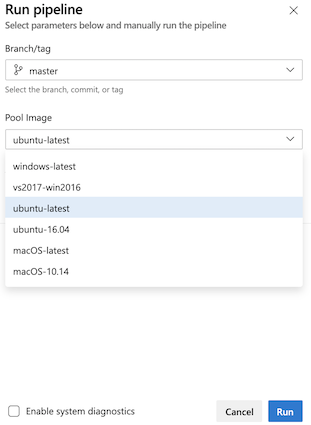

# Runtime parameters

Runtime parameters let you have more control over what values can be passed to a pipeline. With runtime parameters you can:
- Supply different values to scripts and tasks at runtime
- Control parameter types, ranges allowed, and defaults
- Dynamically select jobs and stages with template expressions

You can specify [parameters in templates](templates.md) and in the pipeline. Parameters have data types such as number and string, and they can be restricted to a subset of values. The `parameters` section in a YAML defines what parameters are available. 

Parameters are only available at template parsing time. Parameters are expanded just before the pipeline runs so that values surrounded by `${{ }}` are replaced with parameter values. Use [variables](variables.md) if you need your values to be more widely available during your [pipeline run](runs.md). 

> [!NOTE]
> This guidance does not apply to classic pipelines. For parameters in classic pipelines, see [Process parameters (classic)](parameters.md).
> 

Parameters must contain a name and data type. Parameters cannot be optional. A default value needs to be assigned in your YAML file or when you run your pipeline. If you do not assign a default value or set `default` to `false`, the first available value will be used. 

## Use parameters in pipelines

Set runtime parameters at the beginning of a YAML. This example pipeline accepts the value of `image` and then outputs the value in the job. The `trigger` is set to none so that you can select the value of `image` when you manually trigger your pipeline to run. 

```yaml
parameters:
- name: image
  displayName: Pool Image
  type: string
  default: ubuntu-latest
  values:
  - windows-latest
  - ubuntu-latest
  - macOS-latest

trigger: none

jobs:
- job: build
  displayName: build
  pool: 
    vmImage: ${{ parameters.image }}
  steps:
  - script: echo building $(Build.BuildNumber) with ${{ parameters.image }}
```

When the pipeline runs, you select the Pool Image. If you do not make a selection, the default option, `ubuntu-latest` gets used. 

> [!div class="mx-imgBorder"]
> 

## Use conditionals with parameters

You can also use parameters as part of conditional logic. With conditionals, part of a YAML will only run if it meets the `if` criteria. 

### Use parameters to determine what steps run

This pipeline only runs a step when the boolean parameter `test` is true. 

```yaml
parameters:
- name: image
  displayName: Pool Image
  values:
  - windows-latest
  - ubuntu-latest
  - macOS-latest
- name: test
  displayName: Run Tests?
  type: boolean
  default: false

trigger: none

jobs:
- job: build
  displayName: Build and Test
  pool: 
    vmImage: ${{ parameters.image }}
  steps:
  - script: echo building $(Build.BuildNumber)
  - ${{ if eq(parameters.test, true) }}:
    - script: echo "Running all the tests"
```

### Use parameters to set what configuration is used

You can also use parameters to set which job runs. In this example, a different job runs depending on the value of `config`. 

```yaml
parameters:
- name: configs
  type: string
  default: 'x86,x64'

trigger: none

jobs:
- ${{ if contains(parameters.configs, 'x86') }}:
  - job: x86
    steps:
    - script: echo Building x86...
- ${{ if contains(parameters.configs, 'x64') }}:
  - job: x64
    steps:
    - script: echo Building x64...
- ${{ if contains(parameters.configs, 'arm') }}:
  - job: arm
    steps:
    - script: echo Building arm...
```

### Selectively exclude a stage

You can also use parameters to set whether a stage runs. In this example, the Performance Test stage runs if the parameter `runPerfTests` is true. 

```yaml
parameters:
- name: runPerfTests
  type: boolean
  default: false

trigger: none

stages:
- stage: Build
  displayName: Build
  jobs:
  - job: Build
    steps:
    - script: echo running Build


- stage: UnitTest
  displayName: Unit Test
  dependsOn: Build
  jobs:
  - job: UnitTest
    steps:
    - script: echo running UnitTest


- ${{ if eq(parameters.runPerfTests, true) }}:
  - stage: PerfTest
    displayName: Performance Test
    dependsOn: Build
    jobs:
    - job: PerfTest
      steps:
      - script: echo running PerfTest


- stage: Deploy
  displayName: Deploy
  dependsOn: UnitTest
  jobs:
  - job: Deploy
    steps:
    - script: echo running UnitTest
```

### Loop through parameters


You can also loop through your string, number, and boolean parameters. 

#### [Script](#tab/script)

In this example, you loop through parameters and print out each parameter name and value. 

```yaml
# start.yaml
parameters:
- name: myStringName
  type: string
  default: a string value
- name: myMultiString
  type: string
  default: default
  values:
  - default
  - ubuntu
- name: myNumber
  type: number
  default: 2
  values:
  - 1
  - 2
  - 4
  - 8
  - 16
- name: myBoolean
  type: boolean
  default: true

steps: 
- ${{ each parameter in parameters }}:
  - script: echo ${{ parameter.Key }} 
  - script: echo ${{ parameter.Value }}
```

```yaml
# azure-pipeline.yaml
trigger: none

extends:
  template: start.yaml
```

#### [PowerShell](#tab/powershell)

You can loop through parameters in a PowerShell task and set each parameter as an environment variable. 

```yaml
# start.yaml

parameters:
- name: myStringName
  type: string
  default: a string value
- name: myMultiString
  type: string
  default: default
  values:
  - default
  - ubuntu
- name: myNumber
  type: number
  default: 2
  values:
  - 1
  - 2
  - 4
  - 8
  - 16
- name: myBoolean
  type: boolean
  default: true

steps: 
  - task: PowerShell@2
    env:
      ${{ each parameter in parameters }}:
        ${{ parameter.Key }}: ${{ parameter.Value }}
    inputs:
      filePath: test_script.ps1
      pwsh: true


```

```yaml
# azure-pipeline.yaml
trigger: none

extends:
  template: start.yaml
```

```powershell
# test_script.ps1

Write-Host "Hello, World!"
Write-Host $env:myStringName

```

---

### Check for an empty parameter object

You can use the `length()` [expression](expressions.md) to check whether an object parameter has no value. 

```yaml
parameters:
- name: foo
  type: object
  default: []

steps:
- checkout: none
- ${{ if eq(length(parameters.foo), 0) }}:
  - script: echo Foo is empty
    displayName: Foo is empty
```


## Parameter data types

[!INCLUDE [parameter-data-types](includes/parameter-data-types.md)]

## FAQ

### How can I use variables inside of templates?

There are times when it may be useful to set parameters to values based on variables. Parameters are expanded early in processing a [pipeline run](runs.md) so not all variables will be available. To see what predefined variables are available in templates, see [Use predefined variables](../build/variables.md). 

In this example, the predefined variables `Build.SourceBranch` and `Build.Reason` are used in conditions in template.yml.


```yaml
# File: azure-pipelines.yml
trigger:
- main

extends:
  template: template.yml
```

```yaml
# File: template.yml
steps:
- script: echo Build.SourceBranch = $(Build.SourceBranch) # outputs refs/heads/main
- script: echo Build.Reason = $(Build.Reason) # outputs IndividualCI
- ${{ if eq(variables['Build.SourceBranch'], 'refs/heads/main') }}: 
  - script: echo I run only if Build.SourceBranch = refs/heads/main 
- ${{ if eq(variables['Build.Reason'], 'IndividualCI') }}: 
  - script: echo I run only if Build.Reason = IndividualCI 
- script: echo I run after the conditions
```
