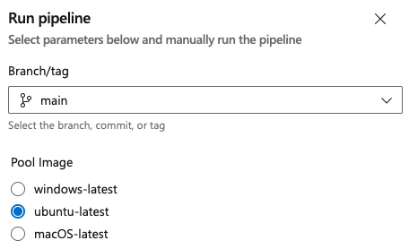

# Runtime parameters

[!INCLUDE [version-gt-eq-2020](../../includes/version-gt-eq-2020.md)]

Runtime parameters give you more control over the values passed to a pipeline. With runtime parameters, you can:
- Supply different values to scripts and tasks at runtime
- Control parameter types, allowed ranges, and default values
- Dynamically select jobs and stages with [template expressions](template-expressions.md)

You can specify [parameters in templates](template-parameters.md) and in the pipeline. Parameters have data types such as number and string, and they can be restricted to a subset of values. The `parameters` section in a YAML defines what parameters are available. 

Parameters are available only during template parsing. They expand before the pipeline runs, replacing values surrounded by `${{ }}` with parameter values. Use [variables](variables.md) if your values need to be available throughout the [pipeline run](runs.md). 

> [!NOTE]
> This guidance doesn't apply to classic pipelines. For parameters in classic pipelines, see [Process parameters (classic)](parameters.md). 
> 

Parameters must contain a name and data type. Parameters can't be optional. A default value needs to be assigned in your YAML file or when you run your pipeline. If you don't assign a default value or set `default` to `false`, the first available value is used. 

Use [templateContext](template-parameters.md#use-templatecontext-to-pass-properties-to-templates) to pass additional properties to stages, steps, and jobs used as parameters in a template. 

## What is the difference between parameters and variables? 

The following table highlights the key differences between parameters and variables in Azure Pipelines.

| Feature              | Parameters         |  [Variables](variables.md)          |
|----------------------|----------------------------|-----------------------------|
| **Evaluation Time**  | Template parsing (queue)   | Runtime (during execution)  |
| **Mutability**       | Immutable after queue      | Can be updated dynamically during pipeline execution |
| **UI exposure during run**  | Shown in Run Pipeline UI and can be set before a run | Not exposed during runs |
| **Secret values**      | Do not support secret values | Can be marked as secrets |


## Use parameters in pipelines

Set runtime parameters at the start of a YAML file. 

This example pipeline includes an `image` parameter with three hosted agents as `string` options. In the jobs section, the `pool` value specifies the agent from the parameter used to run the job. The `trigger` is set to none so that you can select the value of `image` when you manually trigger your pipeline to run. 

```yaml
parameters:
- name: image
  displayName: Pool Image
  type: string
  default: ubuntu-latest
  values:
  - windows-latest
  - ubuntu-latest
  - macOS-latest

trigger: none

jobs:
- job: build
  displayName: build
  pool: 
    vmImage: ${{ parameters.image }}
  steps:
  - script: echo building $(Build.BuildNumber) with ${{ parameters.image }}
```

From the pipeline runs page, select **Run pipeline** to run the pipeline. You'll see the option to select the Pool Image. If you don't make a selection, the default option `ubuntu-latest` is used. You can't select a Pool Image if you run your pipeline from the YAML editor. 

> [!div class="mx-imgBorder"]
> 

## Use conditionals with parameters

You can also use parameters as part of conditional logic. With conditionals, part of a YAML runs if it meets the `if` criteria. 

### Use parameters to determine what steps run

This pipeline adds a second boolean parameter, `test`, which controls whether to run tests in the pipeline. When the value of `test` is true, the step that outputs *Running all the tests* runs. 

```yaml
parameters:
- name: image
  displayName: Pool Image
  values:
  - windows-latest
  - ubuntu-latest
  - macOS-latest
- name: test
  displayName: Run Tests?
  type: boolean
  default: false

trigger: none

jobs:
- job: build
  displayName: Build and Test
  pool: 
    vmImage: ${{ parameters.image }}
  steps:
  - script: echo building $(Build.BuildNumber)
  - ${{ if eq(parameters.test, true) }}:
    - script: echo "Running all the tests"
```

### Use parameters to set what configuration is used

You can also use parameters to set which job runs. In this example, different architectures build depending on the value of `config` parameter, which is a `string` type. By default, both the `x86` and `x64` architectures build.  

```yaml
parameters:
- name: configs
  type: string
  default: 'x86,x64'

trigger: none

jobs:
- ${{ if contains(parameters.configs, 'x86') }}:
  - job: x86
    steps:
    - script: echo Building x86...
- ${{ if contains(parameters.configs, 'x64') }}:
  - job: x64
    steps:
    - script: echo Building x64...
- ${{ if contains(parameters.configs, 'arm') }}:
  - job: arm
    steps:
    - script: echo Building arm...
```

### Selectively exclude a stage

You can also use parameters to set whether a stage runs. In this example, there's a pipeline with four stages and different jobs for each stage. The Performance Test stage runs if the parameter `runPerfTests` is true. The default value of `runPerfTests` is false, so only three of the four stages run unless updated. 

```yaml
parameters:
- name: runPerfTests
  type: boolean
  default: false

trigger: none

stages:
- stage: Build
  displayName: Build
  jobs:
  - job: Build
    steps:
    - script: echo running Build


- stage: UnitTest
  displayName: Unit Test
  dependsOn: Build
  jobs:
  - job: UnitTest
    steps:
    - script: echo running UnitTest


- ${{ if eq(parameters.runPerfTests, true) }}:
  - stage: PerfTest
    displayName: Performance Test
    dependsOn: Build
    jobs:
    - job: PerfTest
      steps:
      - script: echo running PerfTest


- stage: Deploy
  displayName: Deploy
  dependsOn: UnitTest
  jobs:
  - job: Deploy
    steps:
    - script: echo running UnitTest
```


### Check for an empty parameter object

Use the `length()` [expression](expressions.md) to check if an object parameter has no value. 

```yaml
parameters:
- name: foo
  type: object
  default: []

steps:
- checkout: none
- ${{ if eq(length(parameters.foo), 0) }}:
  - script: echo Foo is empty
    displayName: Foo is empty
```

## Parameter data types

[!INCLUDE [parameter-data-types](includes/parameter-data-types.md)]

## Parameter security best practices

When using runtime parameters in Azure Pipelines, don't pass secrets or sensitive values as parameter inputs, because parameter values are expanded at template parsing time and might be exposed in pipeline logs or outputs. 

Always validate and restrict allowed parameter values to prevent injection of unexpected or unsafe input, and follow the principle of least privilege when granting access to pipeline resources. 

Use pipeline variables marked as secrets and stored in Azure Key Vault, the Pipeline UI, or variable groups for credentials, tokens, or other confidential data. For more information, see [Protect secrets in Azure Pipelines](../security/secrets.md).